# Gravity JCL PRE/PRO Workflows

## 1. Introduction

As mentioned this document is intended to deep into details about how JCL's objects are deployed in PRE and PRO environment.

The goal of these workflows is to promote from a previous PRE environment to a final PRO environment. This is done in several steps: From Previous (Temp) PRE to PRE, from PRE to Previous (Temp) PRO and finally from Previous (TMP) PRO to final PRO.

It has been included also CSA jobs where JCLs are promoted (copied) from properly stablished CSA folders to either Previous (TMP) PRE or Previous (TMP) PRO environments.

## 2\. Component Creation & Team onboarding

Component should be already created at your gluon organization together with the Team that can access and execute the appropriate workflows. In case of any doubt please contact your [Gluon Gravity ALM Support team](../gravity-support-faqs.md)

## 3. Github.com ecosystem

Be familiar with github.com actions and look-like:

???- Note "**Enter in Github.com**"

    *   Open your browser
    *   Access or copy the URL (add to favorites recommended).<br>
        Sample [USA JCLs Repo](https://github.com/santander-group-usa-gln/sov-jclplan-grvusajcl):  ** Restricted access **

???- Note "**Run a workflow**"

    *   Select the 'action' bar, click on the workflow you may want to execute and click on **Run Workflow** button

    

    *   **Use workflow from**: you may select it according at your branch strategy (development by default)

???- Note "**Check the workflow's log:**"

    *   Click on **Workflow execution** and then on the desired stage
    
    *   and then on the desired **stage** and **job**<br>
    
    <br>

    !!! Info "JCLS JOB SUMMARY"
        Pay special attention at the button of the console where you can find a summary of the most important actions done during the workflow execution. Example:
        

???- Note "**Check Annotations for Workflow entries:**"

    You may also check on Annotations the main entries given at workflow configuration time
    

## 4\. Jobs Description

### 4.1 PREproduction Jobs

#### 4.1.1. From PRE Previous to PRE final libraries

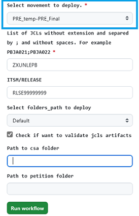
???+ Parameters

    *   **Select movement to deploy.:** Select ***PRE-temp_PRE-Final***
    *   **JCL\_LIST**: List of JCLs without extension and separated by semicolons and without spaces. JCLs have to exist in origin directory.
    *   **ITSM/RELEASE:** ITSM code or Release code. It is been used for audit log. (Mandatory).
     *   **FOLDERS\_PATH**: For UK only. Available values on the combo: Default, deposit protection y cdb.
    *   **VALIDATE\_ARTIFACTS**: if checked an script is invoked in order to guarantee that the JCL has all related artifacts on the origin. If some artifact is missing job will be stopped.

#### 4.1.2. From PRE Final to PRO previous libraries

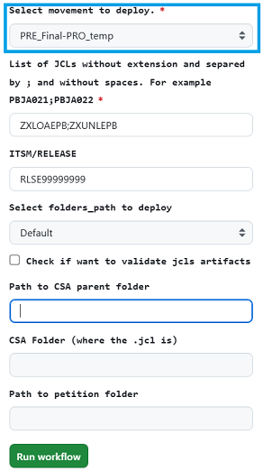
???+ Parameters

    *   **Select movement to deploy.:** Select ***PRE-Final_PRO-Temp***
    *   **JCL_LIST:** List of JCLs without extension and separated by semicolons and without spaces. JCLs have to exist in origin directory.
    *   **ITSM/RELEASE:** ITSM code or Release code. It is been used for audit log. (Mandatory).
    *   **FOLDERS\_PATH**: For UK only. Available values on the combo: Default, deposit protection y cdb.

#### 4.1.3. From CSA folder to PRE Previous libraries (only .jcl)

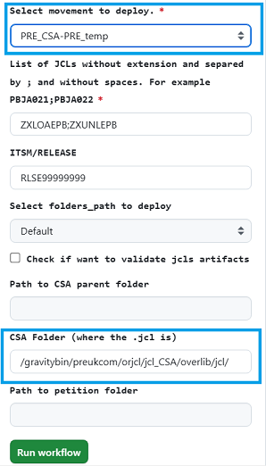
???+ Parameters

    *   **Select movement to deploy.:** Select ***PRE-CSA_PRE-Temp***
    *   **JCL\_LIST**: List of JCLs without extension and separated by semicolons and without spaces. JCLs have to exist in origin directory
    *   **CSA\_FOLDER**: Location of the folder where the JCLs are going to be to copy from.
    *   **FOLDERS\_PATH**: For UK only. Available values on the combo: Default, deposit protection y cdb

#### 4.1.4. From PRE CSA Folder to other destination (only .jcl)

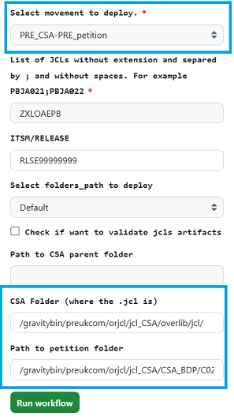
???+ Parameters

    *   **Select movement to deploy.:** Select ***PRE-CSA_PRE-Petition***
    *   **JCL\_LIST**: List of JCLs without extension and separated by semicolons and without spaces. JCLs have to exist in origin directory.
    *   **ITSM/RELEASE:** ITSM code or Release code. It is been used for audit log. (Mandatory).
    *   **CSA\_FOLDER**: Location of the folder where the JCLs are going to be to copy from. It may be introduced any folder as origin.
    *   **PETITION\_PATH**: Location of the folder where de JCLs are going to be copy to.

#### 4.1.5. From PRE Final to decommission

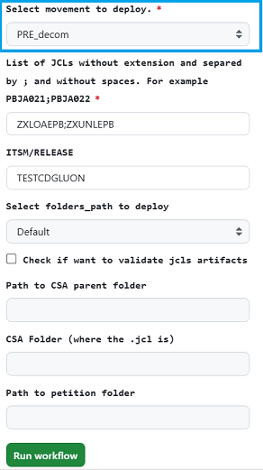
???+ Parameters

    *   **Select movement to deploy.:** Select ***PRE-Decom***
    *   **JCL\_LIST:** List of JCLs without extension and separated by semicolons and without spaces. JCLs have to exist in origin directory.
    *   **ITSM/RELEASE**: ITSM code or Release code. It is been used for audit log. (Mandatory)
    *   **FOLDERS\_PATH**: For UK only. Available values on the combo: Default, deposit protection y cdb.

#### 4.1.6. Restore PRE Final libraries

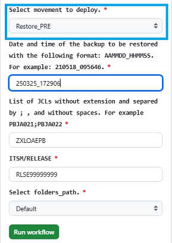
???+ Parameters

    *   **Select movement to deploy.:** Select ***Restore_PRE***
    *   **BACKUP\_DATE:**  Backup Date in format AAMMDD\_HHMSS. This information can be found in deployments JOBS log looking for the pattern  : "\_bk/BK"
    *   **JCL\_LIST:** List of JCLs without extension and separated by semicolons and without spaces. JCLs have to exist in origin directory
    *   **ITSM/RELEASE:** ITSM code or Release code. It is been used for audit log. (Mandatory)
    *   **FOLDERS\_PATH**: For UK only. Available values on the combo: Default, deposit protection y cdb

### 4.2 Production Jobs

#### 4.2.1. From PRO Previous to PRO Final libraries

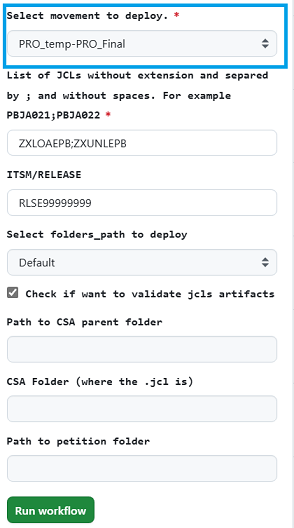
???+ Parameters

    *   **Select movement to deploy.:** Select ***PRO-Temp_PRO-Final***
    *   **JCL_LIST**: List of JCLs without extension and separated by semicolons and without spaces. JCLs have to exist in origin directory
    *   **ITSM/RELEASE:** ITSM code or Release code. It is been used for audit log. (Mandatory)
    *   **FOLDERS\_PATH**: For UK only. Available values on the combo: Default, deposit protection y cdb
    *   **VALIDATE\_ARTIFACTS**: if checked an script is invoked in order to guarantee that the JCL has all related artifacts on the origin. If some artifact is missing job will be stopped.

#### 4.2.2. From CSA folder to PRE Previous libraries (only .jcl)

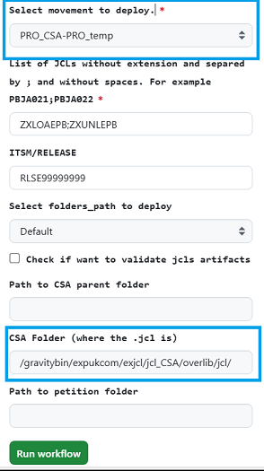
???+ Parameters

    *   **Select movement to deploy.:** Select ***PRO-CSA_PRO-Temp***
    *   **JCL\_LIST**: List of JCLs without extension and separated by semicolons and without spaces. JCLs have to exist in origin directory
    *   **CSA\_FOLDER**: Location of the folder where the JCLs are going to be to copy from. 
    *   **FOLDERS\_PATH**: For UK only. Available values on the combo: Default, deposit protection y cdb

#### 4.2.3. From PRO CSA Folder to other destination (only .jcl)

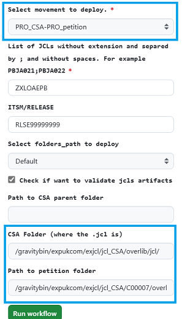
???+ Parameters

    *   **Select movement to deploy.:** Select ***PRO-CSA_PRO-Petition***
    *   **JCL\_LIST**: List of JCLs without extension and separated by semicolons and without spaces. JCLs have to exist in origin directory.
    *   **ITSM/RELEASE:** ITSM code or Release code. It is been used for audit log. (Mandatory).
    *   **CSA\_FOLDER**: Location of the folder where the JCLs are going to be to copy from. It may be introduced any folder as origin.
    *   **PETITION\_PATH**: Location of the folder where de JCLs are going to be copy to.

#### 4.2.4. From PRO Final to decommission


???+ Parameters

    *   **Select movement to deploy.:** Select ***PRO-Decom***
    *   **JCL\_LIST:** List of JCLs without extension and separated by semicolons and without spaces. JCLs have to exist in origin directory.
    *   **ITSM/RELEASE**: ITSM code or Release code. It is been used for audit log. (Mandatory)
    *   **FOLDERS\_PATH**: For UK only. Available values on the combo: Default, deposit protection y cdb.

#### 4.2.5. Restore PRO Final libraries

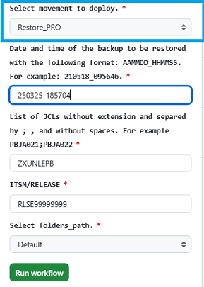
???+ Parameters

    *   **Select movement to deploy.:** Select ***Restore_PRO***
    *   **BACKUP\_DATE:**  Backup Date in format AAMMDD\_HHMSS. This information can be found in deployments JOBS log looking for the pattern  : "\_bk/BK"
    *   **JCL\_LIST:** List of JCLs without extension and separated by semicolons and without spaces. JCLs have to exist in origin directory
    *   **ITSM/RELEASE:** ITSM code or Release code. It is been used for audit log. (Mandatory)
    *   **FOLDERS\_PATH**: For UK only. Available values on the combo: Default, deposit protection y cdb

## 5\. Jobs Behaviour

### 5.1 **FROM TEMP TO FINAL**

This is for either 'CERT-TEMP to CERT-Final', 'PRE-TEMP to PRE-Final' or 'PRO-TEMP to PRO-Final'

* Check that JCLs exist. Job will fail if any of the JCL listed is not found
* Finds all jcl related files
* If checked, a new step is done to guarantee that the JCL has all related artifacts on the origin by means of an script called 'validate\_jcl\_artifacts.sh' . In case of some missing required associated artifacts in origin folder, it will show up
 an error message as following
{: style="height:75px"}

* Once checks are done, workflow (but CERT env) will display the difference between JCL about to move and the existing one at final destination stopping the execution


You may see those differences either in console or attached txt file and so decide to continue deploying (Proceed) or stopping workflow (Abort). So, **if Approve is checked**:

* Moves all found files in the FINALLY directory to the backup directory and rename the file with the deploy date and time (i.e.```/preukcom/orjcl/ORG.GRISB.JCL_bk/BK_210607/PBJA021.jcl_210607_134002```)

* Moves all found files in the temporal directory to the FINAL directory
* Audit file will be generated with the information of the JCL deploy with the name of the transitional-jcl-audit.log in the same path that the jcl are deployed OUI.GRORG.JCL\_audit but in the folder. Example: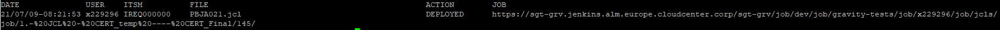

    In case of failure, the action column will have the value AUTO\_RESTORED with the restored files.

### 5.2 **FROM FINAL TO TEMP**

This is for either 'CERT-Final to PRE-TEMP' or 'PRE-Final to PRO-TEMP'

* Check that JCLs exist. Job will fail if any of the JCL listed is not found
* Finds all jcl related files
* Transforms the jcl (*.jcl), model (*.MODEL) and SQL (\*.sql) to adapt then to next environment with [the adaptaJCL.sh script](https://github.alm.europe.cloudcenter.corp/sgt-ISL00279/50074298/blob/master/adaptaJCL.sh)
    .

* Deletes all JCL related files (using the pattern described in the step 2) from the temporal directory of target servers (all hosts in *Microfocus* server group).
* Copies all JCL files to the temporal directory of target servers

* It is done a **comparison** between the JCLs just promoted to the environment-temp folders to the existing ones in the environment-final

### 5.3  **FROM CSA TO TEMP**

This is for either 'CSA to PRE-TEMP' or 'CSA to PRO-TMP' or 'CSA to PETITION'

* Check that JCLs exist. Job will fail if any of the JCL listed is not found
* Find all jcl files
* Copy only Jcls (none related file) from any CSA folder to PRE-TMP folder or from any CSA folder to PRO-TMP folder to PETITION Folder
* It is done also a **comparison** between the JCLs just copied to TMP folders with the existing ones in the final ( this is, compare to PRE-Final or PRO-Final depending on the triggered job).

### 5.4 **FROM FINAL TO DECOMMISSION**

* Check that JCLs exist. Job will fail if any of the JCL listed is not found
* Find all jcl files
* Move Jcls (and associated artifacts) from Final folders to decommissioned folders.
* Generates a backup in PRO folders in case restore is needed after decommision.
* Audit file will be generated with the information of the JCL deploy with the name of the transitional-jcl-audit.log in the same path that the jcl are extracted from (example: OUI.GRORG.JCL\_audit). showing the word DECOMMISIONED as follows:

???- code "Audit example"
    24/03/25-15:20:19 x230841 TEST ZXUNLEPB.jcl **DECOMMISIONED** sgt-grv.cloudbees.alm.cloudcenter.corp/sgt-grv/job/Adoption/job/UKEU/job/PRE/job/3.8.-Decom_JCL_PRE/7/

    24/03/25-15:20:19 x230841 TEST ZXUNLEPB-UNLOAD-QQPRUCOM.dcb **DECOMMISIONED** sgt-grv.cloudbees.alm.cloudcenter.corp/sgt-grv/job/Adoption/job/UKEU/job/PRE/job/3.8.-Decom_JCL_PRE/7/

### 5.4 **RESTORE**

Any case of restore in CERT, PRE or PRO

* Check that backup file with indicated nomenclature exists.
* Copies JCLs and related files to the final directory of target servers, with correct name

* Audit file will be generated with the information of the JCL restore with the name of the transitional-jcl-audit.log in the same path that the jcl are deployed OUI.GRORG.JCL\_audit but in the folder. Example: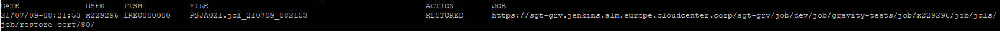

    In case of failure, the action column will have the value AUTO\_RESTORED with the restored files.

## 6\. **ANEXES:**

### **AUDIT FILE**

  Audit sample extracted from the same path where JCLs are stored:

```text
DATE              USER    ITSM/RELEASE             FILE                                                        ACTION        JOB
22/03/02-10:43:30 x230841 test  ZXUNLEPB-UNLOAD-QQPRUCOM-FB.sql\_220302\_104330 RESTORED    https://sgt-grv.jenkins.alm.europe.cloudcenter.corp/sgt-grv/job/sgt-shift-operations/job/UKEU/job/PRO/job/RESTORE\_PRO\_Final/8/
22/03/02-10:43:30 x230841 test  ZXUNLEPB-UNLOAD-QQPRUCOM-CSV.sql\_220302\_104330    RESTORED    https://sgt-grv.jenkins.alm.europe.cloudcenter.corp/sgt-grv/job/sgt-shift-operations/job/UKEU/job/PRO/job/RESTORE\_PRO\_Final/8/
22/03/11-09:54:44 x230841 RLSE00000000  ZXUNLEPB.jcl    DEPLOYED    https://sgt-grv.jenkins.alm.europe.cloudcenter.corp/sgt-grv/job/sgt-shift-operations/job/UKEU/job/PRO/job/5.-JCL-PRO\_temp----PRO\_Final/11/
22/03/11-09:54:44 x230841 RLSE00000000  ZXJCLALE.jcl    DEPLOYED    https://sgt-grv.jenkins.alm.europe.cloudcenter.corp/sgt-grv/job/sgt-shift-operations/job/UKEU/job/PRO/job/5.-JCL-PRO\_temp----PRO\_Final/11/
22/03/11-09:54:44 x230841 RLSE00000000  ZXUNLEPB-UNLOAD-QQPRUCOM.dcb    DEPLOYED    https://sgt-grv.jenkins.alm.europe.cloudcenter.corp/sgt-grv/job/sgt-shift-operations/job/UKEU/job/PRO/job/5.-JCL-PRO\_temp----PRO\_Final/11/
22/03/11-09:54:44 x230841 RLSE00000000  ZXUNLEPB-UNLOAD-QQPRUCOM-FB.dtl DEPLOYED    https://sgt-grv.jenkins.alm.europe.cloudcenter.corp/sgt-grv/job/sgt-shift-operations/job/UKEU/job/PRO/job/5.-JCL-PRO\_temp----PRO\_Final/11/
22/03/11-09:54:44 x230841 RLSE00000000  ZXUNLEPB-UNLOAD-QQPRUCOM-CSV.sql    DEPLOYED      https://sgt-grv.jenkins.alm.europe.cloudcenter.corp/sgt-grv/job/sgt-shift-operations/job/UKEU/job/PRO/job/5.-JCL-PRO\_temp----PRO\_Final/11/
22/03/11-09:54:44 x230841 RLSE00000000  ZXUNLEPB-UNLOAD-QQPRUCOM-FB.sql DEPLOYED    https://sgt-grv.jenkins.alm.europe.cloudcenter.corp/sgt-grv/job/sgt-shift-operations/job/UKEU/job/PRO/job/5.-JCL-PRO\_temp----PRO\_Final/11/
```

### **COMPARISON RESULTS**

For those jobs that stablishes a comparison between JCLs, the result can be viewed or/and downloaded from the workflow in any of the following ways:


This diffJCL.txt file may looks like as follows:

* If there is a new JCL related file in the promoted file vs the destination folders content (Example: a new dtl):


* If some JCL related file are in the destination folder but not in the promoted files (Example: a dtl not included):


* If there is no change in the JCLs and/or in the related files between promoted and destination folder:


* If there is a change in an artifact, as an example on the .jcl comparison is shown in two column format (on the left side promoted file, on the right side existing file);


## 7\. Trouble shooting

Some errors could appear while executing any of the workflows. These are most common ones:

* "*JCL's *****\* are duplicated in the JCL list*" meaning a set of JCLs has been specified at least twice.


* "*JCL *****\* not found in temp directory*", meaning specified JCL is not in origin


In case some non-controlled error raise during execution, please let us know by means of a ITSM

## 8\. CERT/PRE/PRO JCLs folders structure guidance

* Check on [**UK Corporate** folders structure](https://santandernet.sharepoint.com/:w:/s/Architecture_SWLifecycle_Public/EbKsXUpPfDFKmFtECM0XDEoBRspuUvx03UXgVPzUs89f8w?e=ra1BrH)

* Check on [**USA** folders structure](https://santandernet.sharepoint.com/:w:/s/Architecture_SWLifecycle_Public/EWR_AzVXznhDqkhn-Bk_uqwBu9hv-6SAlNp37uJXYADAcA?e=tNHtPS)

* Check on [**SCIB** folders structure](https://santandernet.sharepoint.com/:w:/s/Architecture_SWLifecycle_Public/EY1PoEizf5lPn2gkqNcdtQMBNZCy28gDGMY3sNEYRezYWA?e=JOlgtT)

* Check on [**Santander Spain** folders structure](https://santandernet.sharepoint.com/:w:/s/Architecture_SWLifecycle_Public/EU8j2BTPwJ1OuW7LO9N4p5sBSt2UytAO4sF4VE0uKmgWbw?e=nd2S4g)

* Check on [**Santander Mexico** folders structure](https://santandernet.sharepoint.com/:w:/r/sites/Architecture_SWLifecycle_Public/Shared%20Documents/ALMMC%20-%20Gravity/Documentation/WORD/estructura_carpetas_jcls_MEX_PREPRO.docx?d=w5fd69953041346f69264b3a65d13e930&csf=1&web=1&e=YtOKS1)

* Check on [**Santander Chile** folders structure](https://santandernet.sharepoint.com/:w:/r/sites/Architecture_SWLifecycle_Public/Shared%20Documents/ALMMC%20-%20Gravity/Documentation/WORD/estructura_carpetas_jcls_CHILE_PREPRO.docx?d=w4cf10423e62c496cbc46faa5d7c82470&csf=1&web=1&e=vLewhN)

* Check on [**Santander Germany** folders structure](https://santandernet.sharepoint.com/:w:/r/sites/Architecture_SWLifecycle_Public/Shared%20Documents/ALMMC%20-%20Gravity/Documentation/WORD/estructura_carpetas_jcls_DEU_CERT_only.docx?d=web99a89eea934ff5b44a6c86325487d3&csf=1&web=1&e=RH7ZAU)

## 9\. Doubts, incidents or support

### **9.1 Functional doubts**

For functional doubts you can access to the Team Channel: [ALMMC - Gravity](https://teams.microsoft.com/l/channel/19%3a700a602f72c1462abc5dbcb25e01004d%40thread.skype/4.%2520ALM%2520-%2520Gravity?groupId=e08adfa0-b3fd-4054-9ec0-eeb99835f6d0&tenantId=35595a02-4d6d-44ac-99e1-f9ab4cd872db)

During the pilots phase you may also consider to contact ALM Gravity Focal Points

### **9.2 Support or incidents in ALM cycle (Jenkins jobs)**

For any incident or support that you may need while using ALM Multicloud jobs, it is necessary to open a Service now to [Gluon Gravity ALM Support team](../gravity-support-faqs.md/#how-to-open-a-support-ticket)

### **9.3 Support or incidents in Mainframe (scripts)**

For any incident or support that are related to scripts it will be needed to open a ITSM ticket to the following categorization

[Technical Catalog / Systems / Mainframe / Gravity - Development Support](https://santander.service-now.com/com.glideapp.servicecatalog_cat_item_view.do?v=1&sysparm_id=ce3e0a471b33189862ce85506e4bcb3c&sysparm_processing_hint=setfield:request.parent%3d&sysparm_link_parent=d592a6601b40378020044002cd4bcba4&*sysparm_catalog=719aafd0db031f448c6c7cde3b9619f8&sysparm_catalog_view=catalog_technical_catalog)
*
Resolutor Group: SGT\_IN\_SY\_ES\_DEV\_SUP\_MAINFRAME

### **9.4. Support or incidents in Mainframe (JCLs transformation)**

For any incident or support related to JCLs transformation, please rise a ticket to SGT\_AP\_SE\_AA\_SGS Host& GIPIH N1 at the following categorization:

* Category: Architecture
* Subcategory: SGS Host & Gipih
* Environment: Production
* Element: Gipih & Tools SDLC  HOST
  
## 10\. Videos

| Título | **1. Topic** | **2\. Link** | **3\. Language** | **4\. Duration** |
| --- | --- | --- | --- | --- |
| Scheduling Team Training Session | JCL  | [training](https://santandernet-my.sharepoint.com/:v:/r/personal/x230841_santanderglobaltech_com/Documents/Recordings/Formaci%C3%B3n%20despliegues%20JCLs%20por%20GLUON-20250403_120715-Grabaci%C3%B3n%20de%20la%20reuni%C3%B3n.mp4?csf=1&web=1&e=Kqi9up&nav=eyJyZWZlcnJhbEluZm8iOnsicmVmZXJyYWxBcHAiOiJTdHJlYW1XZWJBcHAiLCJyZWZlcnJhbFZpZXciOiJTaGFyZURpYWxvZy1MaW5rIiwicmVmZXJyYWxBcHBQbGF0Zm9ybSI6IldlYiIsInJlZmVycmFsTW9kZSI6InZpZXcifX0%3D) | Spanish | 58:49 |
