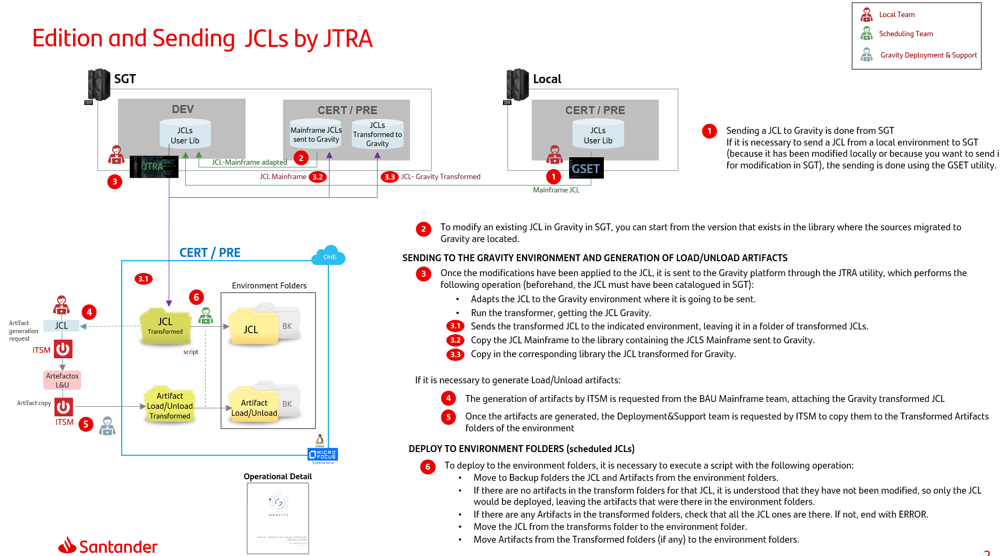
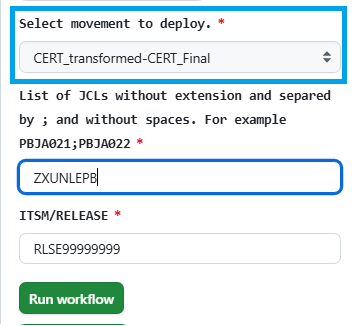
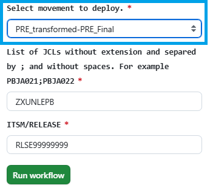
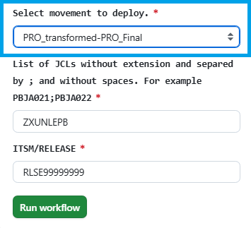
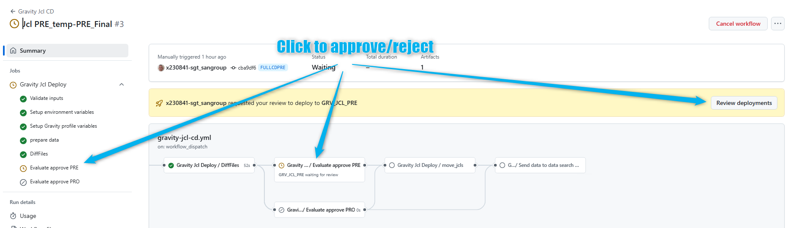
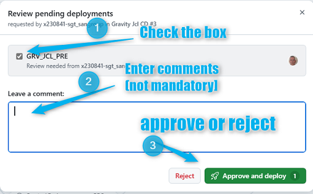
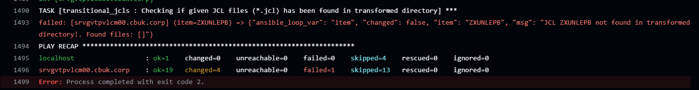

# Gravity JCL Transformed CERT/PRE/PRO workflows

## 1. Introduction

As mentioned this document is intended to deep into details about how JCL's objects are deployed in PRE and PRO environment coming from Transformed libraries.

The goal of these workflows is to promote from transformed libraries to either CERT, PRE or PRO environment. How JCLs are promoted to the transformed libraries using JTRA/GSET is explained at the following doc:

[Gravity. Edition and Sending of Santander USA JCLs by JTRA (v 5.0).docx](https://santandernet.sharepoint.com/:w:/s/Architecture_SWLifecycle_Public/EW1_ag5ENYpMklzhq-Ok1FgBbfexze3iWxDZjLtpbYz9Ww?e=Obm4uL)

## 2\. Component Creation & Team onboarding

Component should be already created at your gluon organization together with the Team that can access and execute the appropriate workflows. In case of any doubt please contact your [Gluon Gravity ALM Support team](../gravity-support-faqs.md)

## 3. Github.com ecosystem

Be familiar with github.com actions and look-like:

???- Note "**Enter in Github.com**"

    *   Open your browser
    *   Access or copy the URL (add to favorites recommended). 
        Sample [USA JCLs Repo](https://github.com/santander-group-usa-gln/sov-jclplan-grvusajcl):  ** Restricted access **

???- Note "**Run a workflow**"

    *   Select the 'action' bar, click on the workflow you may want to execute and click on **Run Workflow** button

    

    *   **Use workflow from**: you may select it according at your branch strategy (development by default)

???- Note "**Check the workflow's log:**"

    *   Click on **Workflow execution** and then on the desired stage
    
    *   and then on the desired **stage** and **job** 
    
     

    !!! Info "JCLS JOB SUMMARY"
        Pay special attention at the button of the console where you can find a summary of the most important actions done during the workflow execution. Example:
        

???- Note "**Check Annotations for Workflow entries:**"

    You may also check on Annotations the main entries given at workflow configuration time
    

## 4\. Jobs Description

### 4.1 Certification Jobs

???+ Parameters

    *   **Select movement to deploy.:** Select ***CERT-transformed_CERT-Final***
    *   **JCL\_LIST:** List of JCLs without extension and separated by semicolons and without spaces. JCLs have to exist in origin directory
    *   **ITSM/RELEASE:** ITSM code or Release code. It is been used for audit log.

### 4.2 PREproduction Jobs

???+ Parameters

    *   **Select movement to deploy.:** Select ***PRE-transformed_PRE-Final***
    *   **JCL\_LIST:** List of JCLs without extension and separated by semicolons and without spaces. JCLs have to exist in origin directory
    *   **ITSM/RELEASE:** ITSM code or Release code. It is been used for audit log.

### 4.3 Production Jobs

???+ Parameters

    *   **Select movement to deploy.:** Select ***PRO-transformed_PRO-Final***
    *   **JCL\_LIST:** List of JCLs without extension and separated by semicolons and without spaces. JCLs have to exist in origin directory
    *   **ITSM/RELEASE:** ITSM code or Release code. It is been used for audit log.

## 5\. Jobs Behaviour

* Check that JCLs exist. Job will fail if any of the JCL listed is not found
* Finds all jcl related files
* Already existing JCLs and associated artifacts in the environment folders are moved to backup ones.
* Checks artifacts related to the jcl so:
    * If there are none artifacts in the transform folders for the listed JCL, it is understood that they have not been modified, so only the JCL would be deployed, leaving the artifacts that were there in the environment folders.
    * If there is any artifact in the transformed folders, it is checked through a script called 'validate\_jcl\_artifacts.sh'  that all the JCL are in the origin folders. If not, will end up with ERROR.

* Once checks are done, workflow will stop in order you to download a file where you may see the difference between JCL about to move and the existing one. The result can be viewed or/and downloaded from the workflow in any of the following ways:

Once you have reviewed the differences, you should decide to continue deploying (Proceed) or stopping workflow (reject).

* if **Approve and deploy** is checked, workflow copies the JCL from the transforms folder to the environment folder.
* if **Approve and deploy** is checked, workflow copies artifacts from the Transformed folders (if any) to the environment folders.

## 6\. Trouble shooting

Some errors could appear while executing any of the workflows. These are most common ones:

* "*JCL's *****\* are duplicated in the JCL list*" meaning a set of JCLs has been specified at least twice.

* "*JCL *****\* not found in transformed directory*", meaning specified JCL is not in origin

In case some non-controlled error raise during execution, please let us know by means of a ITSM

## 7\. CERT/PRE/PRO JCLs folders structure guidance

* Check on [**UK Corporate** folders structure](https://santandernet.sharepoint.com/:w:/s/Architecture_SWLifecycle_Public/EbKsXUpPfDFKmFtECM0XDEoBRspuUvx03UXgVPzUs89f8w?e=ra1BrH)

* Check on [**USA** folders structure](https://santandernet.sharepoint.com/:w:/s/Architecture_SWLifecycle_Public/EWR_AzVXznhDqkhn-Bk_uqwBu9hv-6SAlNp37uJXYADAcA?e=tNHtPS)

* Check on [**SCIB** folders structure](https://santandernet.sharepoint.com/:w:/s/Architecture_SWLifecycle_Public/EY1PoEizf5lPn2gkqNcdtQMBNZCy28gDGMY3sNEYRezYWA?e=JOlgtT)

* Check on [**Santander Spain** folders structure](https://santandernet.sharepoint.com/:w:/s/Architecture_SWLifecycle_Public/EU8j2BTPwJ1OuW7LO9N4p5sBSt2UytAO4sF4VE0uKmgWbw?e=nd2S4g)

* Check on [**Santander Mexico** folders structure](https://santandernet.sharepoint.com/:w:/r/sites/Architecture_SWLifecycle_Public/Shared%20Documents/ALMMC%20-%20Gravity/Documentation/WORD/estructura_carpetas_jcls_MEX_PREPRO.docx?d=w5fd69953041346f69264b3a65d13e930&csf=1&web=1&e=YtOKS1)

* Check on [**Santander Chile** folders structure](https://santandernet.sharepoint.com/:w:/r/sites/Architecture_SWLifecycle_Public/Shared%20Documents/ALMMC%20-%20Gravity/Documentation/WORD/estructura_carpetas_jcls_CHILE_PREPRO.docx?d=w4cf10423e62c496cbc46faa5d7c82470&csf=1&web=1&e=vLewhN)

* Check on [**Santander Germany** folders structure](https://santandernet.sharepoint.com/:w:/r/sites/Architecture_SWLifecycle_Public/Shared%20Documents/ALMMC%20-%20Gravity/Documentation/WORD/estructura_carpetas_jcls_DEU_CERT_only.docx?d=web99a89eea934ff5b44a6c86325487d3&csf=1&web=1&e=RH7ZAU)

## 8\. Doubts, incidents or support

### **8.1 Functional doubts**

For functional doubts you can access to the Team Channel: [ALMMC - Gravity](https://teams.microsoft.com/l/channel/19%3A700a602f72c1462abc5dbcb25e01004d%40thread.skype/ALMMC%20-%20Gravity?groupId=e08adfa0-b3fd-4054-9ec0-eeb99835f6d0&tenantId=35595a02-4d6d-44ac-99e1-f9ab4cd872db)

During the pilots phase you may also consider to contact ALM Gravity Focal Points

### **8.2 Support or incidents in Gluon ALM cycle (Workflows)**

For any incident or support that you may need while using Gluon Workflows, it is necessary to open a Service now to [Gluon Gravity ALM Support team](../gravity-support-faqs.md/#how-to-open-a-support-ticket)

### **8.3 Support or incidents in Mainframe (scripts)**

For any incident or support that are related to scripts it will be needed to open a ITSM ticket to the following categorization

[Technical Catalog / Systems / Mainframe / Gravity - Development Support](https://santander.service-now.com/com.glideapp.servicecatalog_cat_item_view.do?v=1&sysparm_id=ce3e0a471b33189862ce85506e4bcb3c&sysparm_processing_hint=setfield:request.parent%3d&sysparm_link_parent=d592a6601b40378020044002cd4bcba4&sysparm_catalog=719aafd0db031f448c6c7cde3b9619f8&sysparm_catalog_view=catalog_technical_catalog)

Resolutor Group: SGT\_IN\_SY\_ES\_DEV\_SUP\_MAINFRAME

### **8.4. Support or incidents in Mainframe (JCLs transformation)**

For any incident or support related to JCLs transformation, please rise a ticket to SGT\_AP\_SE\_AA\_SGS Host& GIPIH N1 at the following categorization:

* Category: Architecture
* Subcategory: SGS Host & Gipih
* Environment: Production
* Element: Gipih & Tools SDLC  HOST

## 9\. Videos

| Título | **1. Topic** | **2\. Link** | **3\. Language** | **4\. Duration** |
| --- | --- | --- | --- | --- |
| Scheduling Team Training Session | JCL  | [training](https://santandernet-my.sharepoint.com/:v:/r/personal/x230841_santanderglobaltech_com/Documents/Recordings/Formaci%C3%B3n%20despliegues%20JCLs%20por%20GLUON-20250403_120715-Grabaci%C3%B3n%20de%20la%20reuni%C3%B3n.mp4?csf=1&web=1&e=Kqi9up&nav=eyJyZWZlcnJhbEluZm8iOnsicmVmZXJyYWxBcHAiOiJTdHJlYW1XZWJBcHAiLCJyZWZlcnJhbFZpZXciOiJTaGFyZURpYWxvZy1MaW5rIiwicmVmZXJyYWxBcHBQbGF0Zm9ybSI6IldlYiIsInJlZmVycmFsTW9kZSI6InZpZXcifX0%3D) | Spanish | 58:49 |
