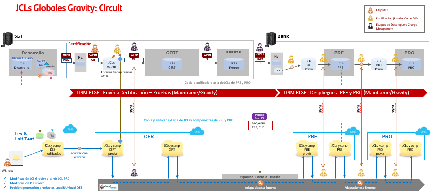
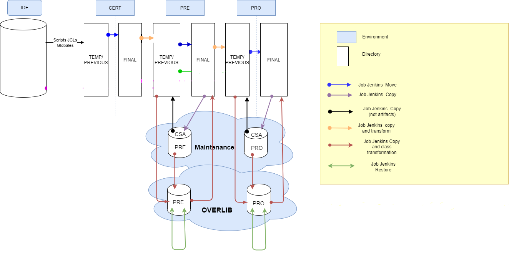

# Gravity JCL's Workflows

## 1. Scope

This article is meant to describe how Gluon JCLs workflows allow "Shift Operations or Scheduling" users to promote and transform JCL and related objects (DTL's load&unload) from one environment to another.

These deployments steps are part of the whole process of editing, maintaining and deploying JCL's from Mainframe as described in the following diagram:

## 2\. Abstract

The following diagram shows the flow on JCL's deployments through the different environments using Gluon workflows or Gipih:

## 3\. Jobs Summary

### 3.1 FOR MOVING FROM TRANSFORMED LIBRARIES

Transformed Workflows list:

| **Workflow name** | **Workflow setup** | **Description** |
| --- | --- | --- |
| Gravity JCL Transformed | **CERT / CERT\_transf----CERT\_Final** | Move JCL objects from CERT/Transformed to CERT/FINAL directory |
| Gravity JCL Transformed | **PRE / PRE\_transf----PRE\_Final** | Move JCL objects from PRE/Transformed to PRE/FINAL directory |
| Gravity JCL Transformed | **PRO / PRO\_transf----PRO\_Final** | Move JCL objects from PRO/Transformed to PRO/FINAL directory |

**Follow [this link](./gravity-jcl-transformed-workflows.md) for detailed information!!**

### 3.2. FOR DEPLOYMENT IN CERT ENVIRONMENT

Certification Workflows list:

| **Workflow name** | **Workflow setup** | **Description** |
| --- | --- | --- |
| Gravity JCL CI | **CERT\_temp----CERT\_Final** | Move JCL objects from CERT/Temp to CERT/FINAL directory |
| Gravity JCL Restore Cert | **Gravity JCL Restore Cert** | Restore JCL from previous backup in CERT/FINAL directory |
| Gravity JCL CI | **CERT\_Final---PRE\_temp** | Move JCL objects from CERT to PRE/Temp |

**Follow [this link](./gravity-jcl-certification-workflows.md) for detailed information!!**

### 3.3. FOR DEPLOYMENT IN PRE ENVIRONMENT

Preproduction workflows list:

| **Workflow name** | **Workflow setup** | **Description** |
| --- | --- | --- |
| Gravity JCL CD | **PRE/ CSA - PRE\_temp** | Move  JCL objects from CSA to PRE/TMP. This job also does a comparison between objects to be promoted to PRE/Temp and the already existing ones in PRE/Final |
| Gravity JCL CD | **PRE / JCL - PRE\_temp ---- PRE\_Final ---- PRO\_temp** | Move  JCL objects from PRE/Temp to PRE/FINAL directory  This job also copy from PRE-Final to PRO/Temp and makes a comparison between the objects to be promoted to PRE/Final and the already existing ones in PRO/Final |
| Gravity JCL CD | **JCL-PRE\_temp----PRE\_Final** | Moves JCLs  from PRE/Temp to PRE/FINAL directory   |
| Gravity JCL CD | **PRE_CSA----PRE_Petition** Moves JCLs from PRE/CSA to any PRE/destiny folder    |
| Gravity JCL CD | **Decom_JCL_PRE** | Moves JCLs from PRE/FINAL to Decomission folder    |
| Gravity JCL Restore PREPRO | **RESTORE - PRE\_Final** | Restore JCL from previous backup in PRE/FINAL directory |
| Gravity JCL CD | **PRE\_Final ---- PRO\_temp** | Copy  JCL objects from PRE/FINAL to PRO/Temp |

**Follow [this link](./gravity-jcl-prepro-workflows.md) for detailed information**

### 3.4. FOR DEPLOYMENT IN PRO ENVIRONMENT

Production Workflows list:

| **Workflow name** | **Workflow setup** | **Description** |
| --- | --- | --- |
| Gravity JCL CD | **PRO / JCL - PRO\_temp ---- PRO\_Final** | Move JCL objects from PRO/Temp to PRO/FINAL directory |
| Gravity JCL CD | **PRO** / **PRO_CSA----PRO_Petition** | Moves JCLs from PRO/CSA to any PRO/destiny folder    |
| Gravity JCL CD | **PRO / Decom_JCL_PRO** | Moves JCLs from PRO/FINAL to Decomission folder    |
| Gravity JCL CD | **PRO / CSA - PRO\_temp** | Move  JCL objects from CSA to PRO/TMP. This job also does a comparison between objects to be promoted to PRO/Temp and the already existing ones in PRO/Final |
| Gravity JCL Restore PREPRO | **RESTORE\_PRO** | Restore JCL from previous backup in PRO/FINAL directory |

**Follow [this link](./gravity-jcl-prepro-workflows.md) for detailed information**

### 3.5. FOR DEPLOYMENT IN OVERLIB

#### 3.5.1. ON PREPRODUCTION

Preproduction Overlib Workflows list

| **Workflow name** | **Workflow setup** | **Description** |
| --- | --- | --- |
| Gravity JCL CD | **OVERLIB / PRE-Final----PRE\_CSA** | Copies JCL objects from PRE-Final to PRE-CSA Folder |
| Gravity JCL OVERLIB | **OVERLIB / PRE\_CSA----PRE\_OVERLIB** | Copies JCL objects from PRE\_CSA to PRE\_OVERLIB. This job also does a comparison between objects to be promoted to PRE\_OVERLIB and the already existing ones in PRE-Final |
| Gravity JCL OVERLIB | **OVERLIB / PRE_CSA----PRE_OVERLIB-WOA** | Copies only .JCL  from PRE\_CSA to PRE\_OVERLIB but without any transformation |
| Gravity JCL OVERLIB | **OVERLIB / PRE\_Overlib----PRE\_final** | Copies JCL objects from PRE\_OVERLIB to PRE\_FINAL. |
| Gravity JCL OVERLIB | **OVERLIB / PRE_OVERLIB----PRE_final-WOA** | Copies only .JCL  from PRE\_OVERLIB to PRE\_FINAL. without any adaptation |
| Gravity JCL OVERLIB | ****OVERLIB / PRE\_temp----PRE\_overlib**** | Copies JCL objects from PRE\_tmp to PRE\_OVERLIB. |

**Follow [this link](./gravity-jcl-overlib-workflows.md) for detailed information**

#### 3.5.2. ON PRODUCTION

Production Overlib Workflows list:

| **Workflow name** | **Workflow setup** | **Description** |
| --- | --- | --- |
| Gravity JCL CD | **OVERLIB / 4.3.PRO-Final----PRO\_CSA** | Copies JCL objects from PRO-Final to PRO-CSA Folder |
| Gravity JCL OVERLIB | **OVERLIB / PRO\_CSA----PRO\_OVERLIB** | Copies JCL objects from PRO\_CSA to PRO\_OVERLIB. This job also does a comparison between objects to be promoted to PRO\_OVERLIB and the already existing ones in PRO-Final |
| Gravity JCL OVERLIB | **OVERLIB / PRO_CSA----PRO_OVERLIB-WOA** | Copies only .JCL  from PRO\_CSA to PRO\_OVERLIB but without any transformation |
| Gravity JCL OVERLIB | **OVERLIB / PRO\_Overlib----PRO\_final** | Copies JCL objects from PRO\_OVERLIB to PRO\_FINAL. |
| Gravity JCL OVERLIB | **OVERLIB / PRO_OVERLIB----PRO_final-WOA** | Copies only .JCL  from PRO\_OVERLIB to PRO\_FINAL. without any adaptation |
| Gravity JCL OVERLIB | **OVERLIB / PRO\_temp----PRO\_overlib** | Copies JCL objects from PRO\_tmp to PRO\_OVERLIB. |

**Follow [this link](./gravity-jcl-overlib-workflows.md) for detailed information**
