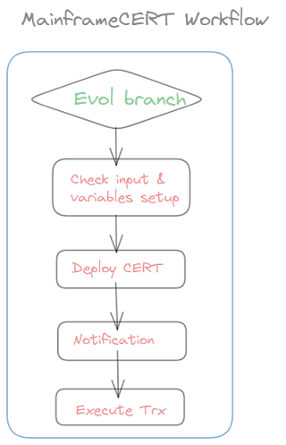
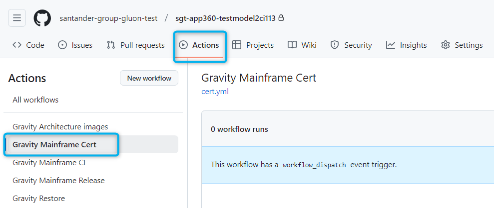
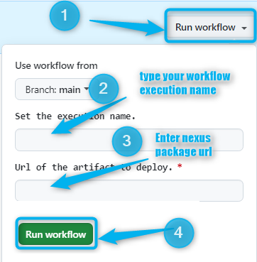
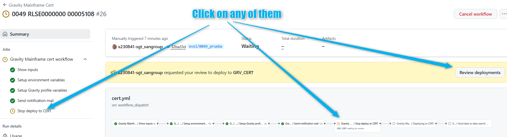
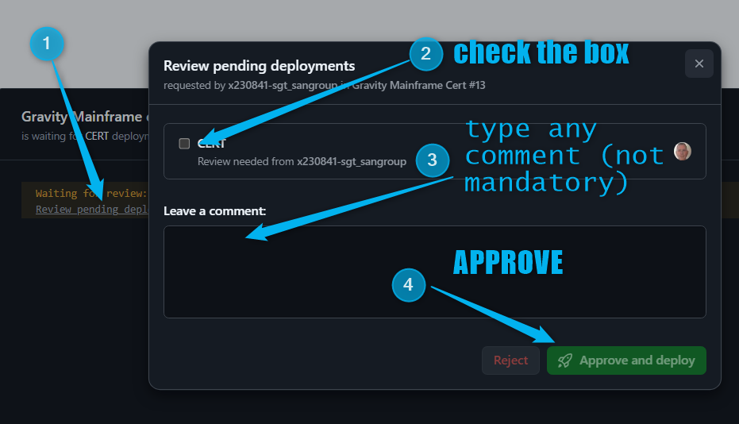
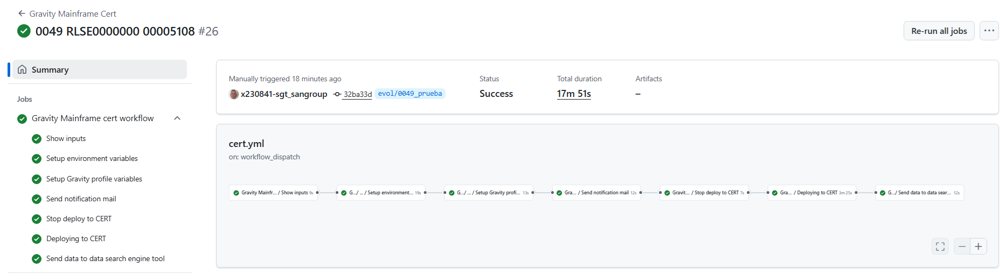

## Aim & Scope

This workflow allows to deploy a NEXUS snapshot package ( generated during [MainframeCI_Workflow](./MainframeCI.md) execution) in the gravity certification environment. This workflow must be executed by labs but it will need
 **'Gobierno de entornos de Certificacion' Team** approval.



## Workflow setup configuration

Once you have entered in the appropriate github.com repository where your Host Subapplication is, you may click on actions menu and then select Gravity Mainframe Cert Workflow.



Once this is done you may click on 'Run workflow' button and then:

* **select the branch** where Nexus snapshot package was created from (if main branch is selected it will fail immediately)

* enter the workflow execution name. According to 'Gobierno de Entornos' standards should be "CLIENT RLSE-ID SUA" (Eg: SVGS RLSE0000000 00112233 )

* type or copy the **NEXUS snapshot package**: you may see how to get it from MainframeCI Workflow execution the following [doc-link](./index.md/#85-howto-get-the-nexus-snapshot-url-from-a-mainframeci-workflow)



Once you hit on 'Run workflow', runner will start working covering the accurate stages

## Workflow stages

* **Check Input & Variables setup**: first of all, the given **NEXUS snapshot package** parameter entered is checked. In case of any issue on checking, workflow will stop showing an error message. Remember naming convention such as for migrated
    repositories from ALMMC:
```https://nexusmaster.alm.europe.cloudcenter.corp/repository/cobol_linux_snapshots/sgt-00001261/00007068/00007068-0.2.0+evol/UKEU_CHG00000000.zip```<br>
For new repositories in GLUON:
```https://nexusmaster.alm.europe.cloudcenter.corp/repository/cobol_linux_snapshots/santander-group-sds-gln/sgt-apm2999-mf00112233/sgt-apm2999-mf00112233-1.0.0+evol/UKEU_Project.zip```)<br>

* **Notification**: the 'Gobierno de entornos' email box will receive an email with appropriate data for them to approve this deployment (see next stage).

* **Stop deploy to cert**: at this point, Workflow will stop in order Gobiernos de Entornos Team to validate and approve the CERT deployment execution.

<br>If rejected, workflow stops and send a mail accordingly to the user but if it is approve, then it will continue covering next stages.<br>


* **Deployment to CERT**: workflow will trigger ansible deployment that will deposit the contents of the zip file in the accurate Certification server folders according to predefined inventories controlled by the Gluon Gravity Team. the "SQAI" TrxOp is
 invoked in order to storage the versions data in both Gravity and Mainframe tables.<br>This stage also includes **Execute TRX** step where the "SQV0" TrxOp is invoked in order to inform about the objects relationships in order them to be stored in the
  appropriate Gravity and Mainframe tables.

## Workflow summary

You may also see at the workflow execution diagram who launch it, which package and how long it took to execute the complete workflow and the partial and total results of each stage explained above


