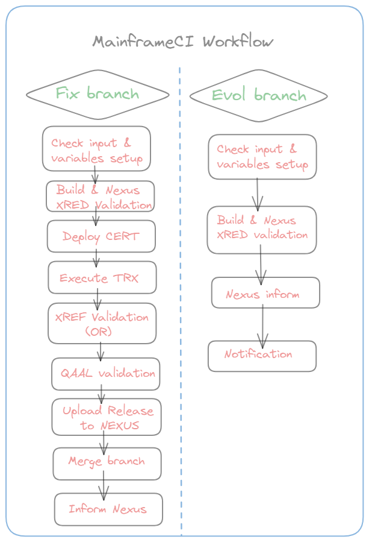
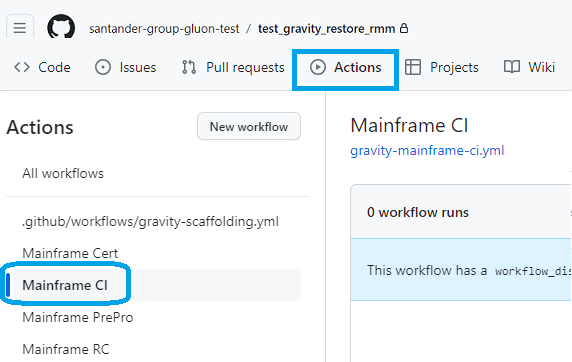
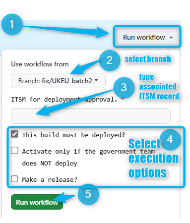
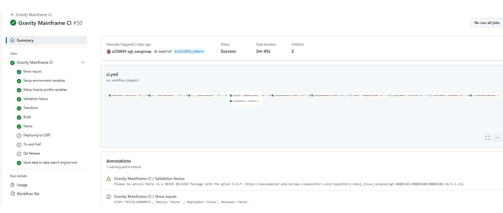
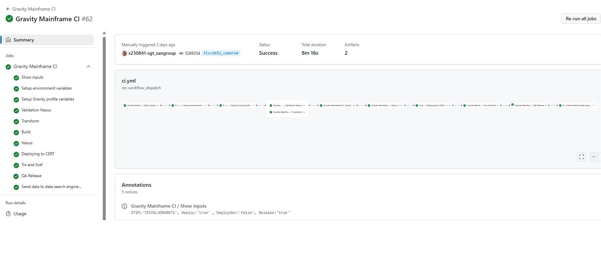

## Aim & Scope

This workflow allows depending on the selected branch:

Evol (evolutive): to build an application and upload the package to nexus (Snapshot repository)

Fix (Maintenance): to build a application, upload the package to nexus (Snapshot repository) and deploy it into certification environment as well as prepare the release nexus package to be delivered to the client.



## Workflow setup configuration

Once you have entered in the appropriate github.com repository where your Host Subapplication is, you may click on actions menu and then select MainframeCI Workflow.



Once this is done you may click on 'Run workflow' button and then select the branch where you previously load your objects from mainframe as well as ITSM mandatory field:



You may also select your **executions options** as shown above:

* ***'This build must be deployed'***: uncheck if you don't want to deploy the nexus artifact created during workflow execution (only eligible for fix branches).

* ***'Activate only if the government team does NOT deploy'***: check only for local SW or Architectural SW. Leave it unchecked for any kind of business global software since 'Gobierno de Entornos de Certificacion' is on charge of deploying SW in
 Cert environment.

* ***'Make a release'***: check only if you want to create a release while executing the workflow (only eligible for fix branches).

Once you hit on 'Run workflow', runner will start working covering the accurate stages depending on the selected branch (fix or evol) and the execution options selected.

## Workflow stages

### EVOL BRANCHES (EVOLUTIVES)

* **Check Input & Variables setup**: first of all, given parameters entered are checked. The branch selected must be according to naming convention. ITSM field must be filled in for tracing purposes. In case of any issue on checking, workflow will
 stop showing an error message.

* **Transform**: This stage is only applicable to architecture SW. GravityOne is triggered in order to get a expanded transformed source for each flavour prior to be compiled.

* **Build**: if some of the loaded object have to be compiled, the runner will ask Microfocus compiler to work on them.

* **Nexus**: Once all compilations are done, sources and binaries (compilation results) are taken together in a zip file that will be
 uploaded to Nexus following this naming convention for migrated repositories from ALMMC:
```https://nexusmaster.alm.europe.cloudcenter.corp/repository/cobol_linux_snapshots/sgt-00001261/00007068/00007068-0.2.0+evol/UKEU_CHG00000000.zip```<br>
and for new repositories in GLUON:
```https://nexusmaster.alm.europe.cloudcenter.corp/repository/cobol_linux_snapshots/santander-group-sds-gln/sgt-apm2999-mf00112233/sgt-apm2999-mf00112233-0.1.0+evol/UKEU_Project.zip```<br>
This step will execute the XRED validation. If it fails workflow will be stopped with KO result.
Finally GLUON invokes a BTAX microservice in order to inform about the Nexus snapshot package just created.

???+ WORKFLOW
    You may also see at the workflow execution diagram who launch it, over which branch and how long it took to execute the complete workflow and the partial and total results of each stage explained above.
    

    Pay special attention to annotations where entries and output are shown. There is also a possible **warning** shown about whether the VERSION selected is already taken from another release package. You may upgrade the VERSION file in this case in order the SW lifecycle to be completed successfully

### FIX BRANCHES (MAINTENANCE)

* **Check Input & Variables setup**: first of all, given parameters entered are checked. The branch selected must be according to naming convention. ITSM field must be filled in for tracing purposes. In case of any issue on checking, workflow will
 stop showing an error message.

* **Transform**: This stage is only applicable to architecture SW. GravityOne is triggered in order to get a expanded transformed source for each flavour prior to be compiled.

* **Build**: if some of the loaded object have to be compiled, the runner will ask Microfocus compiler to work on them.

* **Nexus**: Once all compilations are done, sources and binaries (compilation results) are taken together in a zip file that will be
 uploaded to Nexus following this naming convention for migrated repositories from ALMMC:
```https://nexusmaster.alm.europe.cloudcenter.corp/repository/cobol_linux_snapshots/sgt-00001261/00007068/00007068-0.2.0+evol/UKEU_CHG00000000.zip```<br>
For new repositories in GLUON:
```https://nexusmaster.alm.europe.cloudcenter.corp/repository/cobol_linux_snapshots/santander-group-sds-gln/sgt-apm2999-mf00112233/sgt-apm2999-mf00112233-1.0.0+evol/UKEU_Project.zip```<br>
This step will execute the XRED validation. If it fails workflow will be stopped with KO result.
Finally GLUON invokes a BTAX microservice in order to inform about the Nexus snapshot package just created.

* **Deployment to CERT**: according to the branch taken and if deployment check is set, workflow will trigger ansible deployment that will deposit the contents of the zip file in the accurate Certification server folders according to predefined
inventories controlled by the Gluon Gravity Team.

* **TRX and XREF**: in this stage:<br>
the "SQV0" and "SQAI" TrxOp are invoked in order to inform about the objects, versions and relations just deployed in order them to be stored in the appropriate both Gravity and Mainframe tables.<br>
Also based on objects, cross references are validated against OR environment (Preproduction). More details may be read at [XREF Annex](../gravity-partenon-model2/index.md/#81-xref-validation)

???+ info
    Following (above) stages will be executed only if ***'Make a Release'*** has been checked on workflow configuration

* **QA Release**: in this stage:<br>

    * QA info is checked for each object/version/release taking part of the package. Workflow will stop in case of any none QA compliance object. See more detail at [QA Section](../gravity-partenon-model2/index.md/#82-qa-circuit-in-this-model)<br>

    * A new package will be uploaded in NEXUS containing just the same information and contents than the snapshot. As a result, the new RELEASE package will be named as follows:<br>
    For migrated repositories from ALMMC:
    ```https://nexusmaster.alm.europe.cloudcenter.corp/repository/cobol_linux_release/sgt-00001261/00007068/00007068-0.2.0.zip```<br>
    For new repositories in GLUON:<br>
    ```https://nexusmaster.alm.europe.cloudcenter.corp/repository/cobol_linux_release/santander-group-sds-gln/sgt-apm2999-mf00112233/sgt-apm2999-mf00112233-1.0.0.zip```<br>
    Note repository is now cobol_linux_releases but v.r.f is kept from the snapshot notation.

    * Also during this stage, contents loaded in the feature branch are merged into the main_```[platform]``` branch and so a new tag is created in order to trace the github.com contents related to the just created release package.

    * Finally during this stage there is an extra SQAI call is executed in order to register objects/versions as an table entry 'RE LX GRAVITY ORACLE' that may be listed using Mainframe ARQ laboratory menu:
    

???+ WORKFLOW
    You may also see at the workflow execution diagram who launch it, over which branch and how long it took to execute the complete workflow and the partial and total results of each stage explained above.
    

    Please take special attention to annotations where information about entries and outputs are shown for easy look&find.
