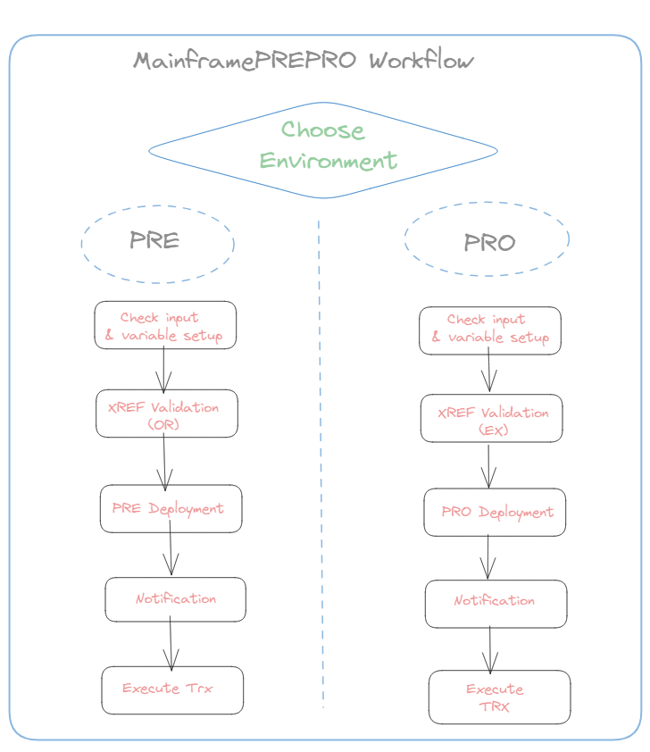
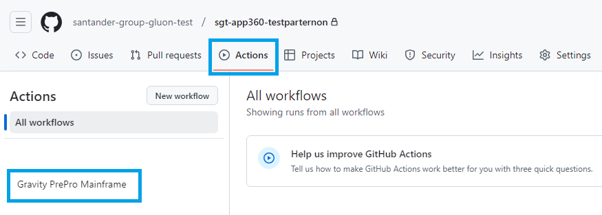
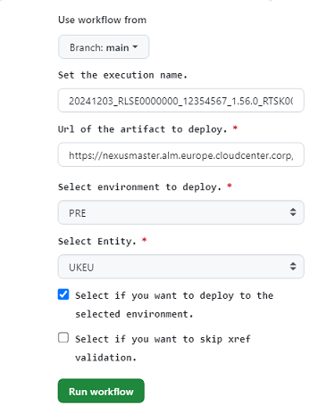
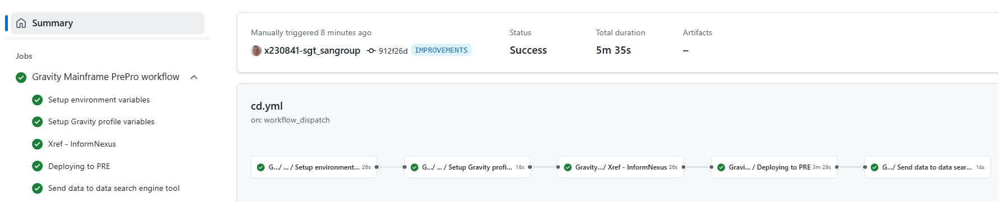
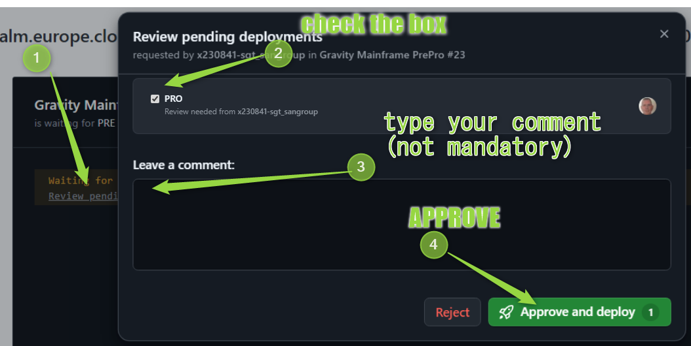
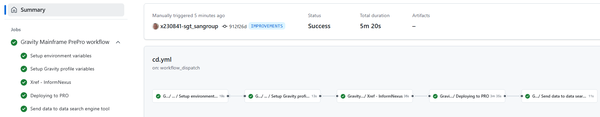

## Aim & Scope

 This workflow deploys a RELEASE nexus package into PRE or PRO environment checking Cross references prior to deployment stage.



## Workflow setup configuration

Once you have entered in the appropriate github.com repository, you may click on actions menu and then select **Gravity PREPRO Mainframe** Workflow.



Once this is done you may click on 'Run workflow' button and then:

* Use Workflow from (select properly depending on your branch strategy)

* Enter **comments** for you to trace the workflow about to be executed on 'Set the execution name'. (No restrictions in length,spaces, tabs or special characters).

* type or copy the **NEXUS Release Package** Artifact URL.

* Select the **environment** (either PRE or PRO).

* Select the **client** where package is going to be deployed from the list of available customers (UKEU, ARQ, SVGS, 0049, COSK, MEXM, CHLJ, SCF1).

* Check box: Select whether you want **to deploy** the artifact on the selected environment (by default is checked, this is, set to YES)

* Check box: Select whether you want to **skip the XREF validation** on the selected environment (by default is not checked, this is, set to NO)



Once you hit on 'Run workflow', runner will start working covering the accurate stages depending on the selected environment (PRE or PRO)

## Workflow stages

### PREproduction Environment

* **Check Input & Variables setup**: first of all, given parameters entered are checked. The nexus Release package should be according to the naming convention, this is containing: cobol_linux_release as in the following sample and for migrated repositories
 from ALMMC:
```https://nexusmaster.alm.europe.cloudcenter.corp/repository/cobol_linux_release/sgt-00001261/00007068/00007068-0.2.0.zip```<br>
For new repositories in GLUON:
```https://nexusmaster.alm.europe.cloudcenter.corp/repository/cobol_linux_release/santander-group-sds-gln/sgt-apm2999-mf00112233/sgt-apm2999-mf00112233-1.0.0.zip```<br>
In case of any issue on checking, workflow will stop showing an error message.

* **XREF validation - nexus inform**: relationships are checked for all objects included in the nexus package against Production environment. In case of response different than 00 or 01 (Warning) workflow will be stopped.

* **Deployment to PRE**: according to the branch taken, workflow will trigger ansible deployment that will deposit the contents of the zip file in the accurate PREproduction server folders according to predefined inventories controlled by the Gluon
 Gravity Team. This stage includes "SQAI" TrxOp invocation in order objects versions just deployed to be informed to both Gravity and Mainframe tables.

!!! Warning
    Workflow will stop in order you to approve/confirm the deployment
    
    and so it will remain till you get your accurate environment check selected
    as follows:
    

This stage also includes: **Notification**: in this stage, only if deployment ends OK, an email is sent to change management email box provided for each client and **Execute TRX**: in this stage the "SQV0" is invoked in order to inform about the
 relationships of the objects just deployed in order them to be stored in the appropriate Gravity and Mainframe tables.

???+ WORKFLOW
    You may also see at the workflow execution diagram who launch it, over which branch and how long it took to execute the complete workflow and the partial and total results of each stage explained above.
    

### PROduction Environment

* **Check Input & Variables setup**: first of all, given parameters entered are checked. The nexus Release package should be according to the naming convention for migrated repositories from ALMMC:
```https://nexusmaster.alm.europe.cloudcenter.corp/repository/cobol_linux_release/sgt-00001261/00007068/00007068-0.2.0.zip```<br>
For new repositories in GLUON:
```https://nexusmaster.alm.europe.cloudcenter.corp/repository/cobol_linux_release/santander-group-sds-gln/sgt-apm2999-mf00112233/sgt-apm2999-mf00112233-1.0.0.zip```<br>
In case of any issue on checking, workflow will stop showing an error message.

* **XREF validation-nexus inform**: relationships are checked for all objects included in the nexus package against Production environment. In case of response different than 00 or 01 (Warning) workflow will be stopped. A call is also send to inform
 about the release package about to be deployed in Production.

* **Deployment to PRO**: according to the branch taken, workflow will trigger ansible deployment that will deposit the contents of the zip file in the accurate Production server folders according to predefined inventories controlled by the Gluon
 Gravity Team. This stage includes "SQAI" TrxOp invocation in order objects versions just deployed to be informed to both Gravity and Mainframe tables.

!!! Warning
    Workflow will stop in order you to approve/confirm the deployment
    <br>
    and so it will remain till you get your accurate environment check selected
    as follows:
    

This stage also includes, **Notification**: If deployment OK, change management email box provided for each client will receive the appropriate email with package information and **Execute TRX** where the "SQV0" is invoked in order to inform about
 the relationships of the objects just deployed in order them to be stored in the appropriate Gravity and Mainframe tables.

???+ WORKFLOW
    You may also see at the workflow execution diagram who launch it, over which branch and how long it took to execute the complete workflow and the partial and total results of each stage explained above.
    
