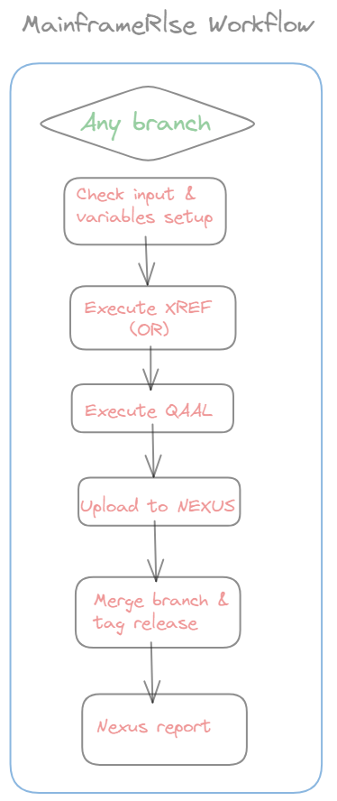
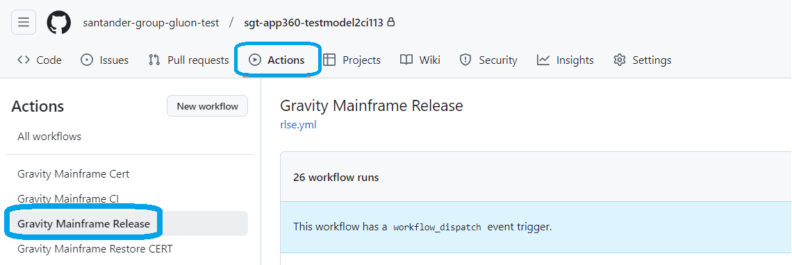
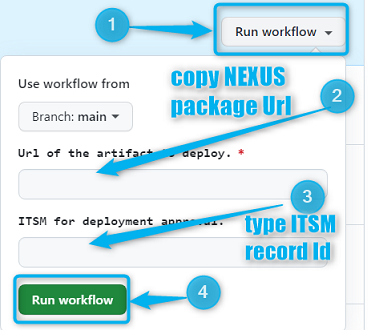
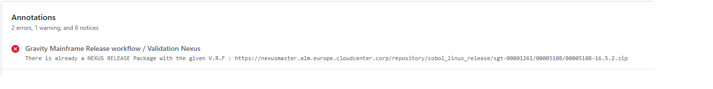
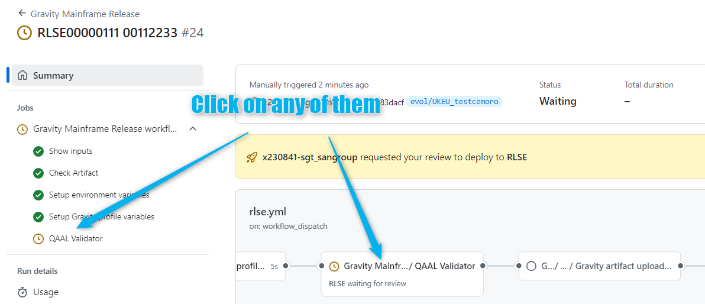
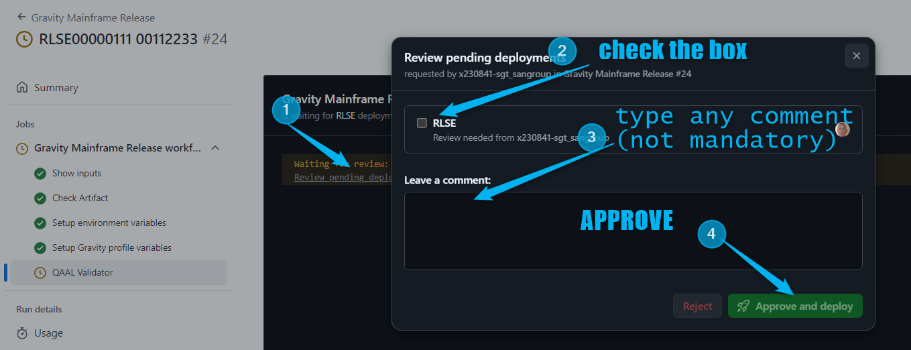
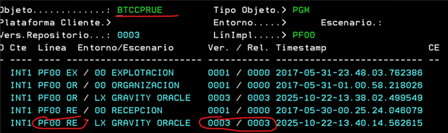
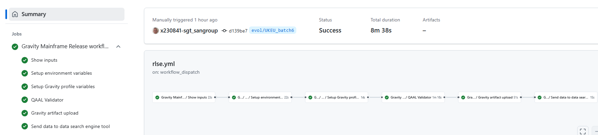

## Aim & Scope

This workflow allows to generate a release from an already existing nexus snapshot package generated during [MainframeCI_Workflow](./MainframeCI.md). This workflow must be executed by labs but it will need **'Gobierno de entornos de Certificacion'
 Team** approval.



## Workflow setup configuration

Once you have entered in the appropriate github.com repository where your Host Subapplication is, you may click on actions menu and then select MainframeRC Workflow.



Once this is done you may click on 'Run workflow' button and then:

* **select your branch** where Nexus snapshot package was created from (if main branch is selected it will fail immediately)

* enter the workflow execution nameAccording to 'Gobierno de Entornos' standards should be "CLIENT RLSE-ID SUA VERSION" (Eg: SVGS RLSE00000000 00112233 1.0.0)

* type or copy the **NEXUS snapshot package**: you may see how to get it from MainframeCI Workflow execution the following [howto](./index.md/#85-howto-get-the-nexus-snapshot-url-from-a-mainframeci-workflow)

* type the **ITSM(/RLSE)** record id (MANDATORY)



Once you hit on 'Run workflow', runner will start working covering the following stages:

## Workflow stages

* **Check Input & Variables setup**: first of all, given parameters entered are checked. The nexus snapshot package URL must be appropriately given as well as ITSM field must be filled in for tracing purposes.
Remember naming convention such as for migrated repositories from ALMMC:
```https://nexusmaster.alm.europe.cloudcenter.corp/repository/cobol_linux_snapshots/sgt-00001261/00007068/00007068-0.2.0+evol/UKEU_CHG00000000.zip```<br>
For new repositories in GLUON:
```https://nexusmaster.alm.europe.cloudcenter.corp/repository/cobol_linux_snapshots/santander-group-sds-gln/sgt-apm2999-mf00112233/sgt-apm2999-mf00112233-1.0.0+evol/UKEU_Project.zip```<br>
In case of any issue on checking, workflow will stop showing an error message.

???+ warning
    Please be sure the NEXUS package snapshot has been generated in the selected branch, otherwise workflow may be stopped during validations.

???+ failure
    Workflow will be stopped in case the VERSION file contains an already used v.r.f in a previous uploaded release package. You may upgrade appropriately in order to end-up with the SW package release created.
    

* **QAAL validation**: QA info is checked for each object/version/release taking part of the package. Workflow will stop on case of any none QA compliance object. This stage includes **XREF validation** where relationships are checked for all objects
 included in the nexus package against PREproduction environment. In case of response different than 00 or 01 (Warning) workflow will be stopped

???+ VALIDATION
    At this point, Workflow will stop in order ***Gobiernos de Entornos Team*** to validate and approve the Release execution.
    
    <br>If rejected, workflow stops and send a mail accordingly to the user but if it is approve, then it will continue covering next stages.<br>
    

* **Gravity artifact Upload**: following jobs are driven within this stage:<br><br>

    **Upload to NEXUS**: a new package will be uploaded in NEXUS containing just the same information and contents than the provided one. As a result, the new RELEASE package will be named as follows for migrated repositories from ALMMC:
```https://nexusmaster.alm.europe.cloudcenter.corp/repository/cobol_linux_release/sgt-00001261/00007068/00007068-0.2.0.zip```<br>
For new repositories in GLUON:
```https://nexusmaster.alm.europe.cloudcenter.corp/repository/cobol_linux_release/santander-group-sds-gln/sgt-apm2999-mf00112233/sgt-apm2999-mf00112233-1.0.0.zip```<br>
 Note repository is now cobol_linux_releases but v.r.f is kept from the snapshot notation.

    **Release Merge**: during this stage, contents loaded in the feature branch are merged into the main_**[platform] branch and so a new tag is created in order to trace the github.com contents related to the just created release package.

    **Nexus report**: in this stage, an action will trigger the BTAX service in order to advice about the just created nexus release package and so it will be taken into account in the accurate tables.

    **SQAI execution**: in this stage, an extra SQAI call is executed in order to register objects/versions as an table entry 'RE LX GRAVITY ORACLE' that may be listed using Mainframe ARQ laboratory menu:
    

## Workflow summary

You may also see at the workflow execution diagram who launch it and how long it took to execute the complete workflow and the partial and total results of each stage explained above:<br><br>


