# MODEL GOVERNED BY MAINFRAME

## 1. ABSTRACT

The purpose of this article is to indicate the necessary steps for a developer to be able to upload mainframe objects in gitHub.com repositories, version their Cobol Microfocus Programs projects in a Github.com repository, store the artifacts
 generated in Nexus, automatically deploy in the development and release the software for their delivery. Not forgetting, the deployment to preproduction and production environments. This circuit is suitable for any kind of object
  including DDLs though you may extend your knowledge by means of this presentation [DDL Gravity Creation Procedure](https://santandernet.sharepoint.com/sites/SEPPARTRT/SiteAssets/SitePages/News-Technical-Architecture-Partenon/Gravity---DDLs-%E2%80%93-Procedimiento-Creaci%C3%B3n-Tablas-Espa%C3%B1a-modelo-2-v1.4.pptx?web=1)

  The following article is not eligible for JCLs but you may read about [JCLS in Gravity](../gravity-partenon-jcls/index.md) as well.

## 2. ONBOARDING

You may follow instructions given in GLUON onboarding:

 * [**Teams Onboarding**](../../../../../application/application-management/application-members-management.md)

 * [**Application onboarding**](../../../../../application/application-management/application-onboard.md)

 * [**Component Creation**](../../../../../application/component-management/create-component.md)

## 3. ATLAS CATALOGATION

Please note that you may get into Atlas and give the github repository as parameter in the technical agrupation info.

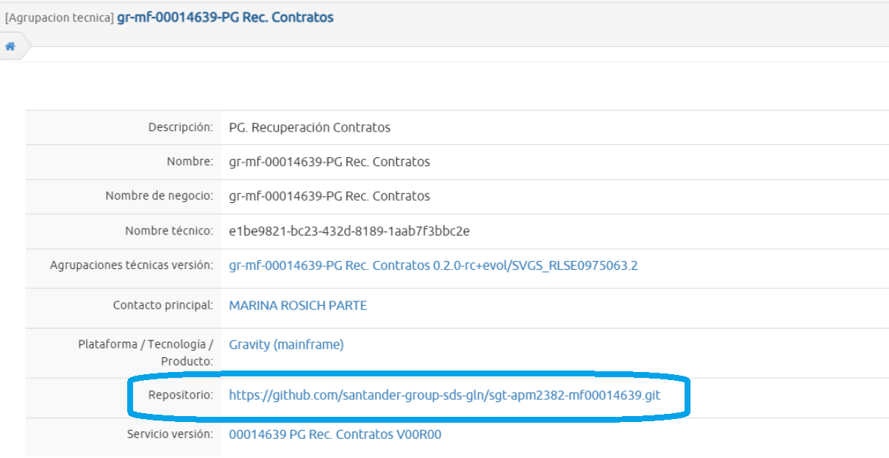

For this purpose you may follow the instructions given at: [ATLAS Technical groups management](https://gluon.gs.corp/alm/docs/latest/atlas/atlas-docs-es/user-manual/technical-maps/technical-groups-management/)

Please check using Atlas that the accurate repository is specified as follows:

!!! danger "Mandatory Catalogation"
    You may follow strictely repository catalogation in atlas. Otherwise you will not be able to load objects from Mainframe to Github and this message will show up in your tso screen:
    ``` ERROR AL RECUPERAR REPOSITORIO. REVISE EN ATLAS LA CATALOGACIÓN DE LA SUA. ```

## 4. COMPONENT CREATION (MODEL2 TEMPLATE)

For those Subapplications not previously onboarded in ALMMC, this is, not migrated to GLUON along the migration period, it is needed you to ask to create your component to your application manager. For this particular Gravity Model2 (Goberned
 by mainframe), you may use the 'Gravity Partenon' template:

!!! danger "Component naming convention restrictions"
    Please be advice that component's short name must be given as follows: MF```SUA-CODE``` Example: mf00005108

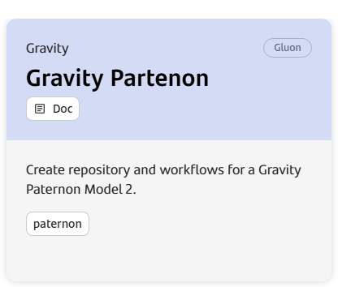

NOTE: for deployment Teams component should have been created during PoC timeframe.

## 5. BRANCH MODEL

Once repository is set, you will need to create branches on it in order to upload your sources from Mainframe. So far the approach to branching name convention is as follows:

* **main**: initial branch in the repository. It will remain unchangeable as setup from the template. For migrated SUAs the main branch must be the origin of any other **main_<***platform***>**.
* **development**:  default branch in the repository. It will remain unchengeable as setup from the template. For brand new components must be the origin of any other **main_<***platform***>**.
* **main_<***platform***>**: Branch opened from main that dessignates the client where the software is developed for. Once RELEASE is done, this branch will take automatically contents from the feature branch.

* **feature branches**: from 1 to n and coming from the main_<***platform***>, these branches are suitable for uploading objects from mainframe and so pipelines will be executed from them:
    * Evol branches: evol/<***platform***>_[projectname] Examples: evol/UKEU_feature1, evol/SVGS_feat
    * Fix branches: fix/<***platform***>_[changeID] Examples: fix/UKEU_mant1, fix/VGS_CHG00012.

!!! warning "Branch naming convention restrictions"
     Please do not use any "_" character on [projectname] or [changeID]

Valid ***platform*** names are:

* ARQ: Architecture (Cert / PRO Environment)

* UKEU: UK Corporate (Cert / Pre / Pro Environment)

* SVGS: Santander US (Cert /Pre / Pro Environment)

* COSK: SCIB (Cert / Pre/Pro Environment)

* 0049: Santander España (Cert / Pre / Pro Environment)

* MEXM: Santander Mexico

* CHLJ: Santander Chile

* SCF1: Santander Germany

This picture below shows the branch model just explained:

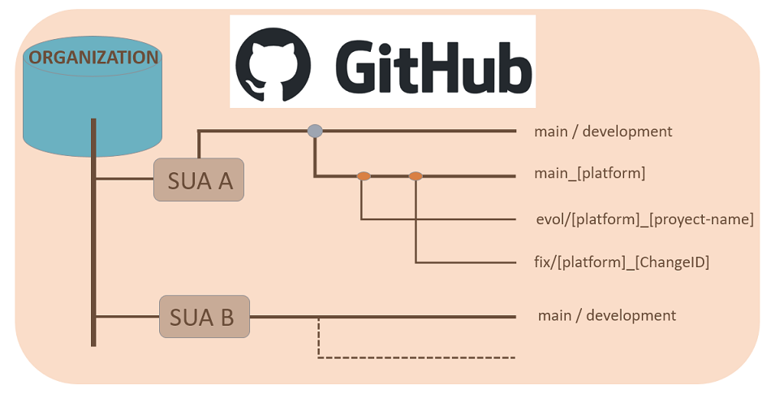

## 6. LOADING OBJECTS FROM MAINFRAME

!!! warning "IMPORTANT"
    It is a 'MUST', as mentioned in previous articles, that SUAs should be marked previously in the appropriate Mainframe tables in order to be possible objects to be loaded in Github.
    See details on how to proceed by reading 4 topic in the following documentation in Spanish Gravity. [Envío de objetos al Repositorio GitHub desde Mainframe](https://santandernet.sharepoint.com/sites/SEPPARTRT/SitePages/annexes/Annexed%20Partenon%20Gravity%20MaaS.%20Developer,%20Deployment%20_%20Configuration%20Management/Gravity.%20Env%C3%ADo%20de%20objetos%20al%20Repositorio%20GitHub%20desde%20Mainframe/Gravity.%20Env%C3%ADo%20de%20objetos%20al%20Repositorio%20GitHub%20desde%20Mainframe.aspx)

Please review carefully following documentation Gravity. [Pushing objects to the GitHub repository from Mainframe](https://santandernet.sharepoint.com/sites/SEPPARTRT/SitePages/annexes/Annexed%20Partenon%20Gravity%20MaaS.%20Developer,%20Deployment%20_%20Configuration%20Management/Gravity.%20Pushing%20objects%20to%20the%20GitHub%20repository%20from%20Mainframe/Gravity.%20Pushing%20objects%20to%20the%20GitHub%20repository%20from%20Mainframe.aspx)

## 7. WORKFLOWS AND ACTORS

To carry out continuous integration and deployment, users have the following workflows available:

|**Workflow**|**Actor**|**Description**|
|---     |---        |---   |
| [MainframeCI](./MainframeCI.md)   | Development Labs | This template allows depending on the selected branch to build an application and upload the package to nexus (Snapshot repository) and deploy it into certification environment |
| [MainframeCERT](./MainframeCERT.md)    | Development Labs / Gobierno de entorno de Certificación | This workflow allows to deploy a given Nexus snapshot package in Certification environment under Gobiernos de entorno de certificacion Authorization |
| [MainframeRLSE](./MainframeRLSE.md)    | Development Labs / Gobierno de entorno de Certificación | This workflow allows to create a release from a given nexus snapshot package  under Gobiernos de entorno de certificacion Authorization |
| [MainframePREPRO](./MainframePREPRO.md)   | Change Management / SIM Team (for ARQ) | This workflow generates a RELEASE in Nexus (Release repository) from a release candidate and deploys it to PRE or PRO environment.  |
| [MainframeRestore](./MainframeRestore.md)   | Any Team | This workflow allows you to return to a deployment previous from an artifact that we have previously uploaded to Nexus |

## 8. annexes

### 8.1 XREF VALIDATION

Cross references are activated in order to fulfill already existing validations in Mainframe.

In this way, GLUON Gravity will eventually invoked a openshift microservice where these validations are executed. GLUON Gravity sends information about the objects relationships ( .rel files that previously were stored in github ) for any single
 object that takes part of the package and receives back a CODE according to validations executed.

(00 OK, 01: WARNING, 02: Blocking 08: Process Error, 99: Pending on return)

!!! warning "WARNING ON VALIDATION RESULTS"
    During MainframeRC or MainframePREPRO workflows executions could cause the workflow to be stopped on failure.

For you to fix any kind of XREF validation problem and before opening a ticket to the appropriate team, please take a look at [Cross Reference Documentation](https://santandernet.sharepoint.com/sites/SEPPARTRT/SitePages/Annexes/Annexed%20Partenon%20Gravity%20MaaS.%20Developer,%20Deployment%20_%20Configuration%20Management/Gravity.%20Gu%C3%ADa%20de%20referencias%20cruzadas%20ALM%20MC/Gravity.-Gu%C3%ADa-de-referencias-cruzadas-ALM-MC.aspx)

See here a detailed diagram on the validations:

??? INFO XREF DIAGRAM
    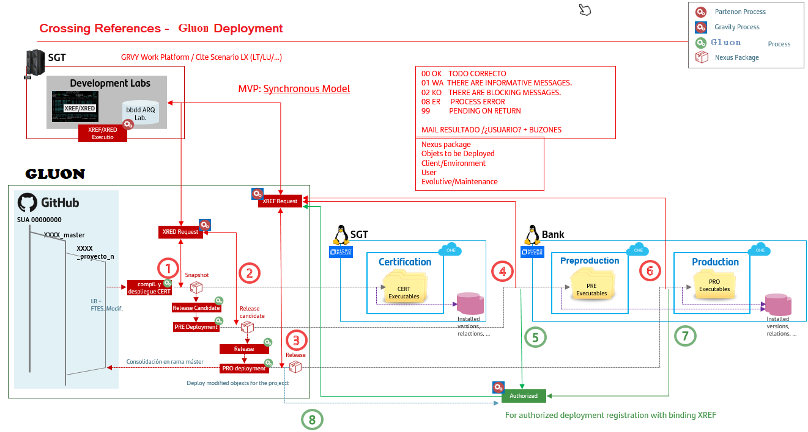

#### 8.1.1 XRED/XREF on MainframeCI or MainframeRLSE Workflows

New stages has been prepared in the MainframeCI y MainframeRLSR workflow for cross dependencies validation purposes invoking an openshift microservice where GLUON sends information about all objects/versions included in the package.

There are TWO non-skippable stages:

* Before uploading snapshot package to NEXUS ('xref validations' Stage).
* Before uploading release package to NEXUS. ('xref release validations' Stage)

#### 8.1.2 XREF on MainframePREPRO Workflow

New stages and validations have been prepared in the Mainframe PREPRO workflow for cross dependencies validation purposes invoking an openshift microservice where GLUON sends information about all objects/versions included in the package.

Those validations may be skipped in case of failure by means of checking on the accurate checkbox shown at workflow parameters input (either PRE or PRO):

**Select if you want to Skip XREF Validation**: Check box in order not take into account xref validations results received right before deployment stage:

???+ HOWTO
    Get the checkbox selected (by default is not)
    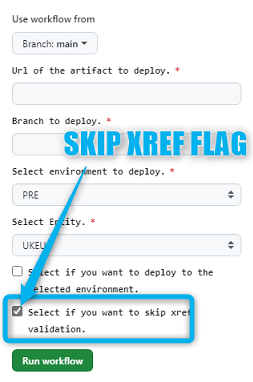

!!! warning "Double effort"
    It will be always needed to execute the workflow not selecting to Skip XREF Validation for the first time.<br>
    If need to skip it, a second effort  is needed (with marked Checkbox) for your workflow to go on, even  if there are blocking messages coming from XREF validations (other CODES but 00 or 01)

#### 8.1.3 XREF VALIDATION NOTIFICATION

* **XREF VALIDATION OK**:  In case that there is no issue during XREF validation process, you will receive an email as follows containing an attachment with information about why validation has successfully passed:

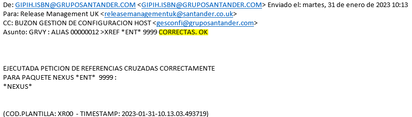

* **XREF VALIDATION KO**: In case that there is any issue during XREF validation process, you will receive an email as follows containing an attachment with the information about why validation has not successfully passed. EMAIL Sample:

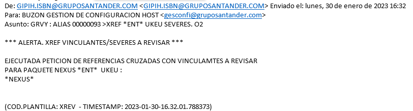

### 8.2 QA CIRCUIT IN THIS MODEL

While performing either [MainframeCI Workflow](../gravity-partenon-model2/MainframeCI.md) or [MainframeRLSE](../gravity-partenon-model2/MainframeRLSE.md) and if you perform the release action, GLUON will request information from
    Mainframe about QA compliance (using the TrxOP QAAL method).

As a result, once the workflow gets the information it could be:

Workflow results OK (Green): all objects deployed using GLUON have QA compliance.<br>
Workflow results KO (Red): any of the objects deployed have not QA compliance. This is a stopper on the workflow hence you will not be able to make the release neither deploy objects in PRE or PRO environment. You may find in the console log the
 reason why QA is not ok as a message coming from Mainframe TrX (Spanish).

!!! info  "Workflow showing QA not compliance"
    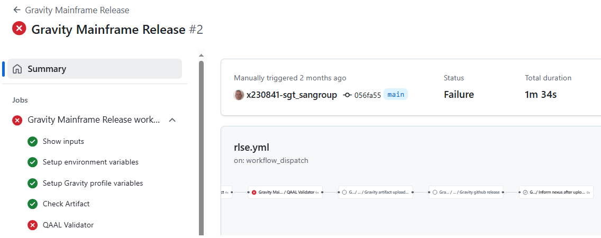<br><br>
    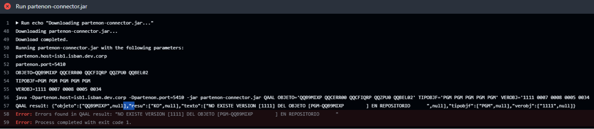

### 8.3 NEWCOPY PROCESS

While deploying either using transitional (synchronized model) or Mainframe (Model2) and depending on the package contents, several process are launched by the workflow in order to assure contents are set for business.
These processes are NewCopy, refresh, install or load_dic.

PGM online, ITE, MEN, MSJ, SER, TPE and TRX are the objects that should be taken into account for the particular case of NewCopy.

GLUON Mainframe Workflows such as MainframeCI, MainframeRC, MainframeCERT, MainframePREPRO, RestoreMainframe and Architecture Mainframe PREPRO are set in order to warn users about possible failures during NewCopy process invocation.

If return code is '0', this is, Newcopy execution ok, the pipeline will end up in 'green' (SUCCESS) if no further errors occur.

In case of receiving a return code 04 or 15, workflow will go on but will end into an UNSTABLE status. See an example:

!!! code "Provisional from ALMMC"
    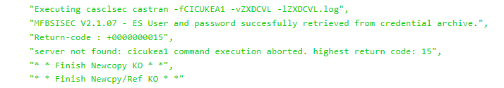

In any other case, pipeline will end up in Failure.

Despite of the Magenta/Red look-like, workflow will be also send an email to the executor in order to warn him/her about this error. So users will be notified in order to raise an ITSM ticket to Support Gravity Team for them to take a look on the error.

[Technical Catalog / Systems / Mainframe / Gravity - Development Support](https://santander.service-now.com/com.glideapp.servicecatalog_cat_item_view.do?v=1&sysparm_id=ce3e0a471b33189862ce85506e4bcb3c&sysparm_processing_hint=setfield:request.parent%3d&sysparm_link_parent=d592a6601b40378020044002cd4bcba4&sysparm_catalog=719aafd0db031f448c6c7cde3b9619f8&sysparm_catalog_view=catalog_technical_catalog)

### 8.4 CHECK NEXUS PACKAGE CONTENTS

You may check object versions and relations in any Nexus package (either snapshot or RELEASE)*

For this purpose you have two ways to do it:

* Download using the full NEXUS_URL_ARTIFACT: Just type desired package into your navigator:<br>

so you will get downloaded at your local desktop<br>


* Browsing in NEXUS (License and Authentication required):

    * Get into [NEXUS URL](https://nexusmaster.alm.europe.cloudcenter.corp/)

    * Login required using your LDAP id and password

    * Search for the package where you may search in cobol_linux_release for RELEASE packages and cobol_linux_snapshot for snapshots
    

    and browse your application and find the subapplication

    

To check contains just open the downloaded zip file, get into project folder and so in the type of branch where package was generated and finally into the yaml


where you may see the package contents such as timestamp, github source directory from where the package was build from, jenkins job URL used for uploading the package and related type, id, version and release for any single object contained in the
    package. See at the sample below:

!!! code "Descriptor (package.yaml) Sample"
    

### 8.5 HOWTO GET THE NEXUS SNAPSHOT URL FROM A MAINFRAMECI WORKFLOW

Nexus snapshot package URL is needed as entry for either [MainframeCERT](./MainframeCERT.md) or [MainframeRLSE](./MainframeRLSE.md) workflows. The way to get this url is easy from a MainframeCI workflow execution:

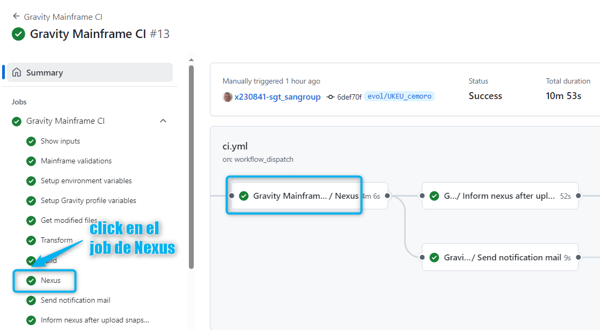

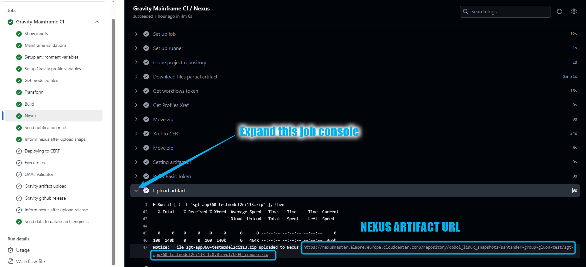

### 8.6 HOWTO GET THE NEXUS RELEASE PACKAGE URL FROM A MAINFRAME CI WORKFLOW

It is needed to identify the nexus release package url for you to send the SW to your client. For that purpose you can copy it from annotations on the Mainframe CI workflow execution:

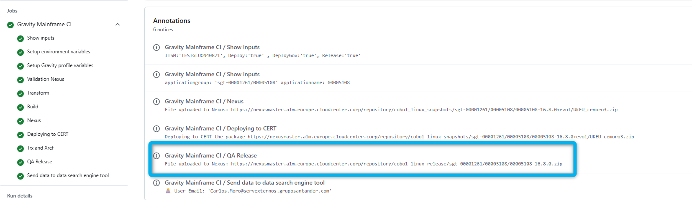

### 8.7 HOWTO GET THE NEXUS RELEASE PACKAGE URL FROM A MAINFRAME RELEASE WORKFLOW

It is needed to identify the nexus release package url for you to send the SW to your client.  For that purpose you can copy it from annotations on the Mainframe Release workflow execution:

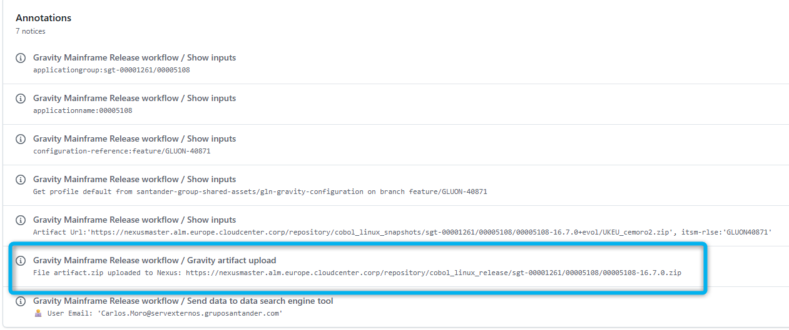

You may copy from there and paste at the RLSE ITSM appropriate field

## 9\. FAQ's

You may also take a look to the [FAQ's section](../gravity-support-faqs.md)

## 10\. Doubts, incidents or support

### **10.1 Functional doubts**

For functional doubts you can access to the Team Channel: [ALMMC - Gravity](https://teams.microsoft.com/l/channel/19%3A700a602f72c1462abc5dbcb25e01004d%40thread.skype/ALMMC%20-%20Gravity?groupId=e08adfa0-b3fd-4054-9ec0-eeb99835f6d0&tenantId=35595a02-4d6d-44ac-99e1-f9ab4cd872db)

During the pilots phase you may also consider to contact ALM Gravity Focal Points

### **10.2 Support or incidents in Gluon ALM cycle (Workflows)**

For any incident or support that you may need while using Gluon Workflows, it is necessary to open a Service now to [Gluon Gravity ALM Support team](../gravity-support-faqs.md/#how-to-open-a-support-ticket)

### **10.3 Support or incidents in XREFs**

For any incident or support that are related to scripts it will be needed to open a ITSM ticket to the following categorization

[Technical Catalog / Systems / Mainframe / Gravity - Development Support](https://santander.service-now.com/com.glideapp.servicecatalog_cat_item_view.do?v=1&sysparm_id=ce3e0a471b33189862ce85506e4bcb3c&sysparm_processing_hint=setfield:request.parent%3d&sysparm_link_parent=d592a6601b40378020044002cd4bcba4&sysparm_catalog=719aafd0db031f448c6c7cde3b9619f8&sysparm_catalog_view=catalog_technical_catalog)

Resolutor Group: SGT\_IN\_SY\_ES\_DEV\_SUP\_MAINFRAME

## 11. VIDEOS

| Título | **1. Topic** | **2\. Link** | **3\. Language** | **4\. Duration** |
| --- | --- | --- | --- | --- |
| Model2 CI Training Session (part. I) | PGMs  | [Training Session I](https://santandernet-my.sharepoint.com/personal/n637646_santanderglobaltech_com1/_layouts/15/stream.aspx?id=%2Fpersonal%2Fn637646%5Fsantanderglobaltech%5Fcom1%2FDocuments%2FRecordings%2F%5BGluon%20Session%5D%20Gravity%20Component%2D20250213%5F123125%2DGrabaci%C3%B3n%20de%20la%20reuni%C3%B3n%2Emp4&referrer=StreamWebApp%2EWeb&referrerScenario=AddressBarCopied%2Eview%2E8a339ae2%2D5875%2D4355%2Da4eb%2De12a77bde7bb) | Spanish | 1:09:33 |
| Model2 CI Training Session (part. I) | PGMs  | [Training Session II](https://santandernet-my.sharepoint.com/personal/n637646_santanderglobaltech_com1/_layouts/15/stream.aspx?id=%2Fpersonal%2Fn637646%5Fsantanderglobaltech%5Fcom1%2FDocuments%2FRecordings%2F%5BGluon%20Session%5D%20Gravity%20Component%20II%2D20250218%5F120301%2DGrabaci%C3%B3n%20de%20la%20reuni%C3%B3n%2Emp4&referrer=StreamWebApp%2EWeb&referrerScenario=AddressBarCopied%2Eview%2E888d81d4%2D6ff1%2D46de%2Da9fa%2D638d1a4b93a1) | Spanish | 1:20:03 |
