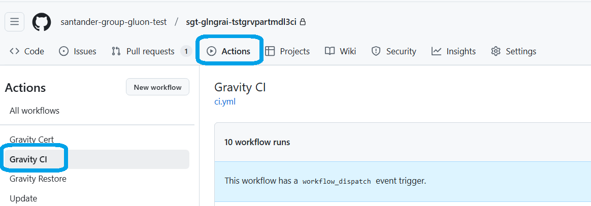
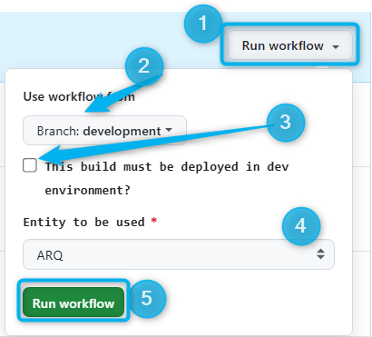
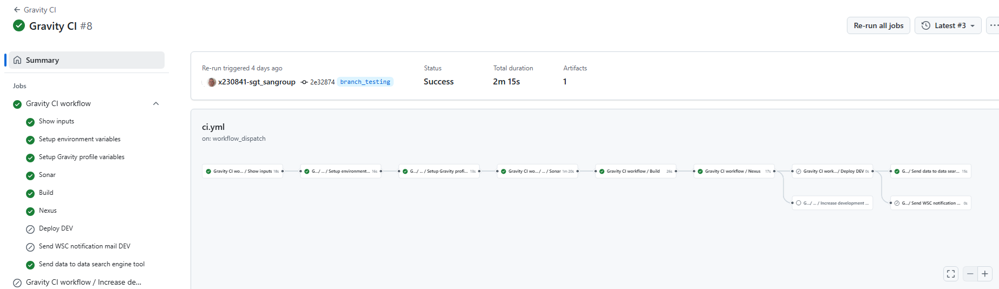
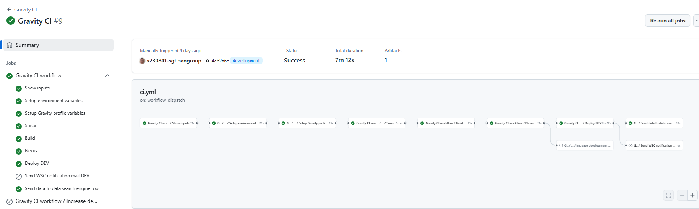
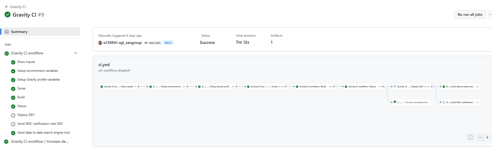
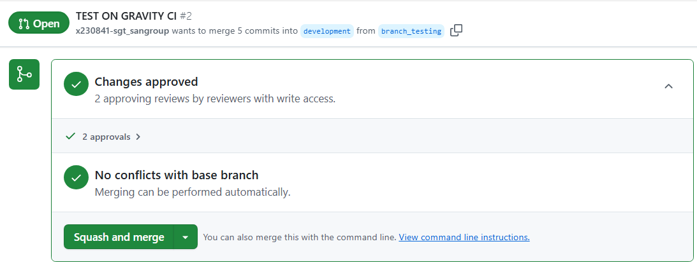
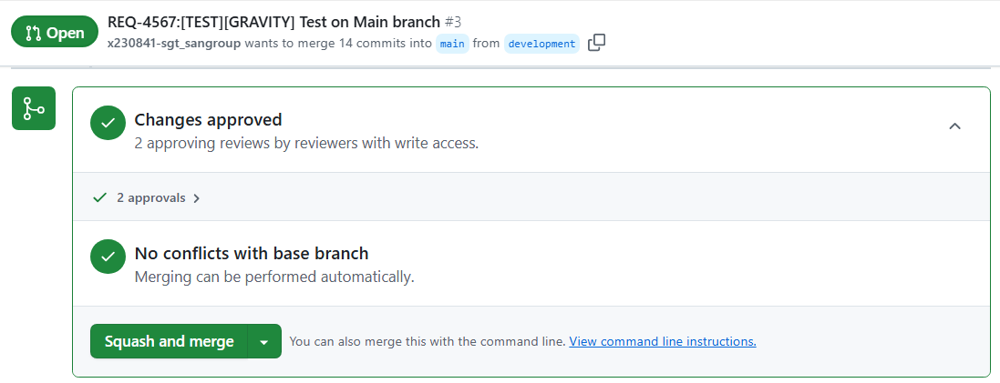

## Aim & Scope

This workflow allows, depending on the branch selected to be executed from, to build (compile) a given native software, make a Nexus package out of it and deploy (if checked) into dev environment.

## Workflow setup configuration

Once you have entered in the appropriate github.com repository where your native subapplication is, you may click on actions menu and then select Gravity CI Workflow.



Once this is done you may click on 'Run workflow' button and then select the branch where you want to execute from



You must also select:

* **deploy to dev**: choose whether you want to deploy your Software in dev environment or not (only suitable while executing in the integration branch).

* **Entity** where the software is intended to be delivered to. ARQ is showed as default selection.

Once you hit on 'Run workflow', runner will start working covering the accurate stages depending on the selected branch and the execution options selected.

## Workflow stages

### FEATURE BRANCHES

* **Check Input & Variables setup**: first of all, given parameters entered are checked.

* **Sonar**: right before compiling any source is checked according to sonar profile if not excepted. More details at [Sonar in native model](./index.md/#5-sonar-in-native-model).

* **Build**: All sources contained in the selected branch are compiled according to the accurated rules of the selected client.

* **Nexus**:  Compiled items are packaged together with sources and upload to the NEXUS Snapshot repository. The naming convention for this package is as follows: ```https://nexus.almpre.europe.cloudcenter.corp/repository/cobol_linux_snapshots/sgt-almprobes/gr-mc-50073561-Test2-Gravity-nativos/gr-mc-50073561-Test2-Gravity-nativos-0.1.0+branch_testing.zip```
Note feature branch name is included on the package name.

* **Send data**: this last stage is aimed to provide the most important workflow data (such as author, date, execution status, environment, client, etc...) to the opensearch tool in order to give an appropriate traceability.

???+ WORKFLOW
    You may also see at the workflow execution diagram who launch it, over which branch and how long it took to execute the complete workflow and the partial and total results of each stage explained above.
    

### INTEGRATION BRANCH (DEVELOPMENT)

* **Check Input & Variables setup**: first of all, given parameters entered are checked.

* **Sonar**: right before compiling any source is checked according to sonar profile if not excepted. More details at [Sonar in native model](./index.md/#5-sonar-in-native-model)

* **Build**: All sources contained in the selected branch are compiled according to the accurated rules of the selected client.

* **Nexus**:  Compiled items are packaged together with sources and upload to the NEXUS Snapshot repository. The naming convention for this package is as follows: ```https://nexus.almpre.europe.cloudcenter.corp/repository/cobol_linux_snapshots/sgt-almprobes/gr-mc-50073561-Test2-Gravity-nativos/gr-mc-50073561-Test2-Gravity-nativos-0.1.0+snapshot.zip```
Note ''snapshot'' is included on the package name.

* **Deploy to dev**: if checked, this stage will be performed and so Software will be deployed in dev environment (unit-test).

* **WSC Notification**: only if previous job is executed and the nexus package contains any WebService object. Mfes & GdS are notified with an email in order them to proceed to execute accurate scripts for WSC to get the proper treatment.

* **Send data**: this last stage is aimed to provide the most important workflow data (such as author, date, execution status, environment, client, etc...) to the opensearch tool in order to give an appropriate traceability.

???+ WORKFLOW
    You may also see at the workflow execution diagram who launch it, over which branch and how long it took to execute the complete workflow and the partial and total results of each stage explained above.
    

### MAIN BRANCH

* **Check Input & Variables setup**: first of all, given parameters entered are checked.

* **Sonar**: right before compiling any source is checked according to sonar profile if not excepted. More details at [Sonar in native model](./index.md/#5-sonar-in-native-model)

* **Build**: All sources contained in the selected branch are compiled according to the accurated rules of the selected client.

* **Nexus**:  Compiled items are packaged together with sources and upload to the NEXUS Release repository. The naming convention for this package is as follows: ```https://nexus.almpre.europe.cloudcenter.corp/repository/cobol_linux_release/sgt-almprobes/gr-mc-50073561-Test2-Gravity-nativos/gr-mc-50073561-Test2-Gravity-nativos-0.1.0.zip```

* **Update Version**: job does increase VERSION file in the development once contents are merged and tagged in the main branch. The value is set to ```v.(r+1).f```

* **Send data**: this last stage is aimed to provide the most important workflow data (such as author, date, execution status, environment, client, etc...) to the opensearch tool in order to give an appropriate traceability.

???+ WORKFLOW
    You may also see at the workflow execution diagram who launch it, over which branch and how long it took to execute the complete workflow and the partial and total results of each stage explained above.
    

## Github Workflow

According to GLUON standards, in order to fulfill the complete workflow in github it will be needed a Pull Request to carry out the changes from one branch to other, this is:

* Open, review & approve PR from a 'feature branch' to the 'Integration branch'

???+ INFO "PULL REQUEST APPROVAL"

    Approval request must be done by some developer who has access to the repository. Squash&Merge is recommended.

* Open, review & approve PR from the 'Integration branch' to the 'Main branch'

???+ INFO "PULL REQUEST APPROVAL"

    Approval request must be done by one of the application **technical-lead**. Please be aware of possible conflicts that may cause automatic merge not possible. Merge is recommended.

NOTE: Once integration branch contents are merged onto the main branch, release nexus package is generated with the v.r.f shown in the VERSION file. Please increase this number in the next iteration in order to prevent issues while uploading
 new release packages.
