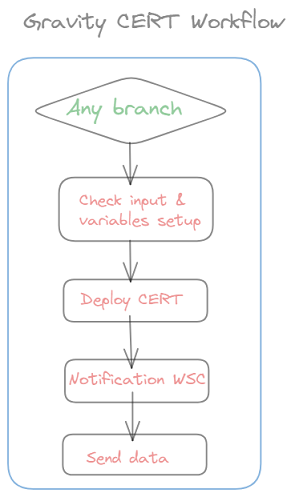
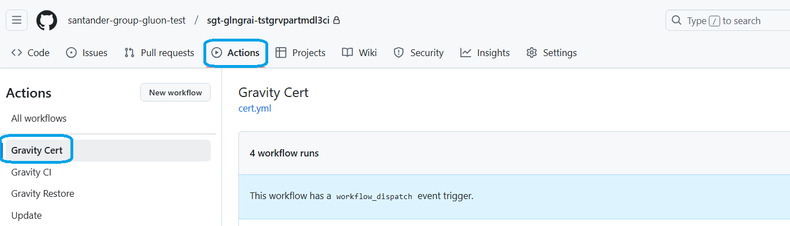
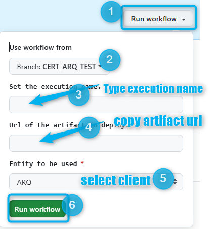
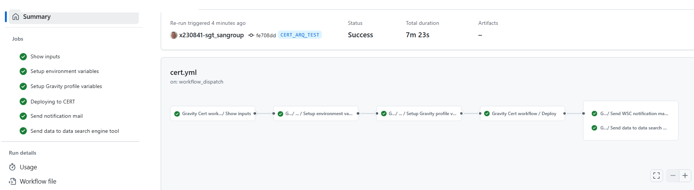

## Aim & Scope

This workflow allows to deploy a NEXUS release package ( generated during [GravityCI_Workflow](./GravityCI.md) execution) in the gravity certification environment.



## Workflow setup configuration

Once you have entered in the appropriate github.com repository, you may click on actions menu and then select Gravity Cert Workflow.



Once this is done you may click on 'Run workflow' button and then:

* Use Workflow from (select properly depending on your branch strategy)

* enter the workflow execution name (Eg: RLSE0000000 SUA 00001111 )

* type or copy the **NEXUS release package**

* select **entity** where the Software is about to be deployed to.



Once you hit on 'Run workflow', runner will start working covering the accurate stages

## Workflow stages

* **Check Input & Variables setup**: first of all, the given **NEXUS release package** parameter entered is checked. In case of any issue on checking, workflow will stop showing an error message. (Remember naming convention such as: ```https://nexus.alm.europe.cloudcenter.corp/repository/cobol_linux_release/sgt-almprobes/gr-mc-50073561-Test2-Gravity-nativos/gr-mc-50073561-Test2-Gravity-nativos-0.1.0.zip```)

* **Deployment to CERT**: workflow will trigger ansible deployment that will deposit the contents of the zip file in the accurate Certification server folders according to predefined inventories controlled by the Gluon Gravity Team.

* **Notification WSC**: in this last stage, If deployment OK and if package contains any Webservice object (WSC), Mfes email box provided will receive a notificatio email saying that those objects must be treated in the affected environment.

* **Send Data**: in this last stage, whether deployment was ok or not, opensearch tool is informed about the most important workflow's parameters used during execution.

## Workflow summary

You may also see at the workflow execution diagram who launch it, which package and how long it took to execute the complete workflow and the partial and total results of each stage explained above


