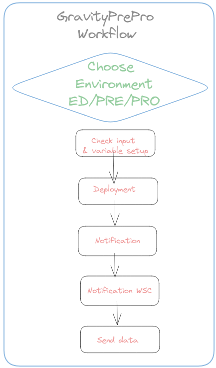
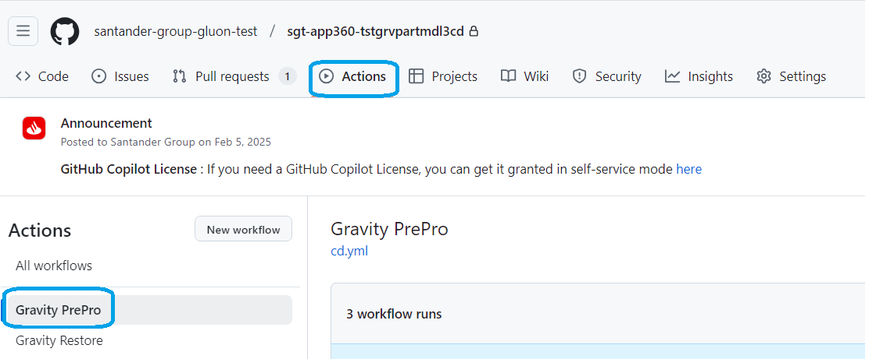
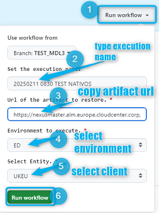
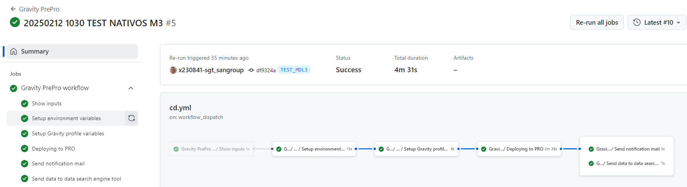

## Aim & Scope

 This workflow deploys a RELEASE nexus package into ED, PRE or PRO environment checking Cross references prior to deployment stage.



## Workflow setup configuration

Once you have entered in the appropriate github.com repository, you may click on actions menu and then select **Gravity PREPRO** Workflow.



Once this is done you may click on 'Run workflow' button and then:

* Use Workflow from (select properly depending on your branch strategy)

* Enter **comments** for you to trace the workflow about to be executed on 'Set the execution name'. (No restrictions in length,spaces, tabs or special characters).

* type or copy the **NEXUS Release Package** Artifact URL.

* Select the **environment** (either ED, PRE or PRO).

* Select the **client** where package is going to be deployed from the list of available customers (UKEU, ARQ, SVGS, 0049, COSK, MEXM, CHLJ, SCF1).



Once you hit on 'Run workflow', runner will start working covering the accurate stages depending on the selected environment (ED, PRE or PRO)

## Workflow stages

Stages are environment independent so these are the executed actions within the workflow:

* **Check Input & Variables setup**: first of all, given parameters entered are checked. The nexus Release package should be according to the naming convention, this is containing: cobol_linux_release as in the following sample:
 ```https://nexusmaster.alm.europe.cloudcenter.corp/repository/cobol_linux_release/sgt-00001261/00007068/00007068-0.2.0.zip```. In case of any issue on checking, workflow will stop showing an error message.

* **Deployment to ENVIRONMENT**: according to the environment selected, workflow will trigger ansible deployment that will deposit the contents of the zip file in the accurate server folders according to predefined inventories controlled by the Gluon
 Gravity Team.

!!! Warning
    Workflow will stop in order you to approve/confirm the deployment
    
    and so it will remain till you get your accurate environment check selected
    as follows:
    

* **Notification**: in this stage, only if deployment ends OK, an email is sent to SIM or Change Management email box provided for each client.

* **Notification WSC**: in this last stage, If deployment OK and if package contains any Webservice object (WSC), Mfes email box provided will receive a notificatio email saying that those objects must be treated in the affected environment.

* **Send Data**: in this last stage, whether deployment was ok or not, opensearch tool is informed about the most important workflow's parameters used during execution.

## Workflow summary

You may also see at the workflow execution diagram who launch it, over which branch and how long it took to execute the complete workflow and the partial and total results of each stage explained above.


