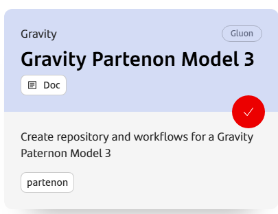
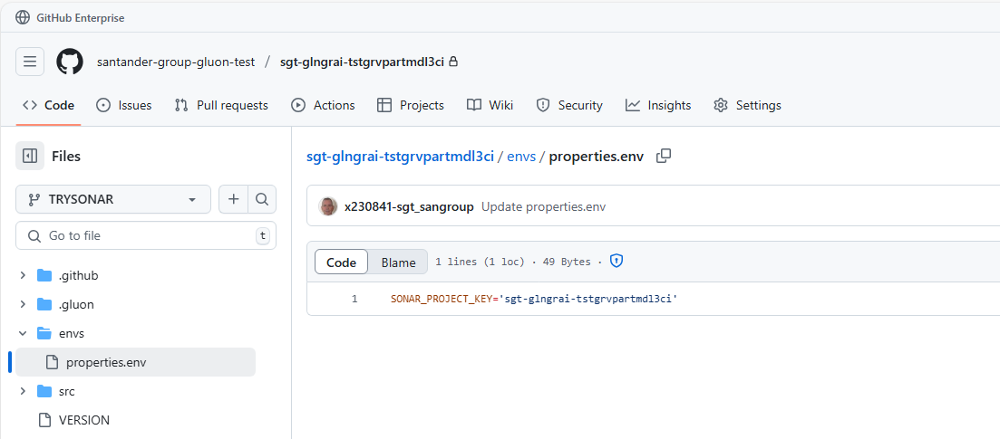
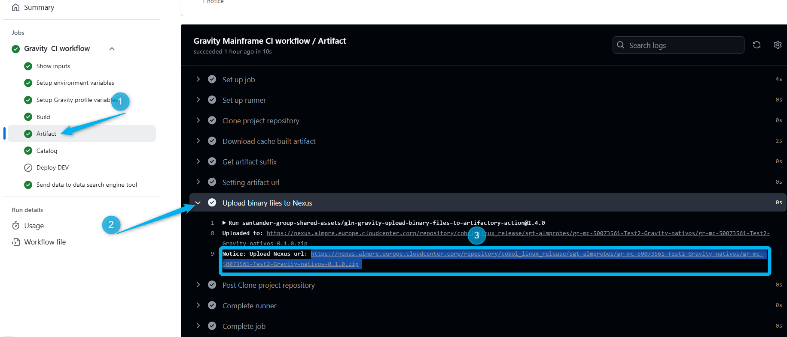
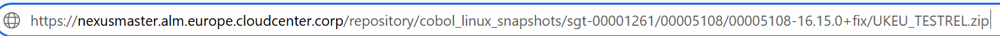
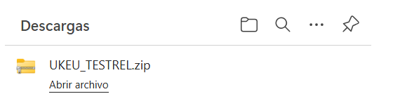
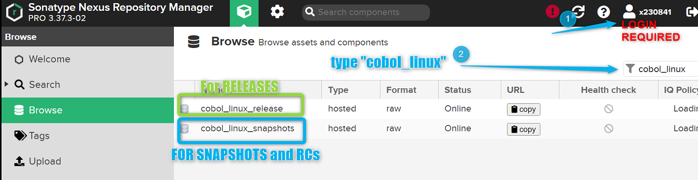
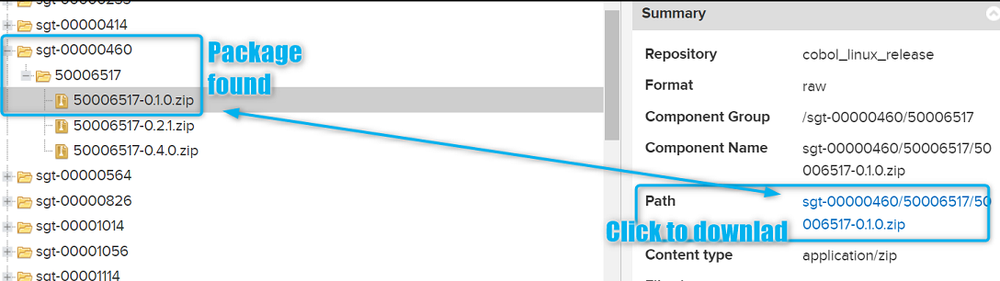
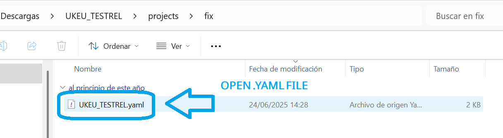
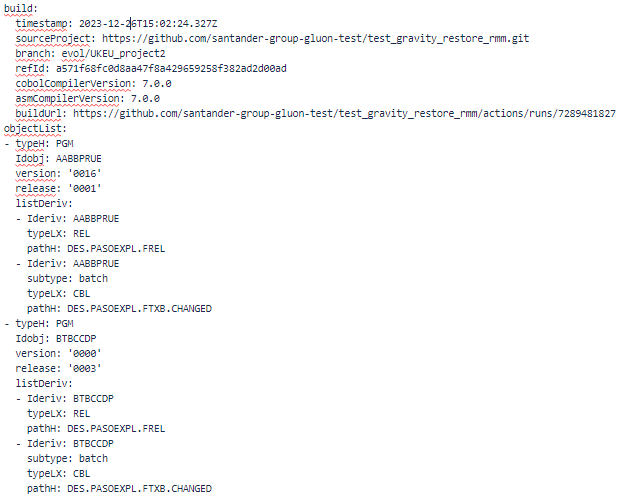
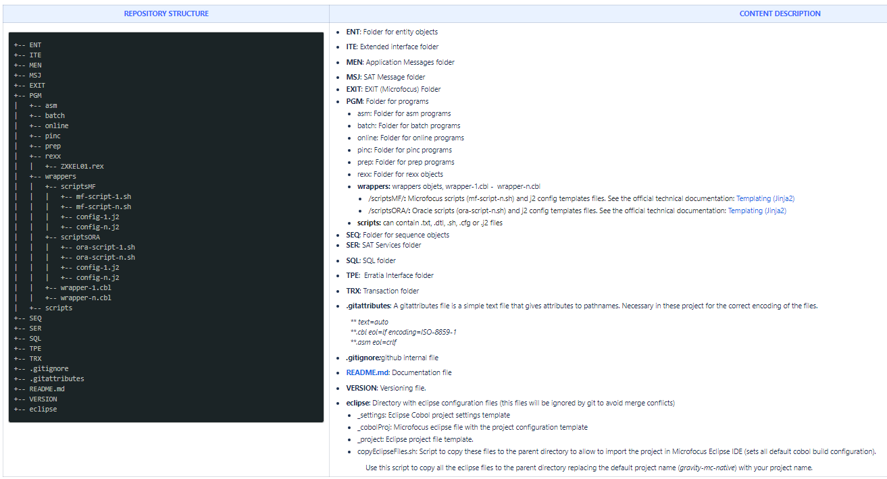

# NATIVE MODEL

## 1. ABSTRACT

The purpose of this article is to indicate the necessary steps for a developer to be able to develop native objects in gitHub.com repositories, version their Cobol Microfocus Programs projects in a Github.com repository, store the artifacts
 generated in Nexus, automatically deploy in the development and release the software for their delivery. Not forgetting, the deployment to preproduction and production environments.

## 2. ONBOARDING

You may follow instructions given in GLUON onboarding:

 * [**Teams Onboarding**](../../../../../application/application-management/application-members-management.md)

 * [**Application onboarding**](../../../../../application/application-management/application-onboard.md)

 * [**Component Creation**](../../../../../application/component-management/create-component.md)

 For those Subapplications not previously onboarded in ALMMC, this is, not migrated to GLUON along the migration period, it is needed you to ask to create your component to your application manager. For this particular Nativemodel,
  you may use the 'Gravity Partenon Model3 ' template:

!!! danger "Component naming convention restrictions"
    Please be advice that component's short name must be given as follows: MC```SUA-CODE``` Example: mc00021210



NOTE: for deployment Teams component should have been created during PoC timeframe.

## 3. BRANCH MODEL

For the correct operation of the workflow, it is necessary to verify that scaffolding has created the following branches:

* **feature branch**: any kind of development may be done onto this kind of branches in order to be merged later on into the integration branch (development by default).

    * **development**: Integration branch where we will test all our changes before going to master.

    * **main**: Branch where the sw will be build, packaged and released in order to be delivered to pre / production environment

## 4. WORKFLOWS AND ACTORS

To carry out continuous integration and deployment, users have the following workflows available:

|**Workflow**|**Actor**|**Description**|
|---     |---        |---   |
| [GravityCI](./GravityCI.md)   | Development Labs | This template allows depending on the selected branch to build an application and upload the package to nexus (Snapshot repository) or created a Release package in order to deploy it into certification environment (but ARQ SW) |
| [GravityCERT](./GravityCert.md) |  SIM Team | This workflow allows to deploy a given Nexus release package in Certification environment (ARQ SW) |
| [GravityPREPRO](./GravityPREPRO.md)   | Change Management / SIM Team (for ARQ) | This workflow deploys a release Nexus package in either ED, PRE or PRO environment.  |
| [GravityRestore](./GravityRestore.md)   | Any Team | This workflow allows you to return to a deployment previous from an artifact that we have previously uploaded to Nexus |

## 5. SONAR IN NATIVE MODEL

It is mandatory (but exceptions to be approved by Application Owner) to fulfill Sonar requisites in the Partenon native model cycle.

For that purposes the Model3 CI Template is set to get the appropriate sonar profile called: ```cobolmicrofocusnativoarq``` suitable for the Architectural SW.

For you to configure it into your repository, you may provide your **SONAR_PROJECT_KEY** as the name of your component. Sample: ```SONAR_PROJECT_KEY='sgt-glngrai-tstgrvpartmdl3ci'```

This information must be given in a **properties.env** file within **envs** directory at your component first level:



Once you have setup your profile at your feature branch, Sonar job within [GravityCI workflow](./GravityCI.md) will be executed for the first time. At that very first time a first analysis is generated in the Sonar instance. You may contact Sonar responsibles
 in order them to mark it as a referenced 'existing code'. So that that baseline will be used as a reference for changes introduced later on the SW cycle.
 From that moment onwards whenever merges are done to development and then to main, sonar will analyze the 'delta' over the already existing baseline.

## 6. ANNEXES

### 6.1 HOWTO GET THE NEXUS SNAPSHOT URL FROM A GRAVITY CI WORKFLOW

Nexus release package URL is needed as entry for either [GravityCERT](./GravityCert.md) or [GravityPREPRO](./GravityPREPRO.md) workflows. The way to get this url is easy from a Gravity CI workflow made out from main branch execution:



### 6.2 CHECK NEXUS PACKAGE CONTENTS

You may check object versions and relations in any Nexus package (either snapshot, Release-Candidate or RELEASE)*

For this purpose you have to ways to do it

* Download using the full NEXUS_URL_ARTIFACT: Just type desired package into your navegator:

so you will get downloaded at your local desktop


* Browsing in NEXUS (Authentication required):

    * Get into [NEXUS URL](https://nexusmaster.alm.europe.cloudcenter.corp/)

    * Login required using your LDAP id and password

    * Search for the package where you may search in cobol_linux_release for RELEASE packages and cobol_linux_snapshot for release-candidates or snapshots
    

    and browse your application and find the subapplication

    

To check contains just open the downloaded zip file and so the package.yaml



where you may see the package contents such as timestamp, github source directory from where the package was build from, jenkins job URL used for uploading the package and related type, id, version and release for any single object contained in the
    package. See at the sample below:

!!! code "Descriptor (package.yaml) Sample"
    

### 6.3 What structure have your project in GIT?

In order to use the continuous integration circuit of the ALM Global, scaffolding workflow has created your project following this structure:

???- note "Cobol Application Structure:"
    

???+ danger "file permissions advice"

    It's quite important to give the right permissions on your files before uploading them to Github. Neither Github or Ansible modify those permissions so the permissions originally defined will be the ones granted on destination. Only if a given file already exists at the destination, permissions will not be modified, preserving those given at destination server

???+ danger "Encoding advice"

    Be aware of already mentioned contents on **.gitattributes** file. It must be include the right encoding. Further more you must configure in IDE's as well together with Eclipse Preferences>GEneral>Workspacem → Select **iso-8859-1 encoding**

### 6.4 Github troubleshooting (Solving merge conflicts)

???+ danger "Important"
    It is quite important you to know that if a conflict appears while merging from one branch to another it must be resolved using commands and never using visual github utilities. Otherwise, Github will change, by its own, the files encoding to
     utf-8 and this will end up in problems while executing the pipelines.

    ???- note "This is a brief how to proceed using github commands"

        *   Step 0. Connect to repository from local (gitbash recommended)

                  *git init*  
                  *git clone https://github.alm.europe.cloudcenter.corp/<organization\>/<repository\> (https mode) or*  
                  *git clone git@github.alm.europe.cloudcenter.corp:<organization\>/<repository\> (ssh mode)*

        *   Step 1. Check conflicts on merge:

                  *git checkout <branch-to\>*

                  *git merge <branch-from\>*

            Conflicts between <branch-from\> and <branch-to\> will appear below the following message:

                    *"Auto-merging <file(s)\> CONFLICT (content): Merge conflict in <file(s)\>. Automatic merge failed; fix conflicts and then commit the result."*

        *   Step 2. Update the repository and checkout the branch you are going to merge  
                  *git fetch origin*  
                  *git checkout -b <branch-from\> origin/<branch-from\>*

        *   Step 3. Merge the branch and push the changes to Github  
                  *git checkout <branch-to\>*  
                  *git merge --no-ff <branch-from\>*

                  *git add .*

                  *git commit -m "fixing conflicts"*

                  *git push origin <branch-to\>*

    You may find further information on how to solve merge conflicts at the **[following link](https://styde.net/ramas-y-resolucion-de-conflictos-en-git/)**

Example j2 template config file, where ```{{ORIGPATH}}``` y ```{{CLIENT}}``` are variables that are defined in the inventories:

???+ CODE
    ```bash```<br>
    ```#!/bin/ksh```<br>
    ```##-- VERSION\_01```<br>
    ```##-- FECHA 2020/05/29```<br>
    ```# DEEXPRES```<br>
    ```export SYNCSORT\_HOME=/opt/syncsort/dmexpress64```<br>
    ```export LD\_LIBRARY\_PATH=$SYNCSORT\_HOME/lib```<br>
    ```## Config```<br>
    ```export NOW=\`date '+%F\_%H.%M.%S'\```<br>
    ```# PATH```<br>
    ```export ORIGPATH={{ORIGPATH}}```<br>
    ```export CTLPATH=$ORIGPATH/WORKSPACE\_UK\_TEST/BATCH/LOAD/{{CLIENT}}/FILE\_CTL\_SQLLDR```<br>
    ```export CTLMODELPATH=$ORIGPATH/WORKSPACE\_UK\_TEST/BATCH/LOAD/{{CLIENT}}/MODEL\_CTL\_SQLLDR```<br>
    ```export DISCPATH=$ORIGPATH/WORKSPACE\_UK\_TEST/BATCH/LOAD/{{CLIENT}}/FILE\_LOG\_BATCH\```<br>

## 7. VIDEOS

| Título | **1. Topic** | **2\. Link** | **3\. Language** | **4\. Duration** |
| --- | --- | --- | --- | --- |
| Model3 CI Native Training Session | PGMs  | [Training Session](https://santandernet-my.sharepoint.com/personal/x230841_santanderglobaltech_com/_layouts/15/stream.aspx?id=%2Fpersonal%2Fx230841%5Fsantanderglobaltech%5Fcom%2FDocuments%2FRecordings%2FFormaci%C3%B3n%20Gluon%20para%20despliegue%20de%20SW%20nativo%2D20250319%5F100803%2DGrabaci%C3%B3n%20de%20la%20reuni%C3%B3n%2Emp4&referrer=StreamWebApp%2EWeb&referrerScenario=AddressBarCopied%2Eview%2E445208c1%2Df82c%2D45fc%2Da1d3%2D8718dc78dd35&ga=1) | Spanish | 1:21:15 |
