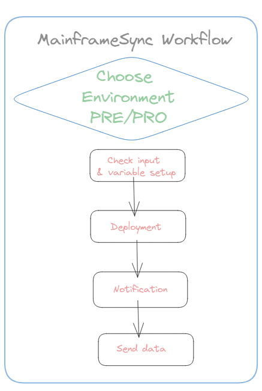
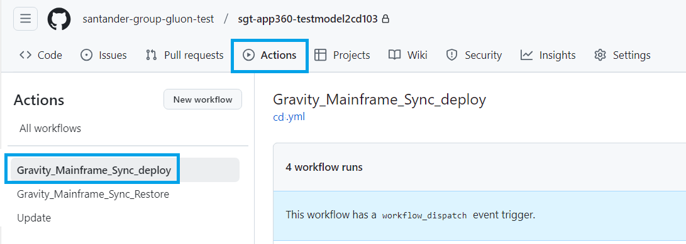
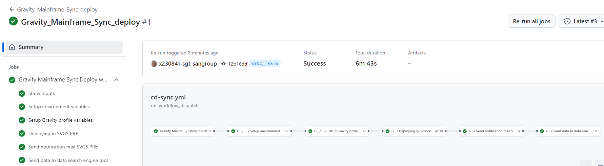
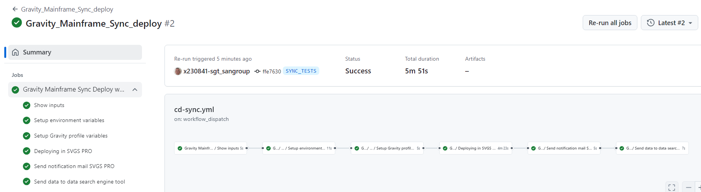

## Aim & Scope

 This workflow deploys a RELEASE nexus package into PRE or PRO environment checking Cross references prior to deployment stage.



## Workflow setup configuration

Once you have entered in the appropriate github.com repository, you may click on actions menu and then select **Gravity Mainframe Sync Deploy** Workflow.



Once this is done you may click on 'Run workflow' button and then:

* Use Workflow from (do not change, keep in branch 'main')

* Enter **comments** for you to trace the workflow about to be executed on 'Set the execution name'. (No restrictions in length,spaces, tabs or special characters).

* type or copy the **NEXUS Freeze Package** Artifact URL. This package might be taken from the GPH_PQT_NEXUS table. 

* Select the **environment** (either PRE or PRO).

* Select the **client** where package is going to be deployed from the list of available customers (UKEU, SVGS, 0049, COSK, MEXM, CHLJ, SCF1).


Once you hit on 'Run workflow', runner will start working covering the accurate stages depending on the selected environment (PRE or PRO)

## Workflow stages

### PREproduction Environment

* **Check Input & Variables setup**: first of all, given parameters entered are checked. The nexus Release package should be according to the naming convention, this is containing: cobol_linux_release as in the following sample:
 ```https://nexusmaster.alm.europe.cloudcenter.corp/repository/cobol_linux_release/PF02/00002682/00002682-20230316.0923.zip```. In case of any issue on checking, workflow will stop showing an error message.

* **Deployment to PRE**: according to the client selected, workflow will trigger ansible deployment that will deposit the contents of the zip file in the accurate PREproduction server folders according to predefined inventories controlled by the Gluon
 Gravity Team. This stage includes "SQAI" TrxOp invocation in order objects versions just deployed to be informed to both Gravity and Mainframe tables.

!!! Warning
    For PRE or PRO, workflow may stop, according to client's way of controlling deployments, in order you to approve/confirm or even reject the deployment<br>
    
    and so it will remain till you get your accurate environment check selected
    as follows:<br>
    

* **Notification**: in this stage, only if deployment ends OK, an email is sent to change management email box provided for each client.

* **Send data**: this last stage is aimed to provide the most important workflow data (such as author, date, execution status, environment, client, etc...) to the opensearch tool in order to give an appropriate traceability.

???+ WORKFLOW
    You may also see at the workflow execution diagram who launch it, over which branch and how long it took to execute the complete workflow and the partial and total results of each stage explained above.
    

### PROduction Environment

* **Check Input & Variables setup**: first of all, given parameters entered are checked. The nexus Release package should be according to the naming convention:
 ```https://nexusmaster.alm.europe.cloudcenter.corp/repository/cobol_linux_releases/PF02/00002682/00002682-20230316.0923.zip```. In case of any issue on checking, workflow will stop showing an error message.

* **Deployment to PRO**: according to the client selected, workflow will trigger ansible deployment that will deposit the contents of the zip file in the accurate Production server folders according to predefined inventories controlled by the Gluon
 Gravity Team. This stage includes "SQAI" TrxOp invocation in order objects versions just deployed to be informed to both Gravity and Mainframe tables.

!!! Warning
    Workflow will stop in order you to approve/confirm or even reject the deployment
    <br>
    and so it will remain till you get your accurate environment check selected
    as follows:
    

* **Notification**: in this stage, only if deployment ends OK, change management email box provided for each client will receive the appropriate email with package information

* **Send data**: this last stage is aimed to provide the most important workflow data (such as author, date, execution status, environment, client, etc...) to the opensearch tool in order to give an appropriate traceability.

???+ WORKFLOW
    You may also see at the workflow execution diagram who launch it, over which branch and how long it took to execute the complete workflow and the partial and total results of each stage explained above.
    
