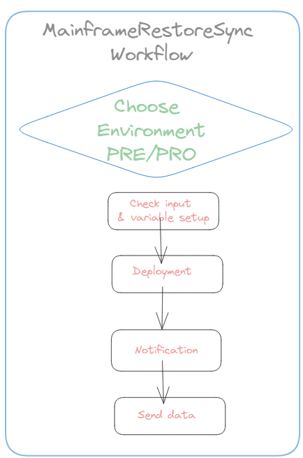
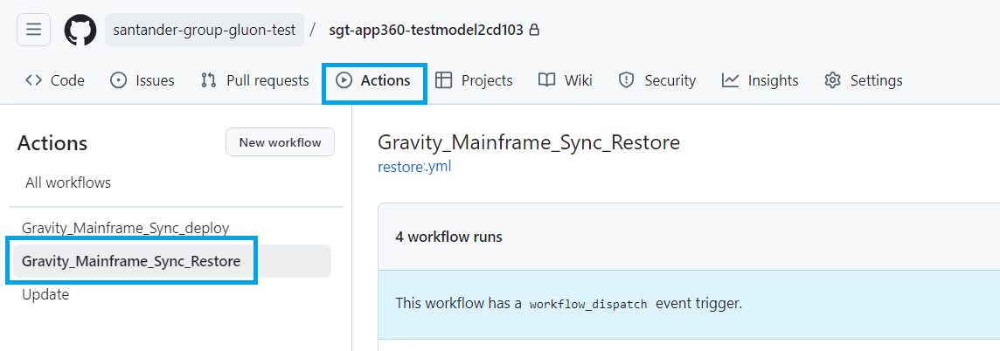
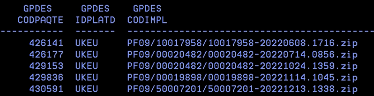
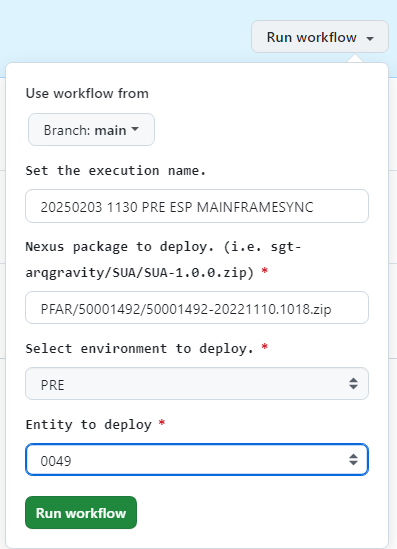
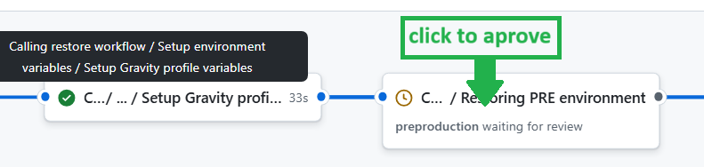
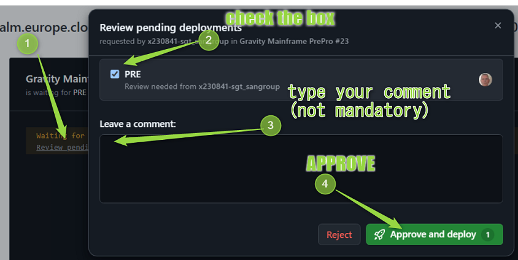
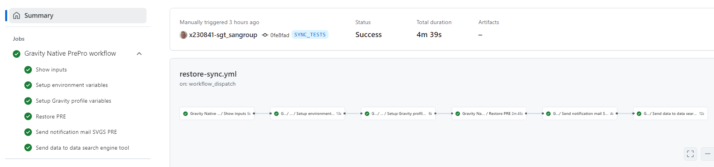

## Aim & Scope

This workflow allows you to return to a prior situation in the environment restoring from an NEXUS freeze artifact that we have previously deployed.

## Workflow setup configuration

Once you have entered in the appropriate github.com repository, you may click on actions menu and then select **Gravity Mainframe Sync Restore** Workflow.

* Use Workflow from (do not change, keep in branch 'main')

* Enter **comments** for you to trace the workflow about to be executed on 'Set the execution name'. (No restrictions in length,spaces, tabs or special characters).

* type or copy the **NEXUS Freeze Package** Artifact URL. This package might be taken from the GPH_PQT_NEXUS table. 

* Select the **environment** (either CERT, ED, PRE or PRO).

* Select the **client** where package is going to be restored from the list of available customers (UKEU, SVGS, 0049, COSK, MEXM, CHLJ, SCF1).

Once you hit on 'Run workflow', runner will start working covering the accurate stages

## Workflow stages

* **Check Input & Variables setup**: first of all, given NEXUS URL parameter entered is checked.In case of any issue on checking, workflow will stop showing an error message.

* **Restore to PRE or PRO**: workflow will trigger ansible deployment that will deposit the contents of the already backup files in the accurate  server folders according to predefined inventories controlled by the Gluon Gravity Team. Also
SQAI TrX will be executed in order tables to be updated according to the object's version restored.

!!! Warning
    For PRE or PRO, workflow may stop, according to client's way of controlling deployments, in order you to approve/confirm or even reject the restore
    
    and so it will remain till you get your accurate environment check selected
    as follows:
    

* **Notification**: this stage is intended to inform to the appropriate email box about the restore action just ended.

* **Send data**: this last stage is aimed to provide the most important workflow data (such as author, date, execution status, environment, client, etc...) to the opensearch tool in order to give an appropriate traceability.

## Workflow summary

You may also see at the workflow execution diagram who launch it and how long it took to execute the complete workflow and the partial and total results of each stage explained above

