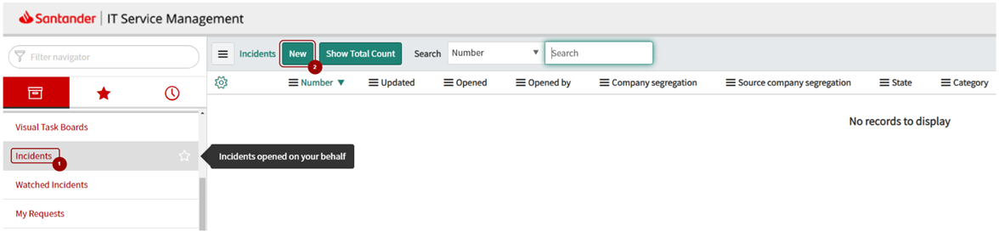

# Support & FAQs

## **How to Open a Support Ticket**

If you have reviewed the documentation and still have a problem with Gravity, in this section you will find help on how to open a Support Ticket!

???+ important
    Before opening an ITSM ticket, we recommend that you first consult the FAQs on this page, where the most common errors and their solutions are explained.

The tool for opening **incidents** for the Gravity product is the official Banco Santander [ITSM Service Now](https://santander.service-now.com)

There are two types of tickets that can be opened in the official Banco Santander ITSM Service Now for the Gravity product:

- **Incidents (INC)**: These are tickets that are opened when an incident is found in the Gravity product. These tickets are used to report problems or errors that can occur in the continuous integration cycle.
- **Support (INC)**: These are tickets that are opened when a user need a support in the Gravity product. These tickets are used to help in solving problems, answering questions, or ensuring the proper functioning of the system.

### **Create a new Support or Incident (INC)**

Into [ITSM Service Now](https://santander.service-now.com/) portal, select the option **Incident** from the left menu and then select New to open the [Incident Form](https://santander.service-now.com/nav_to.do?uri=%2Fincident.do%3Fsys_id%3D-1%26sys_is_list%3Dtrue%26sys_target%3Dincident%26sysparm_checked_items%3D%26sysparm_fixed_query%3D%26sysparm_group_sort%3D%26sysparm_list_css%3D%26sysparm_query%3Dopened_byDYNAMIC90d1921e5f510100a9ad2572f2b477fe%5EORcaller_idDYNAMIC90d1921e5f510100a9ad2572f2b477fe%5Eactive%3Dtrue%26sysparm_referring_url%3Dincident_list.do%3Fsysparm_query%3Dopened_byDYNAMIC90d1921e5f510100a9ad2572f2b477fe%5EORcaller_idDYNAMIC90d1921e5f510100a9ad2572f2b477fe%5Eactive%3Dtrue%5EEQ%26sysparm_target%3D%26sysparm_view%3D).

??? info "See Navigation Details"
    **1. Select *Incident*** inside the left menu. From Incident options, **select *New***.
    
    **2. Fill in the mandatory fields** in the incident form.

Once the new incident has been opened, it is necessary to fill in the associated form with the mandatory fields shown in the following table.

|**Type**|**Support or Incident**|
|:---|:---|
|`Category`|Cloud|
|`Subcategory`|ALM|
|`Environment`|Production|
|`Assignment group`|GTH_PR_GL_GLN_GRAVITY|

**In the short description:**
Besides a short description, Very important, always inform the Github url and your job, so that we can study the problem in detail.

### **Incidents during on-call hours**

If you have a urgent incident that impacts several teams or potentially your business, you can request the support on call.
Please raise ITSM ticket before activating the guard and contact CCSBAU Team through mail or phone explaining the reasons.

- **Mail**: ccsbau `<ccsbau@gruposantander.com>`
- **Tlfn**: 942988174 / 942988175

## **1. Model Governed by Mainframe**

???+ important
    For any incident or support that you will eventually need from Mainframe (while uploading objects to ALM), it is necessary to open a Service now to the following categorization:

      - Technical Catalog / Systems / Mainframe / Mainframe - Development Support
      - Resolutor Group: **SGT_IN_SY_ES_DEV_SUP_MAINFRAME**

      For any incident or support that you will need for XREF/XRED, it is necessary to open a Service Now to the following categorization:

      - Technical Catalog / Systems / Mainframe / Gravity - Development Support
      - Resolutor Group: **SGT_IN_SY_ES_DEV_SUP_GRAVITY**

### **Common Errors**

#### **Mainframe**

| Operation                          | Response |
|------------------------------------|----------|
| Mark objects to be uploaded   | When selecting an object marked to be uploaded to GitHub, the following message may appear on your TSO screen:<br><br>```ERROR AL RECUPERAR REPOSITORIO. REVISE EN ATLAS LA CATALOGACION DE LA SUA```<br><br>- Check in Atlas that the SUA is properly catalogued and has a technical grouping with the associated GitHub repository.<br><br>- If the technical grouping or repository does not exist, you must create and associate them correctly.<br><br>- You can find more information at the following link: [Atlas Cataloguing](https://gluon.gs.corp/community/docs/latest/components/software/gravity/gravity-partenon/gravity-partenon-model2/#3-atlas-catalogation) |
| Upload objects from Mainframe | When selecting an object marked to be uploaded to GitHub, the following message may appear on your TSO screen:<br><br>```ERROR: OBJETO SIN PERIMETRO LINUX, NO TIENE OPERATIVA CON RAMAS GITHUB```<br><br>Please review you have accomplish that the object, SUA or application has been marked for ALMMC deployment ( topic 4 in the following documentation **[Gravity. Envío de objetos al Repositorio GitHub desde Mainframe](https://santandernet.sharepoint.com/sites/SEPPARTRT/SitePages/Annexes/Annexed%20Partenon%20Gravity%20MaaS.%20Developer,%20Deployment%20_%20Configuration%20Management/Gravity.%20Pushing%20objects%20to%20the%20GitHub%20repository%20from%20Mainframe/Gravity.%20Pushing%20objects%20to%20the%20GitHub%20repository%20from%20Mainframe.aspx)** |
| Upload objects from Mainframe | While uploading an object into an existing github repository on a given branch, github is not updated<br><br>Please verify that this object/release/version has not been previously uploaded on that branch. <br><br>If the system detects that there is no changes on the object, nothing will be updated |

#### **GitHub**

| Workflow                 | Response |
|---------------------------|----------|
| GRAVITY MAINFRAME RELEASE | Error Details:<br>```Error: There is already a NEXUS RELEASE Package with the given V.R.F<br>https://nexusmaster.alm.europe.cloudcenter.corp/repository/cobol_linux_release/usa-00002002/00010342/00010342-0.20.0.zip```<br><br>To fix this error, you must generate a different V.R.F version that does not already exist in Nexus. To do this, start a new software lifecycle by updating the VERSION file to a V.R.F that has not yet been published in the repository. |
| GRAVITY MAINFRAME CI      | In the execution of the workflow, the following error occurs.<br><br>```Error:  Build has been cancelled as there are no object changes found.```<br><br>The workflow only runs when modifications to the objects are detected; only the changed objects are compiled and uploaded to Nexus. To avoid the error, make changes to the objects, push them to GitHub, and run the CI workflow again. |
| GRAVITY MAINFRAME CI      | In the execution of the workflow, the following error occurs.<br><br>```Error: Validation error: Error code 02. Message: XRF VINCULANTE```<br><br>For any incident or support that you will need for XREF/XRED, it is necessary to open a Service Now to the following categorization<br><br>Technical Catalog / Systems / Mainframe / Gravity - Development<br>Resolutor Group: SGT_IN_SY_ES_DEV_SUP_GRAVITY |
| deployment in any environment | While executing a package deployment (in any environment) a connectivity error is shown at the job console as:<br><br>```fatal: [isblccmfoci0005.scisb.isban.corp]: UNREACHABLE! => {"changed": false, "msg": "Connection timed out.", "unreachable": true}```<br><br>or<br><br>```fatal: [isblccmfoci0005.scisb.isban.corp]: UNREACHABLE! => {"changed": false, "msg": "EOF on stream; last 100 lines received:\n\ruspreuk@isblccmfoci0005.scisb.isban.corp's password: \nThis service allows sftp connections only.", "unreachable": true}```<br><br>Please raise a ticket to SGT\_IN\_SY\_ES\_UNIX<br><br>[TECHNICAL CATALOG > Systems > Operating Systems > UNIX ES Others](https://santander.service-now.com/com.glideapp.servicecatalog_cat_item_view.do?v=1&sysparm_id=a4a6364e1bb7109862ce85506e4bcbbc&sysparm_processing_hint=setfield:request.parent%3d&sysparm_link_parent=65235f65dbff1f008c6c7cde3b96199d&sysparm_catalog=719aafd0db031f448c6c7cde3b9619f8&sysparm_catalog_view=catalog_technical_catalog)<br><br>Mailbox: [dlprbeunix@produban.com](mailto:dlprbeunix@produban.com) |
| deployment in any environment | While executing deployment in any environment, Install/Refresh keeps stack and finally fails with a time out:<br><br>```TASK [deploy_CICS : Execute installation] **************************************```<br>```Cancelling nested steps due to timeout```<br>```Sending interrupt signal to process```<br><br>Open Ticket GravityMfes indicating the affected server, environment and client<br><br>[TECHNICAL CATALOG > Systems > Mainframe > Gravity – Microfocus Enterprise Server (MFES)](https://santander.service-now.com/nav_to.do?uri=%2Fcom.glideapp.servicecatalog_cat_item_view.do%3Fv%3D1%26sysparm_id%3Dade922fa1b054950e4909753b24bcb0a%26sysparm_processing_hint%3Dsetfield:request.parent%253d%26sysparm_link_parent%3Dd592a6601b40378020044002cd4bcba4%26sysparm_catalog%3D719aafd0db031f448c6c7cde3b9619f8%26sysparm_catalog_view%3Dcatalog_technical_catalog) |

### **Frequently Asked Questions (FAQs)**

#### **Workflow for LOCAL Software**

In the case of local software, since there is no environment governance team responsible for authorizing deployment to CERT or sending to PRE, **the `MainframeRelease` workflow should not be executed**.

Instead, the `MainframeCI` workflow should be used to manage both deployment to CERT and the formalization of the release. The correct procedure is as follows:

1. **Deployment to CERT:**
      - The first checkbox is checked by default, which allows the software to be automatically deployed to the Certification (CERT) environment.
      - If you do not wish to deploy to CERT, simply uncheck this box.
2. **Release Formalization:**
      - The third checkbox enables the formalization of the release, meaning that the software will be available to the client through the creation of a Nexus Release package.
      - This box should only be checked once the deployment in CERT has been validated and you wish to officially publish the release.

> **IMPORTANT NOTES**<br>
> You can deploy to CERT as many times as needed without having to generate a release.<br>
> Once everything has been validated in CERT, you can formalize the release by checking the third box.

#### **How to generate a package that includes all objects**

By default, only the objects that have been modified and compiled are included in the deployment package. If you need to generate a package that contains all objects, follow these steps:

1. Create a new branch in GitHub specifically for this process.
2. Perform a compilation for "Environment Change" (Cambio de entorno) for all objects. This will update the necessary files in GitHub (.rel and the timestamps in the .cbl files), while preserving the individual YAML files for each program.
3. From GitHub, continue the usual cycle and generate a Release.
4. In this way, a package will be generated that includes all objects, ready for deployment.

#### **What should be the short name of a component in Gluon**

- If it is a model2 component, its nomenclature must be `mf<SUA-CODE>` where SUA-CODE consists of the 8 digits of the sub-application catalogue.
- If it is a component for JCLs, there are no restrictions on its short name, but it is recommended to use `JCL<APLI-CODE>` or `JCL<SUA-CODE>` for traceability of workflow executions (where APLI-CODE stands for the  8 digits of the application catalogue).
- If it is a native model component (only for ARQ SW), its nomenclature must be `mc<SUA-CODE>`.

## **2. JCLs**

| OPERATION | RESPONSE |
| --------- | --------- |
| workflow ejecution | Error Details:<br> ```Run if [ "santander-group-scib-gln" != "santander-group-sds-gln" ] && [ -n "COSK" ] && ["COSK" != "NA" ] && ([ "CERT_temp-CERT_Final" == "CERT_temp-CERT_Final" ]  [ "CERT_temp-CERT_Final" == "CERT_Final-PRE_temp" ] [ "CERT_temp-CERT_Final" == "Restore_CERT" ]); then<br>Error: Only sds organization can use input entity<br>Error: Processcompleted with exit code 1.```<br><br>The CLIENT parameter should only be specified for global JCLs, that is, those promoted within the santander-group-sds-gln organization. For local JCLs, the value "NA" must be set in the CLIENT parameter, since the client is determined automatically according to the Gluon organization from which the execution is performed (for example: UKEU for santander-group-scb-gln, SVGS for santander-group-usa-gln, etc.).<br><br>You can find more details and examples in the official GLUON documentation:<br>[Gravity JCL Certification Workflows](./gravity-partenon-jcls/gravity-jcl-certification-workflows.md/#41-from-cert-previous-to-cert-final-libraries)
| workflow ejecution | Error Details:<br>```fatal: [cibd1gmamfel-gravit-001.gravity.gcp.scib.dev.corp]: FAILED! => {"msg": "Attempting to decrypt but no vault secrets found"}```<br><br>This error occurs because the required secret for the correct execution of the process has not been configured.<br>To resolve it, you need to open a ticket and request the support team to configure the required secret. Please open the ticket following the instructions in the link below. [Create a new Support or Incident (INC)](#create-a-new-support-or-incident-inc) |
| workflow ejecution | Error Details:<br>```<br>TASK [transitional_jcls : Checking if given JCL files (*.jcl) has been found in temp directory] ***<br>skipping: [isblccmfocc0004.scisb.isban.corp] => (item=HQJICSDY)<br>failed: [isblccmfocc0004.scisb.isban.corp] (item=HQNICS01) => {"ansible_loop_var": "item", "changed": false, "item": "HQNICS01", "msg": "JCL HQNICS01 not found in temp directory!. Found files: ['/certsanusa/orjcl/jcl_prev/HQJICSDY.jcl', '/certsanusa/orjcl/jcl_prev/HQNICS03.jcl', '/certsanusa/orjcl/jcl_prev/HQNICS04.jcl', '/certsanusa/orjcl/jcl_prev/HQNICSMI.jcl']"}```<br><br>The error occurs because some of the JCL files you want to promote are not found in the temporary directory of the previous environment.<br>Make sure that all the JCL files you wish to promote are available in the corresponding temporary directory before proceeding with the process. <br><br>For more information about the process, please refer to the following link:[Gravity JCL Certification Workflows - Jobs Behaviour](./gravity-partenon-jcls/gravity-jcl-certification-workflows.md/#5-jobs-behaviour)  |
| workflow execution | Error Details:<br> ```Run if [ "santander-group-scib-gln" != "santander-group-sds-gln" ] && [ -n "COSK" ] && ["COSK" != "NA" ] && ([ "CERT_temp-CERT_Final" == "CERT_temp-CERT_Final" ]  [ "CERT_temp-CERT_Final" == "CERT_Final-PRE_temp" ] [ "CERT_temp-CERT_Final" == "Restore_CERT" ]); then<br>Error: Only sds organization can use input entity<br>Error: Processcompleted with exit code 1.```<br><br>The CLIENT parameter should only be specified for global JCLs, that is, those promoted within the santander-group-sds-gln organization. For local JCLs, the value "NA" must be set in the CLIENT parameter, since the client is determined automatically according to the Gluon organization from which the execution is performed (for example: UKEU for santander-group-scb-gln, SVGS for santander-group-usa-gln, etc.).<br><br>You can find more details and examples in the official GLUON documentation:<br>[Gravity JCL Certification Workflows](./gravity-partenon-jcls/gravity-jcl-certification-workflows.md/#41-from-cert-previous-to-cert-final-libraries)
| workflow execution | Error Details:<br>```fatal: [cibd1gmamfel-gravit-001.gravity.gcp.scib.dev.corp]: FAILED! => {"msg": "Attempting to decrypt but no vault secrets found"}```<br><br>This error occurs because the required secret for the correct execution of the process has not been configured.<br>To resolve it, you need to open a ticket and request the support team to configure the required secret. Please open the ticket following the instructions in the link below. [Create a new Support or Incident (INC)](#create-a-new-support-or-incident-inc) |
| workflow execution | Error Details:<br>```<br>TASK [transitional_jcls : Checking if given JCL files (*.jcl) has been found in temp directory] ***<br>skipping: [isblccmfocc0004.scisb.isban.corp] => (item=HQJICSDY)<br>failed: [isblccmfocc0004.scisb.isban.corp] (item=HQNICS01) => {"ansible_loop_var": "item", "changed": false, "item": "HQNICS01", "msg": "JCL HQNICS01 not found in temp directory!. Found files: ['/certsanusa/orjcl/jcl_prev/HQJICSDY.jcl', '/certsanusa/orjcl/jcl_prev/HQNICS03.jcl', '/certsanusa/orjcl/jcl_prev/HQNICS04.jcl', '/certsanusa/orjcl/jcl_prev/HQNICSMI.jcl']"}```<br><br>The error occurs because some of the JCL files you want to promote are not found in the temporary directory of the previous environment.<br>Make sure that all the JCL files you wish to promote are available in the corresponding temporary directory before proceeding with the process. <br><br>For more information about the process, please refer to the following link:[Gravity JCL Certification Workflows - Jobs Behaviour](./gravity-partenon-jcls/gravity-jcl-certification-workflows.md/#5-jobs-behaviour) |

## **3. Training sessions**

### **MODEL GOVERNED BY MAINFRAME**

- [Formación ALM Gluon Gravity Modelo 2-20250626_110418](https://santandernet-my.sharepoint.com/:v:/g/personal/n83142_santanderglobaltech_com/EQHZcxwOqfBOtSAlL0NmX-oB5mtUBjFZ9cN3WkMjtzmtHQ?nav=eyJyZWZlcnJhbEluZm8iOnsicmVmZXJyYWxBcHAiOiJTdHJlYW1XZWJBcHAiLCJyZWZlcnJhbFZpZXciOiJTaGFyZURpYWxvZy1MaW5rIiwicmVmZXJyYWxBcHBQbGF0Zm9ybSI6IldlYiIsInJlZmVycmFsTW9kZSI6InZpZXcifX0%3D&e=BepvaK)
- [Formación ALM Gluon Gravity Modelo 2 parte II-20250627_110334](https://santandernet-my.sharepoint.com/:v:/g/personal/n83142_santanderglobaltech_com/EfO9H7ymUQhDqHxtLr7Qq78BMgKZILrWffaYyM5c_dGudw?nav=eyJyZWZlcnJhbEluZm8iOnsicmVmZXJyYWxBcHAiOiJTdHJlYW1XZWJBcHAiLCJyZWZlcnJhbFZpZXciOiJTaGFyZURpYWxvZy1MaW5rIiwicmVmZXJyYWxBcHBQbGF0Zm9ybSI6IldlYiIsInJlZmVycmFsTW9kZSI6InZpZXcifX0%3D&e=slqrpU)
- [Dudas ALM Gluon Gravity Modelo2 20251007](https://santandernet-my.sharepoint.com/personal/x230841_santanderglobaltech_com/_layouts/15/stream.aspx?id=%2Fpersonal%2Fx230841%5Fsantanderglobaltech%5Fcom%2FDocuments%2FRecordings%2FSesi%C3%B3n%20de%20dudas%20en%20el%20manejo%20de%20Gluon%20ALM%20para%20despliegue%20de%20Programs%20y%20JCLs%20en%20Gravity%2D20251007%5F103209%2DGrabaci%C3%B3n%20de%20la%20reuni%C3%B3n%201%2Emp4&nav=eyJyZWZlcnJhbEluZm8iOnsicmVmZXJyYWxBcHAiOiJTdHJlYW1XZWJBcHAiLCJyZWZlcnJhbFZpZXciOiJTaGFyZURpYWxvZy1MaW5rIiwicmVmZXJyYWxBcHBQbGF0Zm9ybSI6IldlYiIsInJlZmVycmFsTW9kZSI6InZpZXcifX0%3D&referrer=StreamWebApp%2EWeb&referrerScenario=AddressBarCopied%2Eview%2E410b4e1a%2Db0cc%2D4ab0%2Da8ec%2D01d7a115b026º)

### **JCLs**

- [Formación ALM Gluon Gravity Modelo 2 -- JCL's-20250710_110116](https://santandernet-my.sharepoint.com/:v:/g/personal/n83142_santanderglobaltech_com/ERGkvasZm1tArnb83L-8SbkBBWzuylbongWqZSSBpfc2jQ?e=rzD1tX)
- [Dudas ALM Gluon Gravity JCLs 20251009](https://santandernet-my.sharepoint.com/personal/x230841_santanderglobaltech_com/_layouts/15/stream.aspx?id=%2Fpersonal%2Fx230841%5Fsantanderglobaltech%5Fcom%2FDocuments%2FRecordings%2FSesi%C3%B3n%20de%20dudas%20en%20el%20manejo%20de%20Gluon%20ALM%20para%20despliegue%20de%20Programs%20y%20JCLs%20en%20Gravity%2D20251009%5F113601%2DGrabaci%C3%B3n%20de%20la%20reuni%C3%B3n%2Emp4&referrer=StreamWebApp%2EWeb&referrerScenario=AddressBarCopied%2Eview%2Ec4f02543%2Dd920%2D4e43%2Da352%2D7162eb0ffed2&ga=1)
- [Dudas ALM Gluon Gravity JCLs 20251010](https://santandernet-my.sharepoint.com/personal/x230841_santanderglobaltech_com/_layouts/15/stream.aspx?id=%2Fpersonal%2Fx230841%5Fsantanderglobaltech%5Fcom%2FDocuments%2FRecordings%2FSesi%C3%B3n%20de%20dudas%20en%20el%20manejo%20de%20Gluon%20ALM%20para%20despliegue%20de%20Programs%20y%20JCLs%20en%20Gravity%2D20251010%5F110403%2DGrabaci%C3%B3n%20de%20la%20reuni%C3%B3n%201%2Emp4&referrer=Teams%2ETEAMS%2DELECTRON&referrerScenario=MeetingChicletExpiration%2Eview&ga=1)
