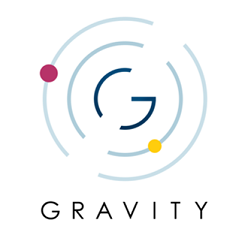

---
hide:
  - toc
---

# **Welcome to Gravity documentation**

In this space you will find user documentation together with a Gravity project
overview for Altair & Partenon Architectures.

- #### Start here

    ---
    [Gravity Overview](./gravity-overview.md)

    Take a look at the Gravity project basics.

    ---

    [Gravity Altair](./gravity-altair/index.md)

    Gravity project is suitable for clients using Altair as Mainframe Architecture

    ---

    [Gravity Partenon](./gravity-partenon/index.md)

    Gravity project is suitable for clients using Partenon as Mainframe Architecture

 

