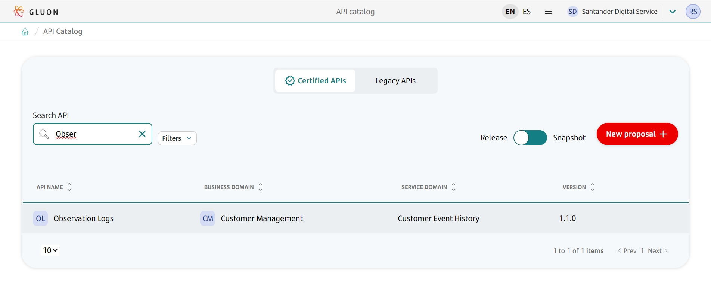
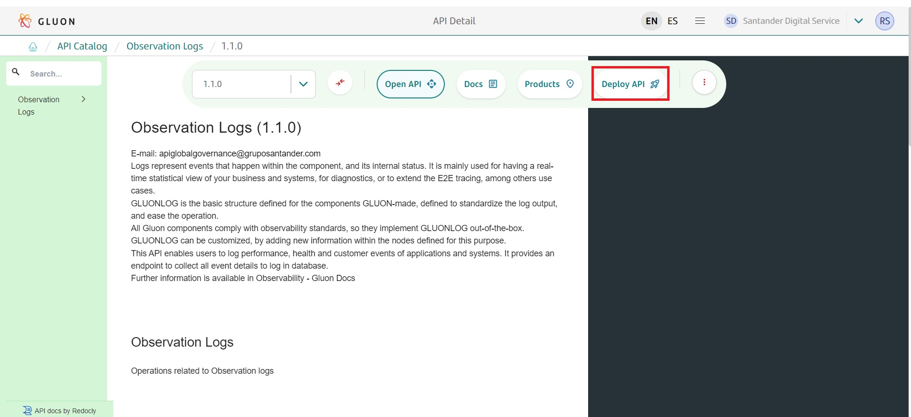

## Introduction

The purpose of this documentation is to provide **step-by-step guide** to deploy a SendLog on your namespace through gluon, how to configure it and getting started on your observability journey.

## Getting Started

To make use of SendLog we recommend the use along with Thundera, which is the official library of gluon to generate and ship logs from applications, this guide will only cover the path with Thundera as the library.

## Prerequisites

In the version 1.0 of the SendLog Deploy Journey, the following prerequisites are required:
    - Application instrumented to ship logs
    - a Kafka or Kafka-Like component (MSK, EventHubs or Confluent Kafka)
    - A stack to rest your data (Elasticsearch, Opensearch)
    - [Image reuse](../../configuration/kubernetes/image-reuse.md)
    - [ConfigMap Kubernetes Journey](../../configuration/kubernetes/configmaps-rm.md)
    - [API Deployment 2.0](../../../components/software/api/apideployment/apis.md)

## Deploying your component on Gluon

### API

The first step towards using the official observability stack is to deploy an API using the API Definition **Observation Logs** to do that follow this steps:
    1- Open the [API Catalog](https://gluon.gs.corp/gluon/api-catalog)
    2- Search for the API Observation Logs.
    
    3- Deploy the API on your structure.
    

For additional support in the realm of API Deployment on Gluon follow this [link](../api/apideployment/apis.md) for a complete guide

### Create SendLog Image component

Following the steps provided by [Image reuse](../../configuration/kubernetes/image-reuse.md), create an Image Reuse component with the properties below:
    - Image type: Arsenal Java Backend
    - Registry type: Harbor
    - Registry URL: registry.global.ccc.srvb.can.paas.cloudcenter.corp
    - Project name: gluon-alm
    - Image name: sgt-glnobs-obsendlog1
    - Version: 0.2.16

### Create and deploy the ConfigMap component

Following the steps provided by [Kubernetes Deployment 2.0](../../../components/configuration/kubernetes/configmaps-rm.md), create and deploy a ConfigMap component with the properties below:
    - server.port: port that will receive logs from applications using Thundera libs;
    - sendlog.kafka.enabled: if set to **true**, received logs will be sent to the configured Kafka server and topic;
    - sendlog.kafka.topic: desired Kafka topic;
    - sendlog.kafka.bootstrap-servers: desired Kafka bootstrap servers;
    - sendlog.kafka.msk-iam-enabled: if set to **true**, allows SendLog to connect to Kafka using IAM;
    - sendlog.kafka.extra-config-dict: users may add customized Kafka configuration here.

Check the links below for possible extra configuration:
    - [Common Client Configs](https://github.com/a0x8o/kafka/blob/master/clients/src/main/java/org/apache/kafka/clients/CommonClientConfigs.java);
    - [Producer Config](https://kafka.apache.org/31/javadoc/org/apache/kafka/clients/producer/ProducerConfig.html);
    - [SASL Configs](https://dist.apache.org/repos/dist/dev/kafka/3.8.1-rc1/javadoc/org/apache/kafka/common/config/SaslConfigs.html);
    - sendlog.logback.print-in-console: if set to **true**, received logs will be printed in console;
    - sendlog.logback.export-to-logstash: if set to **true**, received logs will be sent to the configured logstash when:
    - There is an issue while trying to send logs to Kafka;
    - Kafka is disabled (sendlog.kafka.enabled is set to **false**);
    - sendlog.logback.logstash-host: desired logstash host;
    - sendlog.logback.logstash-port: desired logstash port.

### Example

application.properties file:

```text
server.port: 8080
sendlog.kafka.enabled: false
sendlog.kafka.topic: BR.testeth
sendlog.kafka.bootstrap-servers: srvbdrhalbr24.bs.br.bsch:9092,srvbdrhalbr57.bs.br.bsch:9092,srvbdrhalbr58.bs.br.bsch:9092
sendlog.kafka.msk-iam-enabled: false
sendlog.kafka.extra-config-dict: max.block.ms=3000;retries=0
sendlog.logback.print-in-console: true
sendlog.logback.export-to-logstash: false
sendlog.logback.logstash-host: logstash-logshipper
sendlog.logback.logstash-port: 5014
```
