# Appian Process Journey

## Introduction

The goal of this section is to create a Appian Process from the Gluon portal.

## Prerequisites

You have to request the following infrastructure resources.

### AIM Plugin

Install the AIM Plugin on the Appian Instance
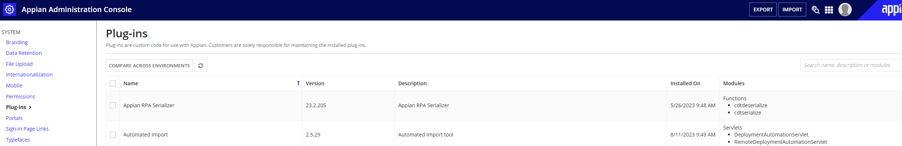

### Access credential

Create a basic user with administrator permissions.

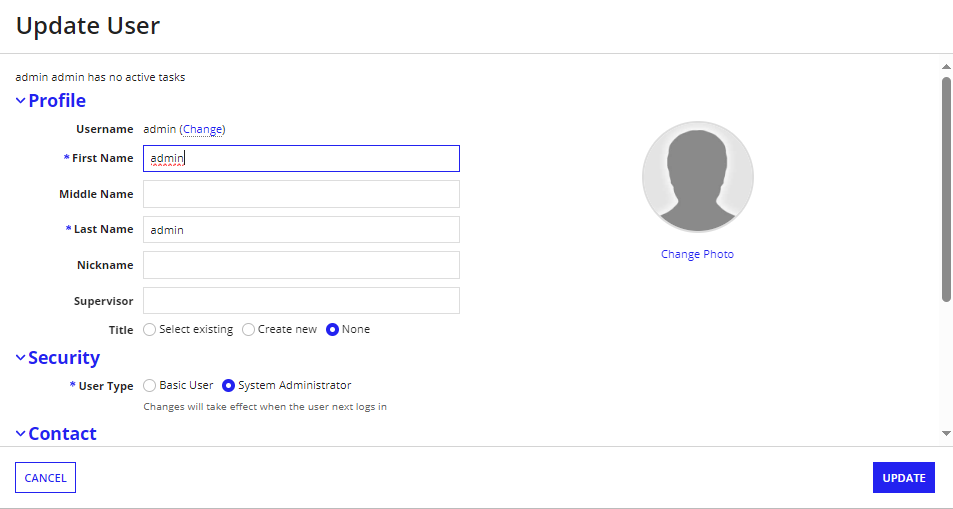

### Appian data

Instance where the process will be deployed in each environment. The required parameters depend on the authorization method chosen:

#### For User Authorization

- URL of the environment.
- Username of the Appian user account (created in the previous point)
- Password of the Appian user account (created in the previous point)

#### For API Key Authorization

- URL of the environment.
- API key with appropriate deployment permissions for the Appian instance
  - Ensure the key has permissions for application deployment operations
  - Requires Appian version that supports the Applications Import REST API endpoint

## Create Component

### Gluon Portal

To create a component, follow the steps described in [Component Management](../../../application/component-management/create-component.md/#introduction), searching for the component to be created.

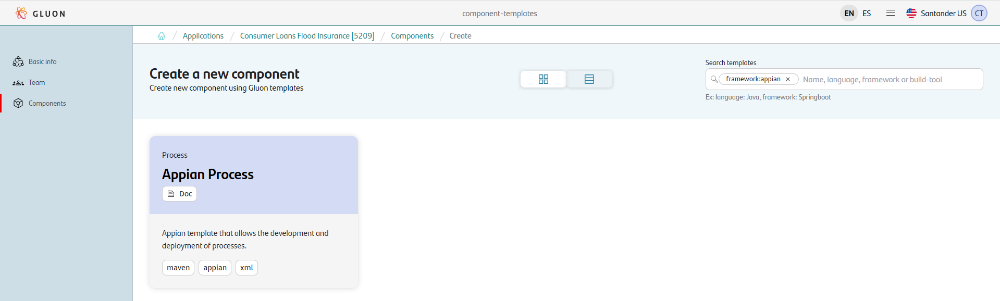

???+ remember

    To follow the naming convention visit [Repository Naming Convention](../../../application/component-management/create-component.md#repository-naming-convention).

The following configuration on the component is shown already preloaded, as it is not user-configurable:

- **Branch Strategy**: Trunk Based Development
- **Class**: deployable
- **Deployment target**: optimized-hosting-environment

As a last step, a summary is displayed with the entered information and the option to "Create Component"

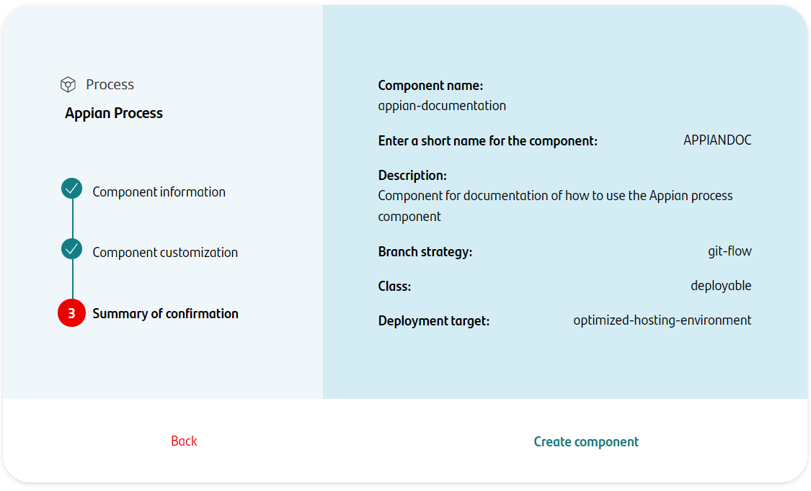

The component has been created correctly! In order to continue with the development of the component, Gluon automatically provides a repository on GitHub and registers the component on Sonarqube.

This operation may take a few seconds, and when it is finished, the links will be enabled on the portal, so that the developer can access it directly.

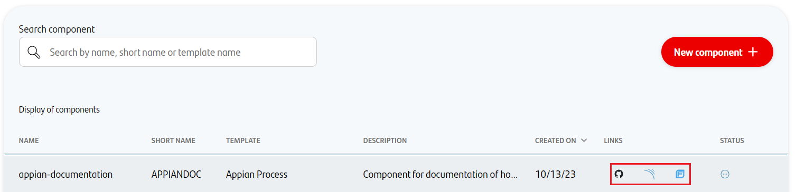

We have the following links in:

| Item | Link | Role Permission |
| --- | --- | --- |
| GitHub Repository | Link to the repository created in GitHub | Developer (RW) /Technical Lead (Maintain) [All roles explained](https://docs.github.com/es/organizations/managing-user-access-to-your-organizations-repositories/managing-repository-roles/repository-roles-for-an-organization) |
| Sonar Project | Link to the Sonar project created | All Users (Read) |
| Fortify Project | Link to the Fortify project created | All Users (Read) |

??? info "Fortify Project"

    The current version of the component does not run Fortify.

### Appian Template

#### Branches

When you creates the component from the Gluon Portal, the component is created with the default values of the template from the scaffolding workflow.

When accessing the repository, the Actions section shows that a GitHub action called "Initialization repository" has been executed which creates 2 branches: main and develop.

- An empty **main** branch
- A **develop** **branch with the Appian archetype, which contains the structure of files and folders to configure process.

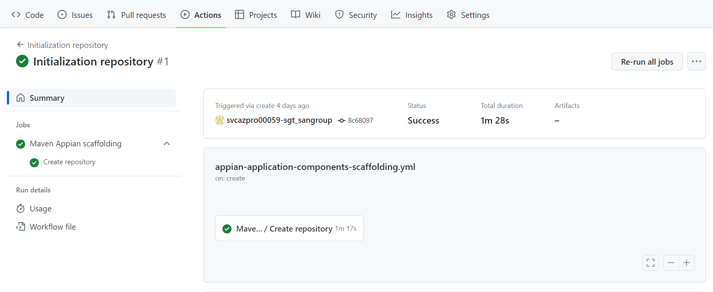

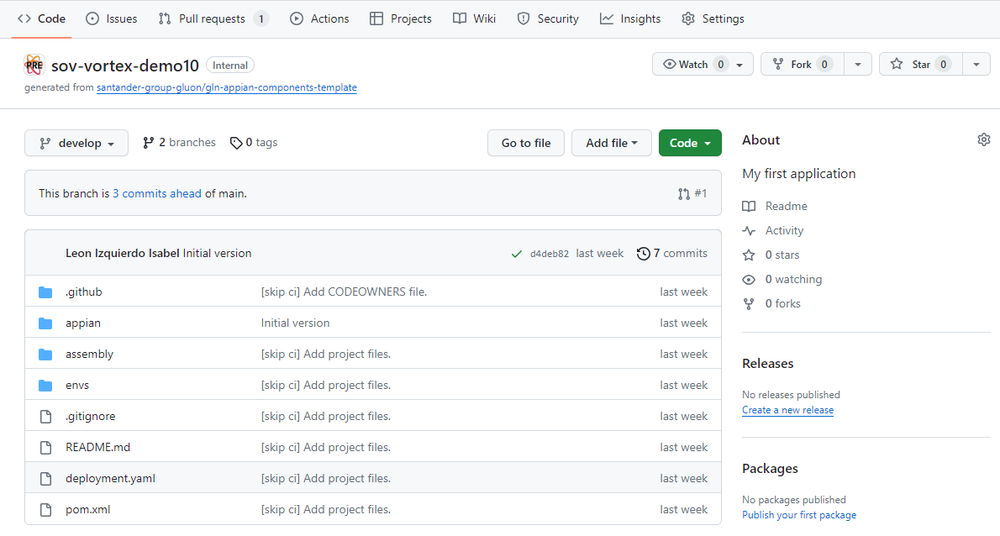

#### Structure

In the develop branch, the Appian archetype is available, with the scaffolding to be able to upload the Appian Component files. The structure of the archetype is as follows:

``` bash

📂.github
 ┣ 📂workflows
 | ┣ 📜cd.yml
 | ┣ 📜ci-tbd.yml
 | ┣ 📜create-release-branch.yml
 | ┣ 📜quality.yml
 | ┣ 📜release-tbd.yml
 | ┣ 📜update-component-workflow.yml
 | ┣ 📜version-validation.yml
 ┗ 📜CODEOWNERS
📂gluon
 ┣ 📂cd
 |  ┣ 📂cert
 |  | ┣ 📜cd.yml
 |  ┣ 📂pre
 |  | ┣ 📜cd.yml
 |  ┣ 📂pro
 |  | ┣ 📜cd.yml
 ┣ 📂ci
 |  | ┣ 📜properties.env
📂appian
 ┣ 📂applications
 | ┣ 📜README.MD
 ┣ 📂properties
 | ┣ 📜sgt-apwfdev-appian21351.cert.properties
 | ┣ 📜sgt-apwfdev-appian21351.pre.properties
 | ┣ 📜sgt-apwfdev-appian21351.pro.properties
📂assembly
 ┣ 📜application.xlm
 ┗ 📜full.xml
📜README.md
📜pom.xml
📜.gitignore


```

In addition, following the Gluon strategy, the repository has been created with the team associated to the application, so that the team members have permissions to be able to work with the repository.

## Cloning your repository

??? abstract "Cloning your repository"

    Once you have the device properly configured, the first step is to clone the project locally.

    To do so, visit [**Cloning a repository**](../../../application/component-management/create-component.md#cloning-a-repository).

## Configure your repository secrets

There are three types of secrets in Github.com:

- **Organization secrets**: Secrets that can be used by all repositories in the organization.
- **Repository secrets**: Secrets that can be used only by the repository.
- **Environment secrets**: Secrets that can be used only by the repository and the environment.

???+ warning "Setup Github Secrets"

    Nowadays only the *devops* team  of the entity has permissions to create the secrets in the organization.
    If you need to create a secret, please contact with the *devops* team. If you have doubts what users belongs to *devops* team, please contact with your entity Gluon Champion.

The secrets required for Appian deployment are determined by the authorization type defined in the Open Application Model (OAM) configuration.
The deployment action automatically reads the `authorizationType` from the `ciJson.properties.authorizationType` value to determine which authentication method to use.

### Secret Configuration by Authorization Type

???+ note "Authorization Type Configuration"

    The authorization type is configured in the Open Application Model and determines which secrets need to be configured:

    - **`USER` (Default)**: Uses traditional username/password authentication with the Java-based Appian ADM Import Client
    - **`APIKEY`**: Uses API key authentication with Appian's Applications Import REST API

    For more information about OAM configuration parameters, refer to the [Gluon Application Model OAM Params](../../../application/ci-cd/cd/cd-rm/gluon-application-model-oam/oam-config-and-params/gluon-application-model-oam-params.md#appian) documentation.

#### User Authorization (Default)

When `authorizationType` is set to `USER` or undefined, the following secrets must be configured:

- **_APPIAN_USER_**: The user with which the component is going to be deployed.
- **_APPIAN_PASSWORD_**: Password of the user with which the component is going to be deployed.

#### API Key Authorization

When `authorizationType` is set to `APIKEY`, the following secret must be configured:

- **_APPIAN_KEY_**: API key for Appian's Applications Import REST API with appropriate deployment permissions.

Those credentials are referenced in the **deployment.yaml** file and defined at **environment secrets level**, so we have to create the secrets in each environment (certification,preproduction and production).

By default, when creating the repository, 3 environments are configured, in which the secrets will have to be created, and which can be accessed in _Settings -> Environments_

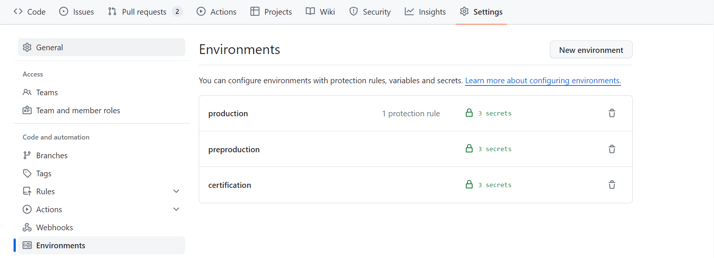

To create the secrets, use the "Add secret" option in the "Environment secrets" section, , by entering the name of the secret and the value.

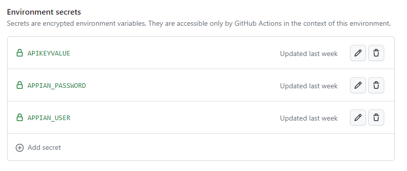

## Exporting, Copying and Configuring Appian Component files

The repository is ready in the local environment, now it is time to copy the files and configurations of the process we have developed.

To do this, use the "Export Application" option available in the Appian Designer console:

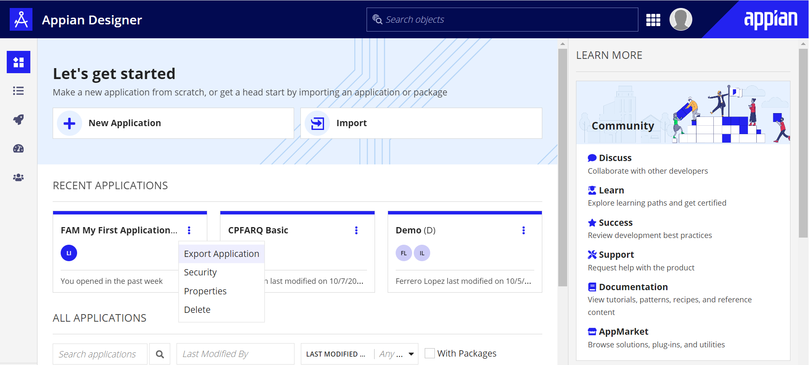

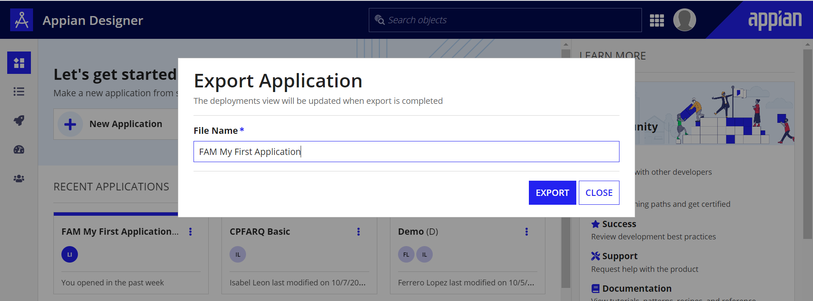

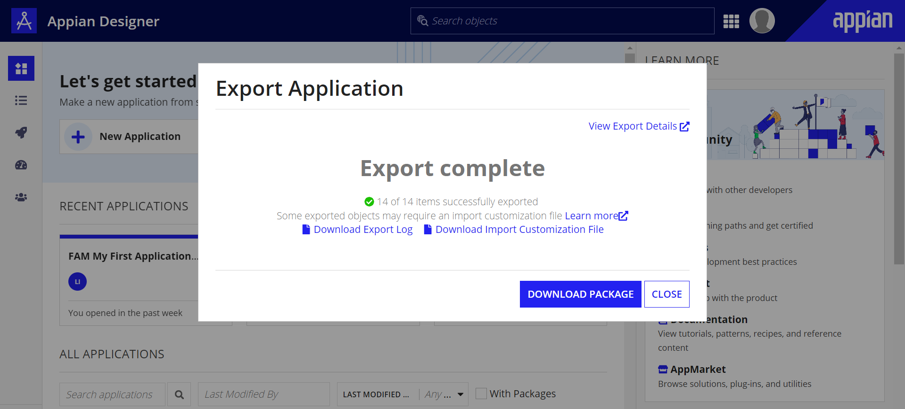

This 2 files are downloaded:

- < **Appian package** >**.zip**: Contains the files of the Appian Component developed.
- < **Custom Properties** >**.properties**: Contains the environment properties of the Appian component.

### Appian Component Files

The Appian Component files must be unzipped in the _appian/applications_ folder of the archetype.

``` bash

📂appian
 ┣ 📂applications
  ┣ 📂application
  ┣ 📂connectedSystem
  ┣ 📂content
  ┣ 📂group
  ┣ 📂processModelFolder
  ┣ 📂META-INF
  ┣ 📜README.md

```

### Appian Component Properties

Regarding the customisation file, one file for each environment must be created. For this, the downloaded .properties file is copied to the _appian/properties_ folder and 3 copies are created, with the following name:

``` bash
  < repo name >-< environment >.properties
```

Below is an example of how the folder should look like:

``` bash

  📂appian
   ┣ 📂properties
    ┣ 📜sov-vortex-appiandoc.cert.properties
    ┣ 📜sov-vortex-appiandoc.pre.properties
    ┣ 📜sov-vortex-appiandoc.pro.properties
    ┣ 📜README.md

```

To configure the properties for each environment, each property must be uncommented and the corresponding value included.

At this point, it is common that there are some properties that must be configured as secrets, such as tokens or passwords, which value are not known by the developer.

???+ info

    The developer does not have permissions to configure secrets. The creation of these secrets can only be done by profiles that know the value of the property and have the necessary permissions in the GitHub repository to create the secret.
    The developer must coordinate with these people, indicating the name of the secret to be created.

Once the secrets have been created, they must be incorporated into the property file using the following nomenclature:

```yaml

${{ secret.< SECRET_NAME >}}

```

Below is an example of a property file with 2 properties, one of them being a secret:

``` yaml title="sov-vortex-appiandoc.cert.properties" hl_lines="13 14" linenums="1"

## Connected System: FAM AppianServer
connectedSystem._a-0002ea91-ebe5-8000-ebe5-219188219188_16633.baseUrl=https://santander-sdsx-poc-bpm4.apps.ocpcto02.sgt.pre.weu2.azure.paas.cloudcenter.corp/suite/deployment-management/v1
connectedSystem._a-0002ea91-ebe5-8000-ebe5-219188219188_16633.apiKeyValue=${{ secret.APIKEYVALUE}}

```

### Configuration Files

- **properties.env**: Properties with the CI/CD configuration
- **deployment.yaml**: Configuration to deploy the image

#### Properties

=== "Default"

    ```yaml linenums="1"
    # Sonar parameters
    SONAR_ID=""
    SONAR_PROJECT_KEY=""

    # Maven parameters
    MAVEN_BUILD_GOAL='clean verify'
    MAVEN_VERSION='3.9.5
    ```

=== "Appian Example"

    ```yaml linenums="1"
    # Sonar parameters
    SONAR_PROJECT_KEY="sgt-apwfdev-appian21351"
    SONAR_PROPERTIES="-Dsonar.sources=appian/applications"

    # Maven parameters
    MAVEN_BUILD_GOAL="clean verify"
    MAVEN_VERSION="3.9.5"

    
    # Appian plug-in version
    APPIAN_ADM_IMPORT_CLIENT_VERSION=2.5.9
    ```
The project name in **Sonar** must be the same as the component repository name.
For example:

```yaml

SONAR_PROJECT_KEY="sgt-apwfdev-appian21351"

```

The  **APPIAN_ADM_IMPORT_CLIENT_VERSION** property specifies the version of the Automated Import Manager (AIM) Client plug-in used by the Appian pipeline. If not explicitly defined, it defaults to version `6.2.0`.
The available values for this property are `2.5.9` and `6.2.0`.

```yaml

# Appian plug-in version
APPIAN_ADM_IMPORT_CLIENT_VERSION=2.5.9

```

??? info "All the properties"

    {!
       include-markdown "**/application/ci-cd/**/maven/snippets/project-properties.md"
    !}

## Build and Deploy your application

{!
include-markdown "../../snippets/lifecycle/tbd-rm-appian.md"
!}

## Fix/Release Flow

{!
   include-markdown "../../snippets/lifecycle/fix-release-flow.md"
!}
