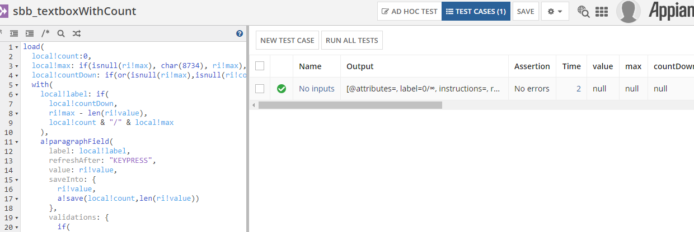
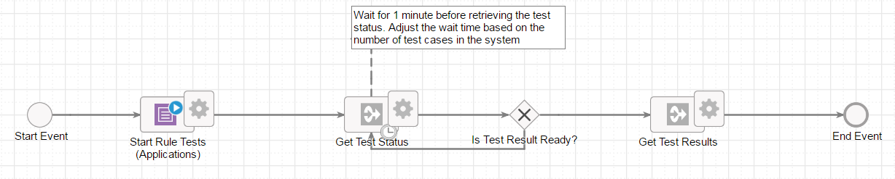
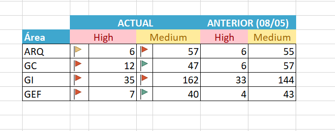

# **Test automation**

There are different approaches to automated testing that are complementary,
such as unit testing and end-to-end or functional testing.

Having well-designed tests will simplify maintenance, offering a very refined
tool to run reliable regression tests without having to implement them every
time a change is made.

The different types of tests in Appian have the following characteristics:

## **Unit testing**

These are responsible for ensuring that an object (expression), given an input,
responds as it should. This type of tests can be implemented in the expression
rules that usually include most of the logic.

It is ideal to follow a TDD (test driven development) model in the development
of expression rules, which means that the tests (inputs and expected outputs)
are implemented first and then the code is developed.

If a rule has several possible outcomes, a unit test should be performed for
each possible outcome to check the full functionality of the rule.

{:.center}

### **Tests 1**

These tests can be launched either from the expression rule itself (as shown in
the Tests 1 image), or using smartservices, which will allow us to launch them
from Webapis or flows (Tests 2).

{:.center}

### **Tests 2**

In this second case, the smartservice will be used in the form of a box (flow)
or in the form of a function ( a!startRuleTestsApplications() or
a!startRuleTestsAll()) from a saveInto. This smartservice generates an Id for
each instance, that using it as parameter with the smartservice
a!testRunStatusForId() will tell us if the execution of the tests has finished.
Once they have finished, with the same Id the results will be obtained by
calling the smartservice a!testRunResultForId().
It can also be invoked from Jenkins by exposing the above via a WebApi and
converting the result to JUnit format (via an XSTL). All the necessary
requirements and steps to follow can be found in the following reference:[https://docs.appian.com/suite/help/20.2/Running_Automated_Tests_on_Expression_Rules_with_Jenkins.html](https://docs.appian.com/suite/help/20.2/Running_Automated_Tests_on_Expression_Rules_with_Jenkins.html)

## **Functional testing**

They consist of testing a workflow from start to finish. A workflow can be a
user action or a complete process. Ideally, these end-to-end tests should have
a correspondence with the user stories, so having them well defined will help
the development of the tests.
In this case the recommended methodology is BDD or Behavior Driven Development.

Some of the habits that BDD encourages, in addition to those provided by TDD
are:

* It helps us to focus on what is truly important for the 'business'.
* If we generate the tests with a specific language, they can help us when
  doing the Acceptance tests.

There are several tools that help us

## **Healthcheck**

Appian provides healthcheck as a tool to control the performance of
environments, the developer must follow these indications to maintain the
quality of these.
It provides the developer with an Excel file with a summary of errorsaccording
to their level of criticality compared to the last time it was executed.

{:.center}

In addition to providing you with more detail on what type of error is being
made, it adds the location where it is occurring for faster correction.

[picture]

## **Talos**

Talos is a model for automating software testing from the corporate repository
in an unattended environment. It is based on Microfocus UFT, Microfocus ALM,
Jenkins  and GitLab tools.

Its most outstanding features are.

* Unattended execution: The automation executor accesses the Jenkins tool
  through the web browser, launches a Job with the necessary parameters of the
  automation and can continue his activity on his computer or even turn it off,
  since the automation will not be executed on the device with which he has
  accessed Jenkins.
* Scalable architecture: The architecture of this optimized model considers the
  use of a Jenkins master node and as many slave nodes as necessary to guarantee
  the requested workload, and these slave nodes can be either physical or virtual
  machines.

The Microfocus ALM connector is an automation framework that incorporates a
Visual Basic Script library available for the UFT automation tool, which allows
the export of automation information and evidence to the Microfocus ALM test
management tool, providing automation developers with the independence of the
knowledge of the internal operation of the tool and centralizing the
maintenance of the connector to a single shared library.
