# **Integrations with third-party systems**

  The following are the most frequent integrations that are commonly used
  within the platform and that have been carried out in Santander's projects.

## **BBDD Integrations**

  Appian allows direct integration with the following databases:

* SQL Server
* Oracle
* DB2
* MySQL
For these databases, the integration is done by configuration, within the
platform:For example: (URL dummy): entornoAppian.Santander/suite/admin

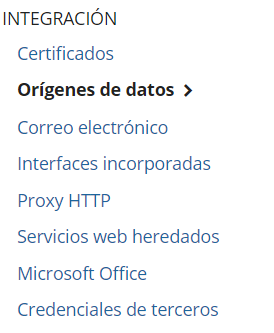{:.center}

To perform the configuration, you only need: the connection string, user and
password:

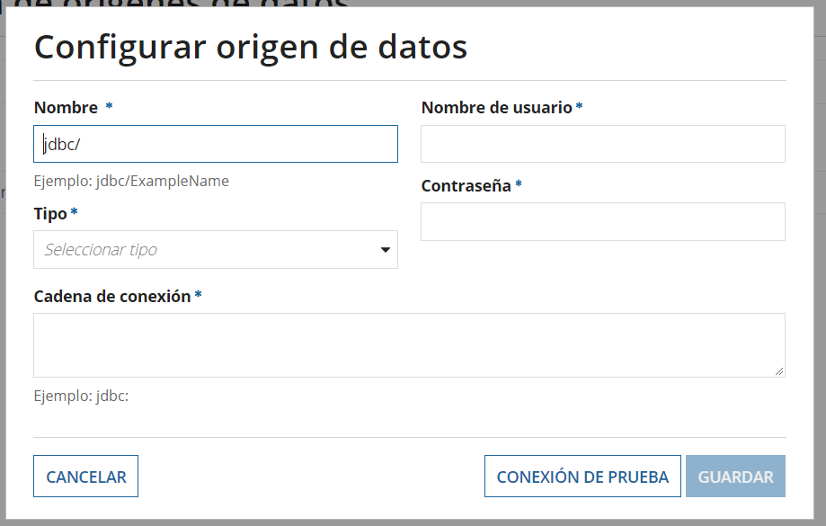{:.center}

The platform allows connecting to different databases simultaneously,
identifying them by a name that will be used in the definition of the
datastores.

**Considerations** 

  * If we are working in Appian Cloud architecture, it is necessary to
    guarantee that there is a connection between the Appian cloud and the network
    where the databases are located. Normally, it is necessary to set up a VPN
    network to guarantee this connection.

  * The security of access to the database must be defined by the permissions
    granted to the user with which it is accessed. Thus, for a database with
    read-only access, it is sufficient to grant read permissions to the user.

  * If you want to integrate a database that is not among those allowed by
    configuration, it is necessary to check in AppianMarket if there is a
    smartService to connect to that database. In the worst case, a custom
    connection plugin can be created.

Ref.Appian Market:[https://community.appian.com/b/appmarket](https://community.appian.com/b/appmarket)

Ref.Plugins:[https://docs.appian.com/suite/help/20.2/Appian_Plug-ins.html](https://docs.appian.com/suite/help/20.2/Appian_Plug-ins.html)

## **Integrations with APIs**

When creating a WebAPI it is necessary to set the name, the HTTP method to be
used for it (GET, POST, PUT, DELETE) and finally the endpoint, this last one is
important since it will be the last part of the WebAPI path to be exposed.
For external or internal services to communicate with it.

Once created, a pop-up will appear with templates that can be used to help
facilitate and speed up the development of the code:

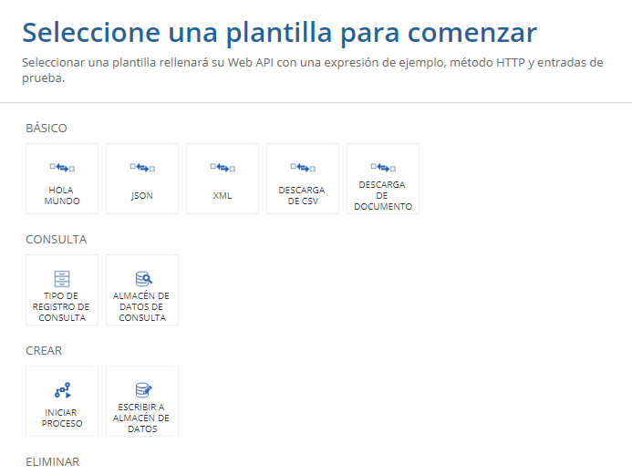{:.center}

If none is selected, the WebAPI screen will appear, which is divided into three
sections, very similar to an Expression Rule, although with differences, since
in the WebAPI Rule inputs cannot be configured, but parameters are declared,
besides the code box only allows the introduction of a maximum of 4000
characters, so it is recommended to develop all the code using normal
Expression Rules and in the WebAPI only call them, simplifying the code in the
WebAPI.  

The structure of the code must contain all the operations that you want to do
when the service is invoked and at the end of the whole a response must be
created by means of the function a!httpResponse() that will have to contain the
normal structure of the response, with a header and a body, by means of which
the invoker is answered with the information that you want to pass, for example
if the service has gone 200 OK or has had a KO.

To invoke the WebAPI it will be necessary to add an authentication to the call,
it is recommended to use the HTTP Basic Authentication, it will be necessary to
use a user and its Appian key in the call so that the service can be executed,
in case of not adding an authentication, the service will give a KO with Access
denied.

The typification of the errors that can occur are the following:

| Status Code|Condition|
| :-: | :-: |
|404| There is no Web API with the specified endpoint and HTTP method|
|404|The user is not the viewer role or higher for the Web API|
|500|There was an error evaluating the Web APIS expression|
|500|The result of the expression evaluation was not and HTTP Response object|

Regarding WebAPI security:

| Actions /Roles |Administrator|Editor|Auditor| Viewer|
| :-: | :-: |:-: |:-: |:-: |
|Execute|Yes|Yes|Yes|Yes|
|Execute|Yes|Yes|Yes|Yes|
|Execute|Yes|Yes|Yes|No|
|Execute|Yes|Yes|No|No|
|Execute|Yes|No|No|No|
|Execute|Yes|No|No|No|

## **Integration with WS**

To solve the integration between APPIAN and web services, two possibilities are
proposed (both have been used within the Santander architecture).

### **Using APPIAN's own integration “Call Integration”:**

{:.center}

The creation of the integration should be as follows

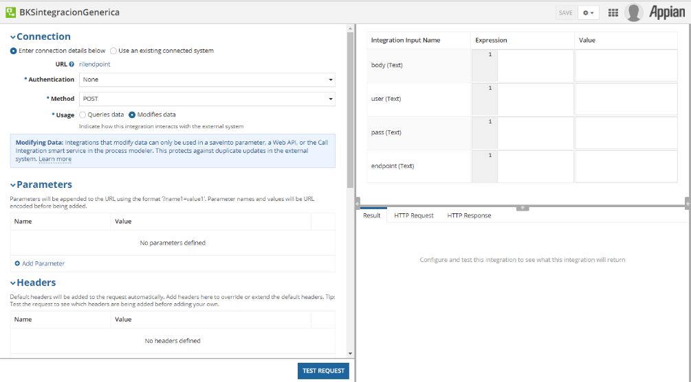{:.center}

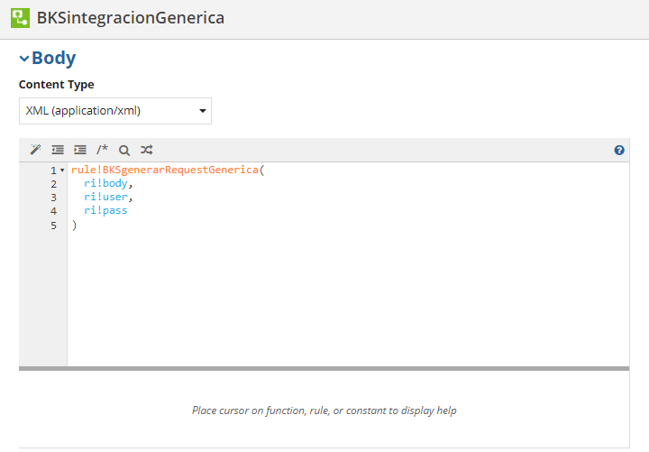{:.center}

The ‘BKSgenerarRequestGenerica’ rule dynamically generates the request,
allowing us to configure the input parameters.

### **Use plugin appian “Advanced Call Web Service”:**

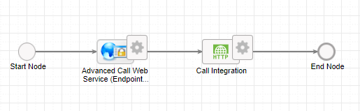{:.center}

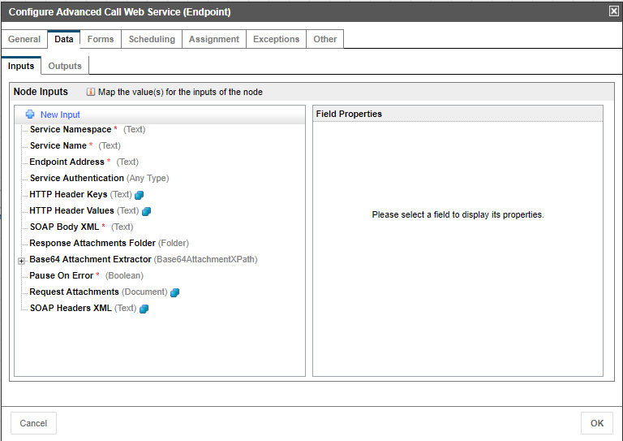{:.center}

All the variables necessary to perform the integration must be mapped available:

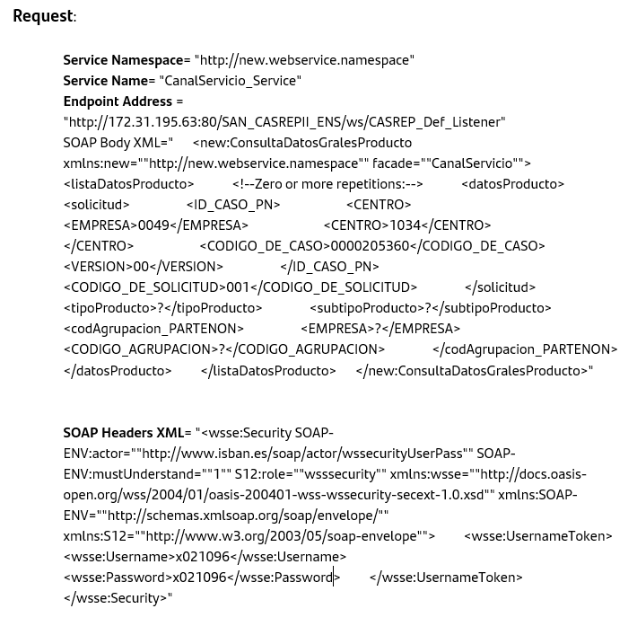{:.center}

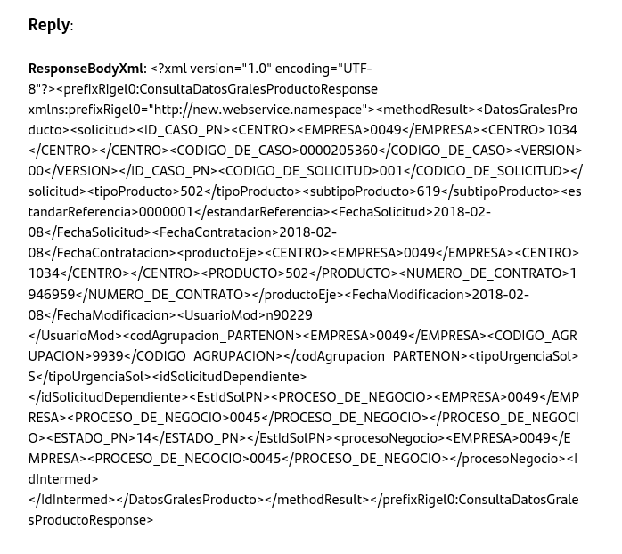{:.center}

### **Performing an invocation from an interface:**

As an example, for interface invocation, an interface with 4 input data has
been developed:

* Endpoint
* User
* Pass
* Body

This allows us to invoke any service that has the same security header.

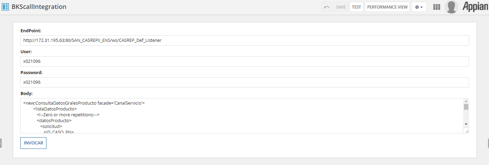{:.center}

In case of success we show the result obtained.

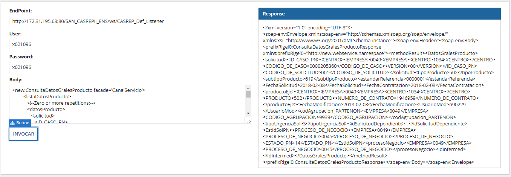{:.center}

NOTE: This option allows to launch invocations from the interfaces, without the
need to raise a process, which, depending on the case, can be useful, since the
processing capacity of the machine is optimized.

**Consideration:**
 
  It is recommended to use appian's own integration, since it does not depend
  on any associated SmartService and guarantees the functionality with the
  versioning of the tool.

## **Integration with  commercial platforms**

The Appian platform has a catalog of connectors to interact with various
existing commercial platforms. This catalog can be found in the AppianMarket
and can be free or paid, depending on the type of smartService required:[https://community.appian.com/b/appmarket](https://community.appian.com/b/appmarket)

In case there is no plugin or smartService available, the connection can be
made in several ways:

* Exposure / Consumption of WS and connection APIs.
* Design and development of a connection plugin and deploy it in the tool.
