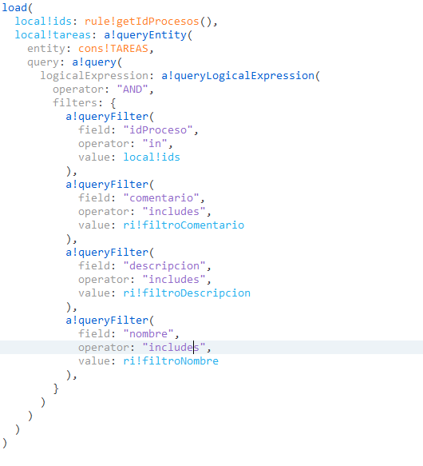
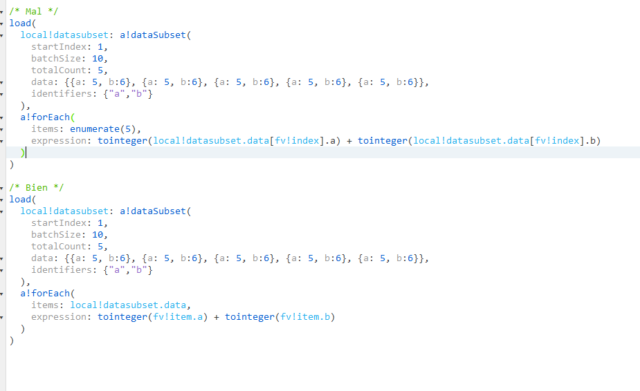
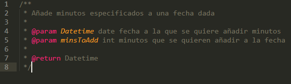
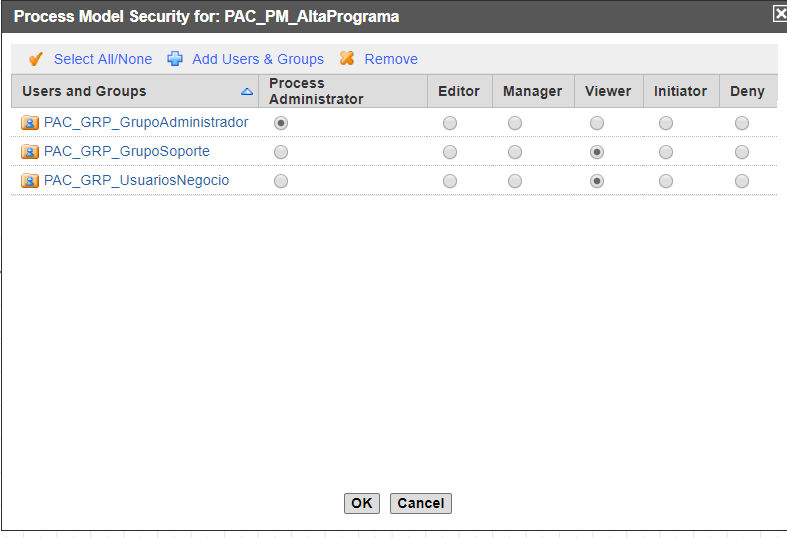

# **Design patterns**

In this section, both the recommended good practices and the knowledge acquired
are detailed by points.

## **Data models**

* Recommendation to start by creating a physical data model and then conduct a
  study on how to enter it into the custom data type (CDT) component.
* Declaration of a primary key (id+descriptive name), if it is of integer type
  it is recommended that it be autogenerated by Appian.
* Nesting CDTs:
    * 1-1: The best way to link them is to create a field that acts as a foreign
    key to one of the tables (Nomenclature: fk+Id+table namefkIdClientes).
    * 1-N: The best way to link them is by creating the foreign key in table N of
    the relation (Nomenclature: fk+Id+table name->fkIdClientes)
    * N-N: The best way to link them is to create an intermediate table with its
    own primary key, in which two columns are created as foreign keys of the two
    tables to be related.
* Nesting CDTs at many levels can cause performance problems both in writes and
  reads.
* Avoid using Query Rules, especially on entities with other nested entities.
* Avoid using many complex filters in database queries, such as many includes
  to search for matches or in filters. It is also not convenient to filter these
  data a posteriori in Appian. The recommendation would be to use a View or a
  stored procedure in the database itself.

{:.center}

## **Process models**

* It is essential in process modeling and design to use Swim lanes that
  identify process actors for better understanding and maintenance. This not
  only helps at a visual level but also simplifies the assignment of tasks to
  groups and/or users.
* Avoid making very recurrent loops (with a high number of repetitions) of
  several nodes, especially if they have database reads/writes, calls to reports
  and/or integrations.
* Always define who will receive error alerts, ideally the process/application
  administrator group (see Security section).
* Always define a data management policy. Keeping many finished processes in
  memory has a direct impact on Appian's performance, if you do not need data
  from certain processes or sub-processes a posteriori, the ideal is to delete
  them, but if you are going to need them, the ideal is to define a history in
  the database to be able to be exploited later.
* Avoid crossing flow lines, maintain order.
* Processes should not have more than 50 variables.
* They should not have more than 30 nodes.
* The display name of the process is dynamic ("Initiated by"& pp! initiator).
* Processes containing user inputs, batch…, have a log archiving after 3 days
  and 7 for all other processes.
* Processes will always terminate on at least one end event.
* Description of the functionality of the nodes used in the process following
  the following logic verb+description, if the node performs several functions,
  it will be set ->get data.
* All XORs have a single-entry point.
* Set in the XOR the result if none of the rules is fulfilled.
* Every output of a Gateway must be labeled.
* CDTs are not passed as a reference between a parent process and a subprocess.
* Use expression rules and constants instead of hardcoded values.
* Recommendation to use exceptions in the components (interfaces, saved in
  bbdd), allowing the saving of nodes to check these.
* Must to assign tasks to groups instead of users.

## **Interfaces and rules**

### Code

* In forEach loops do not use enumerate (list) in items to iterate over the
  list elements using index (list[index]), iterate directly over the list.

{:.center}

* When making an expression, avoid making calls to databases or integrations in
  loops.
* Do not instantiate the same rule, function or query several times in the same
  code when called with the same input parameters. A local variable should be
  declared where the response of this call is temporarily stored, so that it can
  be used as many times as necessary and avoid refreshing the local variable
  every time or for short periods of time.
* The interfaces must have test data.
* Do not exceed 200 lines of code in an interface and 100 in the expression
  rules.
* Use of index when extracting data, allows control of the field in case it is
  empty (index (local! resultadoQuery,”dato1”,null). To access more than one
  subfield it is mandatory to use one index per field as follows:
  index(index(local!query,"dato1",null),"local!dato1.1",null), because if the
  same index is used the designer
  mode is disabled.
* Comment code no matter how simple or obvious it may seem. Start with a header
  explaining what the code does, what inputs it expects to receive and what
  output it will return. Add markup in the code itself, for example when the
  branches of an if are very large.

???+ example

     rule GB_AddMinutesToDatetime(DateTime date, int minsToAdd)

{:.center}

* Separate with a space after a comma.
* Avoid leaving empty line breaks in the code.
* Avoid closing several parentheses and braces on a single line (so as not to
  leave something like "))))}))" on a line).
* Indenting the code correctly (one tab for each extra indented line) makes the
  code easier to read.
* Avoid leaving commented code in a rule or interface, to go back to old code
  the object versions are used.
* Refer to local variables, input parameters, function variables, etc. always
  with the domain prefix (local!, ri!, fv!...) explicitly.
* Indicate explicitly the parameters in function calls, rules and interfaces.
  This avoids errors when changing the input parameters of referenced rules and
  interfaces and also makes the code easier to read.
* Never duplicate an interface or rule (or version objects in general) with
  names such as OriginalNameBis, OriginalNameV1.2, NewOriginalName or similar.
* Try not to copy and paste code without control, doing this can drag errors,
  indicate non-existent attributes...
* Avoid using functions not officially supported by Appian even if they work
  (nor, nand...).
* In an if (condition, true, false) it is not necessary to put the IF, simply
  the condition will return a boolean which is the output we expect to receive.

### Testing

* Perform use cases (test) to test the code. Idyllically use TDD
([https://es.wikipedia.org/wiki/Desarrollo_guiado_por_pruebas](https://es.wikipedia.org/wiki/Desarrollo_guiado_por_pruebas))
  and develop before the expected scenarios given some inputs before the logic.

### Designing memory-efficient expressions

When an expression uses too much memory, it is typically doing one of the following:

* storing too much data in local variables
* looping over too many items
* returning too many components or too much data

#### Page and filter query results

To avoid memory issues with storing too much data in local variables, always do at least one of the following:

1. Page your query results using a reasonable batch size.
2. If you can't use paging, always apply filters to the data to limit the number of results.

#### Limit looping iterations

To avoid memory issues with looping over too many items:

* Check that you actually need to use a looping function. Some functions can also work on an array of data, such as text() or if(). If you can easily achieve the same behavior without using a looping function, you shouldn't use one.
* Limit the number of items in your array by filtering or paging the data. In general, avoid looping over more than 500 items.
* Don't use deeply nested looping functions. In general, avoid nesting beyond 2 levels.

#### Avoid large interfaces

To avoid memory issues with too many components on an interface:

Avoid dynamically generating components (including grid rows or chart series) based on an unbounded or large data set. Always limit the amount of data by paging or filtering before displaying on an interface.

## **Groups and security**

Minimum recommended groups:

* PREFIJOPROYECTO>_GRP_ALLUSERS
* PROYECTPREFIX_GRP_ADMINS: Technical administrators of the project
  (e.g. PMS admins). It is set as Administrator of the whole project.
* PROYECTPREFIX_GRP_ALERTS: Group of people who will receive the alerts of the
  PMs of this APP. Only to put them in the alerts of the PMs.
* PROYECTSPREFIX_GRP_SUPPORT: Group of people who will support the APP. They
  are put as observers of everything. Normally if you belong to this group, you
  should belong to the Appian Designer group.
* PROYECTPREFIX_GRP_BUSINESSUSERS: Group where the business group tree of this
  APP falls
* PROYECTPREFIX_GRP_ARQVWV01: Group that will contain all the application
  groups that want to use the Architecture rest services.
* PREFIXPROYECTO_GRP_AUTHENTICATION_SAML_IDPX: Group that will contain all the
  users/groups of the application that want to authenticate through SAML. Where X
  will correspond to 1,2,3,4 or 5 depending on the IDP that is configured in the
  server and is the one we use in our application.

When configuring any PM of that project or application we put it like this:

{:.center}

The business group is set as initiator or observer, depending on whether those
users have to exploit Process Report data or not. By default, observer.

{:.center}

From this point on, it is only necessary to make sure that all threads inherit
the security:

{:.center}
