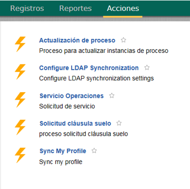
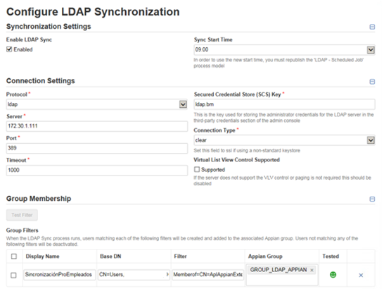
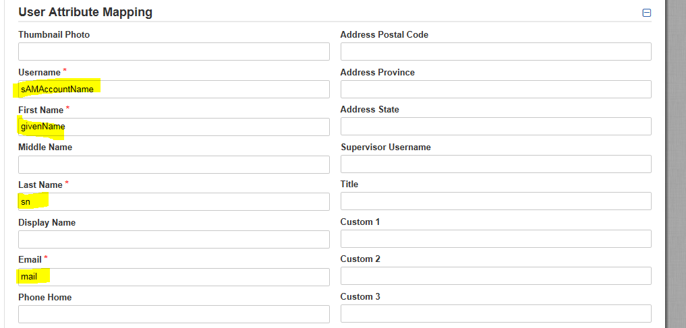
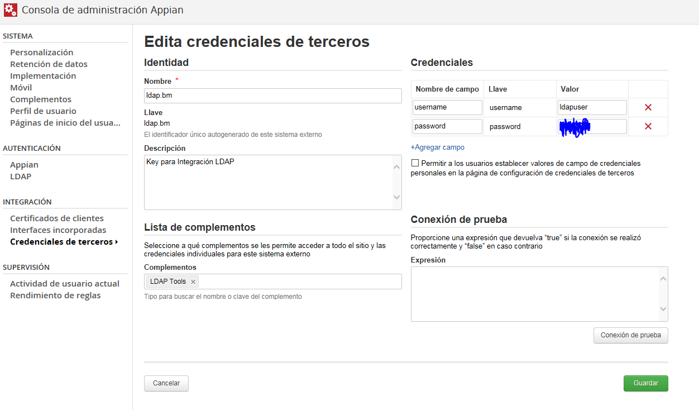
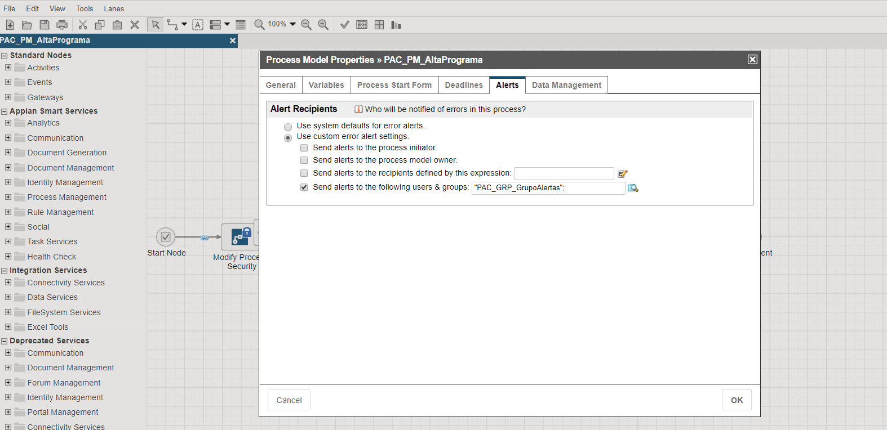
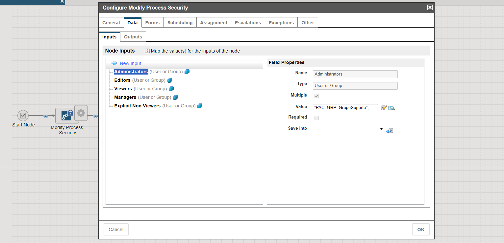
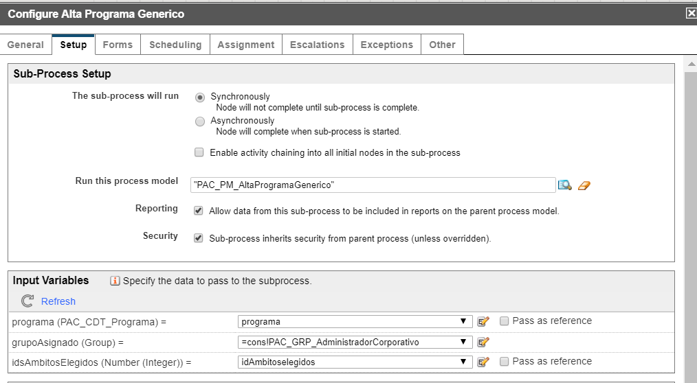

# Users security and roles

## Connection to corporative LDAP

Next, the different configurations carried out in Appian to achieve the
synchronization between LDAP users and Appian will be described.

For the LDAP synchronization of users (knowing the attributes of the users
defined in LDAP), the plugin has been used:
[https://forum.appian.com/suite/tempo/records/type/components/item/i8BWsQdLlzKy55h8z8zJ0sPqpDWFrba_rlbqmymbR5eREEJoiLjnrTAiQnUJvUY0w/view/summary](https://forum.appian.com/suite/tempo/records/type/components/item/i8BWsQdLlzKy55h8z8zJ0sPqpDWFrba_rlbqmymbR5eREEJoiLjnrTAiQnUJvUY0w/view/summary)

On the forum page itself comes the .jar to download and include the
corresponding server path /opt/appian/_admin/plugins. In addition, a PDF guide
and a .zip application that can be imported into the Appian environment
directly is included. LDAP Sync Application

When the LDAP test application downloaded from the plugin page is imported, a
new application is created with practically everything needed to perform user
synchronization.

All the models that are used are configured with the USA locale and therefore,
since the environment is in Spanish, the names of the process models, the SAIL
forms and the names of the tasks did not appear. In case something like this
happens, you can use the Process Management plugin to modify the locale of each
of the models. In this way, although the names are in English, if the
environment is configured in Spanish, they can be displayed. This plugin can
also be used to upgrade the version of the processes in flight, archive and
unarchive processes, etc.

It can be downloaded here:
[https://forum.appian.com/suite/tempo/records/item/lIBCLGOdlMUpdGVqW3dQaIKmclBmvvNEj8vu_cjb7T-5YiPr4Fu8ly5Yj1s09uenE4RYzA8zKyx7eiUjepE6dGk75DUwf-MkSsbwuya1TTzzij2/view/summary](https://forum.appian.com/suite/tempo/records/item/lIBCLGOdlMUpdGVqW3dQaIKmclBmvvNEj8vu_cjb7T-5YiPr4Fu8ly5Yj1s09uenE4RYzA8zKyx7eiUjepE6dGk75DUwf-MkSsbwuya1TTzzij2/view/summary)

### Configuration LDAP

Once the application has been successfully imported and published, an Action is
created within the Tempo Actions tab.

{:.center}

From the Configure LDAP Synchronization action, a SAIL form is launched with
all the parameters for the configuration:

{:.center}

The following is a brief description of each of them:

* **Enable LDAP Sync**: if checked, the synchronization will be executed at the
  programmed time.
* **Sync Start Time**: the time indicated in the drop-down list is one hour
  more than the Spanish time since the server time is configured in another time
  zone. Therefore, if it is indicated to be executed at 9am, it will be executed
  at 8am Spanish time.
* **Protocol**: protocol used to connect to the server. In principle it should
  be: ldap.
* **Server**: name or IP of the LDAP server. It is possible that with the name
  the configuration does not catch well. This information must be provided by
  the client.

* **Port**: 369 or 636 is used by default. This information must be provided by
  the client.

* **Secured Credential Store (SCS) Key**: it is necessary to previously create
  a third-party credential and then configure it here. How to do this is
  explained below.

* **Connection Type**: select SSL if you are not using a non-standard
  credential.

* **All LDAP Users Group**: if a user is a member of this group and is not
  returned by any of the applied filters, it will be disabled. For example, the
  GROUP_LDAP_APPIAN group is used where all the users that have been created
  using LDAP synchronization are.

* **Group Filters**: it is necessary to create at least one filter that returns
  results when querying the LDAP directory. The users returned by this filter
  will be those with which the synchronization will be done in Appian. The
  fields to report in each filter are:
* **Display name**: filter name.
* **Base DN**: base filter to be applied. If left empty, the filter will be
  applied to the entire directory. CN=Users, DC=Santander, DC=es is indicated to
  search only for users in the domain "Santander". This information should be
  provided by the client.
* **Filter**: in this field the filter must be set to return the specific users
  to be synchronized. In the LDAP there are many users that do not want to have
  an account in Appian and therefore two groups have been created in the
  directory where the users will be included and that will be the ones to be
  filtered. In order to create and test the filters, it is advisable to use a
  tool (browser) to connect to the directory externally and consult the
  structure. If this is not possible, it will be necessary to rely on the client
  to be able to correctly elaborate the filter since the structure is partially
  unknown. Examples: Softerra and JXplorer. Information on LDAP filters:
[http://www.ldapexplorer.com/en/manual/109010000-ldap-filter-syntax.htm](http://www.ldapexplorer.com/en/manual/109010000-ldap-filter-syntax.htm)
  and
[https://social.technet.microsoft.com/wiki/contents/articles/5392.active-directory-ldap-syntax-filters.aspx](https://social.technet.microsoft.com/wiki/contents/articles/5392.active-directory-ldap-syntax-filters.aspx)

  * **Appian Group**: Appian group in which the users returned by this filter
    will be included. For example, the GROUP_LDAP_APPIAN group.
  * **Tested**: indicates the result of the filter test. Each time a filter is
    created or modified; it is necessary to test it before leaving it active.
  * **Field mapping**: it is necessary to put the directory field that
    corresponds to the user attribute in Appian. This information should be
    provided by the client.

{:.center}

For the configuration we have followed the documentation guide in the following
link:
[https://community.appian.com/w/the-appian-playbook/520/ldap-synchronization](https://community.appian.com/w/the-appian-playbook/520/ldap-synchronization)

### Third-party credentials

It is necessary to access the Appian administration console and then, within
the Integration options, access the Third-Party Credentials.

In this section, click on Create. Then, the following fields must be filled in:

* Name: name that the credential will have.
* Key: unique identifier of the credential to be used later in the LDAP
  configuration.
* Description: details of the credential.
* List of plugins: plugins that can use the credential. It is necessary to
  include the LDAP Tools plugin.
* Credentials: put the LDAP directory administration credentials (username and
  password).

For the example, it would look as follows:

{:.center}

Additional considerations

* In order for users to be synchronized, they must have the required fields
  completed in LDAP. Therefore, if a user does not have the email filled in the
  LDAP directory, his account will not be created in Appian.

* Within the groups of the LDAP directory, you must include the users as such
  and not a group or several groups that contain the users that you want to
  synchronize.

## Basic user for production supervision

Within Appian users, there are two profiles: basic user and administrator user.
The administrator user has full access to the entire platform and must be used
by technical administration and maintenance personnel. Under no circumstances
should business users have an administrator profile, as their permissions are
at the level of group hierarchy and application security.

For this reason, it may be necessary for a certain business user to have access
to the process instances, without being an administrator. For this purpose, the
following organization of user groups is proposed:

The group hierarchy of any project is usually organized as follows:

* PROYECTPREFIX_GRP_ALLUSERS
  * PROYECTPREFIX_GRP_ADMINISTRATORS: Technical administrators of the project
    (e.g. PMS admins or DSs). It is set as Administrator of the whole project.
  * PROYECTPREFIX_GRP_ALERTS: Group of people who will receive the alerts of
    the PMs of this APP. Only to put them in the alerts of the PMs.
  * PROYECTPREFIX_GRP_SUPPORT: Group of people who will support the APP. They
    are put as observers of everything. Normally if you belong to this group, you
    should belong to the Appian Designer group.
  * PROYECTPREFIX_GRP_BUSINESSUSERS: Group where the business group tree of
    this APP falls

At the time of configuring any PM of that project or app we must put it in the
following way:

{:.center}

  The business group is configured as initiator or observer, depending on
  whether these users have to exploit data from Process Reports or not (with
  only initiator there are sometimes problems in this regard). Lately and by
  default, observer.

{:.center}

  Then at the start of the Parent PMs, that is, all those that start a flow for
  the first time, the Modify Process Security Smart Service is added. With this
  we will modify only the permissions of the live instance, without touching
  the rest of the permissions, in such a way that we will give administrator
  permissions to the support group for that instance.

{:.center}

  From this point on, it is only necessary to make sure that all threads
  inherit the security:

{:.center}
