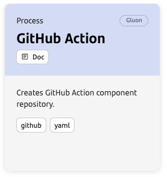

## Introduction

The purpose of this documentation is to provide a **step-by-step guide** on how to use Composite Actions in GitHub.

## Create Component

### Gluon Portal

First, you have to [**onboard your application.**](../../../application/application-management/index.md)

Once you have your application created, you can start creating your component.

To create a component, follow the steps described in [**Component Management**](../../../application/component-management/create-component.md),
searching for the component to be created.

You have to select the type of component you want to create, EXAMPLE.



???+ remember
    To follow the naming convention, visit [Repository Naming Convention](../../../application/component-management/create-component.md#repository-naming-convention).

The user can customize the type of application that they want to create. For this example, a GitHub Composite Action with the following parameters:

- **Branch Strategy**: branching model that involves the use of feature branches and multiple primary branches. Values: Git Flow or Trunk-Based Development.

Once the component is created, it's possible to see in the component's list the following links:

| Item | Link | Role Permission |
| --- | --- | --- |
| GitHub Repository | Link to the repository created in GitHub | Developer (RW) / Technical Lead (Maintain) [All roles explained](https://docs.github.com/es/organizations/managing-user-access-to-your-organizations-repositories/managing-repository-roles/repository-roles-for-an-organization) |
| ITSM | Link to the component registration in ITSM | All Users (Read) |

### GitHub Composite Action

The componsnt is initialized with default values based on the Component Template.
For repositories using the Git Flow branch strategy, an empty `main` branch is created.
Additionally, a `development` branch is initialized with the necessary file and folder structure to configure
your Composite Action. Conversely, for repositories using the Trunk-Based Development (TBD) strategy,
the `main` branch is directly populated with the required structure.

The generated repository follows a structure similar to the one below:

```bash
📂.github
 ┣ 📂workflows
 ┃ ┣ 📜update-permission-workflow.yml
 ┃ ┗ 📜update-component-workflow.yml
 ┗ 📜CODEOWNERS
📂scripts
 ┗ 📜goodbye.sh
📜README.md
📜action.yml
```

## Customize your Action

Once we have the device properly configured, the first step is to clone the project locally.

??? abstract "Cloning your repository"

    To do so, visit [**How to clone the project**](../../../application/component-management/create-component.md#cloning-a-repository).

### Adding scripts to action.yml file

The following steps outline the complete cycle for using a Composite Action, based on the **Git Flow** strategy.
Composite Actions provide a simplified way to automate processes using scripts, primarily defined in the `action.yml` file.
The provided template includes the essential structure required for an Action to function effectively. Let's analyze its contents::

### Key content of `action.yml`

```yaml
name: 'Action Name'
description: 'Greet someone'
inputs:
  who-to-greet:
  description: 'Who to greet during the action run'
  required: false
  default: 'pipeline developer'
outputs:
  json-output:
  description: "A simple JSON output generated by the action"
  value: ${{ steps.step-json.outputs.json-output }}
```

- **`name`**: Specifies the name of the Action.
- **`description`**: Describes the purpose and functionality of the Action.
- **`inputs`**: (Optional) Defines input parameters for the Action's automation process. For example:
  - `who-to-greet`: Represents the input parameter name. Within the Action's scope, it can be accessed using the context `${{ inputs.who-to-greet }}`.
- **`outputs`**: (Optional) Defines output parameters for the Action's automation process. For example:
  - `json-output`: Represents the output parameter name. The source value of the data can be provided using steps context `${{ steps.step-json.outputs.json-output }}`.

??? info "Official GitHub Context documentation"
    If you're not familiarized with GitHub context, please visit [GitHub Context Documentation](https://docs.github.com/en/actions/writing-workflows/choosing-what-your-workflow-does/accessing-contextual-information-about-workflow-runs#about-contexts).

```yaml
runs:
  using: "composite"
  steps:
  - name: Set Greeting
    shell: bash
    env:
      INPUT_WHO_TO_GREET: ${{ inputs.who-to-greet }}
    run: |
    echo "Hello, $INPUT_WHO_TO_GREET! 😃 Welcome to GitHub Actions!"
    echo "This is an action of type 'Composite'."
```

- **`steps`**: Specifies the sequence of steps the workflow will execute.
- **`name`**: Provides a descriptive label for the step, indicating its purpose or functionality.
- **`shell`**: Defines the shell used to execute the commands, such as `bash`.
- **`env`**: (Optional) Declares environment variables accessible during execution. For example:
  - `INPUT_WHO_TO_GREET`: Captures the input parameter `who-to-greet` for use within the step.

### Setting an Action's output in a step

```yaml
- name: Generate JSON Output
  id: step-json
  shell: bash
  run: |
  echo "Creating a simple JSON output..."
  echo '{"message": "Hello from JSON!", "status": "success"}' > output.json
  echo "json-output=$(cat output.json)" >> $GITHUB_OUTPUT
```

This step generates a JSON file and provides its content as output data for the Action. To achieve this, use the `key=value` format and set it as output by appending it to `$GITHUB_OUTPUT`.

Ensure the **key name** matches the one referenced in the Action's output value, such as `steps.stepID.outputs.key`. In this example, `json-output` is the key:

```yaml
value: ${{ steps.step-json.outputs.json-output }}
```

### Running a script using the Action's path

```yaml
- name: Run goodbye.sh
  shell: bash
  env:
    INPUT_WHO_TO_GREET: ${{ inputs.who-to-greet }}
  run: |
  source $GITHUB_ACTION_PATH/scripts/goodbye.sh $INPUT_WHO_TO_GREET
```

In the example above, a script named `goodbye.sh` is stored within the Action's scope and executed using the input parameter.
To ensure the script is accessible during runtime, utilize the `GITHUB_ACTION_PATH` placeholder, which references the Action's directory path.

## Create GitHub Release and Tag

To enable the automated mechanism, follow these steps to create a release and tag in GitHub:

1. Navigate to the **Releases** section of your GitHub repository.
2. Click on **Draft a new release**.
3. In the **Tag** field, either select an existing tag or enter a new tag name. If creating a new tag, click on **+ Create new tag on publish**.
4. Select the target branch, typically `main`.
5. Provide a **Release title** and a detailed **description**.
6. Click on **Publish release** to finalize the process.

## Using the Composite Action

Once the release and tag are published, the Composite Action can be integrated into a workflow. Below is an example of how to use the Action within a GitHub workflow:

```yaml
my-job:
name: Test composite action
runs-on: 'base-runner'
steps:
  - name: Run Composite Action
  uses: <owner>/<repository>@<tag>
  with:
    who-to-greet: 'GitHub User'
  
  - name: Get JSON output
  id: get-json-output
  env:
    JSON: ${{ steps.hello-job.outputs.json-output }}
  shell: bash
  run: |
    # Get component information
    echo "JSON from hello-job: $JSON"
```

Replace `<owner>`, `<repository>`, and `<tag>` with the appropriate values for your Composite Action.
