# Gluon Component Template

## 1. Introduction

The purpose of this documentation is to show you how to create and publish new Component Template to be used in the Gluon platform.

**What is a Component?** It is a set of resources that make up one or multiple parts of an application that is managed by Gluon. For example, a microservice, a library, the definition of an API...

**What is a Component Template?** It is an element that includes the processes and necessary configuration to create components of a specific technology. These processes include the template publishing process in the Gluon Portal and the scaffolding
mechanism for those components.
When the attribute "visible:" is configured as "true" in the `definition.yml` file the template will be available for all entities in the portal.

At this point you can create a new Component Template instance ready to work with the necessary files to be published in the Gluon Portal and ready to run a scaffolding process.
Depending on the technology that you want to use, you have to adapt this new Component Template instance structure files.

## 2. How to create a new Component Template?

- Open the Gluon Portal, then select the company:

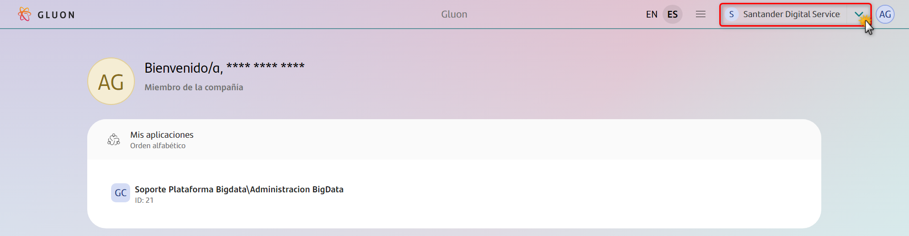

- Select the application:

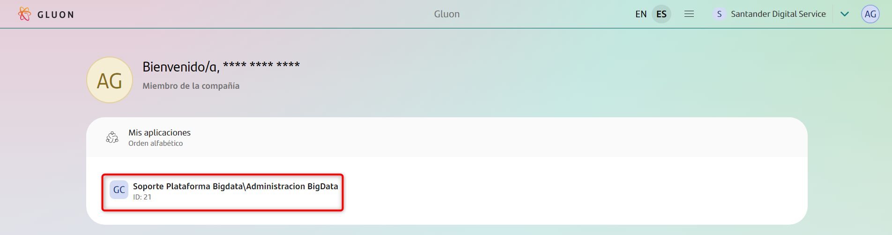

- Click on "Components"

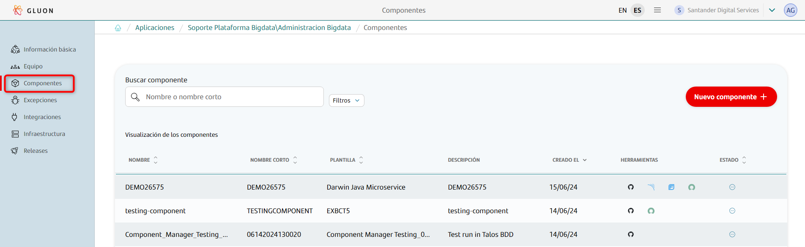

- Click on "New component":

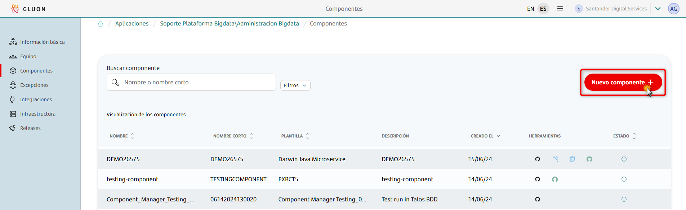

- Then search for "Base Component Template" and select it.

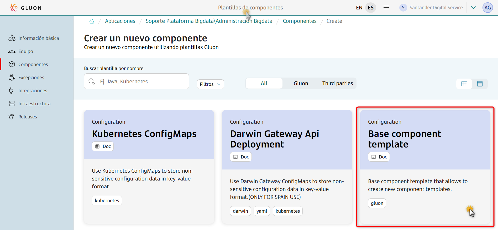

- Type the component name, short name and a brief description.

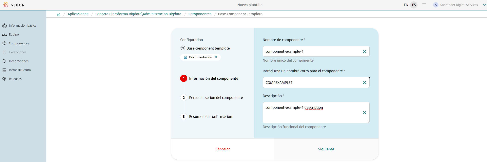

- Then complete the following fields and click on "Next", a summary will be displayed::

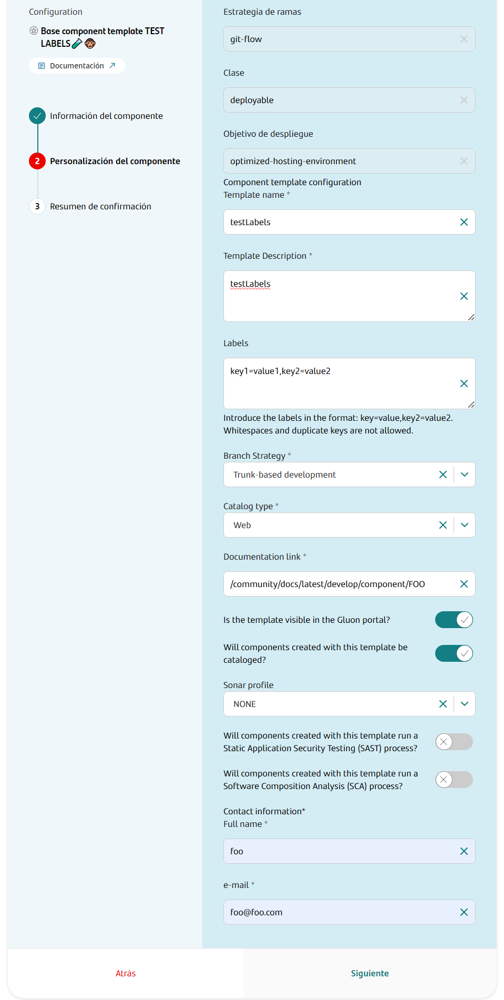

- **Template name**: Introduce the template name in Gluon Portal. This is the name that will be displayed in the Gluon Portal template list when you publish it.

- **Template Description**: Introduce a brief description about of the template capabilities.

- **Labels**: The "Labels" field is a list of unique keys, and each key represents a tag assigned to a Template. You can't leave the "Labels" field empty. It must not contain whitespace or duplicate keys and must also contain a key=value pair. To ensure
proper formatting, labels must be entered in the format: key=value,key2=value2.

- **Branch Strategy**: Only Trunk-based development branch strategy is enabled, therefore only the main branch will be created in the repository.

- **Catalog type**: Technology or catalog type associate with the template. The catalog type must be defined in the ITSM tool. For example: "API", "Configuration", "IaC", "Library", "Microservice", "Process", "Secret", "Testing", "Web", "Gravity".

- **Documentation link**: Introduce user documentation link for this new Component Template. This link has to be relative to the Gluon Docs community site for example "community/docs/latest/quick-start/what-is-gluon". This field couldn't be empty
but it could be temporarily mocked.

- **Is the template visible in the Gluon Portal?**: True by default.

- **Will components created with this template be cataloged?**: True by default, for registering the component in ITSM.

- **Sonar profile**: NONE by default. It allows users to select different quality profiles for their projects.
These profiles use a set of rules that SonarQube uses to analyse code quality and security. Selecting an appropriate profile ensures that your project adheres to specific coding standards and best practices.

- **Will components created with this template run a Static Application Security Testing (SAST) process?**:
  It enables or disables SAST scans for your project within the DevOps pipeline. SAST scans are crucial for identifying security vulnerabilities in the source code before deployment, ensuring the application is secure.
  By default, it will be disabled.

- **Will components created with this template run a Software Composition Analysis (SCA) process?**:
 It allows users to enable or disable SCA scans for their projects. SCA scans are essential for identifying vulnerabilities in third-party components and libraries, ensuring the security and compliance of your application.

- **Contact information**: For contaction purposes you have to fill this information:
  - **Full name**
  - **e-mail**
  
- **Local or global template publish**:
  Component Template scope is defined based on the organization where it is located.
  APP360 team has a list defining all the global organizations, the Component Templates created in those organizations are going to be published globally, that means they are visible among all applications in the Gluon Portal.
  If the Component Template is being created in an organization that's not in the list, the publication is going to be local by default.
  
  ---

- Finally click on "Create component" to execute the Component Template instance generation process.

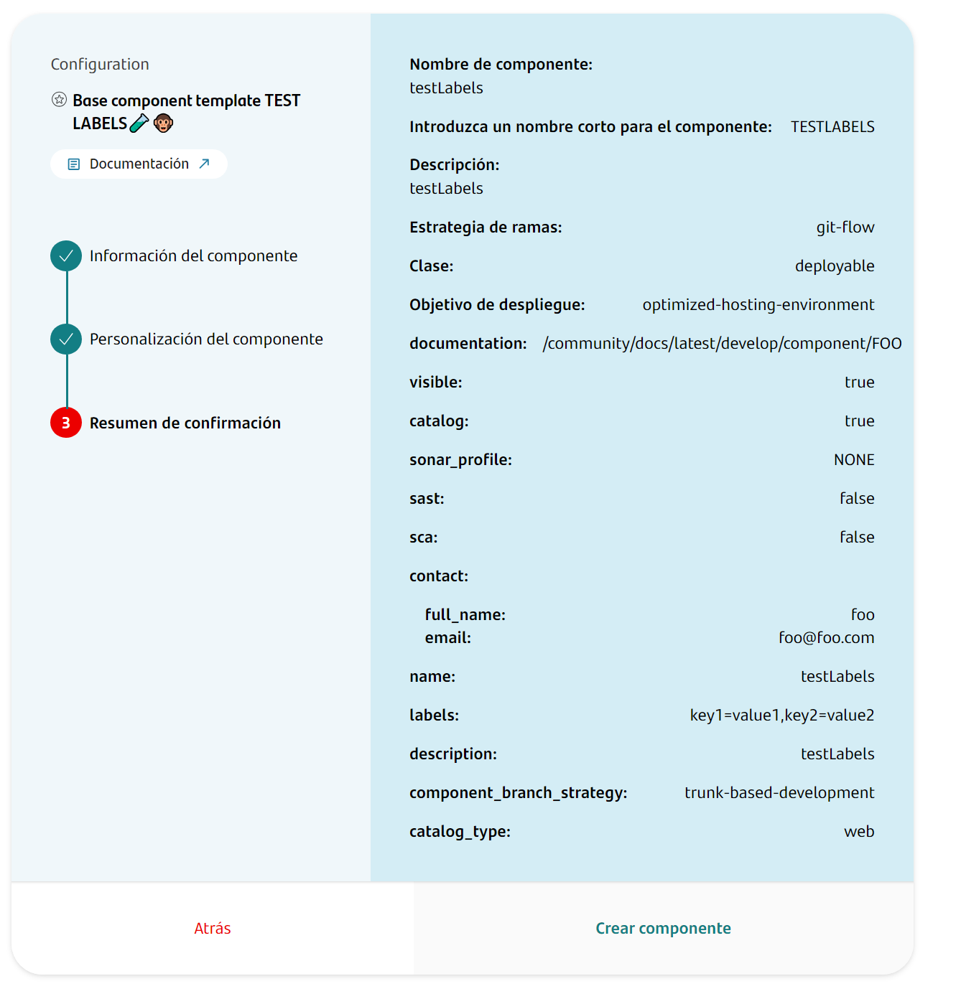

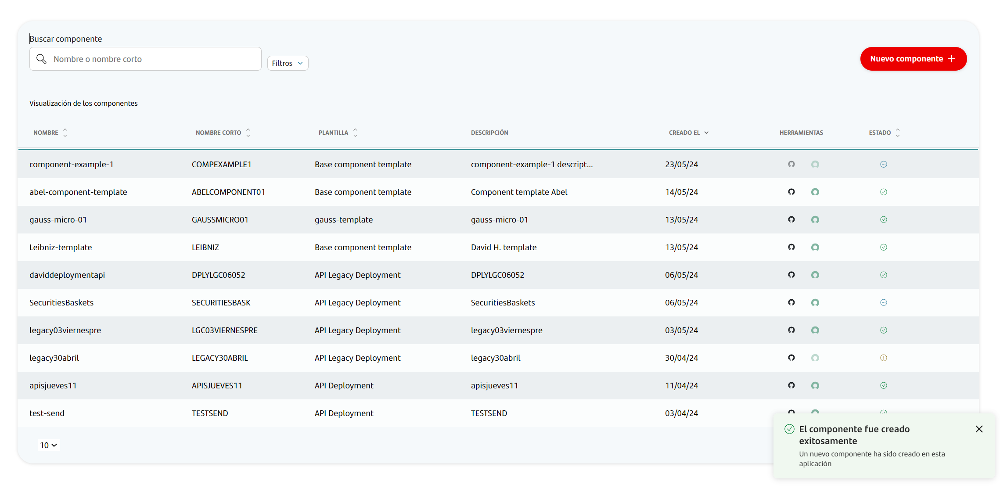

This process will create a new Component Template instance, which means:

  - You can see the new Component Template instance in your application's components list.
  - A new repository in GitHub is created:

## 3. How Scaffolding workflow works?

Once you have created the Component Template repository from the Gluon Portal the initialization process (scaffolding) will be performed, which involves the following steps:

- It gets the necessary credentials to log in to the Component Manager environments.
- The "main" branch is created. This kind of component uses [trunk based development](https://trunkbaseddevelopment.com/#one-line-summary) so no development branch is needed.
- Add the `component-template-publish.yml` workflow to the workflow's folder, this workflow is in charge of publishing the Component Template into the different Component Manager environments.
(When creating a component from our component template, all workflows under src/.github/workflows will be added.)
- Add the necessary files that define the Component Template,
  like `presentation-schema.json`, `data-schema.json` or `definition.yml`. Creating a regular component from a component template, everything under ./src is copied to the new created component.
- Create and setup the [CODEOWNERS](https://docs.github.com/es/repositories/managing-your-repositorys-settings-and-features/customizing-your-repository/about-code-owners) file.
- Commit and push the changes into "main" branch, with everything necessary
  to start working with the new Component Template.
- If the template needs quality assurance and it is onboarded properly, the workflow will run an [initial empty sonar analysis](../../application/qatesting/qa/sonar/index.md#initial-analysis){:target="_blank"}.

!!! warning

      In the execution if initial analysis fails because Sonar is not onboarded, the workflow will stay on error until the user will retry Sonar onboarding
      and after that the user must rerun the scaffolding workflow.

Then you will have this project file structure in the "main" branch:

```text
📁 Component Template
├── 📁 .github
│   ├── 📄 CODEOWNERS
│   └── 📁 workflows
│       └── 📄 component-template-publish.yml
├── 📁 src
│   ├── 📁 .github
│   │   └── 📁 workflows
│   │       ├── 📄 workflow.yml
│   │       ├── 📄 update-component-workflow.yml
|   |       └── 📄 update-user-workflows.yml
│   ├── 📁 .gluon
│   |     └── 📄 blank-file
|   └── 📄 user-workflows-source.yml
├── 📄 definition.yml
├── 📄 data-schema.json
├── 📄 presentation-schema.json
├── 📄 setup.sh
└── 📄 update.sh
```

- **.github/workflows/component-template-publish.yml**: This workflow is used to publish the Component Template in the "Gluon" portal.

- **src/.github/workflows**: This folder allocates the user workflows that are going to be copied when a user creates a new component from this Component Template. This user workflows call reusable workflows,
which can be either generic workflows or those based on Trunk-based development or Gitlow workflow.
Depending on the strategy selected by the user when creating the component, the appropriate workflows will be added to the created component based on their suffix:
    - **-tbd.yml** for Trunk Development Based.
    - **-gfw.yml** for Gitflow Workflow.
    - **No suffix**, there are also workflows with no suffix added, which will be copied in either strategies.

- **src/.github/workflows/update-component-workflow.yml**: This file implements the logic to update a component. The Component Template version to update will be get by the workflow automatically, and it will be the next one.
Then it does some checks and gets information about the component in order to run the update.sh script with the new version. Finally, update the component with the changes.

- **src/.github/workflows/update-user-workflows.yml**: This workflow implements
    the logic to add a list of new user workflows or to update user workflows
    versions in the component template. When it's executed, it reads the
    `user-workflows-source.yml` file to get the user workflows listed.
  
    First of all, it checks if the user workflows version is the latest, if a
    new version exists, the workflow updates the `user-workflows-source.yml`
    file with the latest version and downloads the user workflows into the
    component template. And finally, it leaves a pull request open in the
    repository and a notification with the link in the workflow execution
    summary as it can see in the following screenshot.

    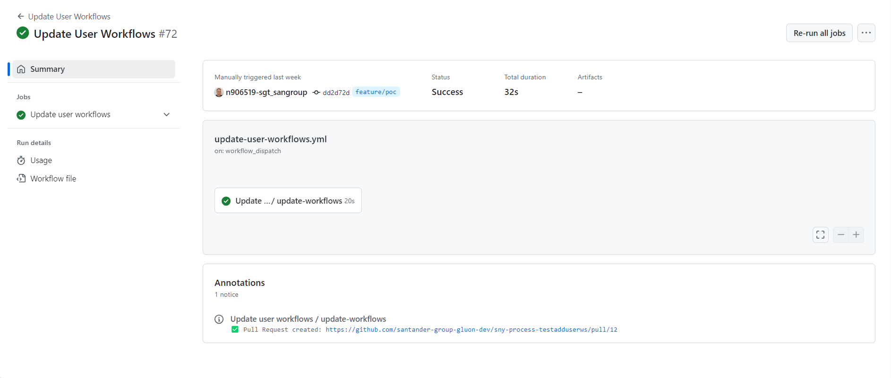

- **src/user-workflows-source.yml**: This file contains a user workflows file
    list to be copied when manually executed the `update-user-workflows.yml`
    workflow. The file has the following format:

    ```yaml
    repositories:
      - name: "org1/repo1"
        version: "vM.m.p"
        user_workflows:
          - "file-pattern"
    ```

    Where:

    - **repositories**: It contains the list of source repositories where the
      update user workflow will retrieve the user workflows from.
    - **name**: *organization/repository* format where the user workflows are
      published.
    - **version**: It's the semversion correlated with the tag name **vM.m.p**.
    - **user_workflows**: This is a array of bash regular expression to chose
      the desired user workflows file. For example: `workflows/*.yml`.

    Here is a real example of this file:

    ```yaml
    repositories:
      - name: "santander-group-shared-assets/gln-user-commons-workflows"
        version: "v1.4.0"
        user_workflows:
          - "workflows/*.yml"
      - name: "santander-group-shared-assets/gln-user-maven-workflows"
        version: "v1.4.0"
        user_workflows:
          - "workflows/*.yml"
          - "workflows/immutable-images/*.yml"
    ```

- **src/.gluon**: Here are all the configuration files needed for the component related to the component lifecycle management. I.e: configuration files to perform de deployment, or the configuration files to perform the tests.

- **definition.yml**: This file has the Component Template configuration. This information will be displayed in the new component catalog in the Gluon Portal.
It has metadata related to the component name, component version, the component description, the documentation link, contact information... It is created when someone creates a new component using "Base Component Template" in the "Gluon Portal",
it takes the values from the form that is displayed in the ["Component Personalization"](#2-how-to-create-a-new-component-template) step.

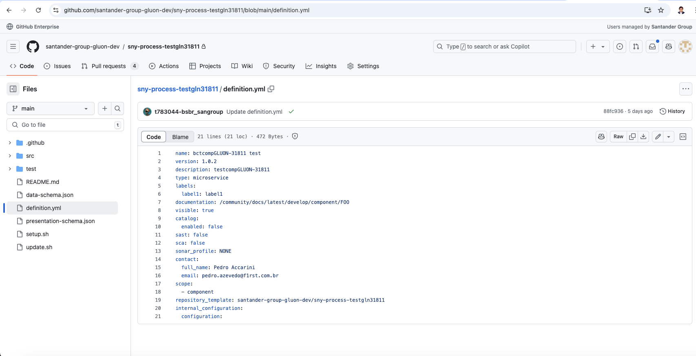

??? example

    ```yaml
    name: iOS Library # Name of the component template (When creating in the portal you select the template by this name)[NC*, new component will be created if this values is changed if the first creation execution was executed] [Image definition-1]
    version: 1.1.0 # Version of the component template
    description: Create an iOS Library leveraging the ODS Mobile framework. The framework provides a set of libraries and mechanisms to simplify configuration, development and publishing issues. # Description of the component template [NC*] [Image definition-1]
    type: configuration # Type of the component template, it can, for example, be configuration, ..... [NC*][Image definition-1]
    labels: # All the labels go here, can be just one but also a few of them
      build-tool: maven # This is a label, they are useful in order to filter by them in the portal [C**][Image definition-1]
      framework: ios
      language: swift
    documentation: /community/docs/latest/develop/component/catalog/component-template  # Relative route to the documentation [C**][Image definition-1]
    visible: true # This variable define if the component is visible in the portal [C**]
    catalog:
      enabled: true
    sast: true # Enable or disable sast (Static Application Security Testing)[NC*]
    sca: true # Enable or disable sca (Software Composition Analysis)[NC*]
    sonar_profile: JavaMicros # Name of the sonar profile to use [NC*]
    contact:
      full_name: Josh # Manager's template name [C**]
      email: Josh.smithbrown@gruposantander.com # Manager's template email [C**]
    scope:
      - component #It can be component or application, which only can create one component for organization. [NC*]
    repository_template: santander-group-shared-assets/gln-component-template-documentation # Component template repository [C**]
    internal_configuration:
      configuration:

    # *NC means that this value CAN'T be changed once the component is created or if it's changed the effect will not be applied
    # **C means that this value CAN be changed once the component is created
    ```

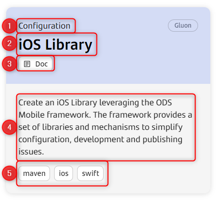

definition-1 [type(1), name(2), documentation(3),description(4), labels(5)]

- **data-schema.json**: File that describe the component and its representation in the Gluon Portal new component form. The purpose of this file is to provide a description of a component.
It contains information about the component's structure, properties, and other relevant details.

??? example

    ```json
    {
      "title": "Template Configuration",
      "description": "Please configure your component template.",
      "type": "object",
      "required": [
        "name",
        "description",
        "labels",
        "catalog_type",
        "documentation",
        "contact",
        "component_branch_strategy"
      ],
      "definitions": {
        "catalog_types": {
          "enum": [
            "API",
            "configuration",
            "data",
            "decisioning",
            "events",
            "gravity",
            "IaC",
            "library",
            "microservice",
            "mobile",
            "orchestration",
            "process",
            "RPA",
            "secret",
            "serverless",
            "testing",
            "web"
          ],
          "enumNames": [
            "API",
            "Configuration",
            "Data",
            "Decisioning",
            "Events",
            "Gravity",
            "IaC",
            "Library",
            "Microservice",
            "Mobile",
            "Orchestration",
            "Process",
            "RPA",
            "Secret",
            "Serverless",
            "Testing",
            "Web"
          ]
        }
      },
      "properties": {
        "name": {
          "type": "string",
          "title": "Template name",
          "description": "Introduce the template name in Gluon portal.",
          "maxLength": 64
        },
        "description": {
          "type": "string",
          "title": "Template Description",
          "description": "Introduce a brief description about of the template capabilities.",
          "maxLength": 512
        },
        "labels": {
          "type": "string",
          "title": "Labels",
          "description": "Introduce the labels in the format: key=value,key2=value2. Whitespaces and duplicate keys are not allowed.",
          "allOf": [
            {
              "pattern": "^([a-zA-Z0-9_-]+=[a-zA-Z0-9_-]+)(,\\s*[a-zA-Z0-9_-]+=[a-zA-Z0-9_-]+)*$",
              "patternErrorMessage": "Invalid format. Please use the format: key=value,key2=value2 without whitespaces."
            },
            {
              "not": {
                "pattern": "([^=,]+)=([^,]*),.*\\1=",
                "patternErrorMessage": "Duplicate keys are not allowed."
              }
            }
          ]
        },
        "component_branch_strategy": {
          "title": "Branch Strategy",
          "description": "Select the branch strategy for your project.",
          "default": "trunk-based-development",
          "enumNames": [
            "Trunk-based development"
          ],
          "enum": [
            "trunk-based-development"
          ]
        },
        "catalog_type": {
          "type": "string",
          "title": "Catalog type",
          "description": "Technology or catalog type associate with the template. The catalog type must be defined in the ITSM tool.",
          "$ref": "#/definitions/catalog_types"
        },
        "documentation": {
          "type": "string",
          "title": "Documentation link",
          "description": "Introduce the documentation link for the component.",
          "default": "/community/docs/latest/develop/component/FOO",
          "maxLength": 128
        },
        "visible": {
          "type": "boolean",
          "default": true,
          "title": "Is the template visible in the Gluon portal?"
        },
        "contact": {
          "type": "object",
          "title": "Contact information",
          "decription": "Contact information.",
          "required": ["full_name", "email"],
          "properties": {
            "full_name": {
              "type": "string",
              "title": "Full name",
              "description": "Introduce the template owner fullname.",
              "maxLength": 64
            },
            "email": {
              "type": "string",
              "title": "e-mail",
              "pattern": "^[a-zA-Z0-9._%+-]+@[a-zA-Z0-9.-]+\\.[a-zA-Z]{2,}$",
              "description": "Introduce the template owner email.",
              "maxLength": 64
            }
          }
        },
        "component": {
          "type": "object",
          "title": "Component Configuration",
          "decription": "Please, configure values to the components created with this template.",
          "required": ["catalog", "sonar_profile"],
          "properties": {
            "catalog": {
              "type": "boolean",
              "default": true,
              "title": "Will components created with this template be cataloged?"
            },
            "sonar_profile": {
              "title": "Sonar profile",
              "description": "Sonar profile for components created",
              "enumNames": [
                "NONE",
                "Android",
                "AngularDarwin",
                "Apigee",
                "Appian",
                "iOS",
                "JavaMicros",
                "NodejsMicros",
                "Python",
                "React",
                "SonarWay"
              ],
              "enum": [
                "NONE",
                "Android",
                "AngularDarwin",
                "Apigee",
                "Appian",
                "iOS",
                "JavaMicros",
                "NodejsMicros",
                "Python",
                "React",
                "SonarWay"
              ]
            },
            "sast": {
              "type": "boolean",
              "default": true,
              "title": "Will components created with this template run Static Application Security Testing (SAST) process?"
            },    
            "sca": {
              "type": "boolean",
              "default": true,
              "title": "Will components created with this template run Software Composition Analysis (SCA) process?"
            }
          }
        }
      }
    }
    ```
  This is a form example based on the data-schema and presentation-schema: 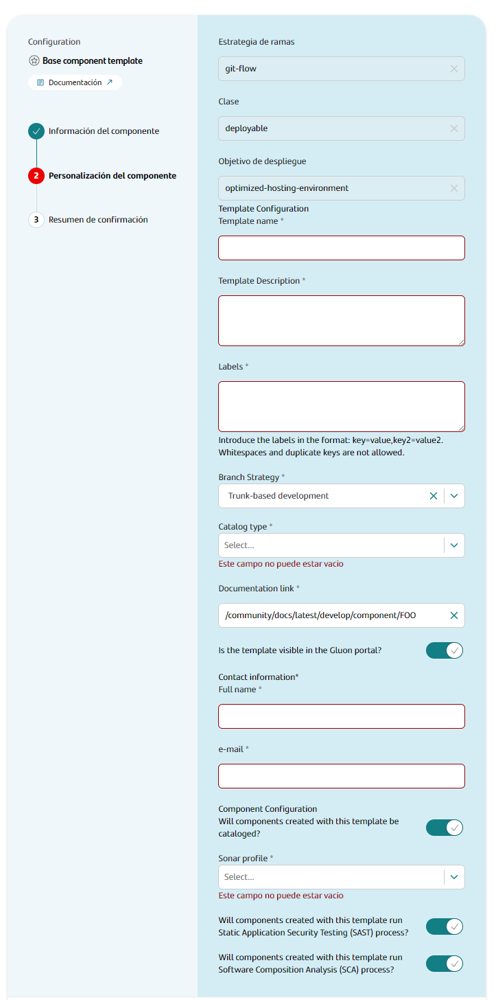

- **presentation-schema.json**: File that describe is used to describe how the Gluon new component form is displayed.
It serves as a configuration file that defines the structure and layout of the form, specifying what fields should be included and how they should be presented to the user.

??? example

    ```json
    {
      "ui:order": [
          "name",
          "description",
          "catalog_type",
          "documentation",
          "visible",
          "catalog",
          "sonar_profile",
          "sast",
          "sca",
          "contact"
      ],
      "name": {
          "ui:options": {
              "inputProps": {
                  "maxLength": 64
              }
          }
      },
      "description": {
          "ui:widget": "textarea",
          "ui:options": {
              "inputProps": {
                  "maxLength": 512
              }
          }
      },
      "documentation": {
          "ui:options": {
              "inputProps": {
                  "maxLength": 128
              }
          }
      },
      "visible": {
          "ui::widget": "check"
      },
      "sonar_profile": {
          "ui:widget": "radio"
      }
    }
    ```
  
  This is a [util link](https://rjsf-team.github.io/react-jsonschema-form/) to validate the data-schema and presentation-schema content file format.

- **setup.sh**: This file has the logic that developers have to define to build the archetype of the application as well as managing the configuration files that have to be included in the project.
The implementation of this logic can be done in various languages and technologies such as Maven archetypes, Cookiecutter, or any scaffolding tool.
The inputs that we can include in our setup.sh will be **repository**, **fortify_project**, **sonar_project_key**, **internal_config_json**, **component_response** and **component_configuration_response**.

??? example

    ```yml
    # Firstly we extract them to a local variable.
    repository=$1
    fortify_project=$2
    sonar_project_key=$3
    internal_config=$4
    component_response=$5
    component_configuration_response=$6

    # We can print them here, in order to check later if everything is right.
    echo repository: $repository
    echo fortify_project: $fortify_project
    echo sonar_project_key: $sonar_project_key
    echo internal_config: $internal_config
    echo component_response: $component_response
    echo component_configuration_response: $component_configuration_response

    # Other interesting step could be to extract some variable from our component_configuration_response variable, such as archetypeVersion, archetypeArtifactId or archetypeGroupId.
    archetypeVersion=$(echo $component_configuration_response | jq -r '.archetypeVersion')
    archetypeArtifactId=$(echo $component_configuration_response | jq -r '.archetypeArtifactId')
    archetypeGroupId=$(echo $component_configuration_response | jq -r '.archetypeGroupId')
    echo archetypeVersion: $archetypeVersion
    echo archetypeArtifactId: $archetypeArtifactId
    echo archetypeGroupId: $archetypeGroupId

    # Also, we can set variables with artifactId, component_short_name or application_short_name
    artifactId=$(basename $repository)
    component_short_name=$(echo $repository | cut -d'/' -f2 | cut -d'-' -f1)
    application_short_name=$(echo $repository | cut -d'/' -f2 | cut -d'-' -f2)
    echo artifactId: $artifactId
    echo component_short_name: $component_short_name
    echo application_short_name: $application_short_name

    # Setting the properties for the project inside of the files that we need, in this example we look for the properties "SONAR_PROJECT_KEY=" and "FORTIFY_PROJECT=", and we replace the blank space before the "=" by the right variable inside the ./.gluon/ci/properties.env file. We could also use and if statement in order to select between 2 variables to replace if needed.
    sed -i "s/^SONAR_PROJECT_KEY=.*/SONAR_PROJECT_KEY=\"$sonar_project_key\"/" "./.gluon/ci/properties.env"
    sed -i "s/^FORTIFY_PROJECT=.*/FORTIFY_PROJECT=\"$fortify_project\"/" "./.gluon/ci/properties.env"

    # In this part of the setup, we can see how the archetype for a maven project is generated, it can be adjusted for our needs.
    echo "Generating the project"

    set -e -x

    echo "Generating archetype for maven-arsenal"

    params="-DarchetypeGroupId="$archetypeGroupId" -Dacronym-app="$application_short_name" -Dcomponent-name="$artifactId" -DarchetypeVersion="$archetypeVersion" -DarchetypeArtifactId="$archetypeArtifactId" -DartifactId="$artifactId" -DgroupId="com.santander.$component_short_name.$application_short_name" "
    echo Params: $params
    command="mvn org.apache.maven.plugins:maven-archetype-plugin:3.2.1:generate -B $params"
    eval $command

    set +e +x
    ```

##### GitHub App in setup.sh

  The scaffolding process has functionality that allows you to handle organization-specific credentials in the setup.sh

  This functionality reads the `alias_github_app` value from the `definition.yml`.
  With this alias_github_app (in the example PREFIX), the automation processes will access the `${PREFIX}_APPLICATION_ID` variable and the `${PREFIX}_APPLICATION_PRIVATE_KEY` secret.
   These variable and secret must previously exist in the organization from which the setup.sh is executed.

  ```yaml
    # component-template/definition.yml
    internal_configuration:
      configuration:
        alias_github_app: "PREFIX"
  ```
  
  - If a GitHub App with that identifier exists and the credentials are correct, it generates a token and exposes it as the `ORG_GITHUB_TOKEN` environment variable in `setup.sh` to customize the scaffolding.
  - If it does not exist, it continues with the default configuration and displays a message, without failing the workflow.

  - **update.sh**: The update.sh script is a shell script located in the repository. It could perform various tasks such as updating
    components, installing dependencies, or any other relevant automation task. Additionally, when `definition.yml` contains
    `alias_github_app`, the update workflow attempts to resolve organization-specific GitHub App credentials (deriving
    `${PREFIX}_APPLICATION_ID` / `${PREFIX}_APPLICATION_PRIVATE_KEY`) and, if successful, exposes an organization token for
    the script as an environment variable. If not present or incomplete, it falls back silently to default credentials without
    failing, then proceeds with version update logic.

This file receives as input the following arguments:

  - **Repository**: GitHub repository "organization/repository" format as argument 1.
  - **Fortify_project**: Fortify project name as argument 2.
  - **Sonar_project_key**: Sonar project key as argument 3.
  - **Internal_config**: Internal configuration defined in the `definition.yml` file as argument 4.
  - **Component_response**: Component content with these values as argument 5.

??? example

    ```json
    {
      "id": 0,
      "created_on": "2024-05-21T12:37:30.099Z",
      "template": {
        "id": 0,
        "name": "string",
        "href": "string",
        "initial_version": {
          "name": "string",
          "href": "string"
        },
        "current_version": {
          "name": "string",
          "href": "string"
        },
        "version": "string"
      },
      "application": 0,
      "name": "string",
      "short_name": "string",
      "description": "string",
      "status": "string",
      "visible": true,
      "source_code_repository": {
        "url": "string",
        "status": "string",
        "href": "string"
      },
      "quality_assurance": {
        "url": "string",
        "status": "string"
      },
      "security_assurance": {
        "url": "string",
        "status": "string"
      },
      "catalog": {
        "url": "https://santandertest.service-now.com/api/now/table/u_cmdb_ci_sw_component/5867df45939e7d50355c36c48aba101a",
        "component_id": "5867df45939e7d50355c36c48aba101a",
        "status": "onboarded"
      }
    }
    ```

- **Component_configuration_response**: Component configuration content in json format as argument 6.

Format example:

??? example

    ```json
    {
      "configuration": {
        "archetype": "@santander/cli@0.0.9",
        "framework": "darwinfrontjs"
      },
      "projectName": "{{company_short_name}}-{{application_short_name}}-{{component_short_name}}",
      "projectType": "angular-darwin-mfe"
    }
    ```

## 4. Publish a Component Template

When the Component Template is developed, you can publish it in the Gluon Portal following next steps:

!!! warning
    Development and preproduction Gluon portal will be accessible only for operational team, but it's required to deploy in those environments to be able to deploy in production.

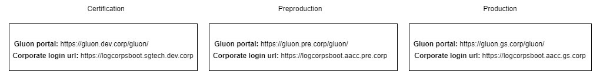

### Deploy to development environment

When a push is made to the "main" branch the component-template-publish workflow is triggered.

!!! info
    It will publish the Component Template in the Gluon development environment Portal, also the workflow creates or regenerates a tag with the semantic component version that is defined in the `definition.yml` file.

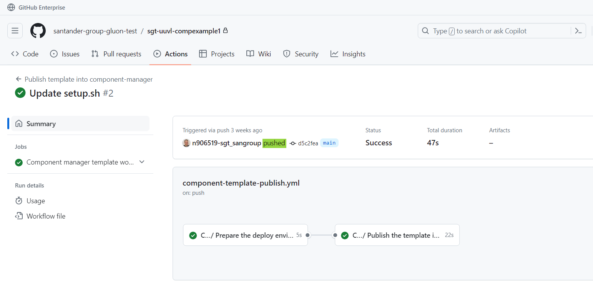

### Deploy to preproduction environment

When a pre-release is published in the Component
Template repository, it will publish the Component Template in the Gluon preproduction environment Portal.

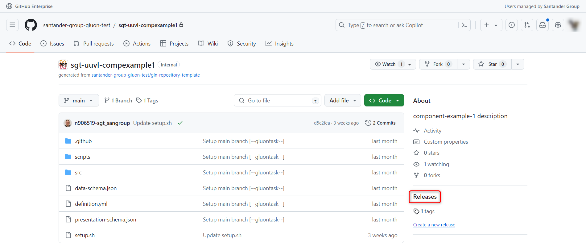

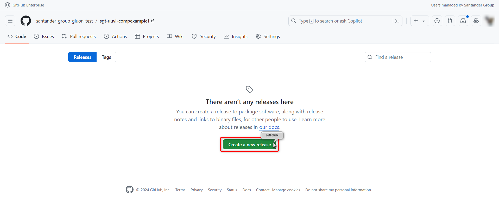

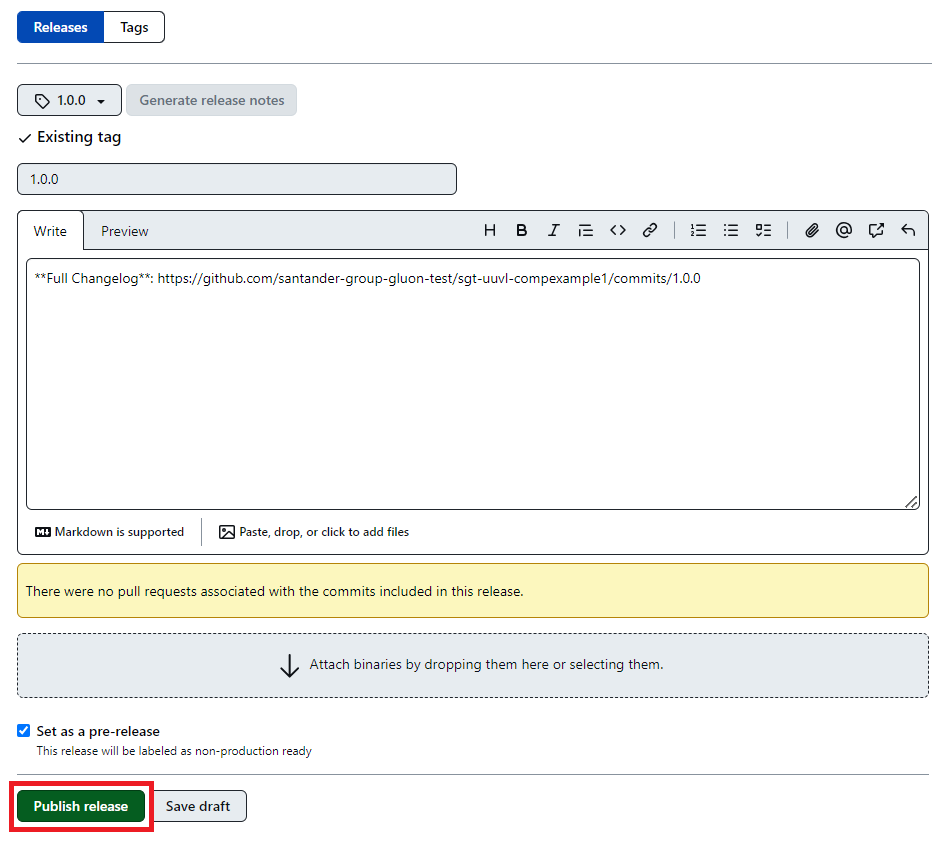

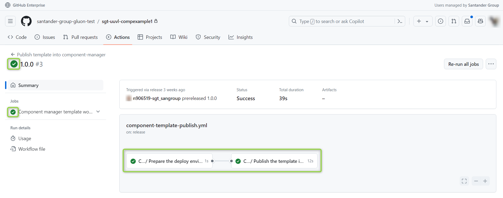

!!! warning
    If the version hasn't been published in the development environment or it was published in the preproduction environment, the workflow will throw an error.

### Deploy to production environment

When a release is published in the Component
Template repository, it will publish the Component Template in the Gluon production environment Portal, the entities shall be responsible for managing the uploading to production.


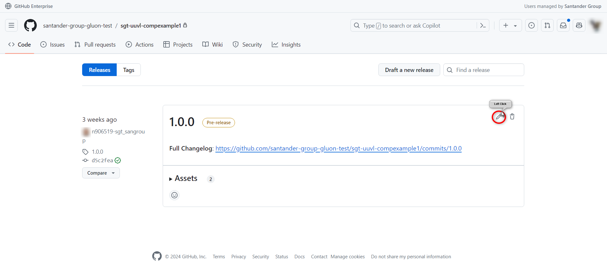

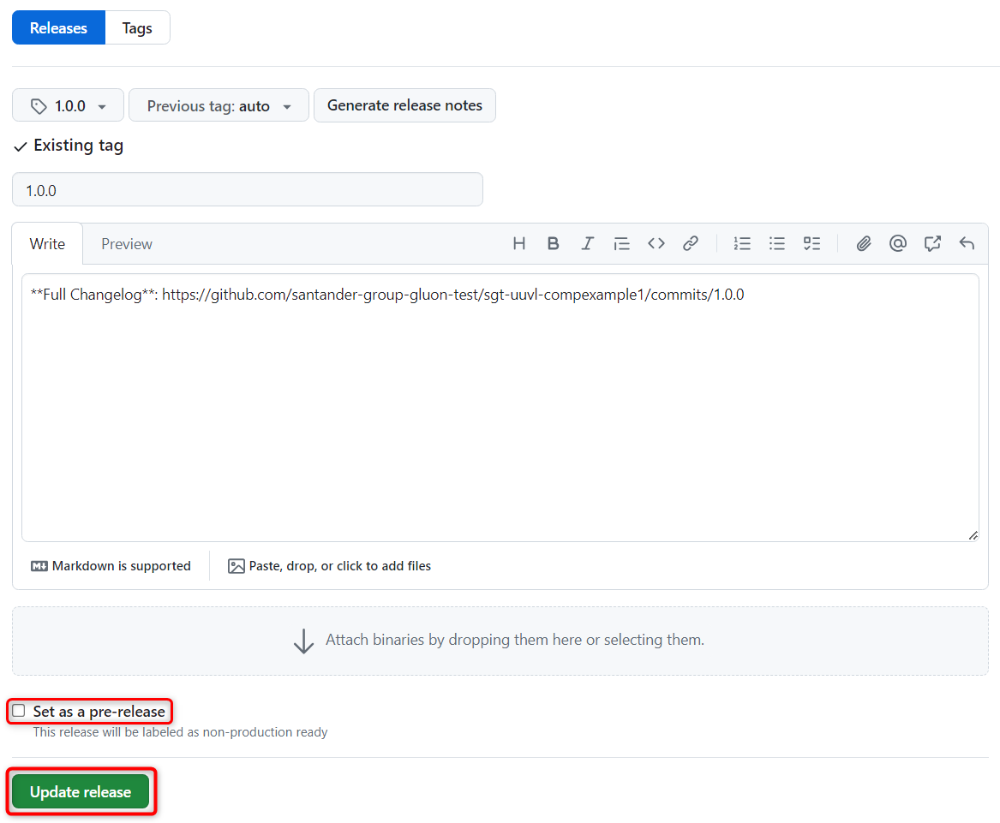

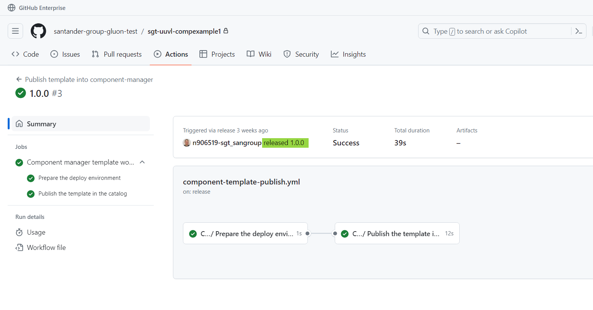

!!! warning
    If the version hasn't been published in the preproduction environment or it was published in the production environment, the workflow will throw an error.

When the Component Template is published in the portal you can create new components based on that template by using it as is described in [this guide](../../application/component-management/create-component.md){:target="_blank"}

When the Component Template is updated in the portal, you can update your component based on that template by using it as is described in [this guide](../../application/component-management/update-component.md){:target="_blank"}
