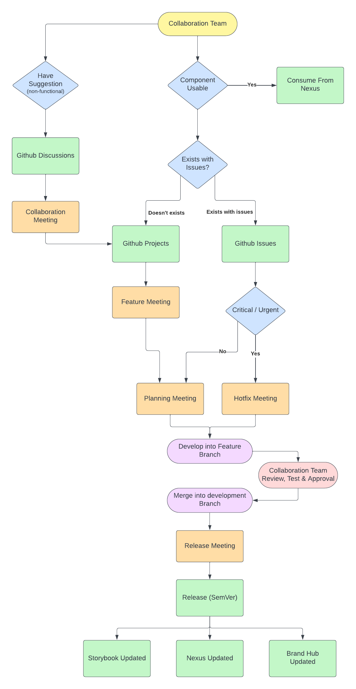

# Collaboration Model

## Overview

Flame DS, an internal source initiative, is managed by the Gluon team. This document defines the roles, processes,
and meetings crucial for a collaborative environment. Our focus is to align the ownership, utilization, and improvement of the Flame implementation across global teams.

## Roles

### Gluon Team

- **Responsibility:** Ensures workflow execution as well as quality and repository integrity.
- **Functions:** Maintains repository, oversees library publication on the Gluon platform, establishes quality benchmarks, and facilitates team integrations.

### Design Team

- **Responsibility:** Serves as the guide for the library's aesthetics.
- **Functions:** Owns the UI component designs for Flame, vital for the final approval in development and release phases.

### Collaboration Team

- **Definition:** Any internal team engaging with the Flame library for usage or enhancement.
- **Requirement:** Each team must designate a 'champion' for representation in strategic meetings.

## Collaborative Workflow

### Meetings

#### **Planning Meeting (Bi-Weekly)**

   - **Participants:** Champions from Collaboration Teams, Gluon, and Design.
   - **Agenda:** Review, Approve and transfer of tickets from backlog to upcoming release iteration.
   - **Outcomes:** New iteration started in Github Projects.

#### **Release Meeting (Bi-Weekly)**

   - **Participants:** As above.
   - **Agenda:** Assess developments against planned objectives, decide on the release viability, and review the latest storybook.
   - **Outcome:** Establish a release date to all Publication Channels, performed by Gluon Team.

#### **Collaboration Meeting (Ad-Hoc)**

   - **Trigger:** Initiated by Collaboration Team champions as needed.
   - **Agenda:** Tackling technical discussions related to the repository/system/publishing.
   - **Outcomes:** Could include GitHub Discussions initiation, issue logging, or ticket creation in GitHub Projects.

#### **Feature Meeting (Ad-Hoc)**

   - **Trigger:** Identified need for new features/components by Collaboration Teams.
   - **Agenda:** Approval of new features by the Design team, facilitated by the Gluon team.
   - **Outcomes:** Ticket creation in GitHub Projects.

#### **Hotfix Meeting (Ad-Hoc)**

   - **Trigger:** Urgent bugs requiring immediate resolution.
   - **Agenda:** Formulation of solutions.
   - **Outcomes:**  Establish a hotfix release date to all Publication Channels, performed by Gluon Team.

## Tools and Platforms

- **GitHub Projects:** Manages team backlog and iteration tracking.
- **GitHub Discussions:** Forum for proposing and deliberating enhancements.
- **GitHub Issues:** Tracks non-urgent bugs for backlog inclusion.

## Publication Channels

1. **Nexus Repositories:** Distributes code.
2. **Design Brand Hub:** Announces updates, publishes changelogs.
3. **Storybook:** Communicates updates to stakeholders.
4. **Flame UI Community:** Announces major updates and events.

