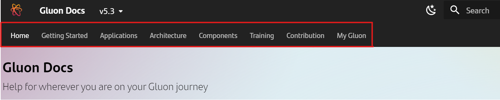
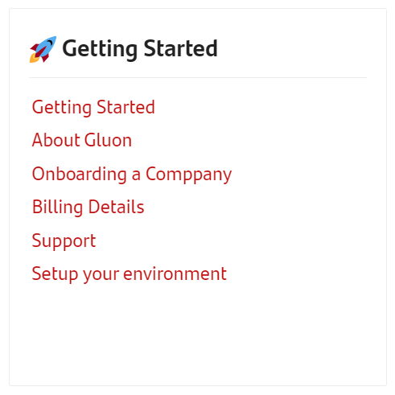
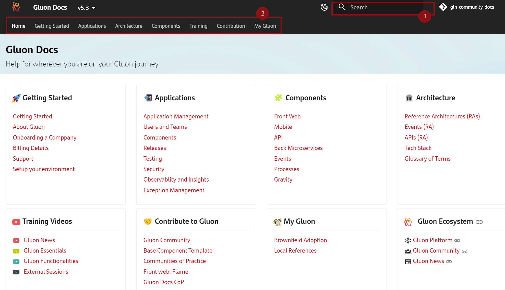
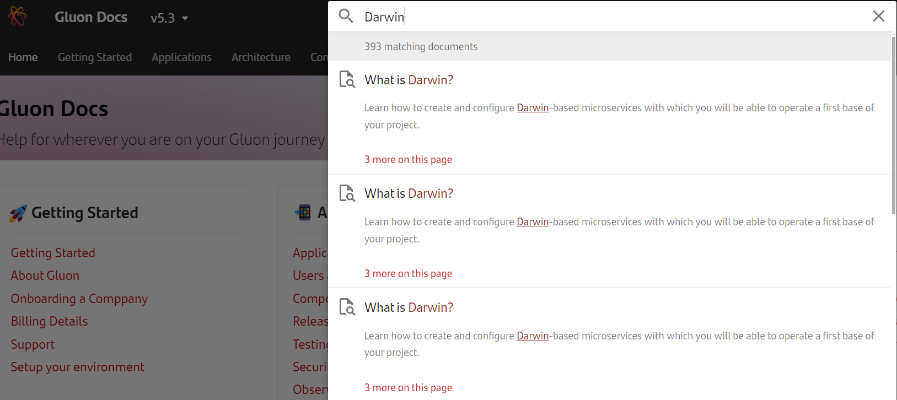
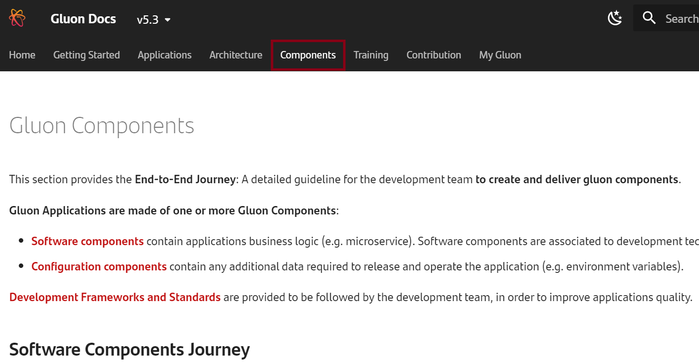

 Gluon Docs Portal hosts Gluon end user related documentation, resources and material required for successfully working with [Gluon](https://gluon.gs.corp/gluon/).

This document provides an overview of Gluon Docs portal.

## Portal Overview

Gluon portal contains the following contents structure, reflected into the **Top Menu**:

   - [**Getting Started**](../../../getting-started/index.md): First steps to start using Gluon.
   - [**Applications**](../../../application/index.md): Information about the services offered by Gluon Platform to create and deliver Gluon Applications Cycle.
   - [**Architecture**](../../../architecture/index.md): Reference architectures, design guidance, and best practices for building, migrating, and managing your Gluon workloads.
   - [**Components**](../../../components/index.md): A detailed guideline for the development team to create and deliver gluon components.
   - [**Training**](../../../training/index.md): Multimedia content about all aspects of Gluon: news, features, third-party technologies...
   - [**Contribution**](../../../contribute/index.md): Dedicated to guiding and encouraging our community members to contribute in various meaningful ways.
   - [**My Gluon**](../../../local/index.md): Component documentation and references created by the entities.

## First Steps

If you're new to Gluon, you can have a look at Gluon [Getting Started section](../../../getting-started/index.md).

{: style="width:350px;" }

### Options for finding contents

Gluon Docs contains a detailed document repository to help developers and other Gluon profiles. This information can be accessed through different ways:

1. Search box
2. Navigating using the Top Menú or links inside the cards

### 1.Search box

Type the term you want to find about and it will display most relevant results

### 2. Site navigation

Starting from the Top menu options or home shortcuts into the section cards, you can discover what Gluon provides.

## Become a contributor

Welcome to the Contributor Community and thank you for your contribution to improve and extend Gluon.

Before starting contributing, please, have a look at our [Code of Conduct](./code-of-conduct.md).

If you're ok with them, let's not wait and enter into [How to Contribute to Gluon Docs](contribution-process/contributor-journey.md).
