Welcome to the Contributor Community and thank you for helping to improve Gluon Docs experience.

Before starting contributing, please, have a look at our [Code of Conduct](../code-of-conduct.md).
 If you're ok with it, let's move on to the next section: [Contribution process overview](#contribution-process-overview).

## Contribution Process Overview

This section represents the different steps of the "Contributor Journey": A step-by-setp guide from the very start of writing to the moment the new document becomes available into Gluon Docs Portal.

### Process short description

1. [**Local Setup:**](#1-local-setup) One time step. Download Gluon Doc project and run it locally.
2. [**Write:**](#2-write) Edit and validate locally.
3. [**Publish:**](#3-publish) Share new documentation with review teams.
4. [**Validate:**](#4-validate) Approval process.
5. [**Integrate:**](#5-integrate) Integrate changes into Gluon Project.
6. [**Release:**](#6-release) Show in production.

### Contribution actors: Roles and responsibilities

- **Contributor**: Is responsible for creating and maintaining their **documentation sections**, as owners. Also to review Pull Requests of the team.
- **Community** Is responsible for the **release management** of Gluon Docs and Gluon Docs evolution.

### Gluon Docs contribution support

Any issue or question, contact **Community Team** through Gluon Docs Community Channel.

[**Subscribe to Gluon Docs community channel**](https://github.com/santander-group-shared-assets/sgt-glncom-glndocsweb/discussions) in order to receive relevant information about **Gluon Docs releases** and critical **updates of the edition process**.
Just that.
On the other hand, this is the place to open topics of interest to share and discuss between Gluon Docs community members. Eventually, working sessions will be planned if required.

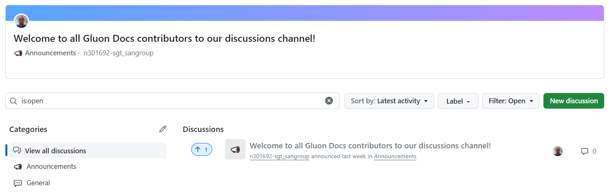

## Contribution process in detail

Gluon Docs is a documentation portal written in [Markdown](https://www.markdownguide.org/getting-started/), a very simple language to create well formatted documents.
 Whatever it's written with Markdown is shown as a web page into Gluon Docs, using [Gluon Docs server](./advanced-topics.md#1-gluon-docs-server-stating-with-mkdocs).

## 1. Local Setup

 In order to start working with Gluon Docs, some basic steps must be taken:

 1. [Access permissions](#11-access-permissions) as Gluon internal writer. External contribution is allowed as well.
 2. [Install Python and NodeJS](#12-install-python-and-nodejs), the framework to run Gluon Docs.
 3. [Clone Gluon Docs](#13-download-gluon-docs-repo) repository into your local workspace.
 4. [Run the server locally](#14-validate-as-you-edit-run-gluon-docs-server-locally), so you can test as you edit.

### 1.1 Access Permissions

Gluon Docs contributors can belong to Gluon Organization or not.

- **Internal contributors** require the following permissions setup:
    - Access to GitHub [Gluon](https://github.com/santander-group-shared-assets) organization.
    - Belong to a Gluon development team.

???+Warning "External contributors"
    If you're not part of Gluon Organization, you can still contribute. Just contact with Gluon Community via [GitHub Issue](https://github.com/santander-group-shared-assets/sgt-glncom-glndocsweb/issues/new){:target="_blank"}.

    The issue fields should follow the following format:

    - **Title**: The title must be “*Request for writing permissions in Gluon Docs*”.
    - **Description**: Listing of the identifiers of the users requesting write permissions.

    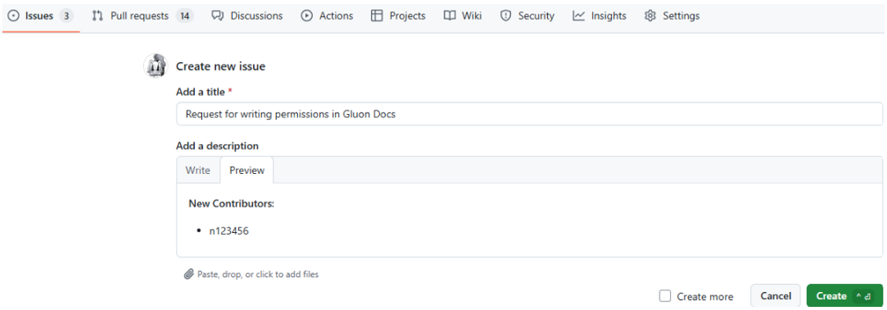

### 1.2 Install Python and NodeJS

Gluon Docs portal runs under Python framework.

??? Info "How to install Python"
    {!
         include-markdown "../../../../getting-started/setup-your-environment/technologies/python.md"
         start="<!--Start Install Python-->"
         end="<!--End Install Python-->"
    !}

??? Info "How to install NodeJS"
    {!
         include-markdown "../../../../getting-started/setup-your-environment/technologies/javascript-node.md"
         start="<!--tutorial-start-->"
         end="<!--tutorial-end-->"
    !}

    > :point_up: **Note:** Always try to install latest available version for any package, unless specified.

### 1.3 Download Gluon Docs Repo

Clone Gluon Docs repository into your local working directory. Choose the way that's better for you. As an example, using any terminal or command prompt:

```bash
git clone --depth=1 https://github.com/santander-group-shared-assets/sgt-glncom-glndocsweb.git
```

The above command downloads just *main* branch, in order to reduce considerably the downloaded size.

To bring a branch that has not been created locally, remember to use the following command:

```bash
git fetch origin branch-name:branch-name
```

???+ tip "Recommendations"
    Gluon Docs has many subsections, so the size of the paths can be a problem when cloning the project. To solve this problem you can modify the Git configuration regarding the size of the paths:

    ```bash
    git config --system core.longpaths true
    ```

### 1.4 Validate as you edit: Run Gluon Docs server locally

Gluon Docs server publishes your document as a web site. To validate as you edit, it is required to start the server in your local machine with your local changes.
There are two ways to start Gluon Docs server:

1. **Using *glu* application**: With glu, there's no need to understand server internals. It is a CLI for Gluon Docs server management.
2. **Native mkdocs server commands**: Mkdocs is the technology behind Gluon Docs server. Using native commands is more complex. Recommended for [advanced usage](./advanced-topics.md#1-gluon-docs-server-stating-with-mkdocs), when behavior needs to be customized.

### 1.4.1 Gluon Docs management with glu

Using glu is very simple, you just need a linux terminal. We recommend Gitbash terminal. You can download from your Software center. It also is provided into Visual Studio Code.

``` bash
# 1.open a session
source ./glu
# a new prompt appears with glu>
```

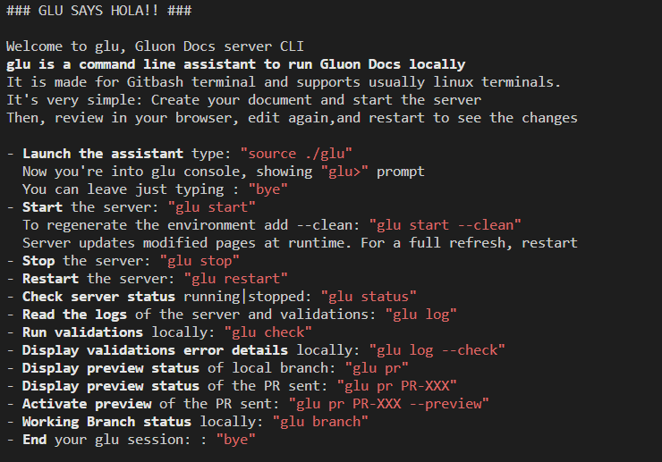

``` bash
# 2. First time to start a server or server clean
glu> glu start --clean

# 3. Server management: glu stop, glu restart, glu status, glu start
# 4. End glu session: bye

glu> bye

# Other options:
# - Read the logs of the server and validations: "glu log"
# - Run validations locally: "glu check"
# - Working Branch status locally: "glu branch"
```

> :memo: **glu check** command requires [npm installation](../../../../getting-started/setup-your-environment/technologies/javascript-node.md#installing-npm).  
>
> :memo: **glu pr** command requires GitHub CLI. Check your Software Center.

Congratulations! You're ready to start writing and validating as you go :).

## 2. Write

Gluon Docs is written in [Markdown](https://www.markdownguide.org/getting-started/), a very simple language to create well formatted documents.
 Whatever it's written with Markdown is shown as a web page into Gluon Docs, using [Gluon Docs server](./advanced-topics.md#1-gluon-docs-server-stating-with-mkdocs).

Gluon Docs pages correspond to markdown files. Gluon Docs server transform these files into web pages (index.md turns into index.html).
As a convention, Markdown file names follow [kebab-case format](./style-guide.md#13-file-and-folder-naming).

Folders can be created to organize complex content and this structure will be reflected into the navigation menus. [Navigation can be customized](./style-guide.md#12-folders-structure) to show, hide or reorder created documents.

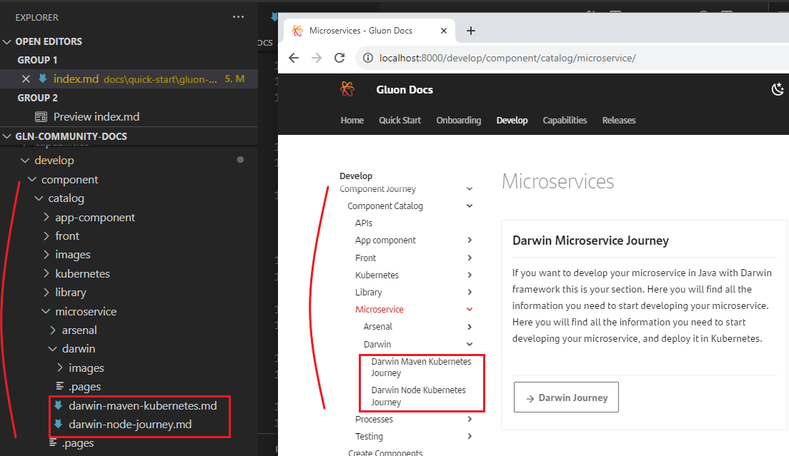

### 2.1 Keep in mind and follow Gluon Docs standard

Fundamental rules are gathered into Gluon Docs Editing [Gluon Docs Editing Standard](./editing-standard.md). Principles to make Gluon Docs easy to read by the final users and to maintain by Gluon contribution community.
 These conventions will be reviewed during validation process. Check it before starting editing.

Any significant update into the standard will be notified into [Gluon Docs community channel](https://github.com/santander-group-shared-assets/sgt-glncom-glndocsweb/discussions).

### 2.1 Choose a good editor

**Visual Studio Code** is the recommended editor. It provides useful tools to easily validate what you're just editing.

- **Page preview**: Just click "Ctrl + Shift + V" on the edit page, it will open into a new Tab and will refresh as you edit.

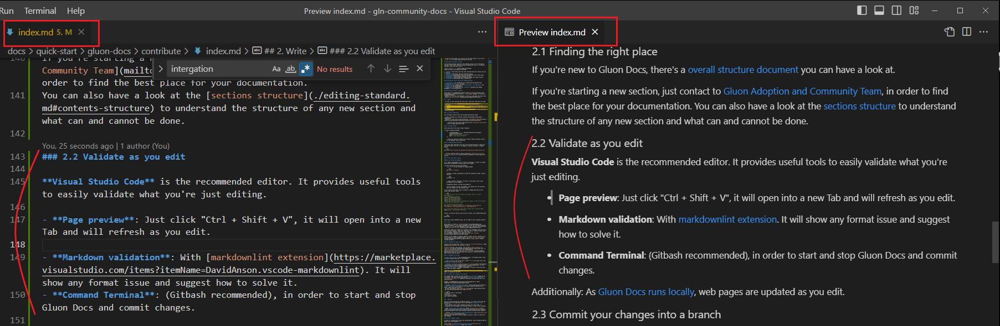

- **Markdown validation**: With [markdownlint extension](https://marketplace.visualstudio.com/items?itemName=DavidAnson.vscode-markdownlint). It will show any format issue and suggest how to solve it.

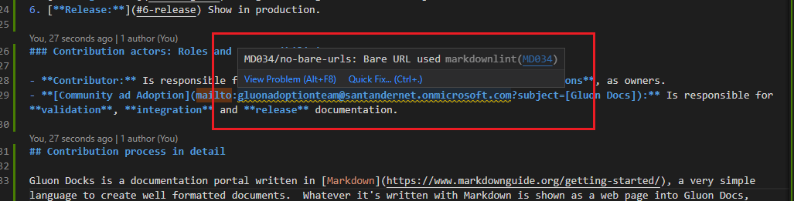

- **Command Terminal**: (Gitbash recommended), in order to start and stop Gluon Docs and commit changes.

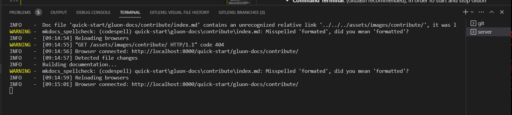

Additionally: As [Gluon Docs runs locally](#14-validate-as-you-edit-run-gluon-docs-server-locally), web pages are updated as you edit.

### 2.2 Finding the right place

If you're new to Gluon Docs, there's a [overall structure document](../about.md) you can have a look at.

If you're starting a new section, just contact to [Gluon Community Team](#gluon-docs-contribution-support), in order to find the best place for your documentation.
You can also have a look at the [sections structure](./style-guide.md#12-folders-structure) to understand the structure of any new section and what can and cannot be done.

### 2.3 Commit your changes into a branch

All changes must be made in a branch created by the contributor that will be published and request to merge into the  main branch when the contribution is ready.

*Branch name format*: *[feat, imp or fix]/GLUON-XXXX-[something-descriptive]*. GLUON-XXX represents the JIRA Issue Id of the delivered item.

- Example: fix/GLUON-XXX-microservices-missing-properties or feat/GLUON-XXX-front-adding-new-deployment-section

> :warning: **Keep your branch up-to-date**: Before publishing the branch, perform a **rebase from main** to keep the edition story clean, right after main history. Don't use git merge to update your branch.
 For more information visit [about git rebase](https://docs.github.com/en/get-started/using-git/about-git-rebase) article.
>
>``` bash
># Update your branch with published contributions
># and keep your document on top
>git pull --rebase origin main
>```

## 3. Publish

Once we're done editing and validating locally, it's time to share the new documentation to be published. This is performed by **opening a Pull Request**.
A Pull Request starts Gluon validation process and, when ready, it integrates the new document into the main branch, in order to be released.

??? Info "Opening a Pull Request detailed process"
    Opening a pull request is performed into github repository site:

    1. Publish your local branch into github repo (git push).
    2. Access to the branch into github repo website.
    3. Into the code tab of your published branch, click into the *Contribute* drop down button and a dialog appears showing *Open Pull request*.
    4. Click on it and the Pull request creation form will open.
    5. Fill in the form ([as detailed below](#31-pull-request-format)) and click on *Create Pull Request*.

    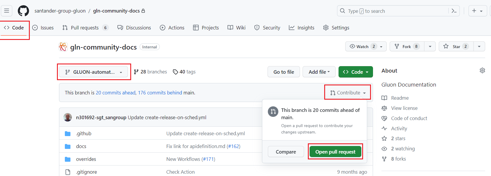

    > :memo: **How-to open Pull Requests** guide: [Creating a pull request](https://docs.github.com/en/pull-requests/collaborating-with-pull-requests/proposing-changes-to-your-work-with-pull-requests/creating-a-pull-request).
    >

### 3.1 Pull request format

In order to validate and release new documentation, some information MUST be added into a Pull Request:

### 3.1.1 Pull Request Title

The title provides information to generate the release notes, to allocate into the corresponding release and more value information.

<!-- markdownlint-disable MD052 -->
**Title Format:** *label(gluon-version):[Section][JIRA_ISSUE] Summary*
<!-- markdownlint-enable MD052 -->
??? Info "Title Format detail"
    - **label**: Helps to prioritize and trace the documentation with Gluon functionality.
         - **feat**: Evolutionary, new doc, with a corresponding Release change in Gluon Docs.
         - **imp**: Improving existing document, not related to any identified issue.
         - **fix**: Resolution of some defect.
         - **dep**: Technical platform dependencies (only Gluoon Docs Platform).

    - **gluon-version**: [current, vx.y.z, unknown]
         - **current**: No need for new Gluon versions.
         - **vX.Y.Z**: If we need a concrete version from Gluon release.
         - **unknown**: Future version, but not defined.

    - **Section**: Capability classification of the document.

    - **Associated task**: 
        - JIRA issue id of the delivered documentation.
        - GitHub issue associated with an ISTM incident.

    - **Summary**: Short and very descriptive in order to be used into release notes.

    Examples:

    - fix(current):[Darwin SpringBoot][GLUON-XXX] Added missing parameter "server" to deployment properties
    - feat(vx.y.z):[Arsenal Front][GLUON-XXX] Added new section "cloud" to support deployment to Public Cloud
    - dep(current):[Mkdocs server][XXXX] Upgrade mkdocs library to x.y.z version

    ???+ Warning "Local references contributions exception"
        There is an **exception for local references** (processes, utilities, and local components), where contributors must indicate the **abbreviation of the entity** owning this local reference in the "section" part of the PR title.

        Example: *feat(current):[****SDS****][GLUON-XXXXX] New local component integrates in Gluon*

### 3.1.2 Pull Request Body

**Body format:** In order to understand the implications of the contribution to the end user, the following information needs to be provided:

??? Info "Body Format detail"
    If it is a feature:

    - **Motivation**: What triggers this new documentation

    Additionally, if it is a fix:

    - **Failing behavior**: From the end user perspective, what failed before the fix.
    - **Right behavior**: From the end user perspective, how does it behave right.

???+ note

    Once created, Pull Request is listed into the [Pull Requests Tab](https://github.com/santander-group-shared-assets/sgt-glncom-glndocsweb/pulls)

## 4. Validate

In order to validate a Pull request, it is required to set as "Ready for Review". This is done clicking the button at the bottom of the Pull Request Page:

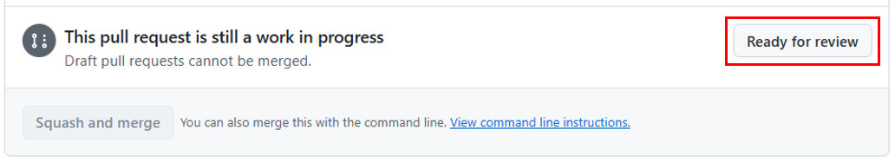

Two processes are automatically launched:

1. Automated Validation
2. Preview publication

### 4.1 Automated Validation

The goal is to keep document consistency. These are the mandatory validations performed:

- **Markdown syntax**: Markdown standard syntax validation.

- **Internal links**: Error if any internal link is broken.

- **English spelling**: Basic spell check of English language.

- **Name file format**: Check if the file name is correctly formatted (kebab-case).

- **PR format**: Check if the PR title and description are [informed](#31-pull-request-format).

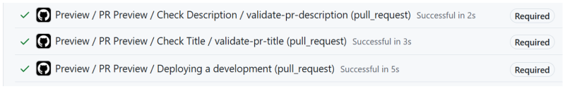

### 4.2 Preview publication

A [Preview Portal](https://gluon.dev.corp/docs/) is provided to facilitate review process with the team. Check into the drop down button if the Pull Request is available, once the automated validation has finished.

 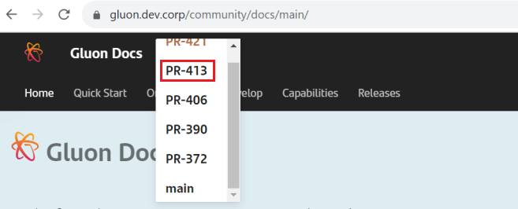

### 4.3 Reviwe and approve

Once the automated validation and review into the web is performed, the reviewer needs to approve the Pull Request:

??? Info "How to approve a PR?"

    **1. Access to the Review page:** 
    
    From the Pull Request Main page, As reviewer a message should be shown on top of the page with a button on the right side of it. Another option, accessing to *Files Changed* tab.

    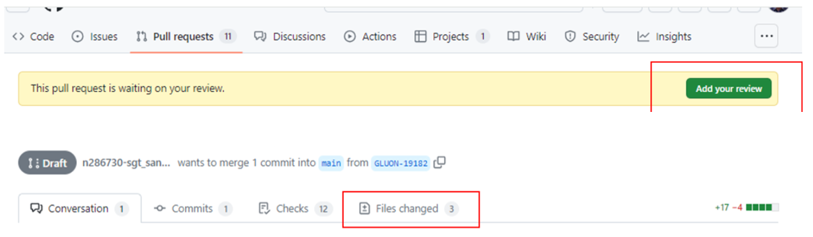 

    **2. Approve the review:**

    Inside the Review page:     
    1. Click on the top right drop-down button "Review Changes".  
    2. Select "Approve".  
    3. Click on "Submit review".  
    
    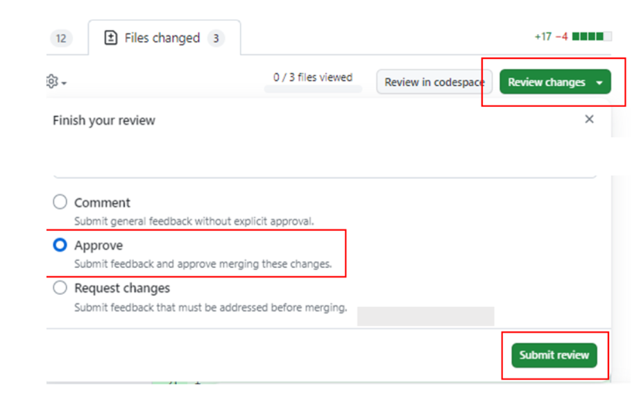 

    Once integrated, the *PR-XXX* will disappear from the selector after a while.

- **Pull Request Editing Standard**: Principles and Rules explained into  [Pull Request Editing Standard](./editing-standard.md).

Defects found into this step will be managed with **Github Conversation Flow**:

- Request Review.
- Comments inside the review.

The contributor gets feedback through GitHub's email notification and accesses to the Pull Request conversation tab.

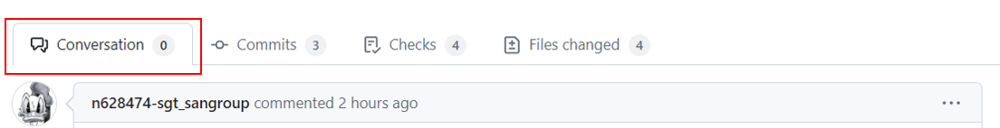

#### Defects management

Any blocking defect found into the Pull request must be resolved before the publication. Later improvements must be managed into the team backlog, following the corresponding way of working.

## 5. Integrate

Once all validations are ready, the new Pull Request is integrated with the *main* branch of Gluon Docs project.

> :warning: Once integrated, the Pull Request is closed and the branch deleted. Any other change requires a new branch and a new pull request.

[Gluon Docs preview main](https://gluon.dev.corp/docs/main/) is updated periodically with the Pull Requests integrated.

## 6. Release

**Frequent releases keep fresh and up-to-date Gluon Docs.** Every new release takes all Pulll Requests that do not have a dependency on future Gluon Platform Releases (Pull Request Title: gluon-version *current*).

The new Gluon Docs Release is deployed to:

- [PRE-Production server](https://gluon.pre.corp/docs/latest/), accessible to Gluon contributors.
- [Production server](../../../../index.md), open to the whole Gluon users community.

### 6.1 Gluon Docs Release types: Improvement and Feature Release

Gluon Docs delivery process has two different flavours, according to the end user impact and aligned with Gluon Product.

**Weekly Release**: Contains every minor evolution or pending document from previous releases.

**Feature Release**: At the end of Gluon Sprints, changes with a significant impact into end user.

### 6.2 Release Process for Improvement and Feature Releases

#### 6.2.1 Improvement Release Process

- **Cadence**: Once a week. **By default, every Thursday**.
- **Release Notes**: [*Gluon Docs Changelog*](https://github.com/santander-group-shared-assets/sgt-glncom-glndocsweb/releases)
- **Validation process**: [Pull Request validation](#4-validate) process plus Deploy validations
- **Release Milestones**:

|Monday | Tuesday | Wednesday | Thursday | Friday |
| :---------------------: | :-----------------------: | :-----------------------: | :-----------------------: | :-----------------------: |
|  |  | Release to PRE [noon]    | Release to PRO [morning] |                          |

- **Release to PRE**:

    - Release Generation
    - Release Notes Generation
    - Deploy to PRE & validation
    - [Communication](#63-release-communication) to Stakeholders

- **Release to PRO**:

    - Deploy to PROD & shakedown
    - [Communication](#63-release-communication) to Stakeholders
    - Release close

#### 6.2.2 Feature Release Process

Feature Release Process is aligned with Gluon Release process. Schedule depends on Gluon Release definition, and is defined into Gluon Release Plan.

- **Cadence**: At the end of every Gluon Sprint.
- **Release Notes**: [Gluon Releases](../../../../changelog/index.md)
- **Validation process**:

    - Gluon Fix Release
    - Additional performed by Gluon Product UAT

- **Release Milestones**:

    - Following Gluon Releases Process.

### 6.3 Release communication

Every Gluon Docs release will be reported into [**Gluon Docs community channel**](https://github.com/santander-group-shared-assets/sgt-glncom-glndocsweb/discussions).
 Subscribe in order to receive relevant information about **Gluon Docs releases** and critical **updates of the edition process**. Just that.
 As a contributor, that is the place to share your Gluon Docs topics of interest for discussion with the contributors community.

Gluon Docs Release Stakeholders:

- Gluon Community Team
- Gluon Adoption
- Release Management
- Gluon Docs contributors

Remember, any issues or questions, contact directly to [Community Team](#gluon-docs-contribution-support) members. We're more than happy to help.
