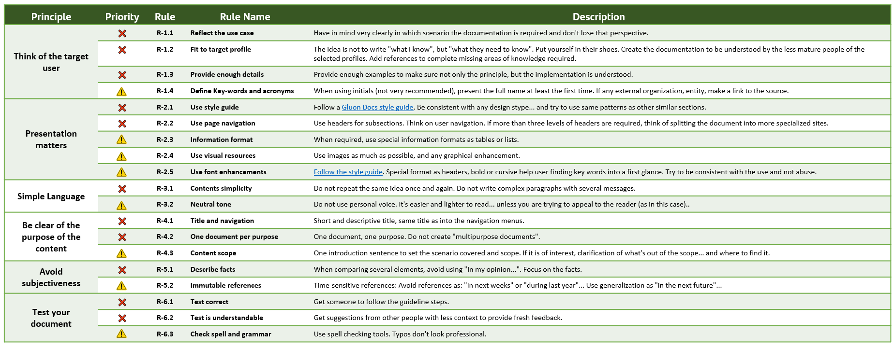

The **main motivation** behind Gluon Docs Editing Standard is to **maximize success as Gluon first line of support**. In other words: The easier for an user to find an explanation,
 the happier the user is and the cheaper for the Gluon Team is.

This document is proposed for any member of Gluon Docs Contribution Community, and provides two guideline of:

- **Principles and Rules:** To set a common understanding of *what, why and how* should be the document written. Each rule has a priority:
    - **Blocker [:x:]:** Document cannot be published until the defect is solved.
    - **Not blocker [:warning:]:** Depending on the amount of violations, solving the defect might not stop the process.

- **Check list:** Check list that can be followed into validation process.

In order to make this document easier to follow, each section starts with a summary of the principles that are reviewed in detail right after.

## Editing Standard Principles

Gluon Docs is a Technical Documentation portal. Its goal is to provide a guide of "how-to" perform the technical activities of Gluon Platform users. And this guide has to be easy to find, read and understand, at least for the target user profiles.

**Principle 1: Think of the target user:** Always keep in mind what the target user needs. Try to cover as much as possible of the "persona" motivation and needings with the article. Don't make optimistic assumptions. [Click for details...](#1-think-of-the-target-user)

**Principle 2: Presentation matters:**  The goal is to make easy and to engage the end user. When talking about communication, the "how" matters as much as the "what". Presentation as simple as possible. Don't overdocument. Be consistent with the style.
 [Click for details...](#2-presentation-matters)

**Principle 3: Simple language:** Technical documents are positive and direct. They just need to describe a process objectively. This is why plain language is the best option. Don't overcomplicate with chained sentences. One sentence, one idea.
 [Click for details...](#3-simple-language)

**Principle 4: Be clear of the purpose of the content:** Outlining what your writing will cover at the early stages of your content ensures readers understand exactly what to expect from your offering.
 This is important to setting and fulfilling expectations and clarity.
 [Click for details...](#4-be-clear-of-the-purpose-of-the-content)

**Principle 5: Avoid subjectiveness:** Technical documentation is objective, so avoid personal references. Time as well, references to the past and future used to fail over time. Make your document "future-resistant".
 [Click for details...](#5-avoid-subjectiveness)

**Principle 6: Test your document:** Document creation is not finished once written. In order to ensure the guide is correct and understandable, a test with a user of a profile as similar as the target is, must follow it and provide feedback.
  [Click for details...](#6-test-your-document)

 

### Principles and Rules - ONE PAGE

 

## Editing Standard Principles and Rules detailed

### 1. Think of the target user

Gluon users can be of multiple profiles: Developers of any of the technologies supported, operations, quality, release, product, support... each of them will open Gluon Docs as first place to find answers about how-to proceed. Some principles to apply.

Principle Rules:

| Priority  | Rule  | Rule Name | Description |
| --------  | ----- | -------------------- | ----------------------------------------------------------- |
| :x:       | **R-1.1** | **Reflect the use case** |Have in mind very clearly in which scenario the documentation is required and don't lose that perspective.|
| :x:       | **R-1.2** | **Fit to target profile** | The idea is not to write "what I know", but "what they need to know". Put yourself in their shoes. Create the documentation to be understood by the less mature people of the selected profiles. Add references to complete missing areas of knowledge required. |
| :x:       | **R-1.3** | **Provide enough details** | Provide enough examples to make sure not only the principle, but the implementation is understood. |
| :warning: | **R-1.4** | **Define Key-words and acronyms** | When using initials (not very recommended), present the full name at least the first time. If any external organization, entity, make a link to the source. |

[Back to the list](#editing-standard-principles)

### 2. Presentation matters

It’s often very difficult to develop engagement with an audience when the subject matter is somewhat complex. So with this in mind, it’s worth considering how your audience would like to engage with the information you have to share.

Principle Rules:

| Priority  | Rule  | Rule Name | Description |
| --------  | ----- | -------------------- | ----------------------------------------------------------- |
| :x:       | **R-2.1** | **Use style guide** | Follow a [Gluon Docs style guide](./style-guide.md). Be consistent with any design stype... and try to use same patterns as other similar sections. |
| :x:       | **R-2.2** | **Use page navigation** | Use headers for subsections. Think on user navigation. If more than three levels of headers are required, think of splitting the document into more specialized sites. |
| :warning: | **R-2.3** | **Information format** | When required, use special information formats as tables or lists. |
| :warning: | **R-2.4** | **Use visual resources** |Use images as much as possible, and any graphical enhancement. |
| :warning: | **R-2.5** | **Use font enhancements** | [Follow the style guide](./style-guide.md#32-font-style). Special format as headers, bold or cursive help user finding key words into a first glance. Try to be consistent with the use and not abuse. |

[Back to the list](#editing-standard-principles)

### 3 Simple language

Keep in mind the reader may not be all that familiar with the subject in question. The lower the barrier to access to the information, the better for all involved. The shortest and simplest way to explain something complicated is often the best.

Principle Rules:

| Priority  | Rule  | Rule Name | Description |
| --------  | ----- | -------------------- | ----------------------------------------------------------- |
| :x:       | **R-3.1** | **Contents simplicity** | Do not repeat the same idea once and again. Do not write complex paragraphs with several messages. |
| :warning: | **R-3.2** | **Neutral tone** |Do not use personal voice. It's easier and lighter to read... unless you are trying to appeal to the reader (as in this case).. |

[Back to the list](#editing-standard-principles)

### 4. Be clear of the purpose of the content

You don’t want to waste your reader’s time and if they are looking for a particular piece of information, providing a summary of what you are covering at the start will help them find exactly what they are looking for.
 Good technical writing gives the reader what they want, when they want it.

Principle Rules:

| Priority  | Rule  | Rule Name | Description |
| --------  | ----- | -------------------- | ----------------------------------------------------------- |
| :x:       | **R-4.1** | **Title and navigation** | Short and descriptive title, same title as into the navigation menus. |
| :x:       | **R-4.2** | **One document per purpose** | One document, one purpose. Do not create "multipurpose documents". |
| :warning: | **R-4.3** | **Content scope** | One introduction sentence to set the scenario covered and scope. If it is of interest, clarification of what's out of the scope... and where to find it. |

[Back to the list](#editing-standard-principles)

### 5. Avoid subjectiveness

It does not look professional to add references that are subjected to a changing concept, as an opinion or time.

Principle Rules:

| Priority  | Rule  | Rule Name | Description |
| --------  | ----- | -------------------- | ----------------------------------------------------------- |
| :x:       | **R-5.1** | **Describe facts** | When comparing several elements, avoid using "In my opinion...". Focus on the facts. |
| :warning: | **R-5.2** | **Immutable references** | Time-sensitive references: Avoid references as: "In next weeks" or "during last year"... Use generalization as "in the next future"... |

[Back to the list](#editing-standard-principles)

### 6. Test your document

Any document should tested in order to checking for any errors, inconsistencies, or gaps. Also to check if the message is understandable. Four eyes is a MUST.

Principle Rules:

| Priority  | Rule  | Rule Name | Description |
| --------  | ----- | -------------------- | ----------------------------------------------------------- |
| :x:       | **R-6.1** | **Test correct** | Get someone to follow the guideline steps. |
| :x:       | **R-6.2** | **Test is understandable** | Get suggestions from other people with less context to provide fresh feedback. |
| :warning: | **R-6.3** | **Check spell and grammar** | Use spell checking tools. Typos don't look professional. |

[Back to the list](#editing-standard-principles)

## 2. Editing Check List Example

**Target user:**

- [ ] Reflects the use case
- [ ] Enough technical detail and formal detail.

**Format tips:**

- [ ] Style guide has been followed consistently.
- [ ] All documents are reachable through the navigation menu.
- [ ] Easy to read, images with quality, special format, font enhancements...
- [ ] Title and Summary: Short and descriptive.
- [ ] Table of Contents (ToC) with max of 4 levels (except for sections index).

**Contents:**

- [ ] No multicontent pages.
- [ ] Index sites provide expected information: Context and useful links.
- [ ] Internal and external references (links, images, documents) work.

**Validation and Verification:**

- [ ] Four eyes.
- [ ] Guides: The guide has been followed.
