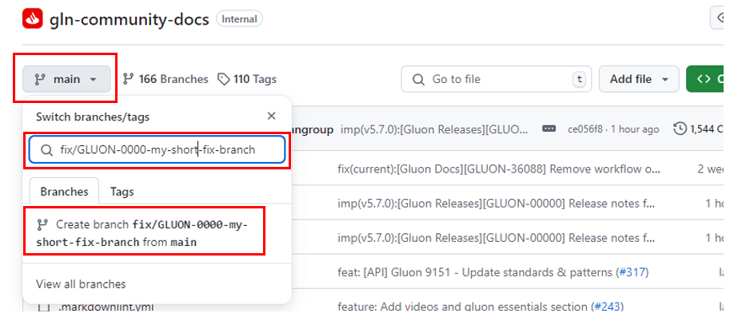
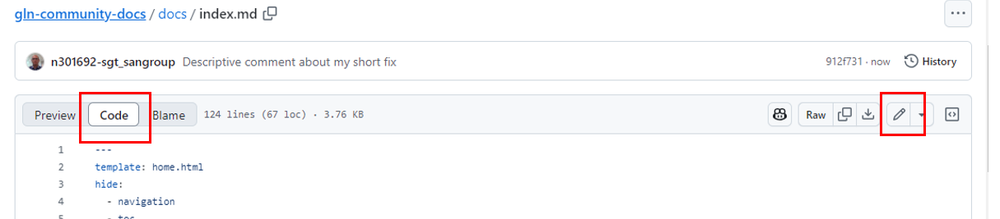
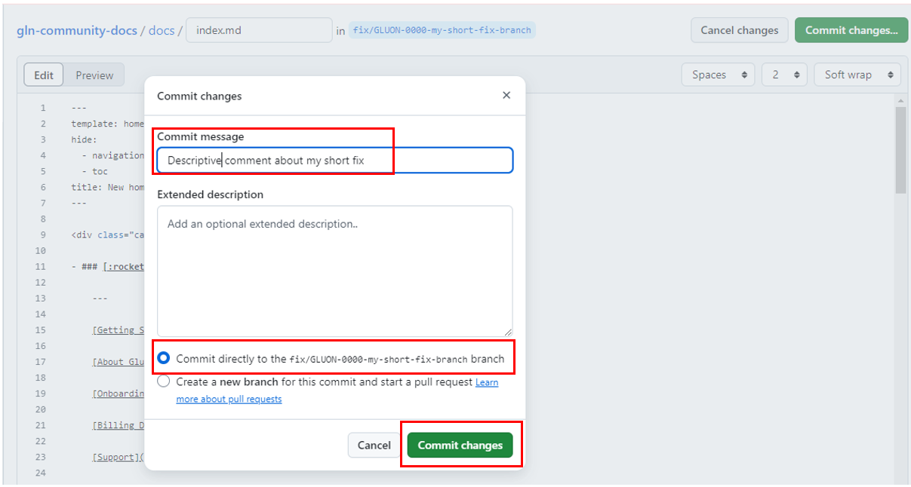

This guide provides a fast path to edit Gluon Docs and publish a Pull Request (PR) in preview. Two options are offered for a quick start:

1. [**Using the web browser:**](#option-1-using-the-web-browser) All steps with the browser. Ideal for short fixes.
2. [**Start with a minimal local setup:**](#option-2-minimal-local-setup) Can be a fast starting exercise for users with some technical background.

It assumes the contributor has [permissions to contribute](./contributor-journey.md#11-access-permissions).

## Option 1: Using the web browser

This option can be useful in case of very short fixes. It is really fast to perform, as no local other tool setup is required.

### Step 1: Create a new branch

#### 1. Open Gluon docs repo

Open [Gluon Docs repo home](https://github.com/santander-group-shared-assets/sgt-glncom-glndocsweb) into our browser.

#### 2. Create a new branch

The branch is created from main branch, as shown in the picture below.

{: style="width:70%"}

### Step 2: Edit files and commit to the new branch

#### 1. Select file

Navigate to the file to edit and click into the *edit* icon :octicons-pencil-24: in the top right corner. The markdown file appear as *Preview*, but there's also the *Code* option to access to the code.

{: style="width:70%"}

#### 2. Edit and commit changes

Perform the required changes into the file code. Click on *Commit changes* button in the top right corner to save changes. Check that the branch selected is the one created.

{: style="width:50%"}

#### 3. Repeat

Repeat this step with all files impacted with the change.

### Step 3: Open and preview a Pull Request

#### 1. Create Pull Request

Navigate to [Gluon Docs repo home](https://github.com/santander-group-shared-assets/sgt-glncom-glndocsweb) and select your newly created branch. Click on *Contribute* button and [open a Pull Request](./contributor-journey.md#3-publish).

#### 2. Validate Pull Request

Follow the [validation process](./contributor-journey.md#4-validate) to integrate the Pull Request.

If the Build process of the Pull Request is successful preview will be available at `https://gluon.dev.corp/community/docs/PR-<PR_NUMBER>/`.

## Option 2: Minimal local setup

This option assumes the contributor has [Python installed](../../../../getting-started/setup-your-environment/technologies/python.md).

### Step 1: Download Gluon Repo and launch Gluon Docs

#### 1. Download Gluon Docs repo

Using your favourite git client, or into terminal:

``` sh
    git clone --depth=1 https://github.com/santander-group-shared-assets/sgt-glncom-glndocsweb.git
```

#### 2. Launch Gluon Docs

Using GitBash terminal, inside the project root path

``` sh
    # Setup Gluon Docs environment
    source ./glu
    # Start Gluon Docs
    glu start
```

Once started, in a browser, open the local `http://localhost:8000/`. Gluon Docs updates your changes as you write them.

### Step 2: Create a Branch and Make Changes

#### 1. Create your local branch

Using your favourite git client, or into terminal:

``` sh
git checkout -b feat/GLUON-XXXX-description
```

#### 2. Make your changes and upload to GitHub

Once your changes are completed, using your favourite git client, or into terminal, commit all of them:

``` sh
git add docs/<path>
git commit -m "Description of changes"
git push origin feat/GLUON-XXXX-description
```

### Step 3: Open a Pull Request and preview

#### 1. Create Pull Request

Navigate to [Gluon Docs repo home](https://github.com/santander-group-shared-assets/sgt-glncom-glndocsweb) and select your newly created branch. Click on *Contribute* button and [open a Pull Request](./contributor-journey.md#3-publish).

#### 2. Validate Pull Request

Follow the [validation process](./contributor-journey.md#4-validate) to integrate the Pull Request.

If the Build process of the Pull Request is successful preview will be available at `https://gluon.dev.corp/community/docs/PR-<PR_NUMBER>/`.
