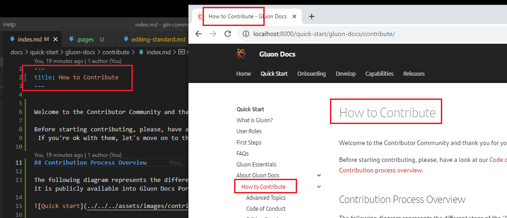
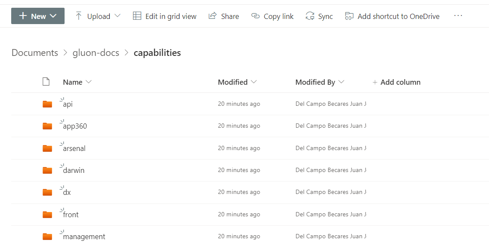
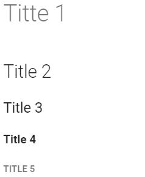

The purpose of this document is to provide a design guidance to structure the documents and format style utilities based on [Material for Mkdocs](https://squidfunk.github.io/mkdocs-material/reference/).

---

## 1. Gluon Docs structure basics

### 1.1 One good page title

Think of the best title: Short, descriptive and  powerful.

Write the title into the *Page header*. Avoid repetitions or inconsistencies writing in other places as first H1 of the page.



### 1.2 Folders structure

Teams basically contribute adding contents to the following two main sections:

- **Capabilities**: Technical documentation related to Gluon supported frameworks, libraries and resources Gluon components are made of. It  is organised according to the teams that are contributing to Gluon Docs.

??? Info "Capabilities folder structure"
    ``` bash
    docs
    ├── capabilities
    |    ├──[technology-folder]
    │         ├── images
    │         ├── folder-1
    │               └── .pages
    │               └── index.md
    │               └── file-1-1.md
    │         └── .pages
    │         └── index.md

    ```

- **Develop**: This section contains the "Developer Journey" documents: A detailed step-by-step guide for a user to create, run, integrate and deploy a component using Gluon.

??? Info "Develop folder structure"
    ``` bash
    docs
    ├── develop
    |    ├──catalog
    |        ├──type-component-folder
    |            ├──component-folder
    │                ├── images
    │                └── component.md

    ```

> :warning: **New technology folders** MUST be notified to the [Gluon Community](https://github.com/orgs/santander-group-shared-assets/teams/community) team for further assessment.

:white_check_mark: Actions allowed:

- **Customize navigation**: With *.pages* files inside any subfolder.
- **Create folders**: as *images*, in order to organize folder components.

:x: Actions forbidden:

- **Modify outside the section** designated to the technology. If needed, ask Community team.
- **Miss the structure** place different contents than expected inside folders, as *images*.
- **Too many levels**: Too many folder levels lead to a bad navigation experience.

### 1.3 File and folder naming

- **Descriptive name** that clearly identifies the folder, file or image being referred to.
- **Kebab-case** naming format for any folder or file. In a nuthsell, [kebab-case](https://www.theserverside.com/definition/Kebab-case) low case letters and "-" as separators.
- *README* file name is **restricted** to README.md repo file.
- **Default page name** into any section or subsection is *index.md*.

<!-- ### 1.4 "Under construction" pages

Try to avoid using "Under construction" sections. If really needed, use the following line of code:

```bash
## ==:construction:UNDER CONSTRUCTION:construction:==
```

The visualisation of which is as follows:

**:construction:UNDER CONSTRUCTION:construction:** -->

---

## 2. Page Contents Palette

### 2.1 HTML contents

As a general rule, try to use as much as possible markdown. The reason is that Gluon Docs will use markdown to indezz and provide more value to the information.
 HTML will be shown by Markdown, but not interpreted. Almost all html elements have a similar alternative in markdown.

### 2.2 Video contents

**Site to store**: Gluon Docs does not store rich and heavy multimedia contents, as videos. A storage space has been created: [Gluon Docs file site](https://santandernet.sharepoint.com/:f:/r/sites/gluoncommunity103/Shared%20Documents/gluon-docs/capabilities?csf=1&web=1&e=7IsAxx){:target="_blank"}.
Find your section and upload your video. Each section lead has edition permissions ever the section.



**Video display format**: Into the document, use an iframe (html) to display the video player. An example:

<iframe src="https://santandernet.sharepoint.com/sites/gluoncommunity103/_layouts/15/embed.aspx?UniqueId=9c225f62-c904-4122-aaa6-8e6136b2ab75&embed=%7B%22ust%22%3Atrue%2C%22hv%22%3A%22CopyEmbedCode%22%7D&referrer=StreamWebApp&referrerScenario=EmbedDialog.Create""
width="300"  frameborder="0" scrolling="no" allowfullscreen title="Onboarding Process & Gluon Roles"></iframe>

Code associated to this video content:

```html
    <iframe src="https://santandernet.sharepoint.com/sites/gluoncommunity103/_layouts/15/embed.aspx?UniqueId=9c225f62-c904-4122-aaa6-8e6136b2ab75&embed=%7B%22ust%22%3Atrue%2C%22hv%22%3A%22CopyEmbedCode%22%7D&referrer=StreamWebApp&referrerScenario=EmbedDialog.Create""
    width="300"  frameborder="0" scrolling="no" allowfullscreen title="Onboarding Process & Gluon Roles"></iframe>

```

### 2.3 Images

- **Folder**: Images are stored into "/images" folder, into the section they belong to.
- **Quality**: Use good quality images. Try to simplify and crop the image to show only what is meant.
- **Name**: [Kebab-case](#13-file-and-folder-naming) format. Name structure "section-action-nr". For example: contribution-standard-image-1.png
- **Link**: Always relative to the page
- **Style enhancements**: Some css style enhancements are allowed with markdown.

```bash
# css style elements can be inserted to customize the image
{: style="height:190px"}
```

### 2.4 Internal links

- Use relative lints to the path
- Use the link to the original file, not to the transformed web page.

Example:

```bash
# The following code is rendered below
[This is an example of an internal link to contribute page](../contribution-process/index.md)
```

And this is how it is build into Gluon Docs: [This is an example of an internal link to contribute page](../contribution-process/index.md)

### 2.5 Contents to download

Gluon Docs is not a platform to store contents to be downloaded. This means, do not upload heavy files into Gluon Docs repository.

If required, the same sharepoint site as for video will be used.

---

## 3. Material for Mkdocs utilities

In this section you will find examples of features that you can use to visually enhance your documentation.

### 3.1 Types of titles

A title must always be preceded by the "#" symbol. To change the style and size, simply repeat the use of the "#" symbol.

{ align=left }

=== "Markdown titles"

    ```
    # Title 1

    ## Title 2

    ### Title 3

    #### Title 4

    ##### Title 5
    ```

<br>
<br>

---

### 3.2 Font style

When to use "Font enhancements"

- **Headers**: As section or subsection title
- **Bold**: Key words to highlight the message or information labels(followed by colon :). Do not use instead of a Heading.
- ***Cursive***: Special words.
- **Underline**: Keep this format for links.
- **Capital letters**: Do not use for emphasys, only for achronyms.
- **Quotations**: Mention to other titles, literal expressions.

**Bold style:**

Using " ** " between the words you want:

    ```
    **Lorem ipsum dolor sit amet, consectetur adipiscing elit.**
    ```
*Italic:*

Using " * " between the words you want:

     ```
    *Lorem ipsum dolor sit amet, consectetur adipiscing elit.*
    ```
---

### 3.3 Admonitions

Here you can see the different types of warnings you can use. Remember that by adding the "+" symbol you can make them drop-down.

???+ note

    Lorem ipsum dolor sit amet, consectetur adipiscing elit. Nulla et euismod
    nulla. Curabitur feugiat, tortor non consequat finibus, justo purus auctor
    massa, nec semper lorem quam in massa.

???+ abstract

    Lorem ipsum dolor sit amet, consectetur adipiscing elit. Nulla et euismod
    nulla. Curabitur feugiat, tortor non consequat finibus, justo purus auctor
    massa, nec semper lorem quam in massa.

???+ info

    Lorem ipsum dolor sit amet, consectetur adipiscing elit. Nulla et euismod
    nulla. Curabitur feugiat, tortor non consequat finibus, justo purus auctor
    massa, nec semper lorem quam in massa.

???+ tip

    Lorem ipsum dolor sit amet, consectetur adipiscing elit. Nulla et euismod
    nulla. Curabitur feugiat, tortor non consequat finibus, justo purus auctor
    massa, nec semper lorem quam in massa.

???+ success

    Lorem ipsum dolor sit amet, consectetur adipiscing elit. Nulla et euismod
    nulla. Curabitur feugiat, tortor non consequat finibus, justo purus auctor
    massa, nec semper lorem quam in massa.

???+ question

    Lorem ipsum dolor sit amet, consectetur adipiscing elit. Nulla et euismod
    nulla. Curabitur feugiat, tortor non consequat finibus, justo purus auctor
    massa, nec semper lorem quam in massa.

???+ warning

    Lorem ipsum dolor sit amet, consectetur adipiscing elit. Nulla et euismod
    nulla. Curabitur feugiat, tortor non consequat finibus, justo purus auctor
    massa, nec semper lorem quam in massa.

???+ failure

    Lorem ipsum dolor sit amet, consectetur adipiscing elit. Nulla et euismod
    nulla. Curabitur feugiat, tortor non consequat finibus, justo purus auctor
    massa, nec semper lorem quam in massa.

???+ danger

    Lorem ipsum dolor sit amet, consectetur adipiscing elit. Nulla et euismod
    nulla. Curabitur feugiat, tortor non consequat finibus, justo purus auctor
    massa, nec semper lorem quam in massa.

???+ bug

    Lorem ipsum dolor sit amet, consectetur adipiscing elit. Nulla et euismod
    nulla. Curabitur feugiat, tortor non consequat finibus, justo purus auctor
    massa, nec semper lorem quam in massa.

???+ example

    Lorem ipsum dolor sit amet, consectetur adipiscing elit. Nulla et euismod
    nulla. Curabitur feugiat, tortor non consequat finibus, justo purus auctor
    massa, nec semper lorem quam in massa.

???+ quote

    Lorem ipsum dolor sit amet, consectetur adipiscing elit. Nulla et euismod
    nulla. Curabitur feugiat, tortor non consequat finibus, justo purus auctor
    massa, nec semper lorem quam in massa.

---

### 3.3 Cards

You can create cards to improve the structure of your content and improve the visualization of your site.

**Simple Cards:**

<div class="cards row-auto" markdown>

- :simple-html5: **HTML** for content and structure

- :simple-javascript: **HTML** for content and structure

</div>

<div class="cards row-auto" markdown>

- :simple-css3: **HTML** for content and structure

- :simple-angular: **HTML** for content and structure

</div>

<br>

**Complex Cards:**

<div class="cards row-auto" markdown>

- **Start here**

    ---
    [About first steps](#33-cards)

    Not familiar with ...? Here we can help you with your first steps.

    ---

    [Start Guide](#33-cards){ .md-button }

- **Popular**

    ---
    Here you can view the most [popular content](#33-cards).

    ---
    **What's new**

    ---

    Here you can check our last updates: [Changelog](#33-cards).

</div>

---

### 3.4 Lists

=== "Unordered list"

    * Sed sagittis eleifend rutrum
    * Donec vitae suscipit est
    * Nulla tempor lobortis orci

=== "Ordered list"

    1. Sed sagittis eleifend rutrum
    2. Donec vitae suscipit est
    3. Nulla tempor lobortis orci

=== "Task lists"

    - [x] Lorem ipsum dolor sit amet, consectetur adipiscing elit
    - [ ] Vestibulum convallis sit amet nisi a tincidunt
        * [x] In hac habitasse platea dictumst
        * [x] In scelerisque nibh non dolor mollis congue sed et metus
        * [ ] Praesent sed risus massa
    - [ ] Aenean pretium efficitur erat, donec pharetra, ligula non scelerisque

When Tasklist is enabled, unordered list items can be prefixed with [ ] to render an unchecked checkbox or [x] to render a checked checkbox, allowing for the definition of task lists.

---

### 3.5 Code blocks

Code blocks must be enclosed with two separate lines containing three backticks "```". To add syntax highlighting to those blocks, add the language shortcode directly after the opening block.
 See the [list of available lexers](https://pygments.org/docs/lexers/) to find the shortcode for a given language.

Python

``` py
import tensorflow as tf
```

Yaml

``` yaml
theme:
  features:
    - content.code.annotate # (1)
```

Java

``` java
public class Archetype {
}
```

---

### 3.6 Content tabs

Code blocks are one of the primary targets to be grouped, and can be considered a special case of content tabs, as tabs with a single code block are always rendered without horizontal spacing:

=== "C"

    ``` c
    #include <stdio.h>

    int main(void) {
      printf("Hello world!\n");
      return 0;
    }
    ```

=== "C++"

    ``` c++
    #include <iostream>

    int main(void) {
      std::cout << "Hello world!" << std::endl;
      return 0;
    }
    ```

---

### 3.7 Tables

Data tables can be used at any position in your project documentation and can contain arbitrary Markdown, including inline code blocks, as well as [icons and emojis](https://squidfunk.github.io/mkdocs-material/reference/icons-emojis/).
 If you want to align a specific column to the left, center or right, you can use the regular Markdown syntax placing : characters at the beginning and/or end of the divider.

=== "Left"

    |  Method      |  Description                          |
    | :----------- | :------------------------------------ |
    | `GET`        | :material-check:     Fetch resource  |
    | `PUT`        | :material-check-all: Update resource |
    | `DELETE`     | :material-close:     Delete resource |

=== "Center"

    | Method      | Description                          |
    | :---------: | :----------------------------------: |
    | `GET`       | :material-check:     Fetch resource  |
    | `PUT`       | :material-check-all: Update resource |
    | `DELETE`    | :material-close:     Delete resource |

=== "Right"

    | Method      | Description                          |
    | ----------: | -----------------------------------: |
    | `GET`       | :material-check:     Fetch resource  |
    | `PUT`       | :material-check-all: Update resource |
    | `DELETE`    | :material-close:     Delete resource |

---

### 3.8 Images

**Image alignment**:

=== "Left"

    { align=left }
    Lorem ipsum dolor sit amet, consectetur adipiscing elit. Nulla et euismod
    nulla. Curabitur feugiat, tortor non consequat finibus, justo purus auctor
    massa, nec semper lorem quam in massa.

=== "Right"

    { align=right }
    Lorem ipsum dolor sit amet, consectetur adipiscing elit. Nulla et euismod
    nulla. Curabitur feugiat, tortor non consequat finibus, justo purus auctor
    massa, nec semper lorem quam in massa.

**Centered images**:

Sadly, the Markdown syntax doesn't provide native support for image captions, but it's always possible to use the Markdown in HTML extension with literal figure and figcaption tags:

<figure markdown>
  { width="300" }
  <figcaption>Image caption</figcaption>
</figure>

---

### 3.9 Footnotes

The footnote content must be declared with the same identifier as the reference. It can be inserted at an arbitrary position in the document and is always rendered at the bottom of the page.
 Furthermore, a backlink to the footnote reference is automatically added:

Lorem ipsum[^1] dolor sit amet, consectetur adipiscing elit.[^2]

[^1]: Lorem ipsum dolor sit amet, consectetur adipiscing elit.

[^2]:
    Lorem ipsum dolor sit amet, consectetur adipiscing elit. Nulla et euismod
    nulla. Curabitur feugiat, tortor non consequat finibus, justo purus auctor
    massa, nec semper lorem quam in massa.

---

## 4. Consistency rules and limitations

There are a number of rules and limitations that must be respected in order to maintain consistency between all lines of work that will be involved in feeding Gluon Docs documentation.

???+ danger

    All "mkdocs.yml" files for each of the working lines must maintain consistency.

???+ danger

    No stylesheets or JavaScript files can be added in the dedicated folders for each line of work. If you wish to add a new change, it will be necessary to communicate it to the community team to study the case and replicate the change in all Gluon Docs files.

???+ danger

    All references (links) to other documentation views will not work due to the structure that has been maintained. They will be reviewed by the community team and will be applied once the task is commented.

---

## 5. Resources

 - For more information about [Markdown](https://markdown.es/) visit the official documentation.
 - For more information about [Material for Mkdocs](https://squidfunk.github.io/mkdocs-material/reference/) visit the official documentation.
