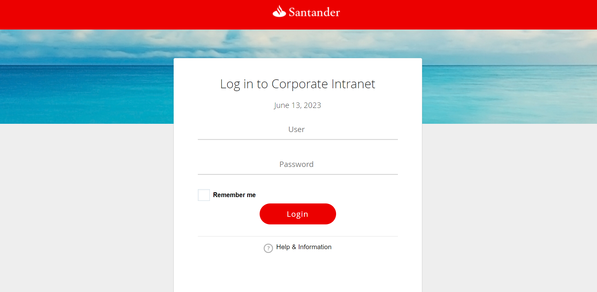
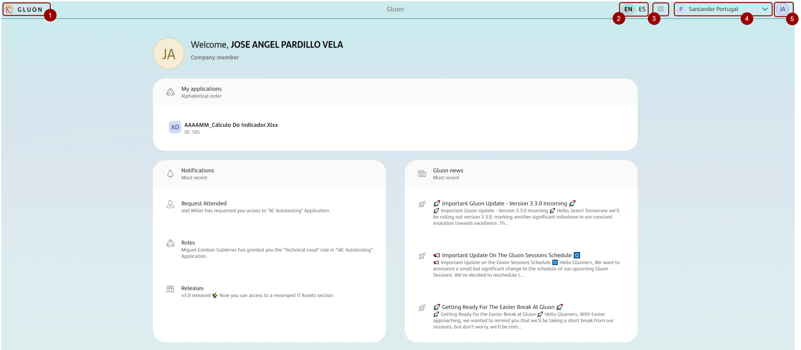
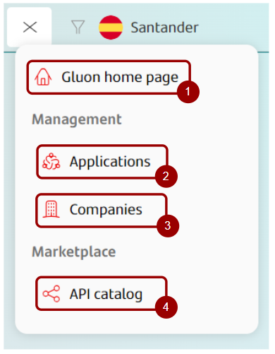
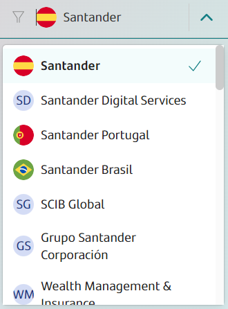
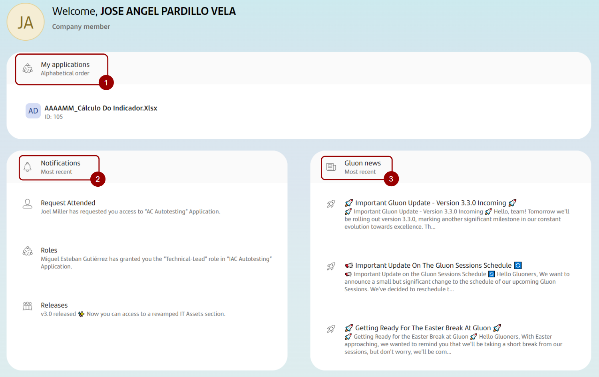
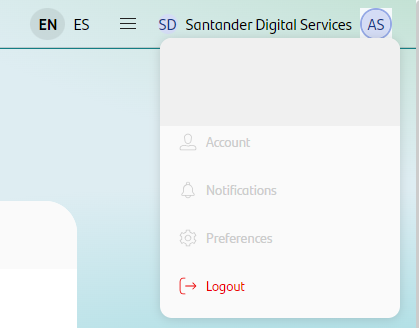

## Introduction

The intention of this section is to learn how to **log in** and **log out** of Gluon Platform and take your **first steps** in the application.

## Log In

Before you can start using Gluon, you need to login. In this section you can learn how to do it.

* **Access to Gluon Platform**: Try to enter in [Gluon Platform](https://gluon.gs.corp). If you are not logged in, you  will see the login page. If you are already logged in, you will see the welcome page.

* **Login page**: In the following link you can access the Gluon Platform Log In page: [Gluon Log In Page](https://logcorp.aacc.gs.corp/?environment=0&okURI=https%3A%2F%2Fgluon.gs.corp%2Fgluon).
The next step is to enter the user's credentials (User ID and Password):
    <figure markdown>
    
    <figcaption></figcaption>
    </figure>

* **Welcome Page**: Once logged in, the user accesses the Gluon Welcome view. You are now ready to start using Gluon!

---

## Home Page overview

Congratulations! You have successfully logged in to Gluon. As you can see there is a lot of information that we are going to go through.

### Top Bar

The top navigation bar has multiple functionalities. Let's see them in detail.

<figure markdown>

<figcaption></figcaption>
</figure>

* **Gluon Logo**: You can go back to Welcome page by clicking on the Gluon logo.

* **Language Selector**: You can change the language of the Gluon Portal by clicking on the language selector. The available languages are: English and Spanish.

* **Main Menu**: This menu gives you access to all the Gluon Features:
{ align=right width=40% }
    * **Gluon Home Page**: You can go back to Welcome page by clicking on Gluon home page.
    * **Applications**: This section gives you access to the applications management features of Gluon.
    * **Companies**: This section gives you access to the companies management features of Gluon.
    * **API Catalog**: This section gives you access to the shared assets of Gluon.

* **Entity Filter**: Users who belong to different entities can change their operating entity here.
    <figure markdown>
    { width=75% }
    <figcaption></figcaption>
    </figure>

* **User Menu**: This menu gives you access to the user's profile and the option to log out.

## Getting Started with GLuon

Each company within Gluon is governed by company owners, who are the users responsible for registering functional applications.

### Want to start working in Gluon?

You only need to ensure that your user account is associated with an application.

### Need to register a new application?

If you need to register a new application, contact your company owner and provide them with your application's ID in ITSM APM.

### Don't know who the company owner of your entity is?

Visit this link to know who the company owner of your entity is: [Company Owner list](../../application/users-teams/user-roles.md#company-owners-list).

 

### Main Section

On the home page you can see all the applications in which we are members, as well as our latest notifications and the latest news from Gluon.

<figure markdown>

<figcaption></figcaption>
</figure>

* **Applications**: In this section you can see the applications that you have access to. You can see the applications that you have access to in the following link: [Application Section](https://gluon.gs.corp/gluon/applications).

* **Notifications**: In this section there are notifications for the user.

* **News**: In this section there are news published in the [diffusion channel.](https://web.yammer.com/main/groups/eyJfdHlwZSI6Ikdyb3VwIiwiaWQiOiIxMjcwODc0NzY3MzYifQ/all)

 

:octicons-play-16: **Gluon Portal overview**

<iframe class= iframes src="https://santandernet.sharepoint.com/sites/gluonacademycommunity/_layouts/15/embed.aspx?UniqueId=c9e502f7-52aa-4ba6-b975-9f6b1053d14f&embed=%7B%22ust%22%3Atrue%2C%22hv%22%3A%22CopyEmbedCode%22%7D&referrer=StreamWebApp&referrerScenario=EmbedDialog.Create"
width="100%" height="500"  frameborder="0" scrolling="no" allowfullscreen title="Gluon Portal overview"  loading="lazy"></iframe>

 

---

## Log Out

Do you want to logout? It's very easy.

* **Leaving Gluon.**At the top of the view, by clicking on the image of our user, the last option is "Logout". By clicking on it, we will exit the Gluon Portal.

<figure markdown>

<figcaption></figcaption>
</figure>

 
