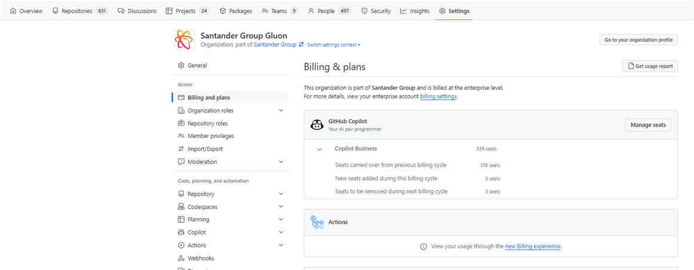
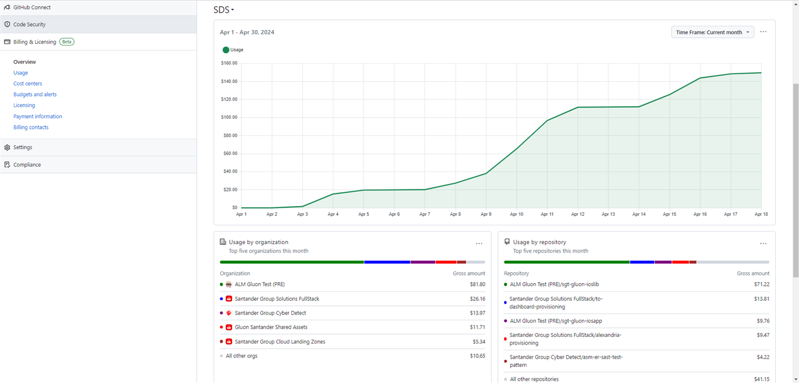
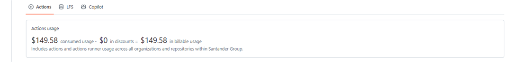

# Gluon Variable Costs

Each company, through its GitHub.com organizations, can generate additional costs to its user licenses. These costs will be passed on to each company through a specific Azure Subscription.

## Variable Costs

The following products are currently generating variable costs:

- GitHub Actions.
- Git Large File Storage.
- GitHub Copilot.
- Codespaces
- Packages
  
Those costs will be automatically related to the Company Cost Center

## Billing Cycle

Billing cycle starts on 1st of each month and ends the last day of the same month.

## Copilot

Santander Enterprise Account is using Copilot Enterprise.

All users onboarded in a month will be charged in next billing cycle based on the number of days onboarded (Not full month is charged).
All users offboarded in a month will be charged the full month.

## Cost Center

A Cost Center will relate :   Company or set of Companies / Organizations / Azure Subscription.  

## Reviewing Costs

For individual organizations, costs can be reviewed by Organization Owners in their organization billing section. To access, replace the **name of the desired organization** in the following link:

``` yml
https://github.com/organizations/[Organization Name]/settings/billing/summary
```

<figure markdown>

<figcaption></figcaption>
</figure>

At Cost Center level, information is also available by Organizations Owners in the following link:

``` yml
https://github.com/enterprises/santander-group/billing
```

<figure markdown>

<figcaption></figcaption>
</figure>

<figure markdown>

<figcaption></figcaption>
</figure>

<br>
