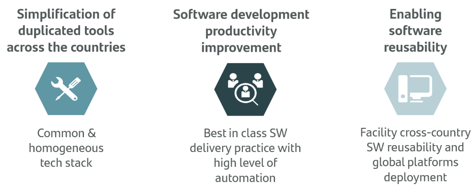
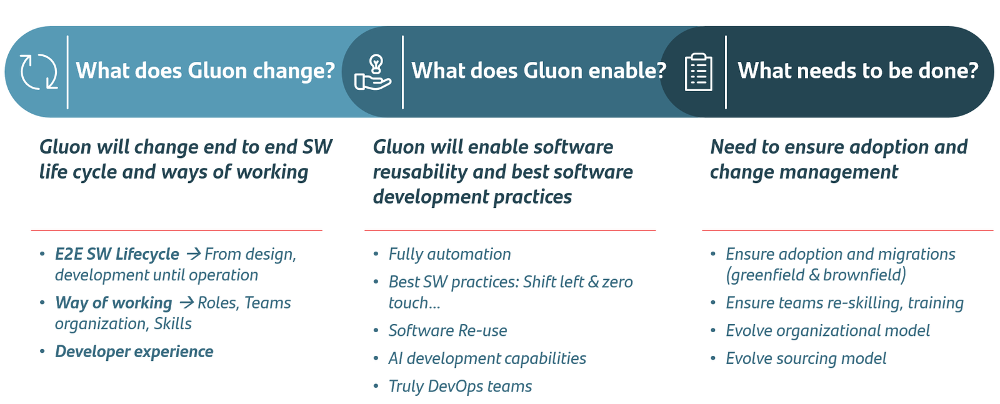
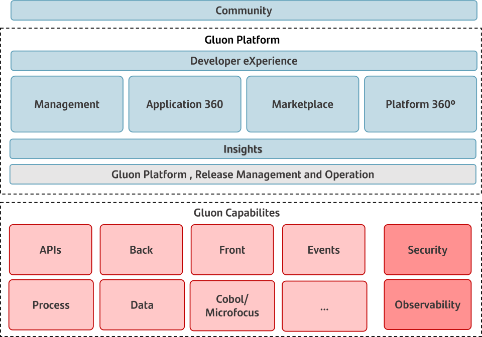

## Introduction

Gluon is a platform for **building and deploying applications on the Cloud**. It is a collection of tools and services that help you build, deploy, and manage your applications.

Platform engineering is the discipline of designing and **building toolchains and workflows** that enable **self-service** capabilities for software engineering organizations in the cloud-native era.

Gluon is Santander Group engineering platform.

* :octicons-gear-24: **Manage** your applications, employees and shared infrastructure autonomously. Through our **self-service** capabilities you can ensure full governance of your company IT assets
* :octicons-rocket-24: Accelerate your team's **productivity**. Our platform provides services and tools that boost Product team's velocity at the same time it ensures the required **traceability, quality and security Santander standards**.
* :material-glasses: Discover and consume **reusable IT assets**, APIs, Libraries, Helm chart museum, UI & Process components, Data models and Hubs with **quality and safety** guarantee
* :material-crane: Build a **continuous improvement** and IT risk culture with advanced Gluon Insights. Take data driven decisions to help your team become elite performers and always be aware of your technical debt.
* :fontawesome-solid-users: Take **collaboration** to the next level with any team at Santander Group. Learn, collaborate and participate with Gluon Community

<figure markdown>
  
  <figcaption></figcaption>
</figure>

## Impact

when you adopt Gluon you will have the following improvements

1. Increase **business Product** Team's **autonomy** and **performance**.
2. Increase and measure **reusability**.
3. Build a **collaboration** and **continuous improvement** culture.
4. Improve **Developer eXperience**.
5. Out of the box **security** and **operation's policies** compliance.

<figure markdown>
  {max-width="75%"}
  <figcaption></figcaption>
</figure>

## Product and Capabilities

Gluon is divided in two main parts:​​​​​​​

1. **Product**: The product is the set of tools and services that you use to onboard, build, re-use, deploy, and manage your applications.​​​​​​​​​​​​​​

2. **​​​​​Capabilities**: The capabilities are the set of technologies and architecture supported by Gluon.

<figure markdown>
  
  <figcaption></figcaption>
</figure>

### Gluon Products

Their aim is to help Product and Operation teams accelerate, simplify, and standardize the process of building, deploying, and managing applications and platforms.
Products will provide core components and services that will allow making use of Gluon capabilities.

* **Community**: building a collaboration culture across Santander Group.
* **​​​​​​​Developer eXperience**: delight developers with the best experience.
* **Management**: easy and quick as a self-service.
* **Application 360**: helping product teams manage their whole Applications lifecycle.
* **Marketplace**: provide a great amount of reusable IT ../assets which helps accelerate time to market.
* **Platform 360**: provide different platform management options, consumption services, and reusable platform components to allow teams to set up, operate and maintain platforms.
* **​​​​​​​Insights**: build a continuous improvement culture driven by data decisions.
* **Gluon Platform**: Release Management & Operations: ​​​​​​​customer confidence based on the highest reliable platform.

### Gluon Capabilities

* **APIs**: help our customers through APIs full lifecycle ensuring their governance, security and observability compliance.
* **Backend**: provide microservices and serverless capabilities for building cloud native applications.
* **Front**: provide web and mobile capabilities to provide the best experience for our customers.
* **Events**: enable developers to fully cover lifecycle of all components that are part of the events architecture.
* **Business processes**: covers the complete lifecycle of processes: definition, development, execution, monitoring and optimization.
* **Data**: provides data management capabilities.
* **Cobol/Microfocus**: enables application development with Gravity.
* **Security SDLC**: help teams identify protect, detect and manage security risks at every step of their applications lifecycle.
* **Observability**: facilitate applications technical and functional observability providing AIOps capabilities.
