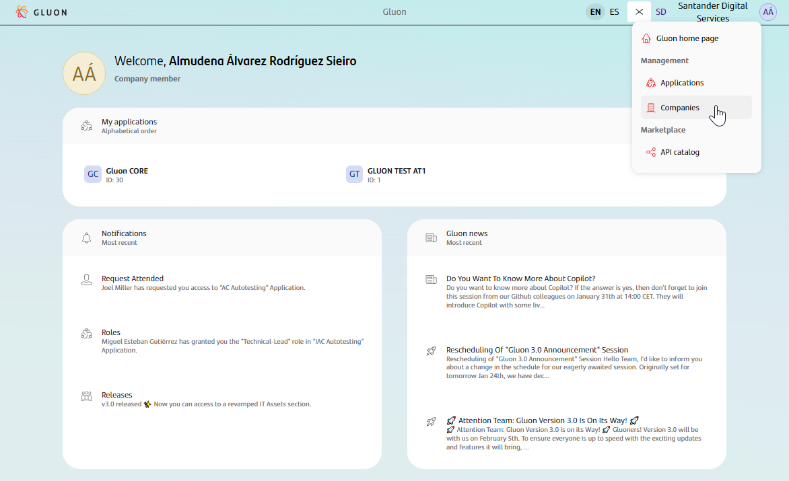
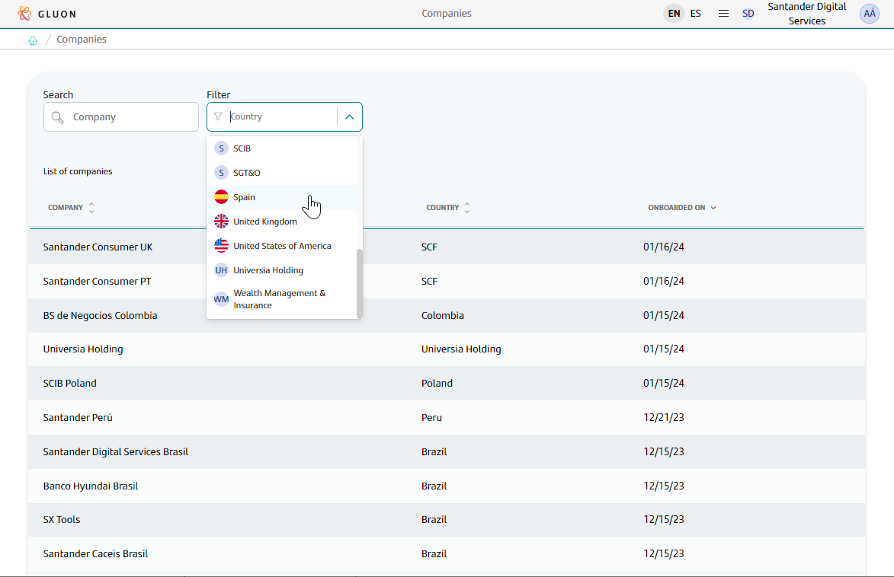
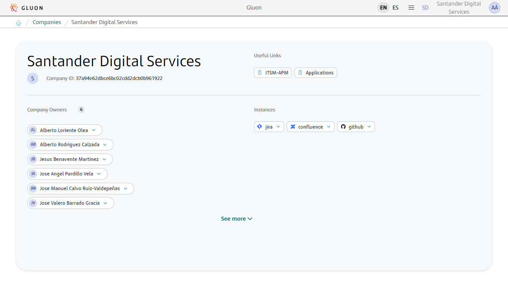

# Companies Management

## Introduction

Welcome to the Companies Management Documentation for Gluon! This comprehensive guide will walk you through the various features and functionalities of the Companies Management Page.
Here, you can explore, analyze, and onboard companies within the Gluon platform.

Whether you're looking to gain insights into existing companies or onboard new ones as an admin user, this documentation will provide you with the necessary guidance. With Gluon, managing companies has never been easier.

Throughout this guide, you will learn how to:

- Explore the companies within Gluon: Navigate the company listing, search, and filter companies based on specific criteria such as industry or location.

- Access detailed company views: Dive deep into the details of each company, including information like contact details, associated projects, and important documentation.

- Onboard a new company: If you have admin privileges, learn how to onboard new companies onto the Gluon platform, enabling seamless collaboration and access to resources.

To begin, log in to the Gluon platform and navigate to the Companies section.

## Accessing the Company details

- **Navigate the Menu.** From the Gluon home page, locate the menu icon in the top right corner. Click on it to reveal the menu options. Select the Companies Section which redirects to the Companies page.  

- **Explore the Companies Listing.** On the Companies page, you will find a comprehensive listing of all the registered companies within Gluon. Companies can be filtered based on their name or country.  

- **View Company Details.** Click on the desired company from the listing to access the details of a specific company.  

Now you have successfully accessed the Companies Listing on Gluon. Take advantage of the powerful search and filtering capabilities to find the information you need.
Feel free to explore other features and functionalities that Gluon offers to enhance your company management experience!

## Onboarding a new Company

Company Onboarding is restricted to **Gluon Admin** users  

### Input

In order to have your company onboarded, you need to initiate the process through an [ITSM Request](../support/index.md) with the following information:

- The identification of the Company in ITSM.
- The email of the Gluon Champion (Gluon Focal point in the Company ). Current Gluon Champions are listed [here](https://santandernet.sharepoint.com/sites/gluoncommunity103/SitePages/Gluon-Champions.aspx).
- The email of at least 2 persons that will be given the Company Owner Role.
- The name of the Atlassian Instance that should be used for your company. If it needs to be created, please indicate it.
- For GitHub
     - If you want to reuse a previous Gluon GitHub organization, provide the name of the organization.
     - The GitHub Cost Center. Current Cost Centers are listed in Gluon Insights
     - The Azure Subscription and identification of the Azure Subscription Admin.

???+ Remember  
  
    If the company is totally new to Gluon and not related to an existing Cost Center, additional information will be required. In this case, please contact the [Gluon Adoption Team](mailto:gluonadoptionteam@santandernet.onmicrosoft.com)

**Example:**

Company Onboarding Request  

|                  |   |  |
|-----------------------|---------|--------|
| **Company Identification**| Santander Digital Services | [ITSM Company URL](https://santander.service-now.com/now/nav/ui/classic/params/target/core_company.do%3Fsys_id%3D37a94e62dbce6bc02cdd2dcb0b961922%26sysparm_view%3Dtext_search)    |
| **Gluon Champion** | <thomas.buttier@gruposantander.com> ||
| **Company Owners**  | <thomas.buttier@gruposantander.com>; <alberto.loriente@gruposantander.com>||
| **Atlassian Instance** | san-sgt-basic ||
| **JIRA Scheme** |ALMMCT ||
| **Gluon GitHub Organization**|-||
| **GitHub Cost Center**  | SANTANDER DIGITAL SERVICES ||
| **Azure Subscription for GitHub** | 7ef30bbd-f6c6-432f-897e-aaswe3b232cf5s | <thomas.buttier@gruposantander.com>|

### Output

As a result of the company onboarding, the company will be available through the Gluon Portal, and you will be able to start using the platform.  
Additionally, a set of [predefined company teams](./company-teams-management/team-predefined.md) will be created.  
Company Owners will need to assign the correct team owners and communicate with them to populate the teams.  

Copilot will be also activated for your users
