# Company Teams Management

## Introduction

Welcome to the Company Teams Management Documentation for Gluon! This comprehensive guide will walk you through the various features and functionalities of the Company Teams Management Page. Here, you can explore, analyze, and manage teams within a company.

## Explore Company Teams

<div class="steps" markdown>

- **Go to the Company Details view.**
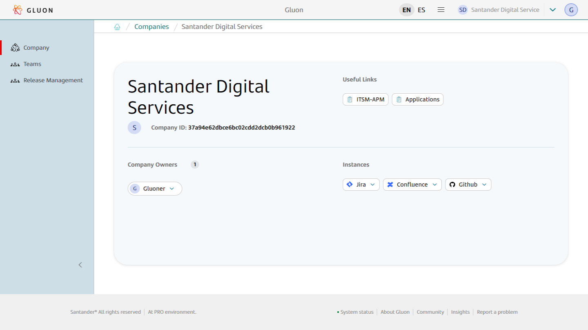  
- **View the teams of the chosen company.** Locate the "Teams" section in the sidebar of the company details page. Click on it to access the list of teams.
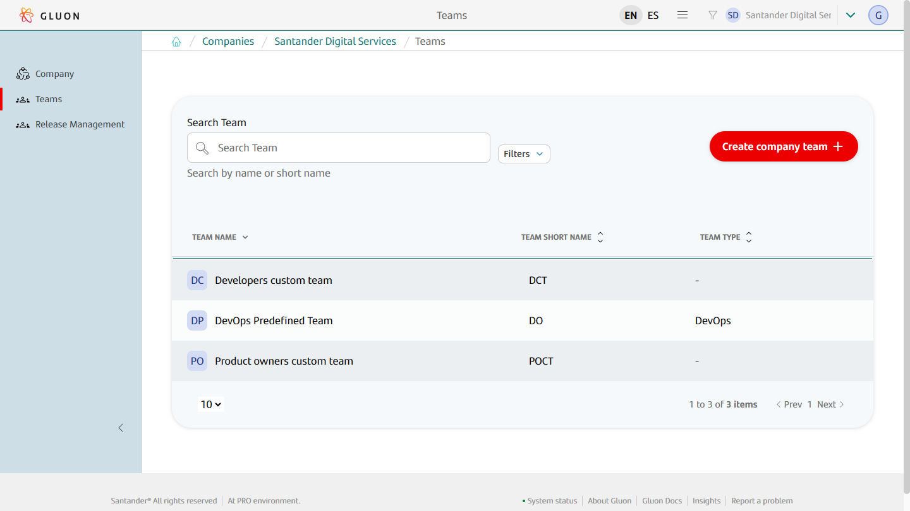  
- **Search teams.** Use the search bar on the top left corner to enter specific keywords and narrow down the team list.
- **Filter teams.** Use the filter options to filter the teams by class (Predefined or Custom).

</div>

## Company Team Details

<div class="steps" markdown>

- **View Company Team Details.** Navigate to the team details page by clicking on the team name. This page provides information such as the full and short names of the team, the team status, the team owners, and a description of the team.
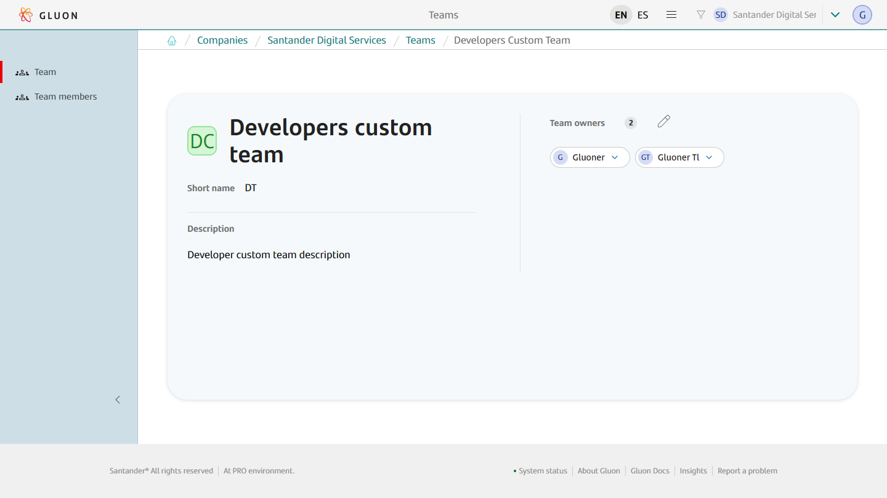  

</div>

## Create a New Company Team

<div class="steps" markdown>

- **Access the Create Company Team Function.** Click on the "Create company team" button on the top right corner of the company teams list page.
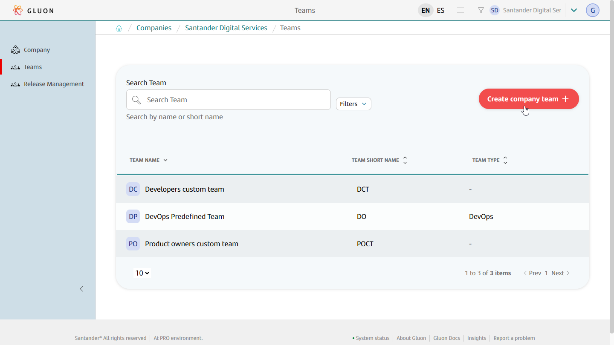
- **Select the team you want to create.** Choose the team you want to create. Available options are: **A. Custom Company Teams (a.k.a., CCT)**: users will be
free to select name, short-name, and description. These teams shall not be configured (profiled) in any SDLC tool. **B. Predefined Company Teams (a.k.a., PCT)**:
users shall choose a team type that provides a predefined name, short-name, and description. Only one predefined company team for the specified team type shall be created in any given company. Click the "Next" button to proceed.
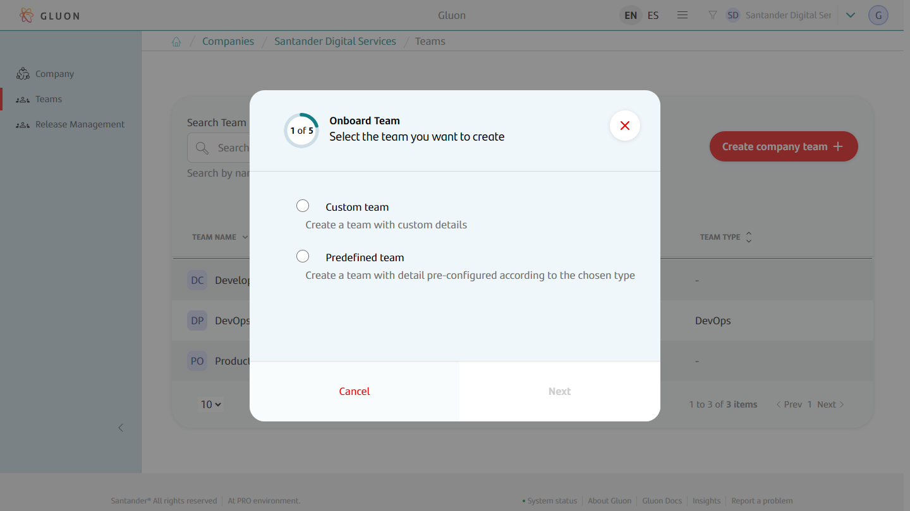

The available types for predefined company teams (PCT) will expand as new capabilities are added to Gluon. Future updates will offer more predefined team types, each with specific configurations and benefits.

- **Only for custom teams, fill in the Company Team Details.** In the "Create Company Team" pop-up, enter the full name, the short name and a description of the team. Click the "Next" button to proceed.
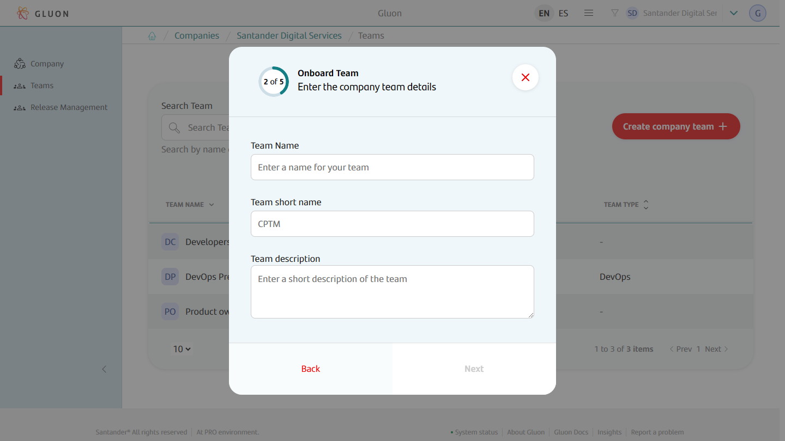
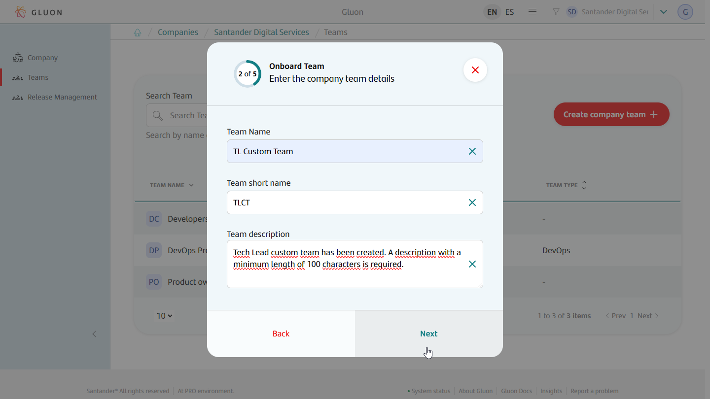
- **Select Jira instance and project.** Choose the Jira instance and project to associate with the company team. Click the "Next" button to proceed.
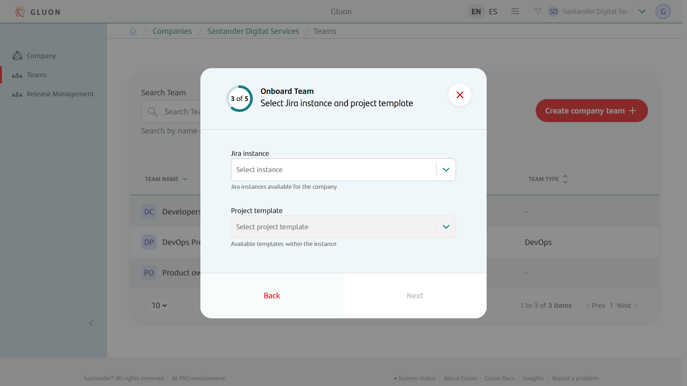
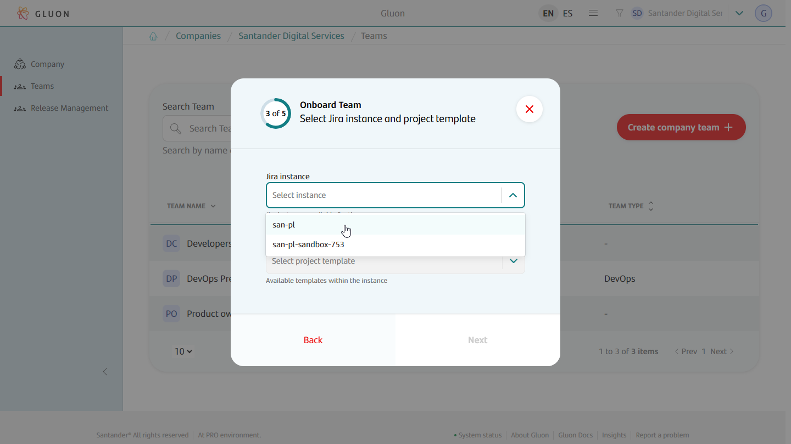
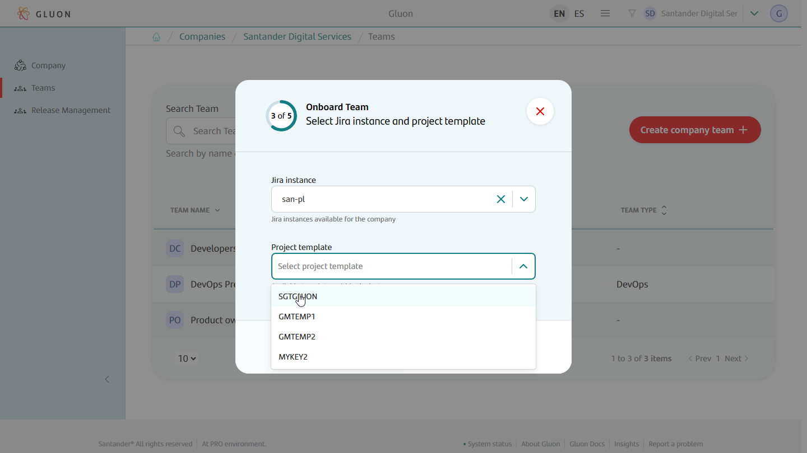
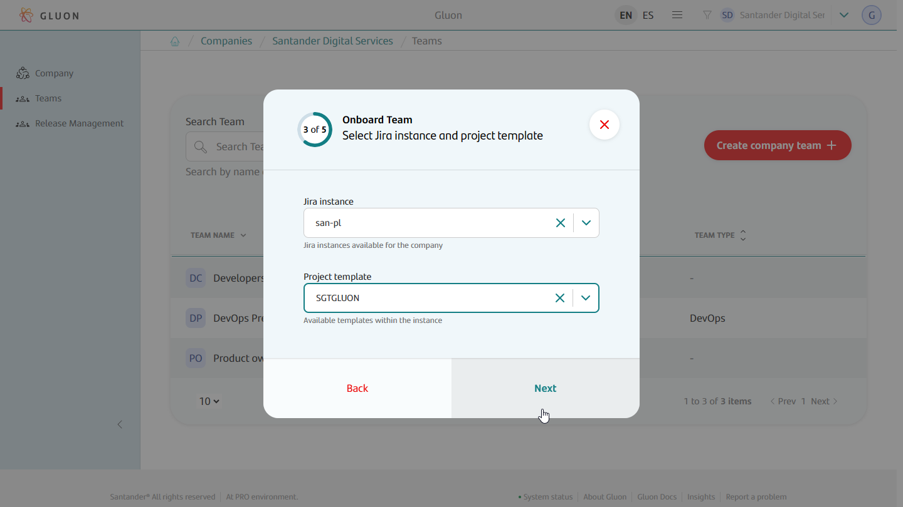
- **Select Confluence instance.** Choose the Confluence instance to associate with the company team. Click the "Next" button to proceed.

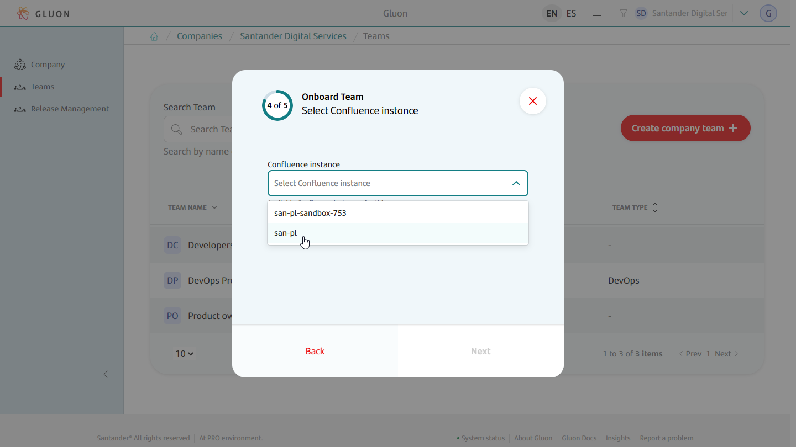
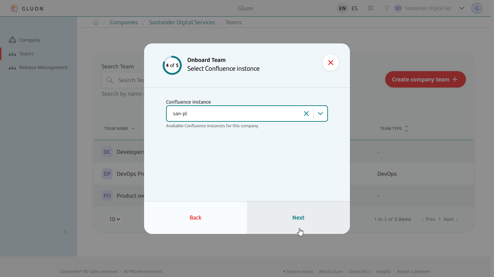
- **Select Github organization.** Choose the Github organization to associate with the company team. Click the "Next" button to proceed.
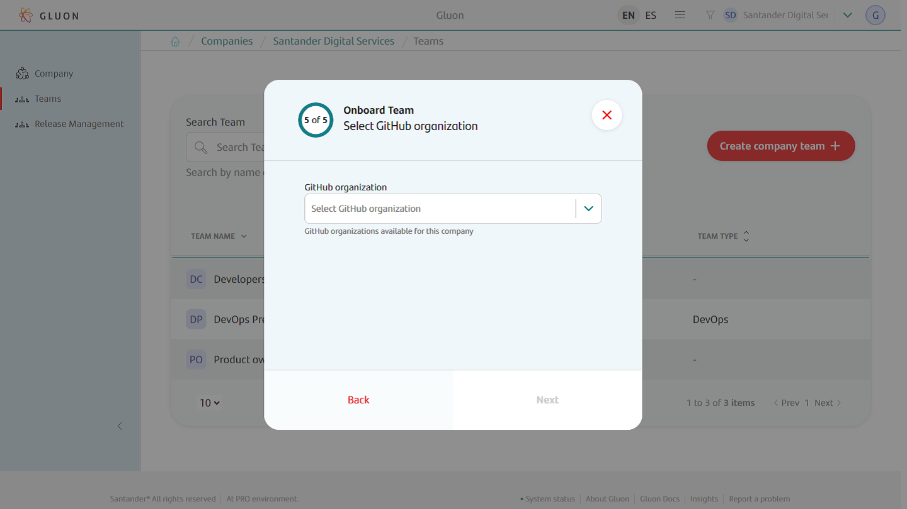
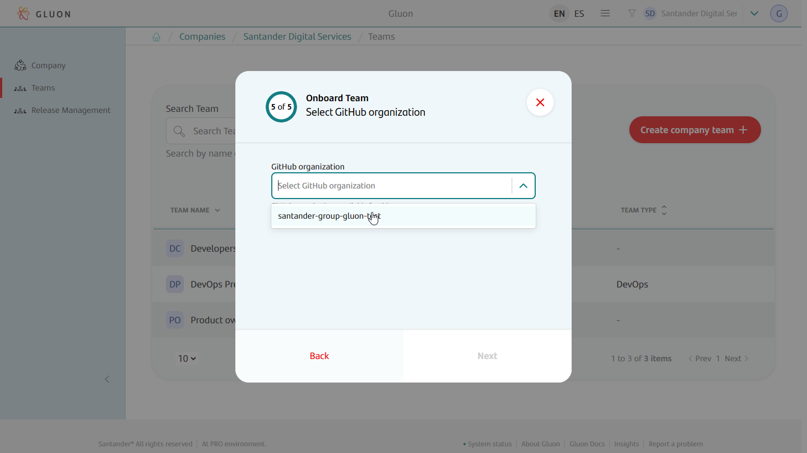

- **Review the information of the company team.** In this last step review the information of the company team to be created. If everything is correct, click the 'Confirm' button to finish the creating process.
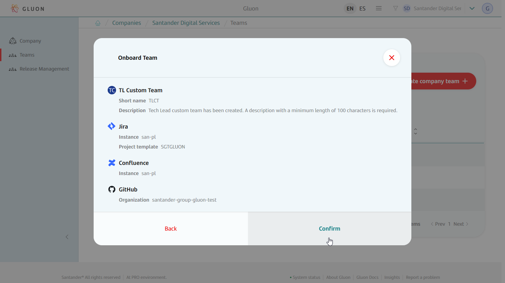
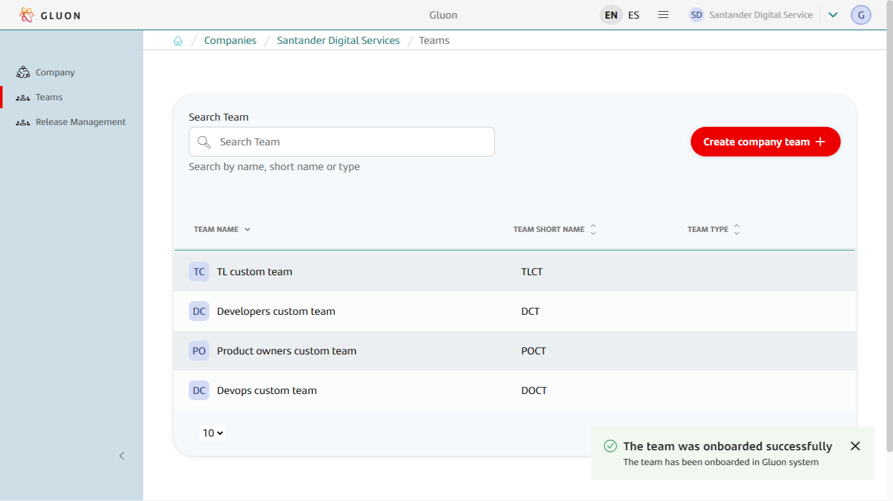

</div>

## Company Teams in Microsoft Entra ID

When a Company Team is created, it will generate the following groups in Entra ID

```GR_ALMNXTGN_<Entity Acronym>-<Team Class Acronym>-<Team Short Name>_<Role Suffix>```

The available team class acronyms are the following:

- **CCT**: Custom Company Team

- **PCT**: Predefined Company Team

The valid role suffixes are the following:

| Role                   | Suffix     | Members                       |
|------------------------|------------|-------------------------------|
| asset-owner            | AO         | Team Owner                    |
| company-team-member    | CTM        | Team Owner and Team Member    |

As an example, the Entra ID groups for the **Devops custom team** of the previous screenshot, would be:

- `GR_ALMNXTGN_SGT-CCT-DOCT_AO`
- `GR_ALMNXTGN_SGT-CCT-DOCT_CTM`

## Related content

[Learn how to manage team owners](./team-owners-management.md)

[Learn how to manage team members](./team-members-management.md)
