# Team Members Management

## Introduction

This document is provided for admins and team owners profiles and explains how to manage members that belong to teams. It contains two main sections:

  - Onboard a user as a team member.
  - Remove a team member.

## Onboarding Team Member

This functionality is only available to team owners or admins.

- **Manage Team Members.** Once into Team Details click on the Team Members section of the sidebar menu to access the Team Members list.
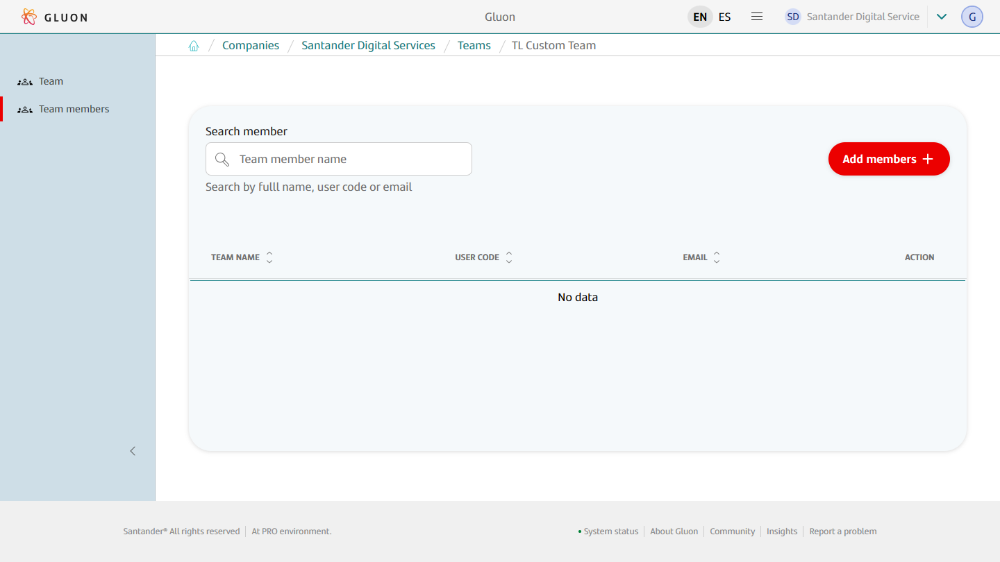

- **Onboard a member.**. Click on the "Add +" button to open the onboarding form.
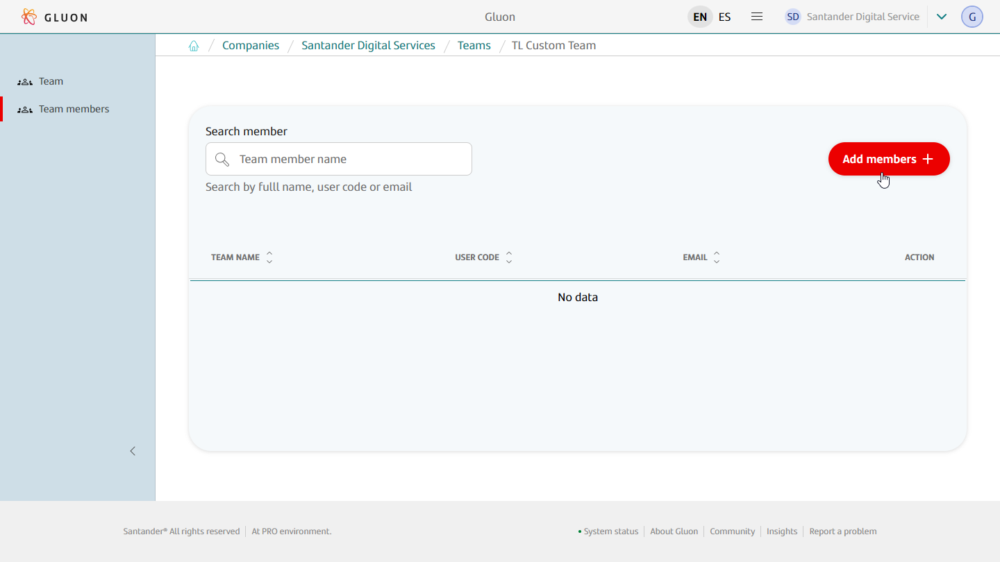

- **Select member to onboard.** Once the team's members detail window opens, their information will be visible. To onboard a new one just type the corporate identifier in text box and hit "Add +" button.
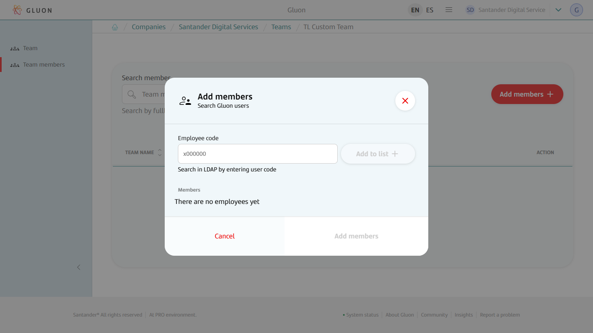
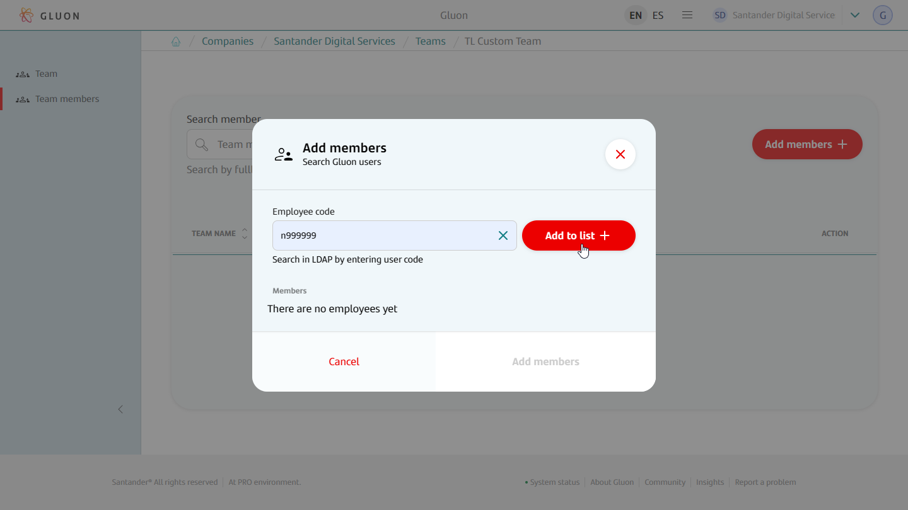
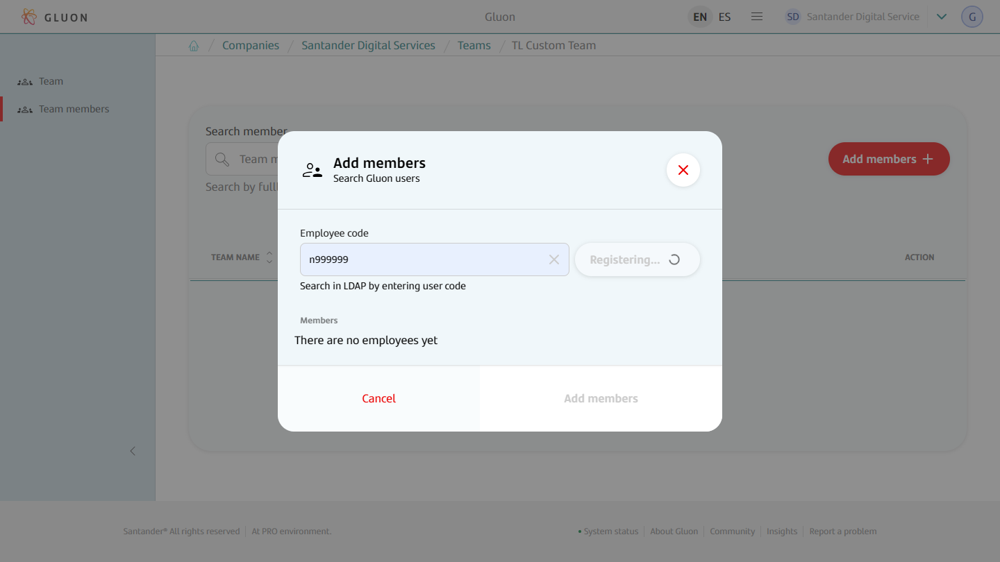
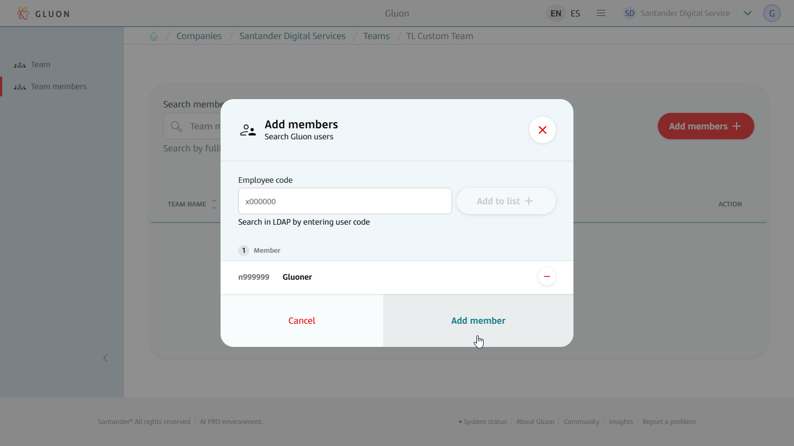
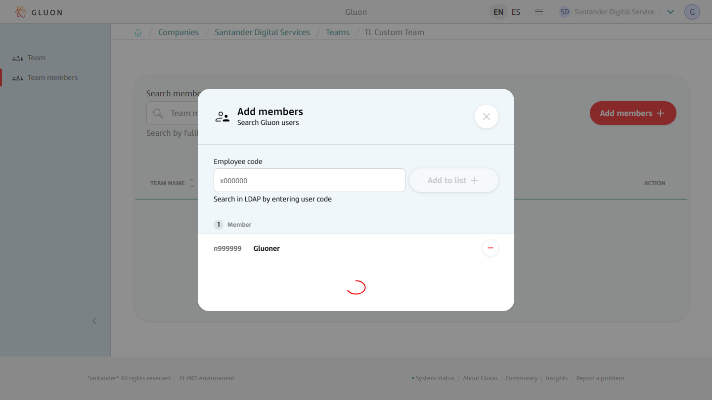

- **Check member is onboarded.** Once the team's member is onboarded a notification appears claiming that "Team member was successfully added", and it will be visible in the detail window.
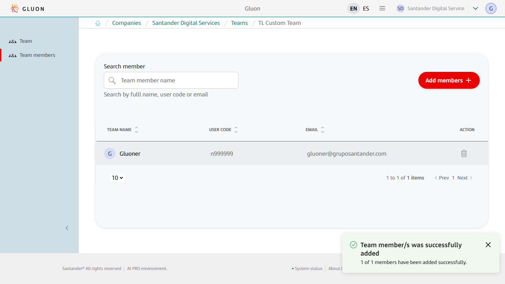

!!! note "Keep in Mind!"

    In order to onboard users they must exist in the corporate LDAP and in Microsoft Entra ID, and the email must be the same in both identity providers.

## Removing Team Member

This functionality is only available to team owners or admins.

- **Manage Team Members.** Once into Team Details click on the Team Members section of the sidebar menu to access the Team Members list.
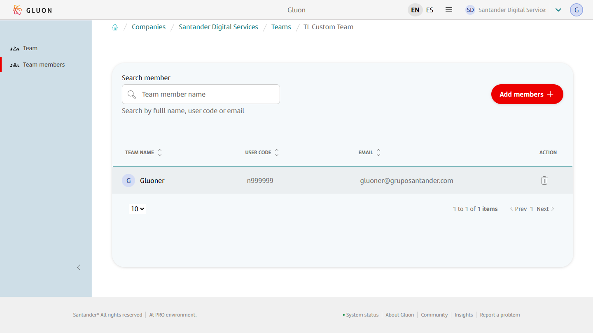

- **Remove Team Member.** Once in the team members detail section just choose the member to remove and click the corresponding delete icon.
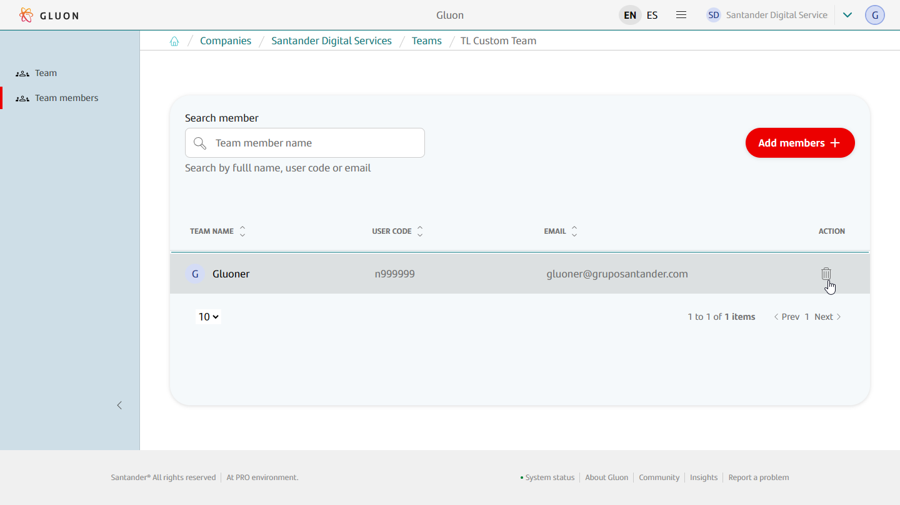
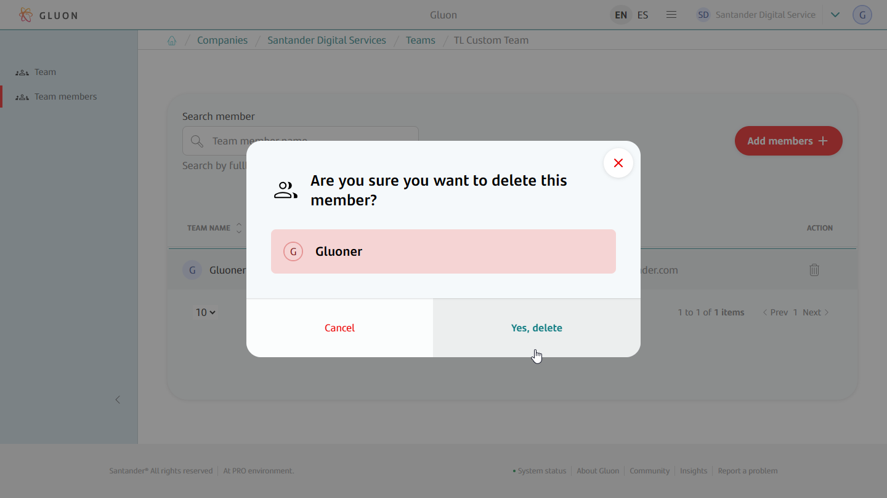
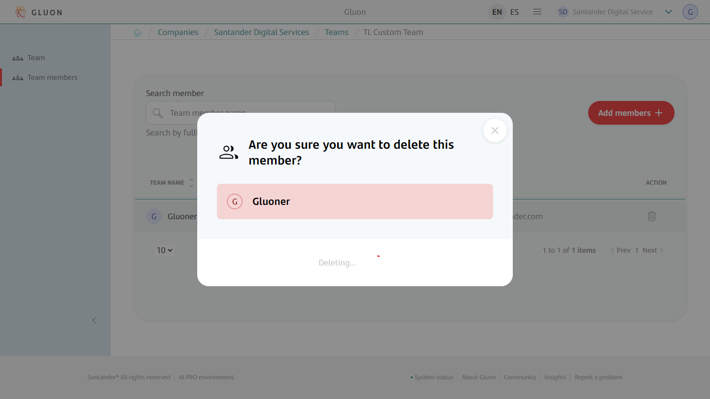

- **Check team member is removed.** Once the team's member is removed you will see a notification with the operation result and the team member details will be updated.
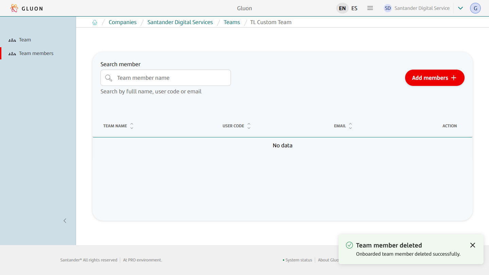

!!! note "Keep in Mind!"

    Every team must always maintain at least two members, so you can not remove a member when only a pair are associated with the team.

