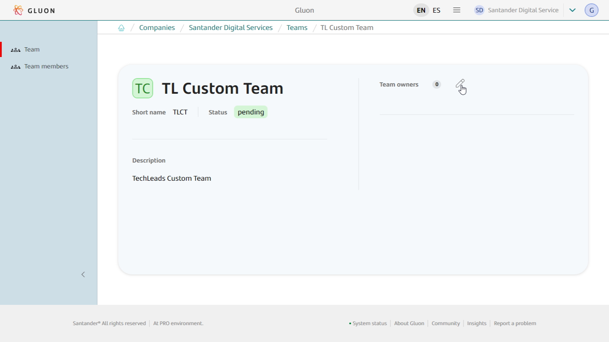
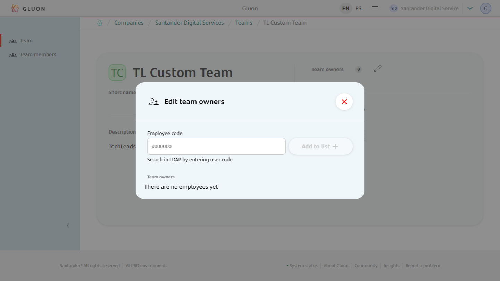
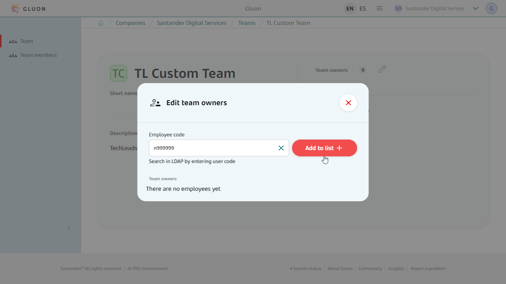
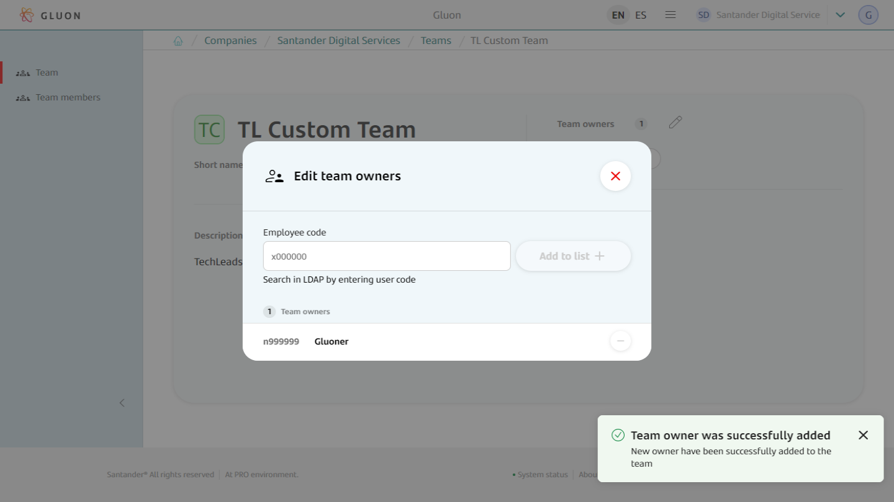
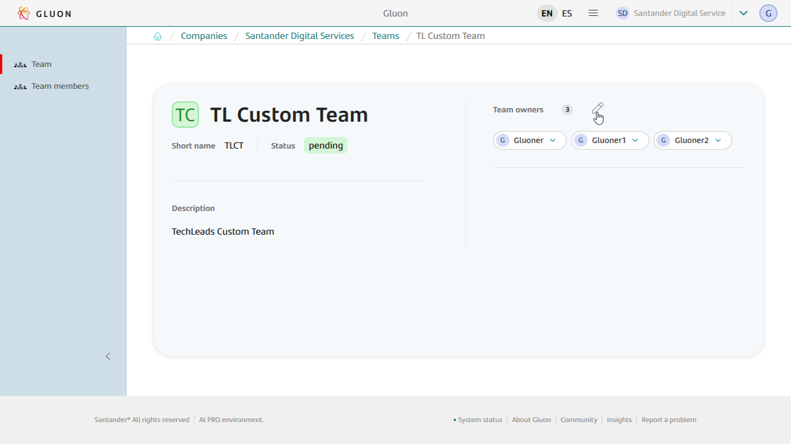
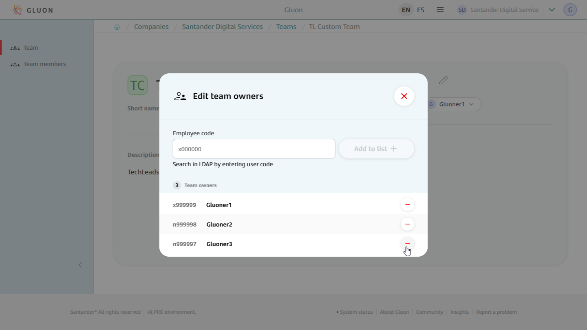
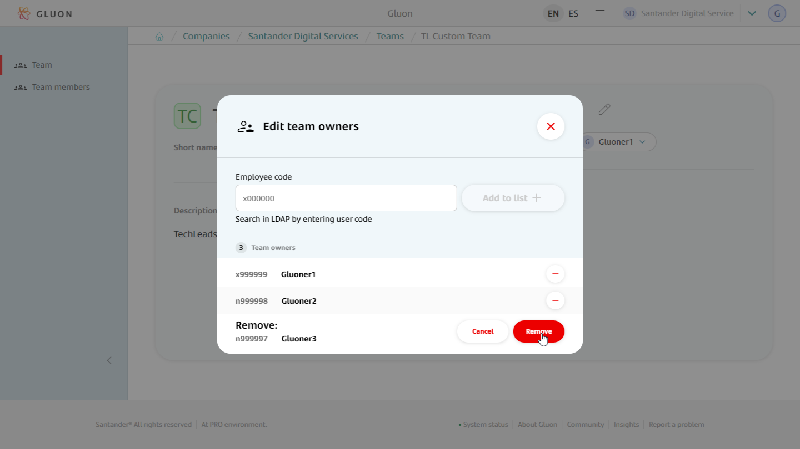
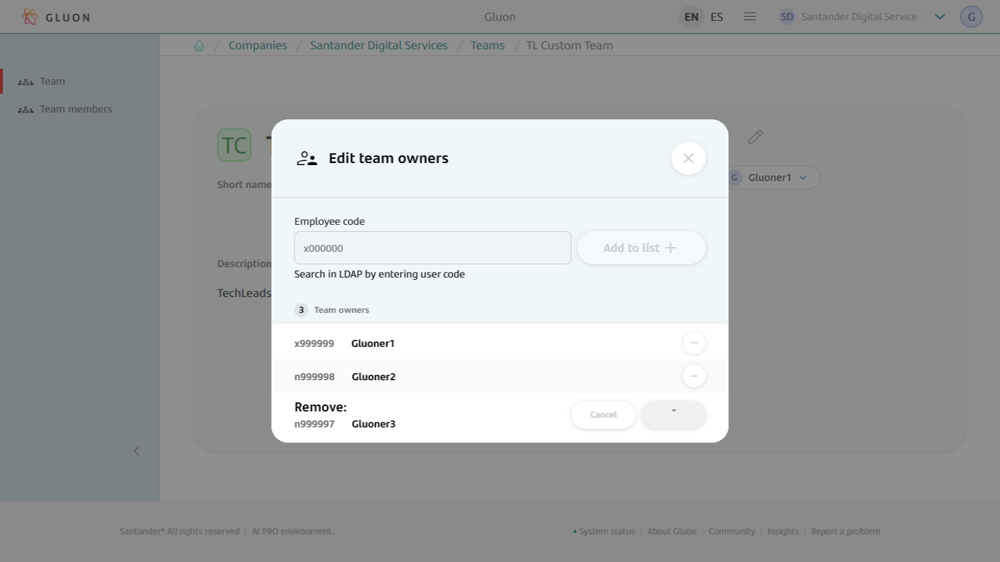
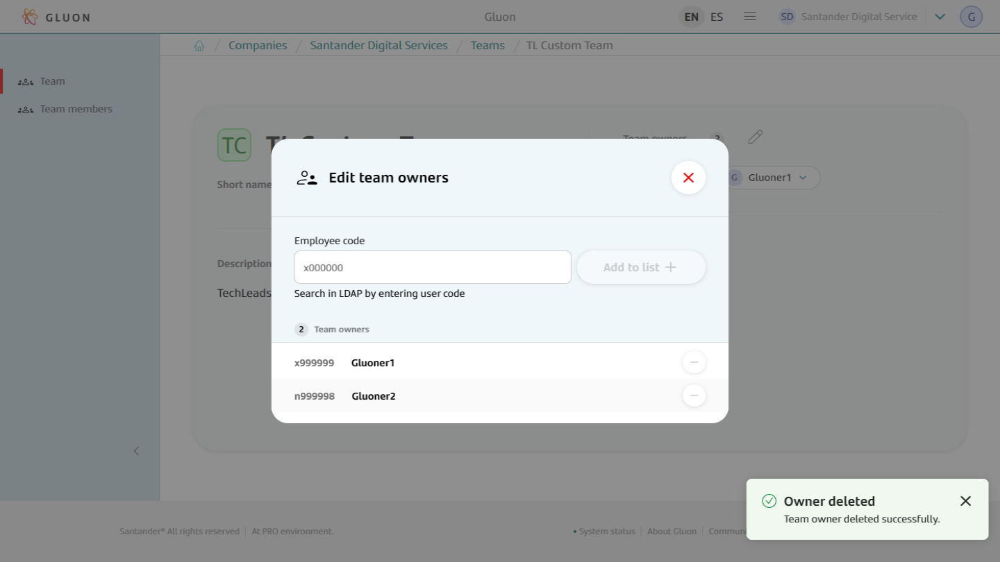

# Team Owners Management

## Introduction

This document is provided for admins and company owners profiles and explains how to manage owners that own teams. It contains two main sections:

  - Onboard a user as a team owner.
  - Remove a team owner.

## Onboarding Team Owner

This functionality is only available to company owners or admins.

- **Manage Team Owners.** Once into Team Details section click on the team owners edit icon to access the Team Owners detail.

- **Select owner to onboard.** Once the team's owners detail window opens, their information will be visible. To onboard a new one just type the corporate identifier in text box and hit "Add +" button.

- **Check owner is onboarded.** Once the team's owner is onboarded a notification appears claiming that "Team owner was successfully added", and it will be visible in the detail window.

!!! note "Keep in Mind!"

    In order to onboard users they must exist in the corporate LDAP and in Azure Active Directory, and the email must be the same in both directories.

## Removing Team Owner

This functionality is only available to company owners or admins.

- **Manage Team Owners.** Get to the team details section and click on the team owners edit icon to access the Team Owners detail.

- **Remove Team Owner.** Once in the team owners detail section just choose the owner to remove and click the corresponding "-" icon.

- **Check team owner is removed.** Once the team's owner is removed you will see a notification with the operation result and the team owner details will be updated.

!!! note "Keep in Mind!"

    Every team must always maintain at least two owners, so you can not remove an owner when only a pair are associated with the team.

