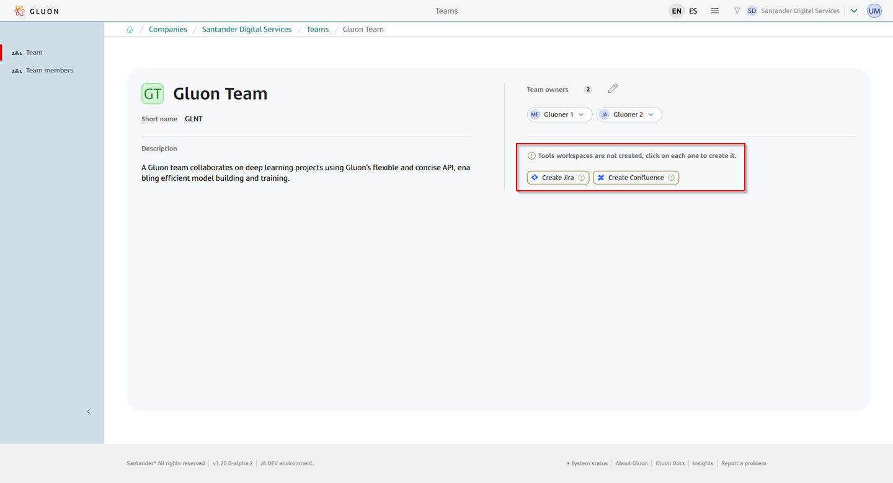
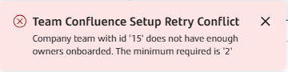
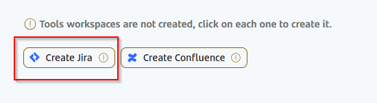
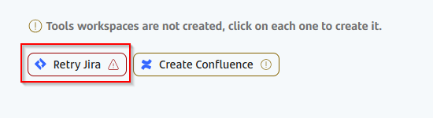
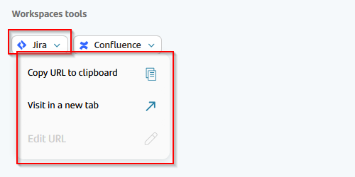
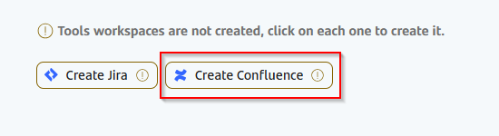
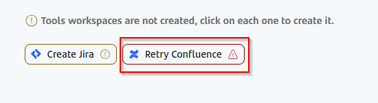
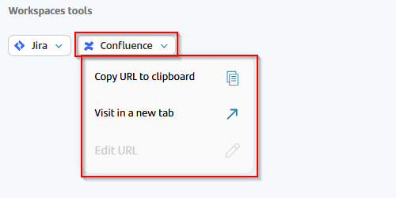

## Introduction

This document is provided for **admins**, **company owners** and **company team owners** profiles and explains how to manage tools associated to company teams.

Tools can be found in the workspace tool section in the "Company Team Details Page". Here they can be managed by the company owners, company team owners and admins and accessed by the members and owners of the company team. Available tools
are Jira and Confluence.  

To access the company team details you can follow the steps [here.](./index.md)

!!! warning
    You must take into account that for any of the tools to be provisioned for the company team needs to have at least **two registered company team owners**.

    

To see the licenses that each user has for the different tools you can explore the [User permissions section](./../company-teams-management/team-users-permissions.md#licenses).

## Tool status and actions

- **Creation pending:** a button will allow you to start the configuration of the tool.

- **Creation failed:** a button will allow you to retry the configuration of the tool.

- **Tool created:** a drop-down menu will allow you to copy the url of the tool configured or to visit it in a new tab.

## Toolchain

### Jira

1. **To provision Jira project**, you must click on the button "Create Jira".

    

2. **In case there is a problem with the Jira project provisioning**, click the button "Retry Jira".

    

3. **Once provisioned**, you can access the company team Jira project from the drop-down menu.

    

### Confluence

1. **To provision Confluence space**, you must click on the button "Create Confluence".

    

2. **In case there is a problem with the Confluence space provisioning**, you can retry the creation by clicking the button "Retry Confluence".

    

3. **Once provisioned**, you can access the company team Confluence space from the drop-down menu.

    
