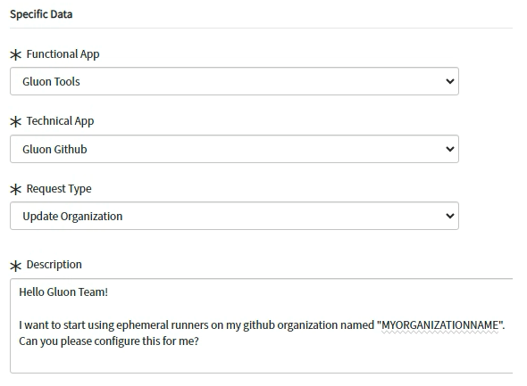

## 1. Using Gluon Infrastructure

To start using ephemeral runners in your workflows we need to create two __Service Now__ requests, one for Firewall Rules and another to request the configuration of the organization.

1. Create the Firewall Rules request, you can use this [this guide](../../../firewall-rules.md).

2. Create a request to the Gluon team to configure your GitHub Organization, using the following link.
[TECHNICAL CATALOG -> Cloud -> Gluon -> Gluon Tools Request](https://santander.service-now.com/nav_to.do?uri=%2Fcom.glideapp.servicecatalog_category_view.do%3Fv%3D1%26sysparm_parent%3D257db34f1bf2a510e4909753b24bcb38%26sysparm_ck%3Da49421c987fe39104cedea030cbb35f424a3bdc6e2efad83e7317a21ff2d380888b4a989%26sysparm_processing_hint%3Dsetfield:request.parent%3D%26sysparm_catalog%3D719aafd0db031f448c6c7cde3b9619f8%26sysparm_catalog_view%3Dcatalog_technical_catalog)

Request example:

### Other sections in Gluon Infrastructure adoption process

- #### Gluon Infrastructure Customization and Scaling Request

    ---
    Customization and Scaling request.

    [:rocket: Gluon Customization and Scaling Request](./customization-and-scaling.md/)

