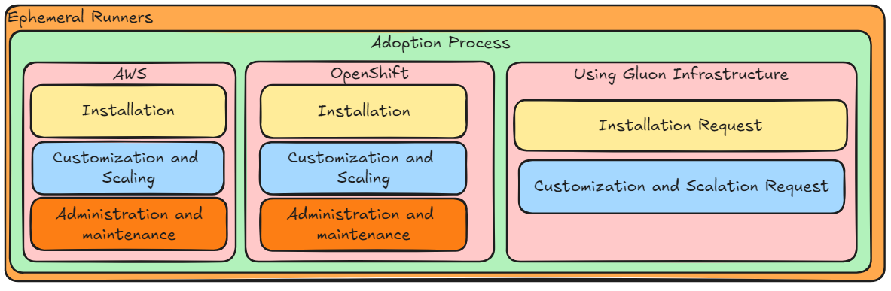

### Ephemeral Runners Adoption Process

If you have a project in a Github Organization, you can follow the steps to enable Ephemeral Runners in your supported infrastructure.

Below we show a schema with the supported infrastructure options, AWS, OpenShift, or requesting it provided by the Gluon
infrastructure, with the options available:

---

### Installation Options

Look at the ephemeral runner installation that would fit
to your needs in every platform:

- #### AWS

    ---
    Aws Installation

    [:rocket: AWS Installation](./aws/installation.md)

- #### OpenShift

    ---
    OpenShift Installation

    [:rocket: OpenShift Installation](./openshift/installation.md)

- #### Gluon

    ---
    Gluon Request

    [:rocket: Gluon Infrastructure Requests](./gluon/request-new.md)

