## Administration

### Preparing Namespace

For this task we can modify and/or run the workflow action ```prepare_namespace.yml``` found in this [repository path](https://github.com/santander-group-gluon/gln-plat-arc-deployment-helm/blob/main/.github/workflows/).

This workflow will:

- Generate a ```secrets.yml``` file with Github App Id, Github App Installation Id, Github App Private Key, and apply it to the namespace provided.
- Apply a cronjob to clean Maven and Npm cache in Maven and Npm volumes weekly (on Sundays).
- Update quota storage.
- Create PVC to store cache for maven, npm and gradle cache.
- Enable service account for Podman.
- Apply a rolebinding at service account level for Podman.
- Update quota-objects max secrets and max pods.
- Update quota-resources limit memory.
- Update max memory and limits memory and cpu for pods and containers.
- Enable egress.

### Deploying ephemeral runners

#### One by one deployment

To deliver this task we can make use of the file ```cd.yaml``` found in this [repository path](https://github.com/santander-group-gluon/gln-plat-arc-deployment-helm/blob/main/.github/workflows/).

For the deployment we have 2 main values:

- The values stored in inventories/default: these values define the default values for each runner.
- The values stored in inventories/organisation_name: these values overwrite the default values if any organisation needs a change like resources or variables. You only need to write the different values.

Example base.yml

```yaml

organization:
  registry: registry.global.ccc.srvb.can.paas.cloudcenter.corp
  image: ccc-alm/gln-plat-node-github-runner
  tag: 1.2.3
  labels:
  - taas-runner
  - base-runner
  - ansible-runner
  - python-runner

autoscaler:
  minReplicas: 4
  maxReplicas: 20

resources:
  limits:
    cpu: 1
    memory: 5Gi
  requests:
    cpu: 100m
    memory: 512Mi
```

This at the same time will get the image corresponding to the runner type found in ```/inventories/default```.

To run this workflow you need the following variables:

- Environment: pro, pre or dev.
- Cluster: if you have multiple clusters in every environment, you can set a default one.
- Organization to deploy.
- yaml: yaml of the runner to deploy without extension.

#### Multideployment

If what we want is to serial deploy on many organizations, we can make use of ```multideployment.yaml``` found in this [repository path](https://github.com/santander-group-gluon/gln-plat-arc-deployment-helm/blob/main/.github/workflows/).

Prior of launching it, we must create a file inside [multideploy_lists](https://github.com/santander-group-gluon/gln-plat-arc-deployment-helm/tree/main/multideploy_lists), i.e. ```multideploy_somename.txt```

Enter all the organizations that we want to deliver deploy, one per line.

Now we run ```multideploy``` and follow the dispatch. On ```yaml with the list for deploy on organizations``` enter the newly created file ```multideploy_somename.txt```. After pressing ```Run workflow``` button, the Action workflow will batch
all the deployments indicated.

To run this workflow you need the following variables:

- Environment: pro, pre or dev.
- Cluster: if you have multiple clusters in every environment, you can set a default one.
- Organization list: list of the organization to deploy.
- yaml: yaml of the runner to deploy without extension.

### Uninstalling ephemeral runners

#### One by one uninstall

For this purpose we can make use of ```uninstall.yaml``` found in this [repository path](https://github.com/santander-group-gluon/gln-plat-arc-deployment-helm/blob/main/.github/workflows/)

To run this workflow you need the following variables:

- Environment: pro, pre or dev.
- Cluster: if you have multiple clusters in every environment, you can set a default one.
- Organization to deploy.
- yaml: yaml of the runner to deploy without extension.

#### Multiuninstall

For this task we can make use of ```multiuninstall.yaml``` found in this [repository path](https://github.com/santander-group-gluon/gln-plat-arc-deployment-helm/blob/main/.github/workflows/)

Also this Action workflow uses the directory [multideploy_lists](https://github.com/santander-group-gluon/gln-plat-arc-deployment-helm/tree/main/multideploy_lists) to deliver this task, as a similar way multideployment does.

To run this workflow you need the following variables:

- Environment: pro, pre or dev.
- Cluster: if you have multiple clusters in every environment, you can set a default one.
- Organization list: list of the organization to deploy.
- yaml: yaml of the runner to deploy without extension.

### Daemonset

In order to facilitate the deployment of runners and to ensure that downloading the image is not a problem, a daemon set has been created to download the images on each node of the cluster.

## Maintenance

In this maintenance section we will describe possible problems and solutions for ephemeral runners on OpenShift.

¡If any of these errors occur, it is possible that the preparenamespace has not been launched in that namespace!

### Pod dont appear after deploy

If the pod does not even appear in the list of pods on deployment, there may be two reasons for this:

The resources of the pod you want to deploy are greater than the namespace limits -> check the limits,
the limits of the ephemeral runners are described either in the default yaml or in the ```runnerdeployment.yaml```

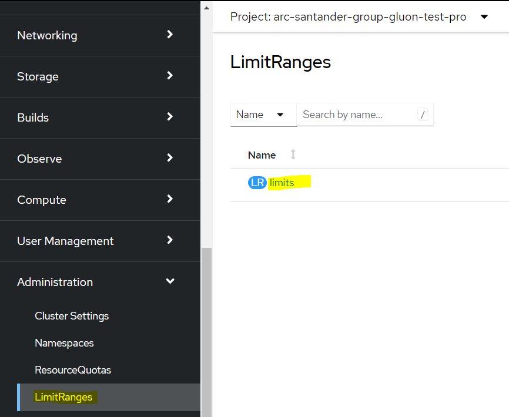

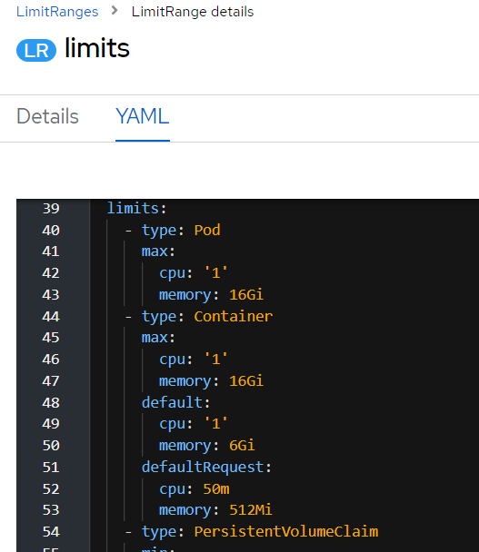

The maximum limit of pods in the namespace does not let you get up. → check maximum number of pods allowed

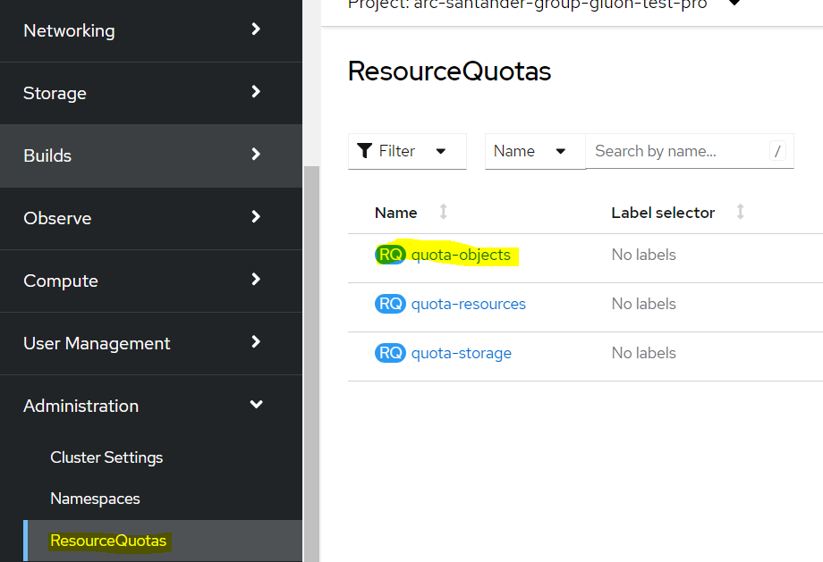

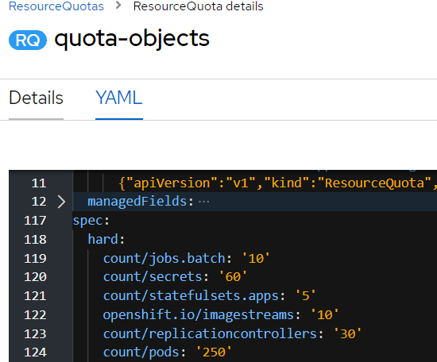

### Pod appear in pending

The pod try to attach a pvc that doesn't exist → check pvcs exists, if dont exist run ```preparenamespace.yaml```

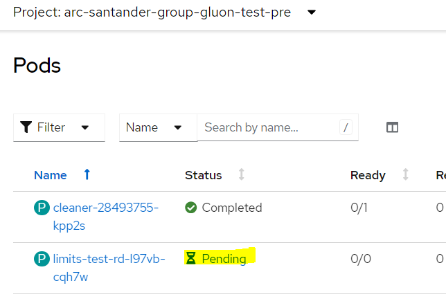


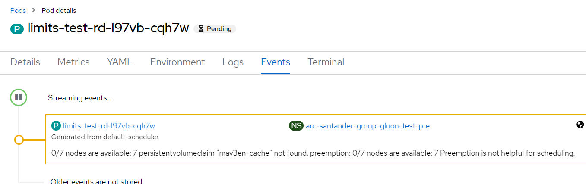

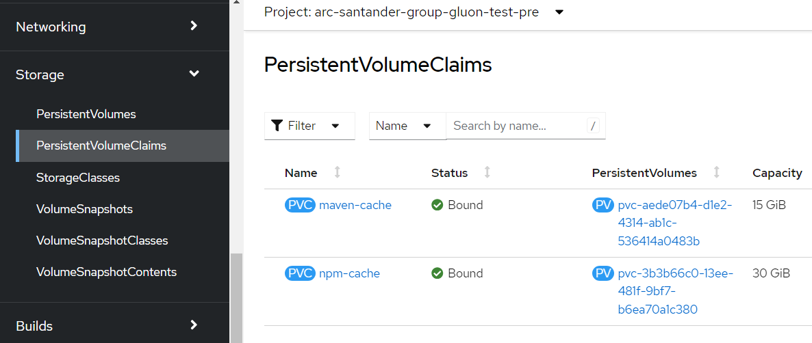

### Imagepull Error

First check the image that you try to deploy exist in the registry. Could be:

  - Harbor Node

  - Harbor Android

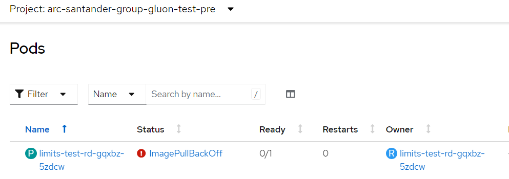

If the image exists and this is happening in several namespaces or massively we cannot do anything as it is a network/space problem on the node.

### Pod dont connect with Github

Pods go to terminating mode:

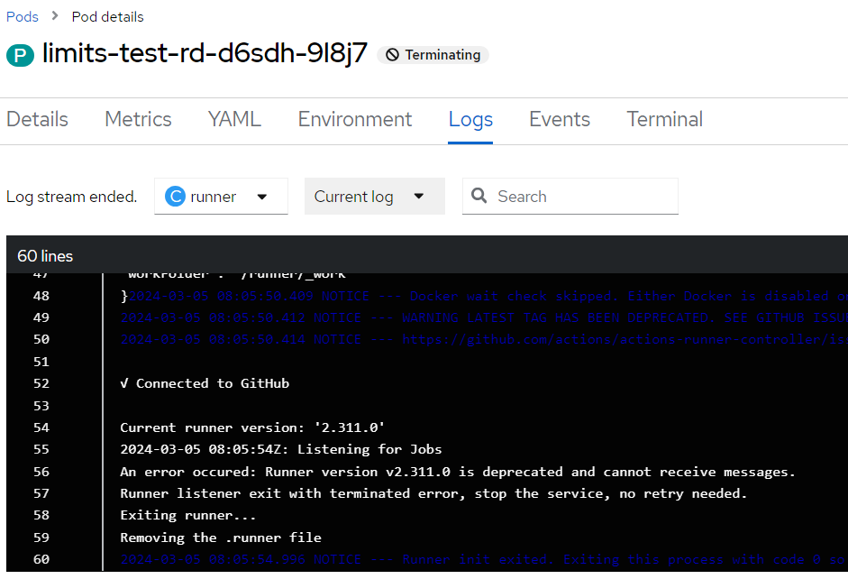

Change in the runnerdeployment object the variable to:

```yaml

        - name: DISABLE_RUNNER_UPDATE
          value: 'false'

```

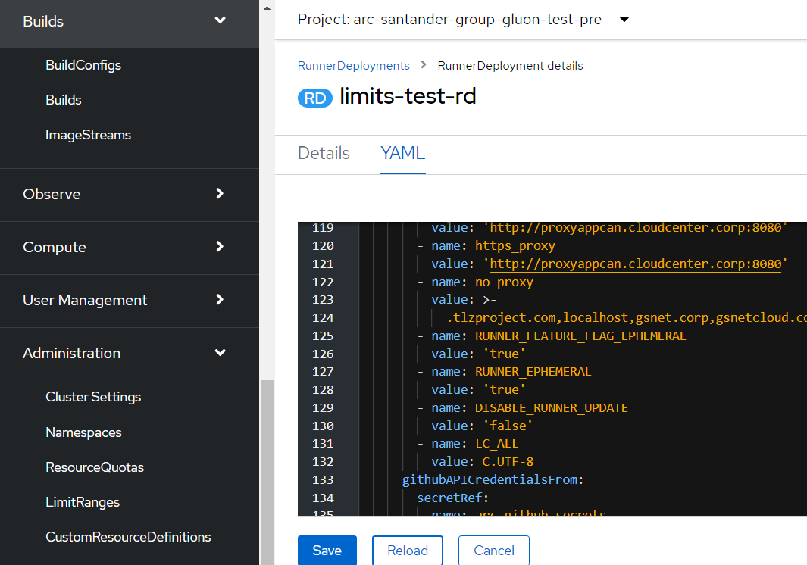

after the change a new runner with the following log will appear:

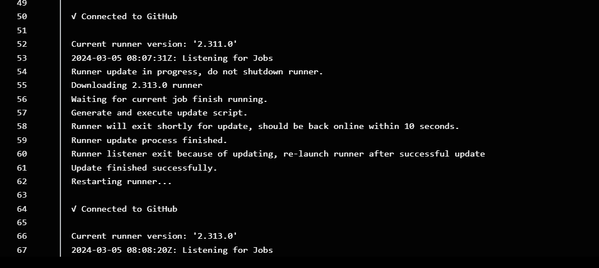

if this problem occurs en masse create a branch by changing it in the runnerdeployment in a new branch and multideploy.

### Infrastructure errors

The action runner controller may have failures if the network infrastructure that accompanies it causes problems.

If the action runner controller cannot communicate properly with github, there are two main problems:

#### Pods in Complete state

The pods remain in the completed state and do not scale the new pods, because the controller cannot talk to github.com and check if more runners of that type are needed.

#### Pods in Terminating state

The pods remain in a terminating state for an unacceptable period of time. This is because the runner or the controller itself cannot communicate well with github.com to remove itself from the list of available runners.

### Cache is full

There are 2 pvcs in each namespace that are maven-cache and npm-cache.

Check if the pvcs are full in the namespace

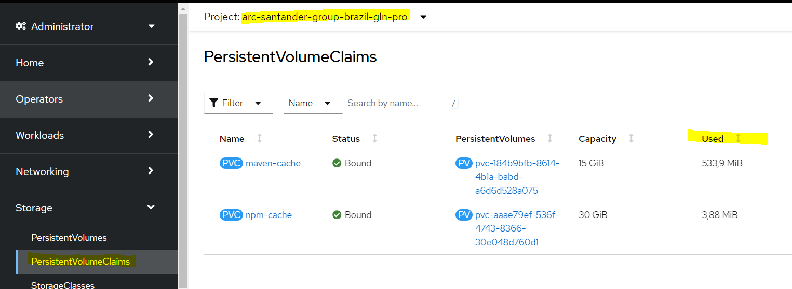

there are three ways to empty it:

#### Workflow

There are currently two workflows to trigger the job, to launch it [individually in one organisation](https://github.com/santander-group-gluon/gln-plat-arc-deployment-helm/actions/workflows/cleaner.yaml), or to launch it in [multiple organisations](https://github.com/santander-group-gluon/gln-plat-arc-deployment-helm/actions/workflows/multicleaner.yaml).

#### Triggering the cronjob

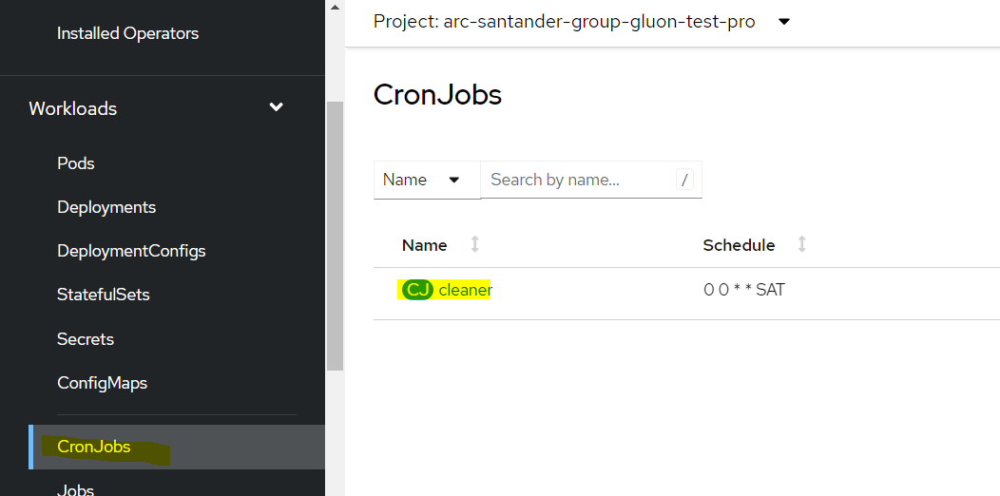

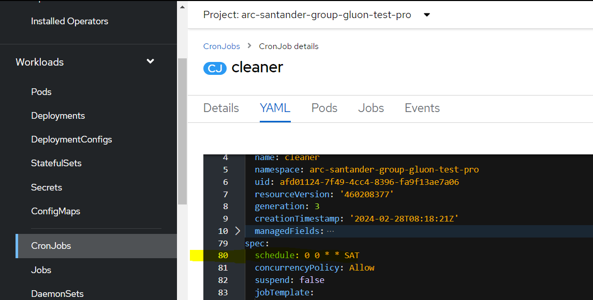

It would be necessary to change the hour and the minute that is needed (be careful at the end it says the day it is done,
change it by *), besides that the cluster time is one hour less than Madrid time.

For example: change it to 8:46 Madrid time every day

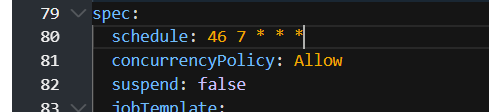

After the caches have been cleared, put the cron back on properly.

#### By hand

Enter an npm runner that has the two pvcs attached and enter the paths to delete the files.

  - /home/runner/.m2/repository

  - /home/runner/.npm/_cacache

### Other sections in OpenShift adoption process

<div class="cards row-2" markdown>

- #### OpenShift Installation

    ---
    Install OpenShift ephemeral runners

    [:computer: OpenShift Installation](./installation.md/)

- #### OpenShift Customization and Scaling

    ---
    Customize and scale OpenShift ephemeral runners

    [:rocket: Customization and Scaling](./customization-and-scaling.md/)

</div>
