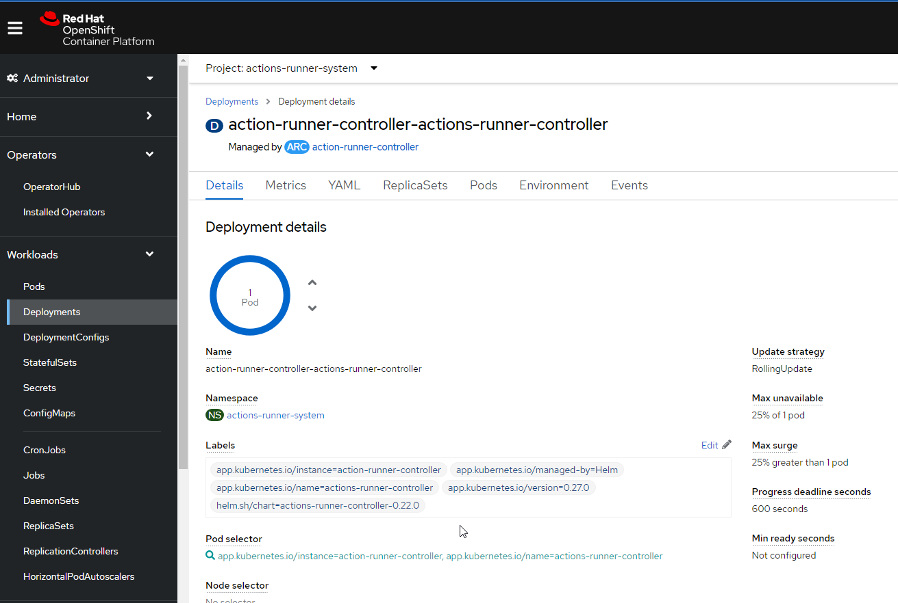

On this page we will show the the way you can adopt the use of Ephemeral Runners in your Openshift Organization Infrastructure.

## Using your own OpenShift Infrastructure

#### Cluster and nodes requirements

The team deploying ephemeral runners have two options. One option is to deploy these runners in a dedicated cluster. The second option is, if the team wants to deploy it on a shared cluster, they must make use of node groups in the cluster.

It is highly recommended to use node selector parameter in the templates or values files when using a shared cluster to avoid resource consumption interference between apps and ephemeral runners.

### Implementation Plan

The purpose of this document is to do all the steps to install the GitHub ARC Operator and the cert-manager operator within an Openshift Cluster, and to setup the resources for autoscalling ephemeral runners against multiple organizations.  
You can do this yourself if you have permissions to do so, or you can also request it directly to your local CaaS team.

### Requirements

- Cluster admin role in the openshift with console access to execute all the yamls contained in this documentation.
- A github app with the right permissions installed in the target organization. [GitHub Doc](https://github.com/actions/actions-runner-controller/blob/v0.27.4/docs/authenticating-to-the-github-api.md)

### Implementation

#### Installing and configuring the Operators

- This part depends on Firewall, proxy, and connectivity, as well as on the side of the CASC team responsible for the infrastructure used as most of this stpes require us to be Cluster Admin  
but it also doesn't have many options of change as they are mandatory pre-requisites of the operator to work.

- Create the namespaces required for the operators.

```yaml
apiVersion: v1
kind: Namespace
metadata:
  name: openshift-cert-manager-operator
  annotations:
    openshift.io/node-selector: ""
  labels:
    openshift.io/cluster-monitoring: "true"
---
apiVersion: v1
kind: Namespace
metadata:
  name: actions-runner-system
  annotations:
    openshift.io/node-selector: ""
  labels:
    openshift.io/cluster-monitoring: "true"

```

- Change the secure image registry for ghcr.io and gcr.io (github and google
 container registries).

```yaml
apiVersion: config.openshift.io/v1
kind: Image
metadata:
spec:
  registrySources:
    allowedRegistries:
      - "*.cloudcenter.corp"
      - registry.access.redhat.com
      - registry.redhat.io
      - quay.io
      - ghcr.io
      - gcr.io
    containerRuntimeSearchRegistries:
      - registry.global.ccc.srvb.can.paas.cloudcenter.corp
      - registry.access.redhat.com
      - registry.redhat.io
      - quay.io
    insecureRegistries:
      - "*.cloudcenter.corp"
```

This step is optional in case you can't get the images from the internet registries, if that is the case we need to get the images used into the harbor we want to use, in our case,  
the harbor registry.global.ccc.srvb.can.paas.cloudcenter.corp in the same project as the public project.  
For our specific case, we had to create in the Harbor the project summerwind and uploaded the image with the version used in the ARC operator: summerwind/actions-runner-controller:v0.27.0

- Add the operators subscription.

```yaml
apiVersion: operators.coreos.com/v1
kind: OperatorGroup
metadata:
  name: openshift-cert-manager-operator-gjqf7
  namespace: openshift-cert-manager-operator
spec: {}
---
apiVersion: operators.coreos.com/v1alpha1
kind: Subscription
metadata:
  name: openshift-cert-manager-operator
  namespace: openshift-cert-manager-operator
spec:
  channel: tech-preview
  installPlanApproval: Manual
  name: openshift-cert-manager-operator
  source: redhat-operators
  sourceNamespace: openshift-marketplace
---
apiVersion: operators.coreos.com/v1alpha1
kind: Subscription
metadata:
  name: github-arc-operator
  namespace: openshift-operators
spec:
  channel: alpha
  installPlanApproval: Manual
  name: github-arc-operator
  source: community-operators
  sourceNamespace: openshift-marketplace
```

- Add the GitHub App credentials in de secret controller-manager. (Look for
 these credentials on keepass or ask for them to an administrator of the github enterprise)

```yaml
apiVersion: v1
kind: Secret
metadata:
  name: controller-manager
  namespace: actions-runner-system
data:
  github_app_id: <GITHUB_APP_ID>
  github_app_installation_id: <GITHUB_APP_INSTALLATION_ID>
  github_app_private_key: >-
<GITHUB_APP_PRIVATE_KEY>
type: Opaque

```

- Manually approve the installations. First we need to install the cert-manager
 and secondly the github-arc-operator. Follow instructions on the operator.
- Configure the action-runner-controller to work correctly with the proxy. For
 this, in the namespace where the github-aqrc-operator was installed, edit the
  deployment config to match these environment variables.

```yaml
apiVersion: github-practice.boxboat.com/v1alpha1
kind: ActionsRunnerController
metadata:
  name: action-runner-controller
  namespace: actions-runner-system
spec:
  authSecret:
    name: controller-manager
  createRunnerNamespaces: false
  env:
    - name: HTTP_PROXY
      value: http://proxyapp.cloudcenter.corp:8080
    - name: HTTPS_PROXY
      value: http://proxyapp.cloudcenter.corp:8080
    - name: NO_PROXY
      value: 10.120.0.1,localhost,.corp
  openshift: true
  runnerNamespaces:
    - actions-runner-system
```

At this point, the action-runner-controller deployment that will manage the job
 queue and the ephemeral runners creation will be up and running.



#### Create and configure other components

- This steps are a pre-requisite for our implementation of the runners, and are needed for podman to work. They also require cluster-admin to configure, so it will probably be implemented via ticket to the CASC team.

- In this step we will configure other components that are required for our installation but that are not a requisite for the ARC operator, instead they are
requisites for our runners and environment.

- Egress. Needed in case it is disable by default, so the network in the namespace is allowed to go to the internet.

```yaml
apiVersion: network.openshift.io/v1
kind: EgressNetworkPolicy
metadata:
  generation: 2
  name: egress
  namespace: <ORG_NAMESPACE>
spec:
  egress:
    - to:
        cidrSelector: 0.0.0.0/0
      type: Allow
```

- SCC (anyuid)

```yaml
allowHostPorts: false
priority: 10
requiredDropCapabilities:
  - MKNOD
allowPrivilegedContainer: false
runAsUser:
  type: RunAsAny
users: []
allowHostDirVolumePlugin: false
allowHostIPC: false
seLinuxContext:
  type: MustRunAs
readOnlyRootFilesystem: false
metadata:
  annotations:
    include.release.openshift.io/ibm-cloud-managed: 'true'
    include.release.openshift.io/self-managed-high-availability: 'true'
    include.release.openshift.io/single-node-developer: 'true'
    kubernetes.io/description: >-
      anyuid provides all features of the restricted SCC but allows users to run
      with any UID and any GID.
    release.openshift.io/create-only: 'true'
  generation: 1
fsGroup:
  type: RunAsAny
groups:
  - 'system:cluster-admins'
kind: SecurityContextConstraints
defaultAddCapabilities: null
supplementalGroups:
  type: RunAsAny
volumes:
  - configMap
  - downwardAPI
  - emptyDir
  - persistentVolumeClaim
  - projected
  - secret
allowHostPID: false
allowHostNetwork: false
allowPrivilegeEscalation: true
apiVersion: security.openshift.io/v1
allowedCapabilities: null
```

- Service Account

```yaml
kind: ServiceAccount
apiVersion: v1
metadata:
  name: podman
  namespace: <ORG_NAMESPACE>
```

- Role and Role Binding

```yaml
kind: ClusterRole
apiVersion: rbac.authorization.k8s.io/v1
metadata:
  name: ClusterRole-Podman
rules:
  - verbs:
      - use
    apiGroups:
      - security.openshift.io
    resources:
      - securitycontextconstraints
    resourceNames:
      - anyuid
```

- There needs to be just one cluster role binding that has ALL namespaces included.

```yaml
kind: RoleBinding
apiVersion: rbac.authorization.k8s.io/v1
metadata:
  name: RoleBinding-Podman
  namespace: <ORG_NAMESPACE>
subjects:
  - kind: ServiceAccount
    name: podman
    namespace: <ORG_NAMESPACE>
roleRef:
  apiGroup: rbac.authorization.k8s.io
  kind: ClusterRole
  name: ClusterRole-Podman
```

### Other sections in OpenShift adoption process

<div class="cards row-3" markdown>

- #### OpenShift Customization and Scaling

    ---
    Customize and scale your ephemeral runners in OpenShift

    [:rocket: OpenShift Customization/Scaling](./customization-and-scaling.md/)

- #### OpenShift ephemeral runners administration and maintenance

    ---
    Openshift ephemeral runners administration and maintenance

    [:question: Administration and Maintenance](./administration-and-maintenance.md/)

</div>
