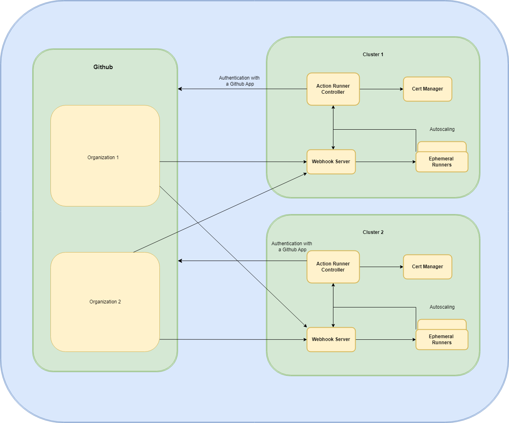

Ephemeral Runners are commonly used for several reasons in CI/CD workflows.

Main benefits are:

- Improvements in workflow execution time
- Valid solution for public and private cloud.
- Horizontal Autoscaling increasing the number of parallel executions.
- Provide a secure and clean environment for each job.
- Facilitate collaboration between entities, to enrich the quality of the runners and the versatility.
- Easy update of the runners avoiding long maintenance windows.

### Ephemeral Runners Diagram

  
Each organization has its own namespace where runners run separately.

### Ephemeral Runners Adoption Process

If you have a project in a Github Organization, you can check the supported infrastructure and follow the steps to enable Ephemeral Runners in [this section](./adoption-process/index.md).

 

### Other sections in Ephemeral runners

- #### Ephemeral Runners Adoption Process

    ---
    Learn about the adoption process and infrastructure supported.

    [:white_check_mark: Learn about the adoption process](./adoption-process/index.md)

- #### Runners Flavours

    ---
    Check out what images we have available to use with ephemeral runners so far.

    [:rocket: Flavours](./flavours.md)

- #### Image Governance

    ---
    Look at the ephemeral runner Image Governance information.

    [:recycle: Image Governance](./image-governance.md)

