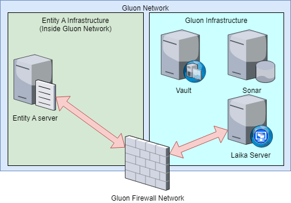
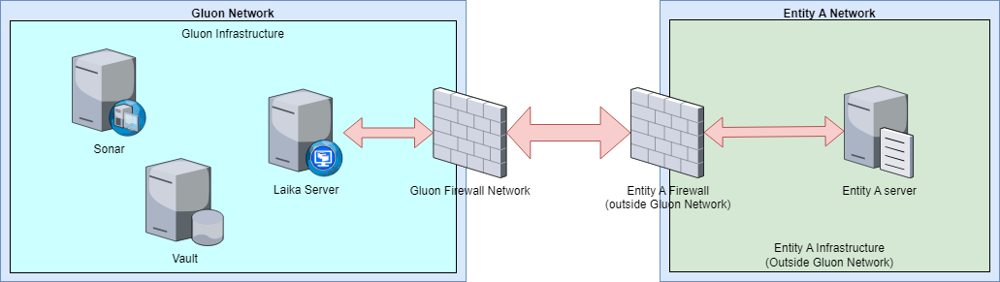
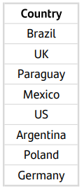
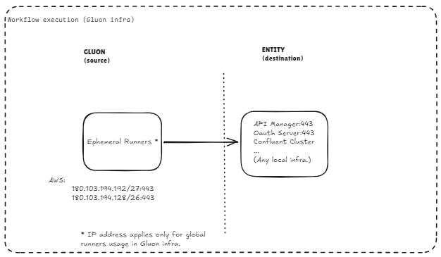
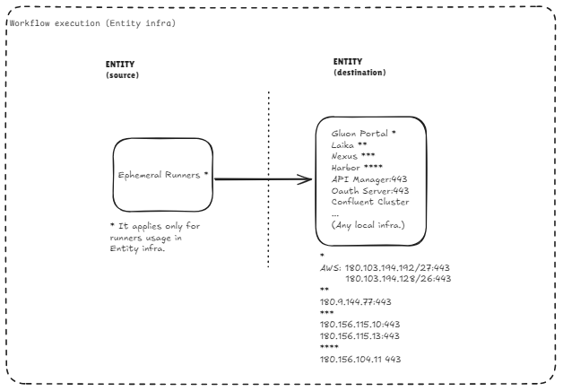
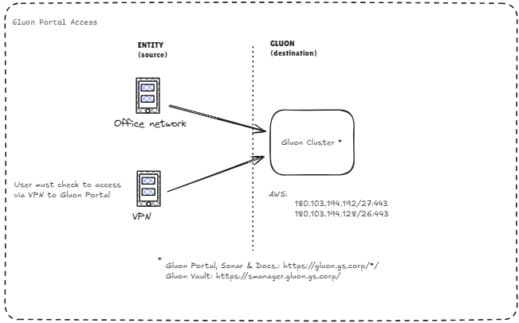
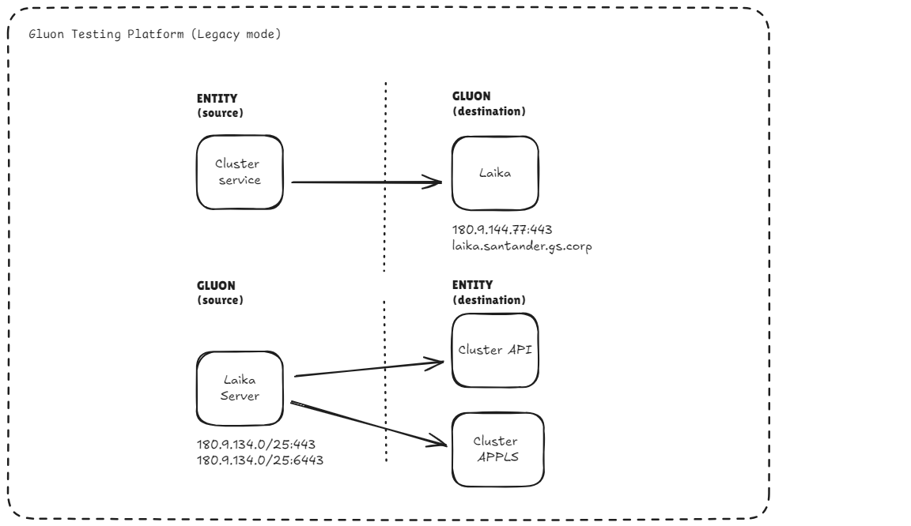
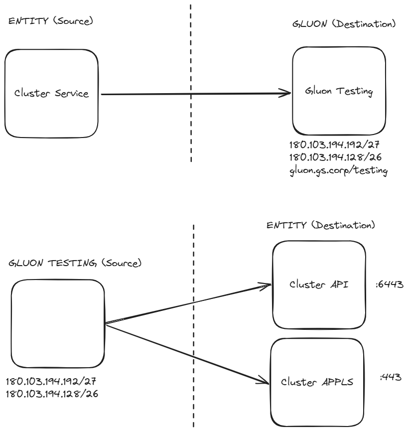
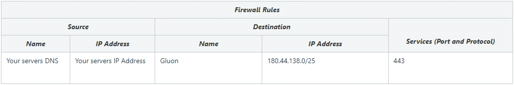

# Firewall Rules

## Introduction

In order to be able to start using and have all Gluon services fully operational, the entity must request firewall rules.

## Firewall domains

In case the entity's infrastructure is found outside the Gluon firewall domains,
they must request two firewall rules: one for the inside of the Gluon firewall network and another for their own.

#### Use Case 1

**Issue** :

  - Entity cannot reach their own infrastructure (Entity A Server/Gluon Testing Server) found in the same network as Gluon.

**Solution** :

   - Request rule for Gluon firewall.

#### Use Case 2

**Issue** :

- Entity cannot reach their own infrastructure(Entity A Server/Gluon Testing Server) found outside Gluon Network.

**Solution** :

- Request rule for Gluon firewall.
- Request the firewall rule for firewall entity network(see the list of countries below).

### List of countries affected as the Case 2

If the infrastructure is located in this list, the entity must follow the case 2:

> **Note:** In order to open the firewall rules from both sides, please open a ticket in Service Now (including the firewall rules info opened from the entity side) and Operations Team to open this rules from Gluon side.

## Firewall Rules IP List

> **Important Update**: Gluon is migrating to AWS infrastructure. Therefore, new IP rules will be needed to access the new infrastructure. Below are the current ranges and the new ones to clarify the changes.

| Services            | Current Services IP List | Future AWS Gluon Cluster  |
|---------------------|--------------------------|---------------------------|
| Global Ephemeral runners range   | 10.202.108.0/25 - 180.156.108.0/25 10.202.108.128/25 - 180.156.108.128/25          | 180.103.194.192/27 180.103.194.128/26 |
| Gluon Portal [https://gluon.gs.corp/gluon/](https://gluon.gs.corp/gluon/)  | 180.103.194.192/27 180.103.194.128/26        | Already updated in *Current* Column        |
| Gluon Vault [https://smanager.gluon.gs.corp/](https://smanager.gluon.gs.corp/)   |  180.103.194.192/27 180.103.194.128/26        | Already updated in *Current* Column        |
| Gluon Sonar [https://gluon.gs.corp/sonarqube/](https://gluon.gs.corp/sonarqube/)   | 180.103.194.192/27 180.103.194.128/26        | Already updated in *Current* Column        |
| Gluon Nexus Server [https://nexus.alm.europe.cloudcenter.corp/](https://nexus.alm.europe.cloudcenter.corp/)  [https://nexusmaster.alm.europe.cloudcenter.corp/](https://nexusmaster.alm.europe.cloudcenter.corp/) |  180.156.115.10 (443) 180.156.115.13 (443)         | N/A        |
| Gluon Testing Server [https://gluon.gs.corp/testing/](https://gluon.gs.corp/testing/)   |  180.103.194.192/27 180.103.194.128/26         | Already updated in *Current* Column        |
| Gluon Harbor [https://registry.global.ccc.srvb.can.paas.cloudcenter.corp/](https://registry.global.ccc.srvb.can.paas.cloudcenter.corp/)   |  180.156.104.11 (443)         | N/A        |

#### **Workflow Execution Using Gluon Infrastructure (Mandatory)**

For workflow execution using Gluon infrastructure these connectivities are mandatory (from Ephemeral runners Gluon to any local infrastructure component).

Connectivities between Gluon Ephemeral runners and gluon services (Gluon Portal, Gluon Vault, Gluon Sonar, Gluon Nexux, Gluon Testing, Gluon Harbor) are open.

#### **Workflow Execution Using Entity Infrastructure (Mandatory)**

For workflow execution using entity infrastructure these connectivities are mandatory (from Ephemeral runners to any local infrastructure component).

> **Note:** Important: Connectivities between Entity Ephemeral runners and gluon services (Gluon Portal, Gluon Vault, Gluon Sonar, Gluon Nexus, Gluon Testing, Gluon Harbor) are NOT open; entity must open them.

#### **Gluon Portal Access**

<!--Gluon Testing ips start-->

#### **Gluon Testing Platform (Legacy mode)**

#### **New AWS Gluon Testing Platform (Legacy mode)**

<!--Gluon Testing ips end-->

<!--Harbour ips start-->

<!--Harbour ips end-->

## Request Details

The request must be created in service now.

Category in [ITSM](https://santander.service-now.com/) is: **TECHNICAL CATALOG → Cybersecurity → Firewall → Firewall Rules requested**
If you don't see this category it is because you are not authorized to raise the ticket, you should require it to your local CISO.

In your request, attach evidences of :

- correct response to **ping**  command from your origin server (ping always responds)
- timeout trying to connect with the command used in the pipeline.
- correct connection from other origins with  **telnet**, **traceroute** or  **curl**  commands.
