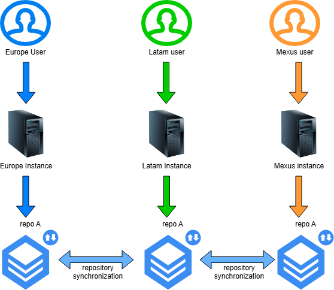
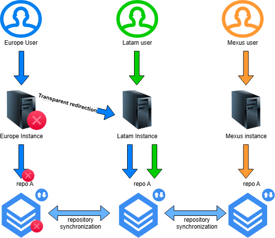
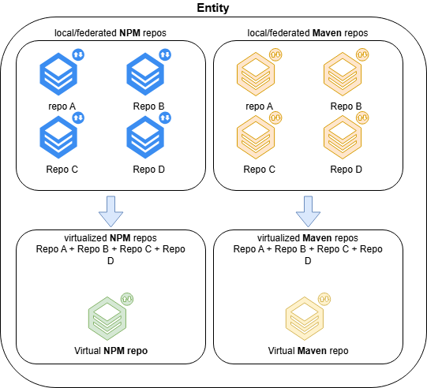
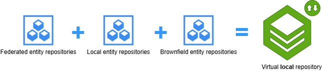
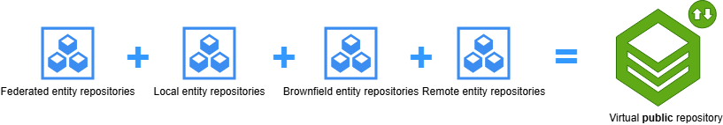

# Introduction to JFrog Artifactory

JFrog Artifactory is a universal artifact repository manager that supports all major package formats, build tools, and CI/CD platforms. It serves as a central hub for managing binaries,
dependencies, and build artifacts throughout the software development lifecycle.

With Artifactory, teams can:

- **Store and Manage Artifacts**: Securely store build artifacts, libraries, and dependencies in a centralized location.
- **Support Multiple Package Types**: Work seamlessly with technologies like Maven, npm, PyPI, and more.
- **Enable CI/CD Pipelines**: Integrate with popular CI/CD tools to automate builds, tests, and deployments.
- **Ensure Consistency**: Promote artifact immutability and traceability to ensure consistent deployments across environments.
- **Optimize Performance**: Use caching and replication to improve build speeds and reduce network latency.

Artifactory is a critical tool for modern DevOps practices, enabling efficient collaboration and reliable software delivery.

## What users can ask for

The user can raise a Gluon request [here](https://gluon.gs.corp/community/docs/latest/getting-started/support/) if needs a customized or different requirements. Requests can be:

1. New remote/virtual repository
2. Customised granularity for mappings (access rights)
3. Azure group permissions/access binding with Read only role
4. CI/CD integration with other products than Github
5. Add a repository with other technologies/repositories

## Infrastructure Architecture

Due to the flexibility and interoperability of JFrog instances, we have implemented three major instances to improve redundancy and geolocation benefits, as below:

- [Gluon Europe](https://gluoneurope.jfrog.io)
- [Gluon LatAm](https://gluonlatam.jfrog.io)
- [Gluon MexUs](https://gluonmexus.jfrog.io)

## Instance Architecture

The instances are composed of different concepts that help organize artifacts, users, repository types, among others.  
Below, we present a diagram and a brief explanation:

### Projects

Projects are groupings of repositories that grant access to certain users. We assume that a project is equivalent to an entity. Repositories from projects (entities) can be shared between other projects.

### Repositories

Repositories are the storage locations for artifacts, as we already know. We have differentiated three major statuses for artifacts, distributed by their nature in specific repositories:

- **Releases**: Artifacts declared as releases.
- **RC**: Release candidates, a stage previous to the release.
- **Snapshot**: Artifacts that are under development and used by developers for testing.

#### Nomenclature

##### Local Repositories

Local repository names must follow this format: **acronym-technology-snapshot**

A local repository in JFrog is a physical, private repository hosted on the JFrog instance. It is used to store and manage artifacts created by your entity, such as build outputs or internal libraries.
In Gluon, by default we will use local repositories for store snapshots.

Examples:  
`san-maven-snapshot`
`sgt-npm-snapshot`

##### Remote Repositories

Remote repository names must follow this format: **technology-domain**

A remote repository in JFrog acts as a caching proxy for a repository managed at a remote URL, such as a public repository or another Artifactory instance. It allows users to access external artifacts while caching
them locally to improve performance and reliability.

Examples:  
`npm-nodejs`
`pypi-public`

##### Federated Repositories (Synchronized repositories between instances)

Federated repository names must follow this format: **acronym-technology-{release}**

A federated repository in JFrog enables synchronization of artifacts between multiple JFrog instances.
Below we show a schema:

As each instance is geolocated, we have enabled fail-safe procedures in case of disasters. This means federated repositories will remain operational in another instance.  
This fail-safe procedure is transparent to the user; changing any instance URL in case of failure is not required because we enable redirections to a working one, and the user can make use of
the desired artifact.

Example:  
`sgt-maven-release`

By default entities have created **npm**, **maven**, and **pypi**. Snapshots and releases statuses for artifacts are enabled by default on Gluon. For specific repositories required by
entities, raise a [Gluon Request](https://gluon.gs.corp/community/docs/latest/getting-started/support/).

Docker image storage is handled using official tools like Harbor or ECR. We have not yet planned to use JFrog as a container registry for now.

##### Virtual Repositories (Grouped Repositories)

Virtual repository names must follow this format: **acronym-technology-{local/public}**

A virtual repository in JFrog is a logical grouping of multiple local, remote, or other virtual repositories. It provides a single access point for users and tools, simplifying artifact management by aggregating content from the
grouped repositories while maintaining access control and repository-specific configurations.

Example:  
`sgt-maven-local`
`scg-npm-public`
`abi-pypi-local`

Repositories are grouped "in one" by entity and technology. This will make much easier to operate all the repositories from one point.

Below a schema how virtual repositories works:

In the case of Gluon, we have two types of virtual repositories, differentiated by the suffix, `local` or `public`.

###### Virtual local repositories

Compounded by local, federated and brownfield entity repositories.

###### Virtual public repositories

Compounded by local, federated, brownfield and remote entity repositories.

???+ info "info"
    A virtual repository can be requested if needed, raising a [Gluon Request](https://gluon.gs.corp/community/docs/latest/getting-started/support/)

#### Artifacts Lifetime and Recovery

#### Remote Repositories - Cleanup Policies

For remote repositories, as artifacts are saved to the cache, we set the lifetime of an unused artifact to **one month**. After a month without being used, the artifact is deleted. Further requests for the artifact will trigger a new download to the cache.

#### Hosted Repositories - Cleanup Policies

We apply different cleanup policies depending on the package stage. Below is more information about how long we retain packages:

| SNAPSHOTS  | RELEASE CANDIDATES | RELEASES  |
|------------|---------------------|-----------|
| One Month  | One Year            | One Year  |

Depending on the artifact/package nature, we delete the artifact when the specified time has passed without any downloads.
These cleanup policies are generic, but exceptions can be made under special circumstances if an entity requires it, raising a [Gluon Request](https://gluon.gs.corp/community/docs/latest/getting-started/support/).

#### Artifact Backup and Recovery

The trash can feature is enabled. If any artifact is deleted by mistake, it can be recovered if the deletion occurred less than **30 days** ago.  
In case of need, a support ticket can be raised to recover artifacts [here](https://gluon.gs.corp/community/docs/latest/getting-started/support/).

## User Onboarding and CI/CD Access
  
To learn about user onboarding and CI/CD access, check [here](./onboard.md).
