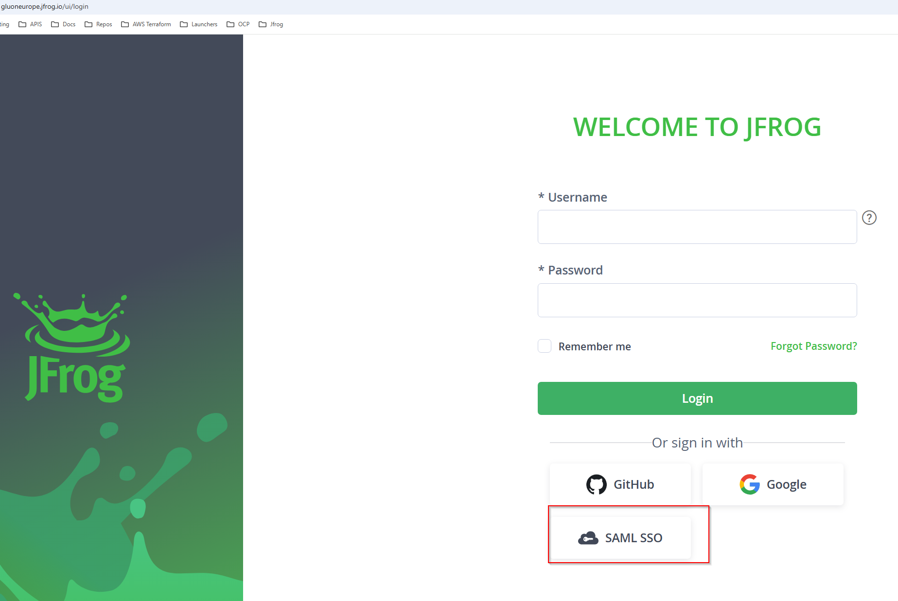

# Onboarding

This document explains how to onboard.

## Onboarding Process

#### User Onboarding

After user onboarding in an entity, access to the respective repositories is granted by default with a **viewer** role. This allows users to log in via Single Sign-On (SSO) or access JFrog resources through tools like the JFrog CLI or API.

This ensures that users in the group can view and interact with the project as permitted by the assigned role.

???+ info "Access Role for User Access"
    The default role for user access is **viewer**.

If you want to know more about Jfrog Groups, please check [here](https://gluon.gs.corp/docs/latest/getting-started/company-management/company-teams-management/team-predefined/).

#### Additional Method for User Onboarding

By default, access is granted using the same groups as an Atlassian Jira. However, sometimes the entity does not use these products, and the associated groups are not fully populated.  
To address this, Azure Company teams from Entry ID can be used and linked to the project/entity.

The entity owner is responsible for enabling the company team and associating the **viewer** role.

### User Access

#### JFrog Web Access

Users will log in through SSO using a web browser. Notice the login button available on every instance:

#### JFrog Local Access

You can find more information about installing the JFrog Client [here](./welcome/installnow.md).  
Additionally, users can log in to JFrog using their username/password or by accessing through an identity token [here](./welcome/identitytkn.md).

### CI/CD Access

#### Configuring OIDC Mapping for GitHub

For CI/CD pipelines, access is configured using OIDC (OpenID Connect) mappings. OIDC mappings bind GitHub workflows to roles in JFrog, allowing pipelines to securely interact with JFrog repositories.

The process works as follows:

1. A GitHub workflow requests an ID token from GitHub's OIDC provider.
2. The token is validated by JFrog, and a short-lived access token is generated.
3. The access token is used by the workflow to perform actions in JFrog, such as uploading or downloading artifacts.

For more details on implementing OIDC in your workflow, see the [OIDC Integration Guide](./welcome/oidc.md).

???+ info "Access Role for CI/CD Access"
    The default role for CI/CD access is **contributor**, allowing pipelines to upload and manage artifacts.

#### Using Other Integrations Outside GitHub

For integrations outside GitHub, such as CloudBees or Bitrise, an Azure company team will be established for the entity/project, managed exclusively by Gluon administrators.  
This admin-type team will be created for the entity with the **collaborator** role in JFrog, along with the service user included in this company team for integration between the CI/CD system and JFrog SaaS.

If you want to integrate JFrog into your pipeline, raise a [Gluon Request](https://gluon.gs.corp/community/docs/latest/getting-started/support/).  
After the Gluon Request is completed, log in with the provided service user and password, and generate a token to use in pipelines.
