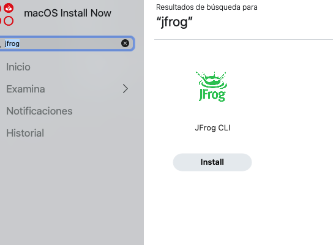
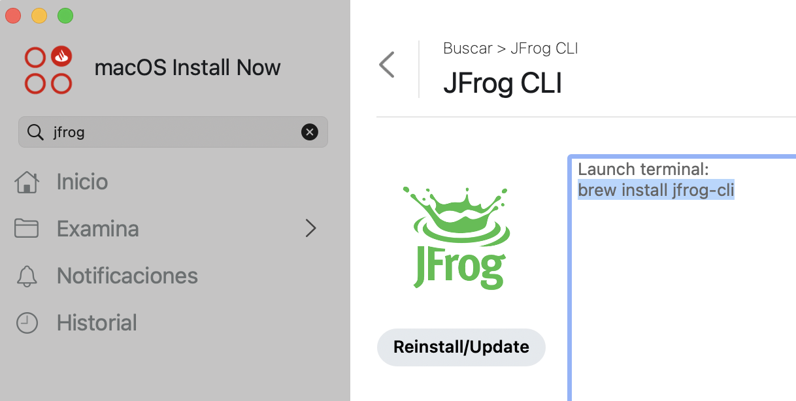
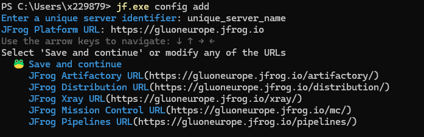
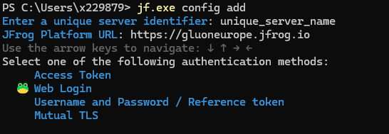
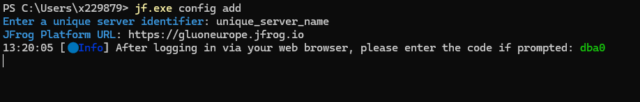
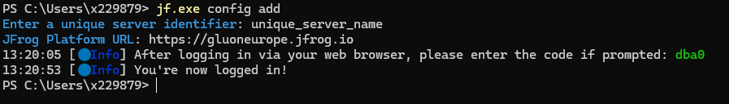
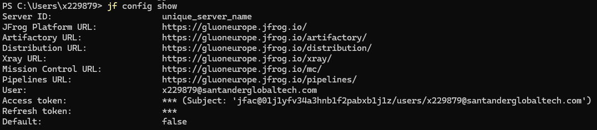

# Jfrog Cli local install

If we need the JFrog CLI executable on our local system, we will perform the installation through Software Center. Software Center is a Windows app
capable of installing any software that is approved and validated, regardless of the system policies in place.

## Installing Jfrog Cli

### Microsoft Windows

- Find **Software Center** in the taskbar or Start menu, and open it.
- Under the "Applications" sidebar tab, locate the search box at the top-right corner, type `jfrog`, and press Enter.
- Software Center will display results related to JFrog. Find `jfrog` (currently version 2.74.1, but use the latest version if available).
- Click the version you want to install. A new screen will appear with an **Install** button. Click the button and wait for Software Center to complete the installation.


After Software Center finishes, you can find the executable in Start Menu; executing it will open a cmd where jf.exe is stored. If you are using git bash, you will need to restart the session to find it in console.

### macOS

- Open the **Software Center** app and search for `jfrog`. A search result will appear, similar to this:



- Click **Install**. After installation, JFrog CLI will be enabled, and you can use the `brew` command. Below is an image representing this:



Open a terminal and run the following command to install JFrog CLI: `brew install jfrog-cli`

## Configure the JFrog Cli

After downloading the JFrog CLI and, optionally getting your token as described in [Identity Tokens](./identitytkn.md) it needs to be configured. There are two options.

#### Using a token

``` bash
jf config add [SERVER_ID] --url [JFROG_INSTANCE_URL] --access-token [YOUR_SSO_TOKEN] --interactive=false
```

#### Using the interactive web login

Web login in the JFrog CLI interactive configuration. Set the server id to what you want or use the default name "Default-Server"

Execute the command `jf config add` to start and follow the steps shown in the screenshots **using the variables you defined in the prerequisites**.












