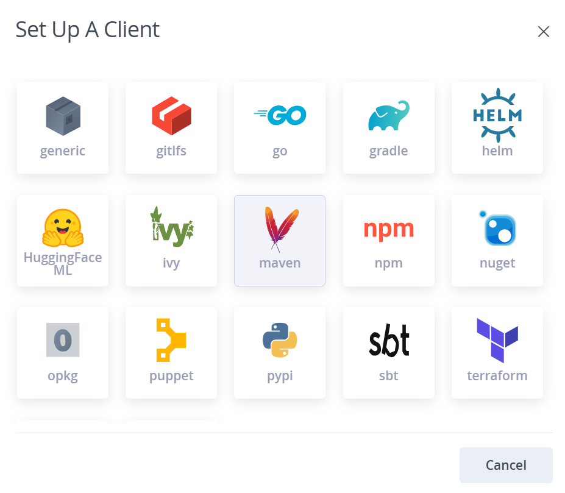
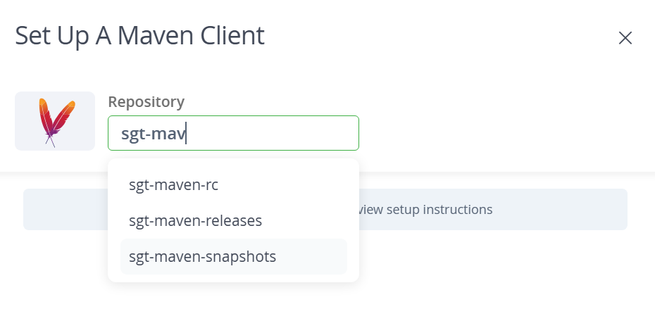
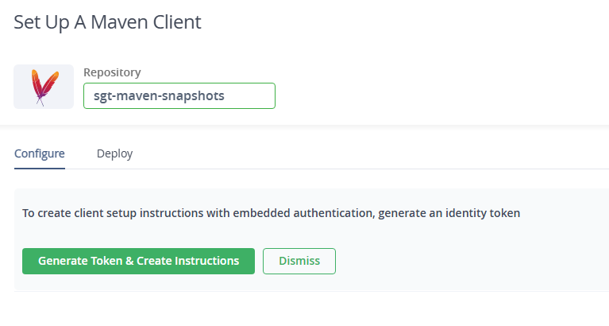
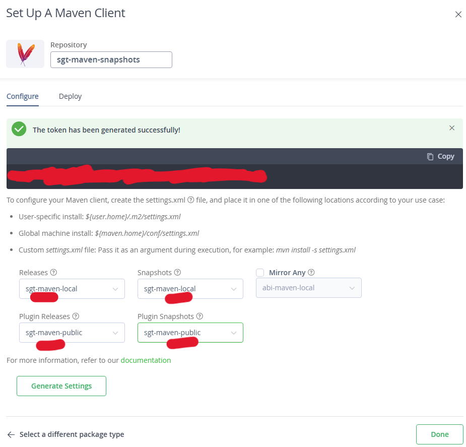

# Local Development Setup for Maven with JFrog Cloud

This guide provides instructions for setting up Maven in a Windows environment to use the JFrog Cloud instance. Authentication is based on SSO, and users must retrieve their token as explained in [Identity Tokens](../identitytkn.md)
for some of the steps. Additionally, users might install and configure the JFrog CLI as described in [JFrog CLI Installation](../installnow.md)
along with the usual technology clients from the [Install Now](../../../../../setup-your-environment/technologies/java-maven.md)

## VScode considerations

In the case of VScode with maven, the most popular extension available makes use of the maven client and the default settings of the user. As this settings.xml will be edited there is no need to do anything to start working with JFrog Artifactory.

## Prerequisites

1. **JFrog Instance**: Identify the instance you use:
   - `gluoneurope.jfrog.io`
   - `gluonmexus.jfrog.io`
   - `gluonlatam.jfrog.io`
2. **Project Name**: Example: `sgt`, `tbr`, `cib`.
3. **Dependency Resolution Repository**: Format: `<project>-<technology>-public` (e.g., `sgt-maven-public`, `sgt-npm-public`, `sgt-pypy-public`).
4. **Deploy Repository**: Format: `<project>-<technology>-snapshots` (e.g., `sgt-maven-snapshots`, `sgt-npm-snapshots`, `sgt-pypy-snapshots`).
5. **Username and Token.**

When following this documentation, the settings.xml is an addition to the one documented in [here](../../../../../setup-your-environment/technologies/java-maven.md)

## Maven Configuration

The user can use Maven using one of two options:

- Using the maven native client, with two options to configure the settings.xml:
    - Use the web `Set Me Up` to generate the settings to be used by maven.
    - Use the native Maven Client and use a settings.xml configuration file.
- Use the JFrog CLI as a wrapper for Maven Client.

We recommend using the `Set Me Up` method when using the maven client as it will be the easiest to implement.

## JFrog "Set Me Up"

Access the JFrog instance in an internet explorer and follow follow the image instructions.

Start by clicking on your profile icon in the top right corner of JFrog Web:

Step 1:


Step 2:



Step 3:



Step 4:



Step 5:



Finally click on Generate Settings to get the settings.xml snippet you can use in place of the example of the previous step.

Save this settings to your user in your system or to a custom location.

### Maven Client Manual Configuration

In this case this is the minimum configuration for setting maven locally for all the projects.

The commented proxy configuration is optional and depends on the user needs, but is shown in case they have a proxy and need to set it up.

1. Create a `settings.xml` file in the Maven configuration directory (`%USERPROFILE%\.m2\settings.xml`).
2. Add the following content:

    ``` xml
    <?xml version="1.0" encoding="UTF-8"?>
    <settings xsi:schemaLocation="http://maven.apache.org/SETTINGS/1.2.0 http://maven.apache.org/xsd/settings-1.2.0.xsd" xmlns="http://maven.apache.org/SETTINGS/1.2.0"
    xmlns:xsi="http://www.w3.org/2001/XMLSchema-instance">
    <servers>
        <server>
            <username>{USERNAME}</username>
            <password>{YOUR_SSO_TOKEN}</password>
            <id>jfrog</id>
        </server>
    </servers>
    <mirrors>
        <mirror>
            <mirrorOf>*</mirrorOf>
            <name>sgt-maven-public</name>
            <url>{JFROG_INSTANCE_URL}/artifactory/{REPOSITORY}</url>
            <id>jfrog</id>
        </mirror>
    </mirrors>
    <profiles>
        <profile>
        <repositories>
            <repository>
            <snapshots>
                <enabled>false</enabled>
            </snapshots>
            <id>jfrog</id>
            <name>{REPOSITORY}</name>
            <url>{JFROG_INSTANCE_URL}/artifactory/{REPOSITORY}</url>
            </repository>
        </repositories>
        <pluginRepositories>
            <pluginRepository>
            <snapshots>
                <enabled>false</enabled>
            </snapshots>
            <id>jfrog</id>
            <name>{REPOSITORY}</name>
            <url>${env.JFROG_INSTANCE_URL}/artifactory/{REPOSITORY}</url>
            </pluginRepository>
        </pluginRepositories>
        <id>artifactory</id>
        </profile>
    </profiles>
    <activeProfiles>
        <activeProfile>artifactory</activeProfile>
    </activeProfiles>
    <!-- <proxies>
        <proxy>
        <id>proxy</id>
        <active>true</active>
        <protocol>http</protocol>
        <host>{PROXY_URL}</host>
        <port>{PROXY_PORT}</port>
        <nonProxyHosts></nonProxyHosts>
        </proxy>
    </proxies> -->
    </settings>
    ```

## JFrog CLI Configuration

This section is for the use case where the user wants to use the JFrog CLI to build and install maven projects using the JFrog CLI as a wrapper for the maven client. The advantage of using this method is that it removes the need of a `settings.xml`

After downloading the JFrog CLI and configuring it as described in [JFrog CLI Installation](../installnow.md) section.

NOTE: You need to configure a maven releases repository for deployment, but local users will not be able to deploy a release due to security restrictions.

1. Set the JFrog CLI maven configuration:

    ``` bash
    jf mvn-config --server-id-deploy [SERVER_ID] --server-id-resolve [SERVER_ID] --repo-deploy-releases [DEPLOY_REPOSITORY] --repo-deploy-snapshots [DEPLOY_REPOSITORY] --repo-resolve-releases [DEPENDENCY_REPOSITORY] --repo-resolve-snapshots [DEPENDENCY_REPOSITORY]
    ```

2. Build maven using the JFrog CLI

    ``` bash
    jf mvn install
    ```

The JFfrog CLI can be used as a wrapper for every other common usage of the maven client, besides the one shown in this example.
