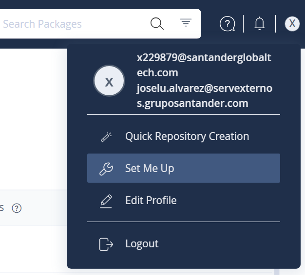
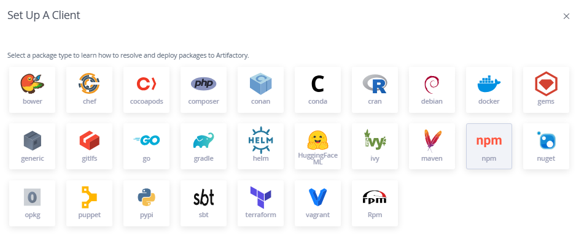
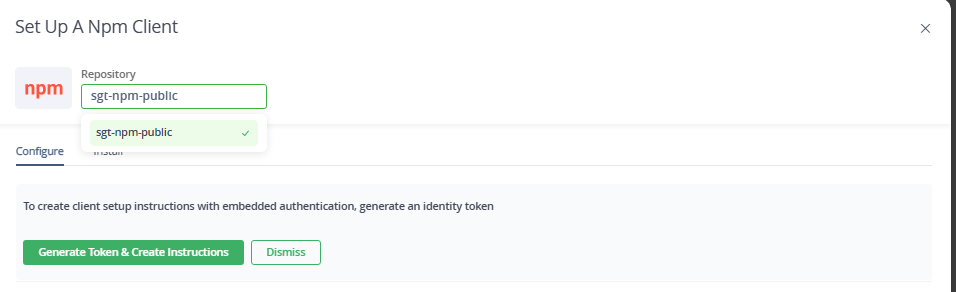
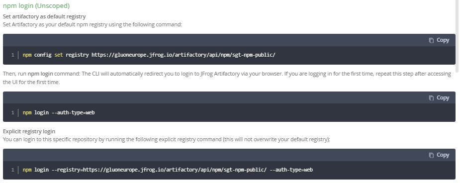
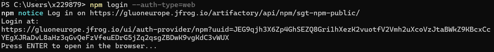
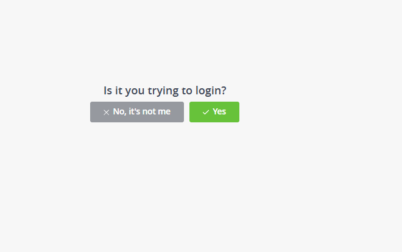
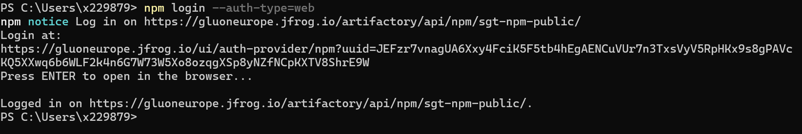
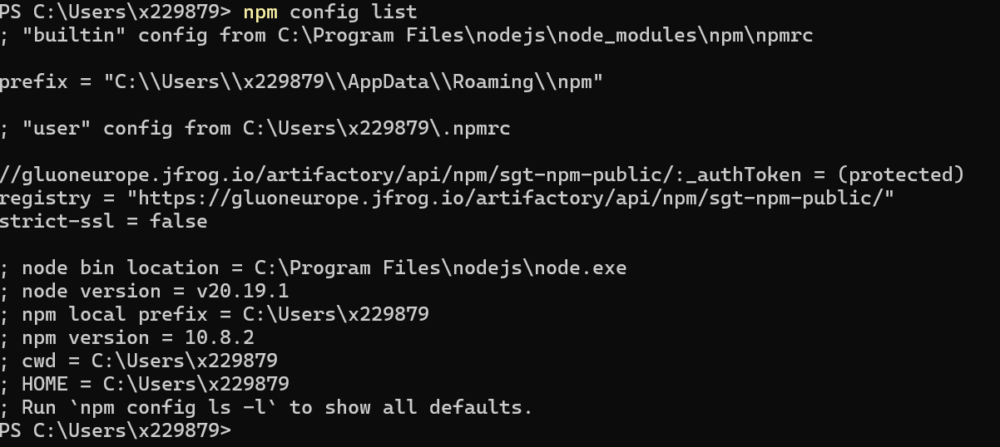
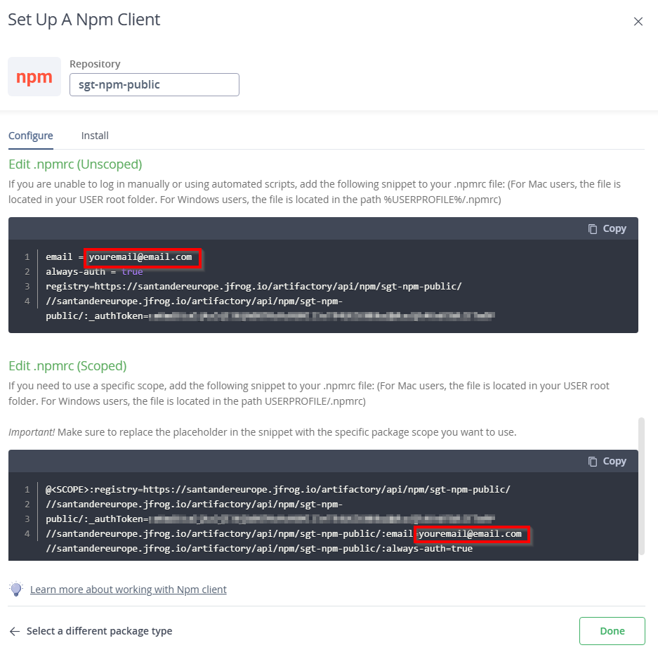

# Local Development Setup for NPM with JFrog Cloud

This guide provides instructions for setting up NPM in a Windows environment to use the JFrog Cloud instance. Authentication is based on SSO,
and users must retrieve their token as explained in [Identity Tokens](../identitytkn.md) for some of the steps. Additionally, users might install
and configure the JFrog CLI as described in [JFrog CLI Installation](../installnow.md) along with the usual technology clients from the [Install Now](../../../../../setup-your-environment/technologies/javascript-node.md)

## VScode considerations

In the case of VScode with npm, the most popular extension is deprecated as npm has been integrated with VScode tasks. These
integrations use the user system npm config so there is no need to do any extra steps besided personal choices regarding the jfrog set up when using VScode.

## Prerequisites

1. **JFrog Instance**: Identify the instance you use:
   - `gluoneurope.jfrog.io`
   - `gluonmexus.jfrog.io`
   - `gluonlatam.jfrog.io`
2. **Project Name**: Example: `sgt`, `tbr`, `cib`.
3. **Dependency Resolution Repository**: Format: `<project>-<technology>-public` (e.g., `sgt-npm-public`).
4. **Deploy Repository**: Format: `<project>-<technology>-snapshots` (e.g., `sgt-npm-snapshots`).
5. **Username and Token.**

When following this documentation, the .npmrc is an addition to the one documented in [here](../../../../../setup-your-environment/technologies/javascript-node.md)

## NPM Configuration

The user can use NPM using one of two options:

- Using the npm native client, with two options to configure the .npmrc:
    - Use the web `Set Me Up` to generate the settings to be used by npm.
    - Use the native NPM Client to configure the default local `.npmrc`.
- Use the JFrog CLI as a wrapper for NPM native client.

We recommend using the `Set Me Up` method as it will be the easiest to implement.

To check the current .npmrc configuration, use `npm config list`

## NPM Native Client Configuration

### JFrog Set Me Up

You can configure the npm client to work with Artifactory in the following ways:

- Use npm login for scoped packages or unscoped packages
- Edit the .npmrc file for scoped packages or unscoped packages

#### NPM Login

##### Step 1

Click on the top right corner profile image and on `Set Me Up` to start



##### Step 2

Select NPM technology on the list



##### Step 3

Write the repository to set up on the registry for dependency resolution as defined in the prerequisites. `sgt-npm-public` in our example. And click on `Generate Token & Create Instructions`



##### Step 4

Follow the steps for the desired use case: scoped or unscoped, npm login or .npmrc direct edition.



##### **4.1** Scoped or Unscoped npm login **Example**

Step 4.1.1: Set Artifactory as your default npm registry using the following command:

``` bash
npm config set registry https://gluoneurope.jfrog.io/artifactory/api/npm/sgt-npm-public/
```

Step 4.1.2: Then, run npm login command: The CLI will automatically redirect you to login to JFrog Artifactory via your browser. If you are logging in for the first time, repeat this step after accessing the UI for the first time.

``` bash
npm login --auth-type=web
```

And follow the instructions on the terminal to finish the process as shown in the screenshots.



Press enter this will open an internet explorer to verify the login.



Check the terminal ok.



Step 4.1.3: Validate the configuration

``` bash
npm config list
```



##### **4.2** Scoped or Unscoped .npmrc manual configuration **Example**

Step 4.2.1: If you are unable to log in manually, you can get the snippet for the authentication in the same `Set Me Up` help from JFrog under the `npm login` part but you need to set the registry first:

``` bash
npm config set registry https://gluoneurope.jfrog.io/artifactory/api/npm/sgt-npm-public/
```

Step 4.2.2: copy the snippet, you only need to replace the email with yours:



##### Step 5 npm install

We are done configuring the .npmrc and we can install our dependencies locally:

``` bash
npm install
```

### Manual .nmprc configuration

This follow the same structure as in the snippet given by JFrog in the `Set Me Up` of the previous step. We need three parameters:

- JFROG_INSTANCE: jfrog url of our instance. (One of gluoneurope, gluonmexus or gluonlatam)
- EMAIL: email of our username
- REGISTRY_REPOSITORY: virtual repository to use as the registry
- TOKEN: access token
- SCOPE: the scope when configuring an scoped registry

``` text
email = <EMAIL>
always-auth = true
registry=https://<JFROG_INSTANCE>.jfrog.io/artifactory/api/npm/<REGISTRY_REPOSITORY>/
//<JFROG_INSTANCE>.jfrog.io/artifactory/api/npm/<REGISTRY_REPOSITORY>/:_authToken=<TOKEN>
```

And for an scoped case

``` text
@<SCOPE>:registry=https://<JFROG_INSTANCE>.jfrog.io/artifactory/api/npm/<REGISTRY_REPOSITORY>/
//<JFROG_INSTANCE>.jfrog.io/artifactory/api/npm/<REGISTRY_REPOSITORY>/:_authToken=<TOKEN>
//<JFROG_INSTANCE>.jfrog.io/artifactory/api/npm/<REGISTRY_REPOSITORY>/:email=<EMAIL>
//<JFROG_INSTANCE>.jfrog.io/artifactory/api/npm/<REGISTRY_REPOSITORY>/:always-auth=true
```

## JFrog CLI Configuration

This section is for the use case where the user wants to use the JFrog CLI to build and install npm projects using the JFrog CLI as a wrapper for the npm client. The advantage of using this method is that it removes the need of a `.npmrc`

After downloading the JFrog CLI and configuring it as described in [JFrog CLI Installation](../installnow.md) section.

NOTE: You need to configure a npm releases repository for deployment, but local users will not be able to deploy a release due to security restrictions.

1. Set the JFrog CLI npm configuration:

    ``` bash
    jf npm-config --server-id-deploy [SERVER_ID] --server-id-resolve [SERVER_ID] --repo-deploy [DEPLOY_REPOSITORY] --repo-resolve [DEPENDENCY_REPOSITORY]
    ```

2. Build npm using the JFrog CLI

    ``` bash
    jf npm install
    ```

The JFfrog CLI can be used as a wrapper for every other common usage of the npm client, besides the one shown in this example.
