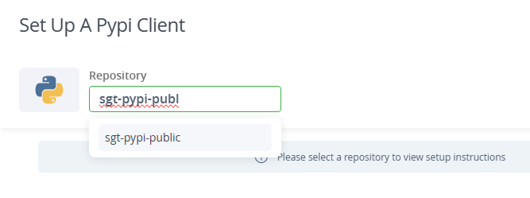
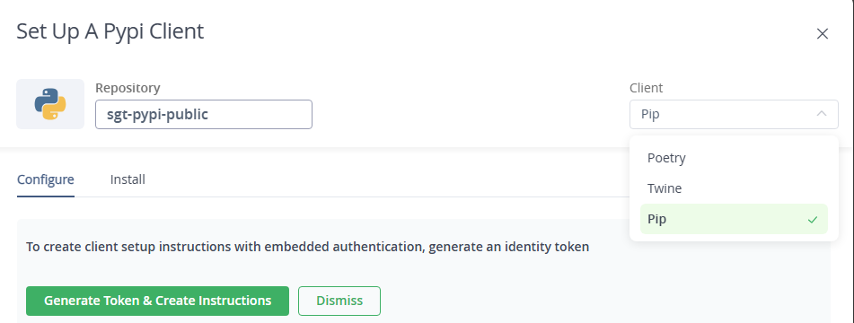
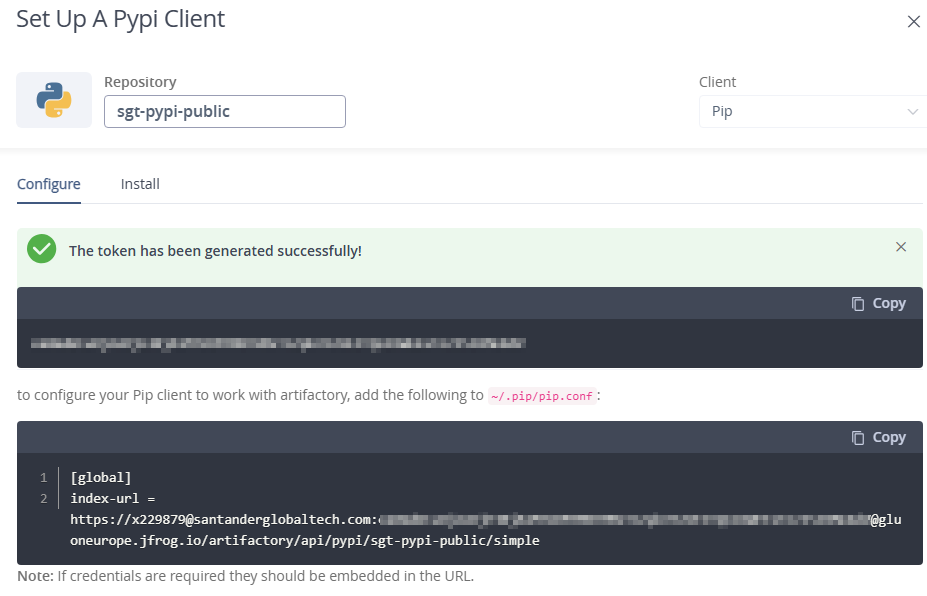

# Local Development Setup for Python with JFrog Cloud

This guide provides instructions for setting up python and pip in a Windows environment to use the JFrog Cloud instance. Authentication is based
on SSO, and users must retrieve their token as explained in [Identity Tokens](../identitytkn.md) for some of the steps. Additionally,
users might install and configure the JFrog CLI as described in [JFrog CLI Installation](../installnow.md) along with the usual technology
clients from the [Install Now](../../../../../setup-your-environment/technologies/python.md)

## VScode considerations

In the case of VScode with python, the most popular extension available makes use of the python client and the default settings of the
user. As both `pip.conf` and `.pypirc` will be edited there is no need to do anything to start working with JFrog Artifactory.

## Prerequisites

1. **JFrog Instance**: Identify the instance you use:
   - `gluoneurope.jfrog.io`
   - `gluonmexus.jfrog.io`
   - `gluonlatam.jfrog.io`
2. **Project Name**: Example: `sgt`, `tbr`, `cib`.
3. **Dependency Resolution Repository**: Format: `<project>-<technology>-public` (e.g., `sgt-pypi-public`).
4. **Deploy Repository**: Format: `<project>-<technology>-snapshots` (e.g., `sgt-pypi-snapshots`).
5. **Username and Token.**

When following this documentation, the `pip.conf` and `.pypirc` configurations are an addition to the one documented in [here](../../../../../setup-your-environment/technologies/javascript-node.md) but changing the registry to be used.

## Python Configuration

The user can use python using one of two options:

- Using the python native client, with two options to configure the local environment:
    - Use the web `Set Me Up` to generate the settings to be used by python. This method gives instructions for Pip, Twine and Poetry.
    - Use the native pip Client to configure the default local files.
- Use the JFrog CLI as a wrapper for python native client.

We recommend using the `Set Me Up` method as it will be the easiest to implement.

To check the current `pip.conf` and `.pypirc` configurations, use `npm config list`

## Python Native Client Configuration

### JFrog Set Me Up

With the help of the web interface `Set Me Up` in JFrog, we can get the content of the configuration files for Pip, Twine and Poetry. For the
purpose of this documentation as we are covering the very basics of dependency installation and not the deployment, we will only see the example for Pip.

Access the JFrog instance in an internet explorer and follow follow the image instructions.

Start by clicking on your profile icon in the top right corner of JFrog Web:

Step 1: Select Pypi as the technology to set up


Step 2: Select the repository to resolve dependencies



Step 3: Select the technology to get the configuration code



Step 4: Copy the code given in the snippet



Step 5:

With this code, we can edit the local user configuration file `pip.ini` in windows, it is usually found in `C:\Users\<USERNAME>\AppData\Roaming\pip`:

We can overwrite the contents or at a minimum the configurations for nexus. We should have a file like:

``` text
[global]
index-url = https://nexus.alm.europe.cloudcenter.corp/repository/pypi-public/simple
index = https://nexus.alm.europe.cloudcenter.corp/repository/pypi-public/simple
trusted-host = nexus.alm.europe.cloudcenter.corp
```

And it will end up looking like

``` text
[global]
index-url = https://<JFROG_USERNAME>.com:<ACCESS_TOKEN>@gluoneurope.jfrog.io/artifactory/api/pypi/<DEPENDENCIES_REPOSITORY>/simple

```

Note that in the `Set Me Up`

### Manual pip.ini configuration

To set up the configuration manually, we can use the same block of code from the previous `step 5` of the `JFrog Set Me Up` documentation:

With this code, we can edit the local user configuration file `pip.ini` in windows, it is usually found in `C:\Users\<USERNAME>\AppData\Roaming\pip`:

We can overwrite the contents or at a minimum the configurations for nexus. We should have a file like:

``` text
[global]
index-url = https://nexus.alm.europe.cloudcenter.corp/repository/pypi-public/simple
index = https://nexus.alm.europe.cloudcenter.corp/repository/pypi-public/simple
trusted-host = nexus.alm.europe.cloudcenter.corp
```

And it will end up looking like

``` text
[global]
index-url = https://<JFROG_USERNAME>.com:<ACCESS_TOKEN>@gluoneurope.jfrog.io/artifactory/api/pypi/<DEPENDENCIES_REPOSITORY>/simple

```

## JFrog CLI Configuration

This section is for the use case where the user wants to use the JFrog CLI to build and install pipdependencies using the JFrog CLI as a wrapper for the
python and pip client. The advantage of using this method is that it removes the need to configure setting files as it relies on the jfrog cli configuration.

After downloading the JFrog CLI and configuring it as described in [JFrog CLI Installation](../installnow.md) section.

NOTE: You need to configure a pip releases repository for deployment, but local users will not be able to deploy a release due to security restrictions.

1. Set the JFrog CLI npm configuration:

    ``` bash
    jf pip-config --server-id-deploy [SERVER_ID] --server-id-resolve [SERVER_ID] --repo-deploy [DEPLOY_REPOSITORY] --repo-resolve [DEPENDENCY_REPOSITORY]
    ```

2. Build npm using the JFrog CLI

    ``` bash
    jf npm install <package> <version>
    ```

The JFfrog CLI can be used as a wrapper for every other common usage of the npm client, besides the one shown in this example.
